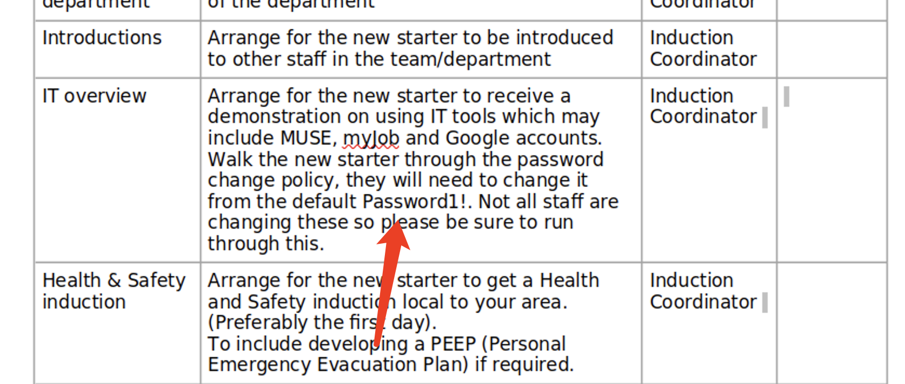
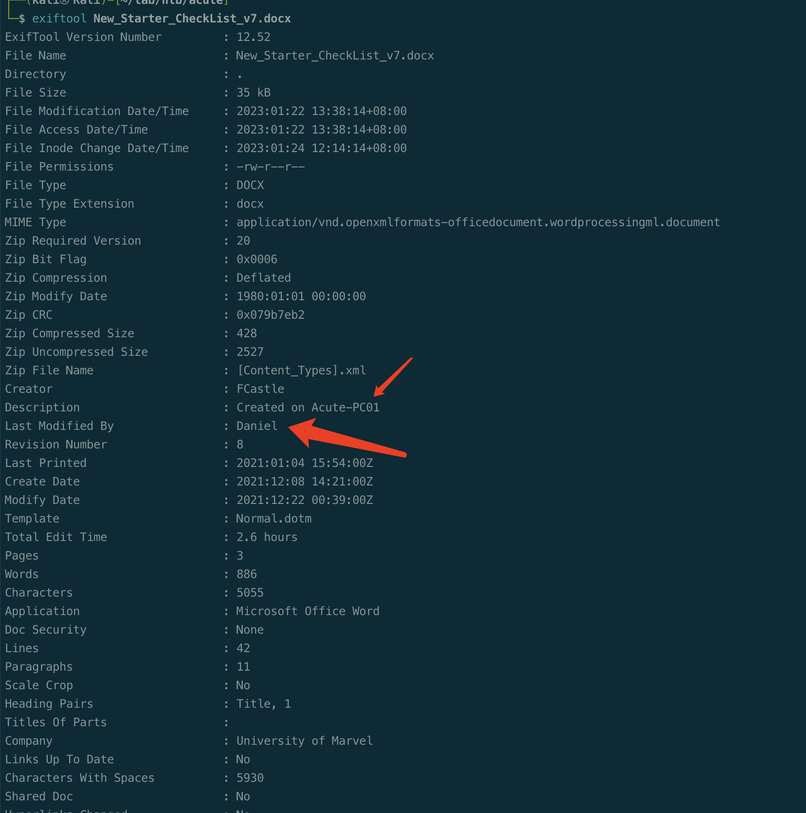
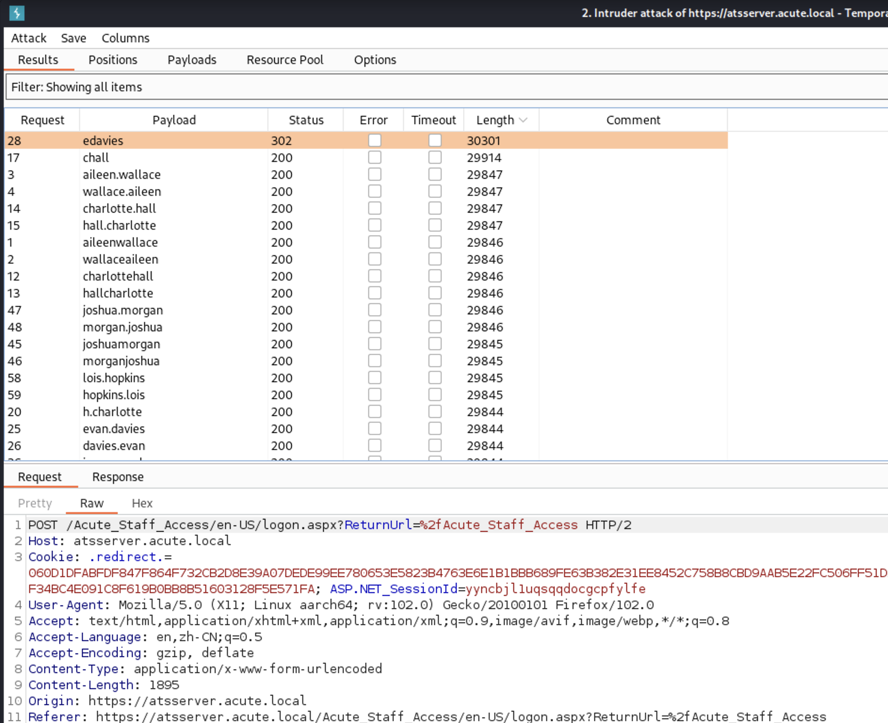

# Summary


## about target

tip:  10.129.136.40

hostname:  Acute

Difficulty:  Hard


## about attack

+ powershell invoke-command 
+ powershell pscredential
+ 


**attack note**


# Enum

## nmap scan


```bash
nmap -p- --min-rate=1000 -T4 -oN nmap.light $tip
export port=$(cat nmap.light | grep ^[0-9] | cut -d "/" -f 1 | tr "\n" "," | sed s/,$//)
sudo nmap -A -O -p$port -sC -sV -T4 -oN nmap.heavy $tip


```











# Foothold


# Privesc


## proof

```bash


```


