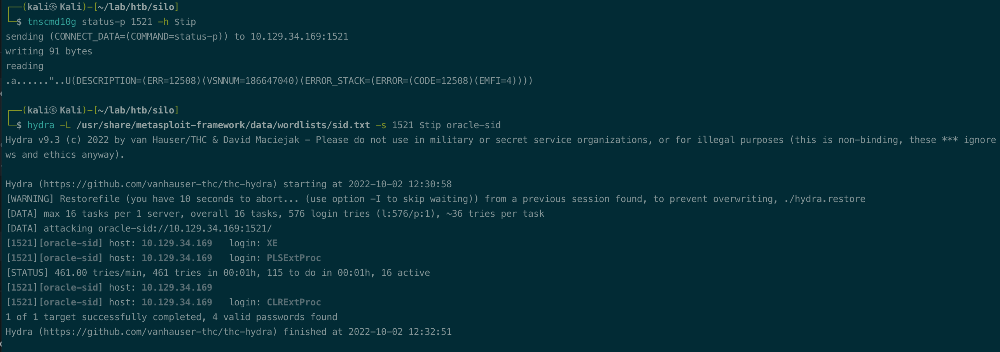

# Summary


## about target

tip:  10.129.131.171

hostname: Silo

Difficulty: Medium


## about attack

+ oracle tns attack, sid enum and brute force, login and write shell.
+ Odat install, oracle basic doesn't support arm, nmap brute force failed. 
+ 暂时放着
+ 


**attack note**


# Enumeration

## nmap scan

light scan

```bash
nmap -p- --min-rate=1000 -T4 -oN nmap.light $tip


```


Heavy scan

```bash
export port=$(cat nmap.light | grep ^[0-9] | cut -d "/" -f 1 | tr "\n" "," | sed s/,$//)
sudo nmap -A -O -p$port -sC -sV -T4 -oN nmap.heavy $tip


```


## oracle enum


sid




Brute force, failed.

wordlist, both failed,  seperated with / and space


# Exploitation


# Privesc


## Post Enumeration


## System


## proof

```bash


```


